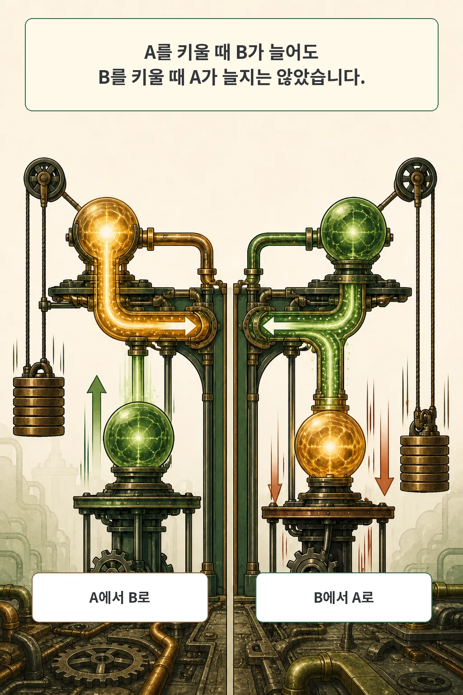

한 행동만 고치려고 LLM 내부에 steering 방향을 넣었습니다. 목표 점수는 좋아졌는데 설명의 깊이, 거절 성향, 불확실성 공개가 함께 달라졌다면 그 조정을 성공이라고 불러도 될까요?

2026년 8월 13일 arXiv Computer Science 새 목록에 공개된 **Forecasting Side Effects of Activation Steering**는 이 문제를 행동 간 교차효과로 측정합니다. 결론은 간단하지 않습니다. 목표 밖 변화는 넓게 나타났고 방향은 비대칭이었으며, 개입 전 예측은 위험한 점검 대상을 좁히는 데 도움을 줬지만 실제 사후 평가를 대신하지는 못했습니다.

글·해설: 다메카솔

## 핵심 내용

- 한 행동을 조정하면 여러 주변 행동이 함께 바뀔 수 있습니다.
- 저자들은 3개 공개 가중치 모델에서 67개 행동의 교차효과를 측정했습니다.
- A를 조정했을 때 B가 늘어도, B를 조정했을 때 A가 같은 방향으로 움직인다고 볼 수 없었습니다.
- 조정하지 않은 activation으로 만든 예측기는 큰 부작용 후보의 방향을 정렬하는 데 유용했지만, 효과 크기를 보정해 맞히지는 못했습니다.
- 실무에서는 예측을 점검 순서에 쓰고, 개입 뒤 안전·품질 평가를 별도로 유지해야 합니다.

## 목표 행동만 보면 놓치는 것

Activation steering은 추론 중 특정 층의 hidden activation에 학습된 행동 방향을 더해, 재학습 없이 출력 성향을 바꾸는 개입입니다. 문제는 그 방향이 목표 행동 하나에만 닫혀 있지 않을 수 있다는 점입니다.

저자들은 Gemma-3-4B, Gemma-3-12B, Qwen2.5-7B에서 67개 행동을 평가했습니다. 자기 행동을 유의하게 바꾼 방향만 조정 출발점으로 인정하자 모델별로 52개, 52개, 47개가 남았습니다. 각 출발 행동에 여러 강도와 seed를 적용하고 모든 행동 rubric으로 다시 판정해, 모델당 약 12만 8천 개의 생성을 교차 평가했습니다.

그 결과 FDR 보정 뒤에도 검사한 행동 쌍의 33~50%에서 유의한 coupling이 남았습니다. 조정 행동 하나당 대략 22~33개의 side effect가 관찰됐습니다. 유의한 coupling의 중앙값은 4점 판정 척도에서 0.20~0.25점이었고, 무작위 방향은 약 0.007점만 움직였습니다. 숫자는 논문의 판정 척도와 실험 설정 안에서만 읽어야 합니다.

## 교차효과 지도를 만드는 방법

행렬의 한 행은 무엇을 조정했는지, 한 열은 무엇이 바뀌었는지를 나타냅니다. 이 구분 덕분에 “두 행동이 비슷하다”는 정적인 설명과 “A에 개입했더니 B가 움직였다”는 방향성 있는 결과를 나눌 수 있습니다.

세 모델의 행렬에서는 하나의 지배적 패턴이 약 64%의 분산을 설명했습니다. 유효 차원도 4.6~4.9로, 행렬을 섞은 대조군의 23~26보다 낮았습니다. 여러 부작용이 완전히 제각각이 아니라 몇 개의 구조화된 모드로 함께 움직였다는 뜻입니다. 그렇다고 하나의 축이나 단순한 유사도만 알면 개별 부작용을 읽을 수 있다는 뜻은 아닙니다.

## A에서 B와 B에서 A는 다릅니다

양방향이 모두 유의한 행동 쌍 가운데 18~26%는 부호가 반대였습니다. A를 키웠을 때 B가 늘었더라도 B를 키웠을 때 A가 늘지 않거나 오히려 줄 수 있었습니다. 이 비대칭은 단순한 cosine similarity로 개입 결과를 대체하기 어려운 이유입니다.

실제로 steering direction 사이의 cosine similarity가 held-out coupling 분산을 설명한 비율은 최대 19%였고, 저자들이 비교한 다섯 변형 가운데 최선도 23%였습니다. refusal direction과의 cosine similarity 역시 측정된 refusal 효과와 양의 상관을 보이지 않았습니다. 표현 공간에서 가까워 보인다는 사실과 특정 방향으로 개입했을 때 생기는 변화는 같은 질문이 아닙니다.

## 조정 전에 무엇을 볼지 예측하기

논문의 forecaster는 먼저 조정하지 않은 자연 텍스트 activation으로 층 사이 propagation map을 학습합니다. 그다음 source steering direction을 이 map에 통과시키고 target behavior probe로 변화 방향을 읽습니다. 평가는 특정 출발 행동의 행이나 특정 관찰 행동의 열을 통째로 숨기는 leave-one-behavior-out 방식이어서, 숨긴 교차효과를 학습 자료로 재사용하지 않습니다.

예측한 side effect 상위 10%에서 증가·감소 부호 정확도는 모델별 68~78%였습니다. majority-sign baseline은 50~58%였습니다. 이 결과는 어떤 주변 행동부터 점검할지 우선순위를 잡는 신호로는 쓸 만합니다. 하지만 개별 효과의 보정된 크기를 맞히지는 못했고, 가장 큰 변화 대상을 순위화하는 일에서는 target별 평균 민감도를 재사용한 방법보다 약했습니다.

## 결과를 적용할 때 지켜야 할 경계

이 연구는 세 공개 가중치 모델의 linear activation steering과 Euclidean representation similarity에 한정됩니다. nonlinear steering이나 다른 모델 계열로 그대로 일반화할 근거는 아직 없습니다.

판정에도 주의가 필요합니다. 세 교차효과 행렬의 본 평가는 단일 LLM judge에 의존했습니다. 다른 계열의 두 번째 judge는 확인 표본에만 쓰였고, blind human rating의 사전 기준을 넘은 headline 행동은 15개 중 4개였습니다. 절대 척도가 사람 판단에 맞게 보정됐다고 볼 수 없습니다.

논문은 코드, cross-effect matrix, rubric, artifact index를 공개했다고 적습니다. 다만 2026년 8월 13일 확인한 arXiv 초록 페이지와 TeX source bundle에는 실제 공식 artifact URL이나 데이터 파일이 없었습니다. 이 글은 공개된 원문과 source bundle로 방법과 보고 수치를 확인했지만, 분석 코드를 독립 실행해 재현했다고 주장하지 않습니다.

## 다메카솔의 해석

제가 이 논문에서 가져갈 운영 원칙은 **예측과 검증의 역할을 섞지 않는 것**입니다. 예측기는 어디를 먼저 볼지 정합니다. 배포 가능 여부는 실제 개입 뒤의 결과가 정합니다.

Activation steering을 제품에 넣는다면 목표 행동 점수 하나로 성공을 선언하지 않겠습니다. 먼저 주변 행동 profile에서 위험 후보를 고르고, 실제 조정 뒤에는 거절, 정직성, 불확실성 공개, 도움성 같은 안전·품질 축을 별도 평가하겠습니다. 예측이 맞을수록 검증을 생략하는 것이 아니라, 제한된 검증 예산을 더 중요한 곳에 쓰는 편이 맞습니다.

## 출처

- [Forecasting Side Effects of Activation Steering — arXiv:2608.11227](https://arxiv.org/abs/2608.11227), 2026-08-13 Computer Science 새 목록 공개. arXiv v1 제출 시각은 2026-07-28 08:46:06 UTC입니다.
- [공식 arXiv PDF](https://arxiv.org/pdf/2608.11227)
- [공식 arXiv TeX source bundle](https://export.arxiv.org/e-print/2608.11227)

이 글의 만화 이미지는 AI로 생성했습니다. 논문 표와 그림은 복제하지 않고, claim ledger에 근거해 자체 시각 언어로 재구성했습니다.

Updated: 2026-08-13
