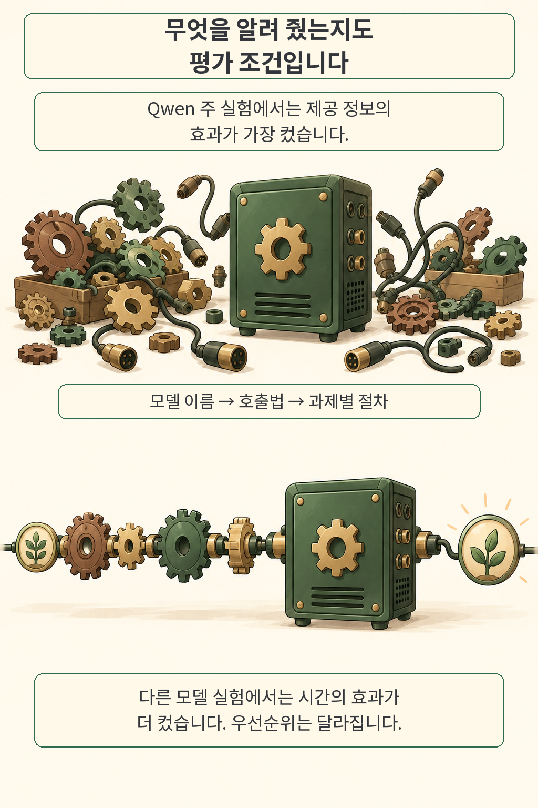
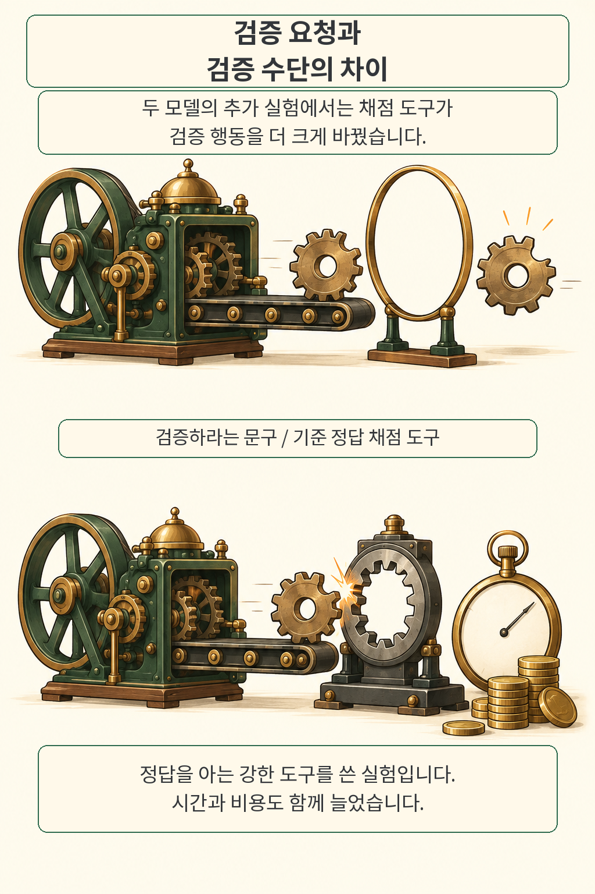
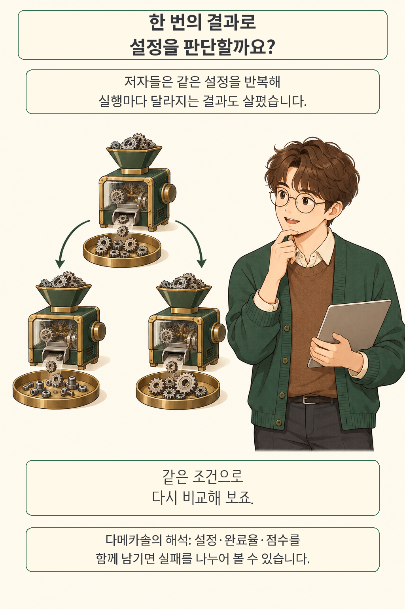

**에이전트가 자꾸 실패하면 더 큰 모델부터 떠올리기 쉽습니다.** 그런데 모델을 그대로 두고 호출 방법과 작업 절차를 알려 주는 편이 더 큰 차이를 만든 실험이 있습니다. 반대로 다른 모델에서는 시간을 늘리는 효과가 앞섰습니다. AI 에이전트를 비교할 때는 모델 이름에 더해 **어떤 정보와 도구를 주고, 얼마나 실행했는지**를 함께 적어야 결과를 이해할 수 있습니다.

*글·해설: 다메카솔*

원문 확인·작성: 2026년 10월 3일

이번에 읽은 논문은 **Agents Are Systems, Not Models: Rethinking Agentic Evaluation**입니다. Luis Wiedmann, Leander Girrbach, Cordelia Schmid, Zeynep Akata가 2026년 10월 1일 제출한 arXiv v1 프리프린트입니다. 저자들은 과학 분야의 전문 모델을 찾아 코드로 실행하는 에이전트를 대상으로, 설정을 바꾸었을 때 성능과 행동이 어떻게 달라지는지 살폈습니다.

## 모델을 바꿨는지, 입력 조건을 바꿨는지

같은 엔진도 연결 방법을 모르면 제대로 돌리기 어렵습니다. 그림의 흩어진 부품과 정돈된 연결은 **에이전트에게 주는 실행 정보**의 차이를 표현한 비유입니다. 입력 자료가 얼마나 친절했는지 빠뜨린 채 모델 점수만 비교하면, 어느 변경이 도움이 됐는지 분리하기 어렵습니다.

저자들은 전문 모델의 가중치와 실행 환경을 미리 준비한 GPU 샌드박스에서 실험했습니다. 에이전트는 파일 읽기·쓰기, 웹 조회, 명령 실행으로 모델을 찾아 직접 호출 코드를 작성합니다. 전문 모델을 한 번에 실행해 주는 전용 도구는 주지 않았습니다.

바꾼 조건은 다섯 가지입니다. **제공 정보**는 추가 설명 없음에서 모델 이름, 호출 방법, 해당 과제의 전체 절차까지 단계적으로 늘렸습니다. **추론 방식**은 추론을 생성하는지와 다음 단계에 남기는지를, **검증 요청**은 답을 확인하고 근거를 보고하라는 문구의 강도를 바꿨습니다. 여기에 **실행 시간**과 **기반 모델**을 더했습니다.

주 실험에서 저자들은 Qwen3.5-35B-A3B, 122B-A10B, 397B-A17B를 FP8로 실행했습니다. 시간 예산은 5·10·20분입니다. 다섯 조건을 조합한 **432개 설정을 각각 5회** 반복해 과제당 2,160회, 네 과제에서 총 8,640회를 실행했습니다. 논문이 언급하는 전체 18,240개 궤적에는 추가 실험도 들어 있으므로 주 실험 횟수와 구분해야 합니다.

전문 모델이 기반 모델보다 우수한 세 과제에서는 제공 정보의 효과가 가장 컸습니다. 검증을 요청하는 문구의 효과는 가장 작았습니다. 여기서 효과는 설정 단계별 평균 점수 차이를 반복 실행의 표준편차로 나눈 값입니다. 단순한 정확도 상승률과는 다릅니다.

이 순위에는 경계가 있습니다. 별도 **Claude Sonnet 5** 실험에서는 세 과제 모두 시간 예산의 효과가 정보보다 컸습니다. 저자들의 Table 16까지 함께 읽으면, 정보를 먼저 늘리라는 고정 처방보다는 **모델마다 어떤 조건에 반응하는지 측정하자**는 설계 질문이 남습니다.

## 검증하라는 문구와 실제로 확인할 수단

검증을 요구해도 에이전트가 확인할 근거가 부족할 수 있습니다. 저자들은 이 차이를 보기 위해 Qwen-122B와 Step-3.7-Flash에 **현재 제출물을 기준 정답으로 채점하는 오라클 도구**를 추가했습니다. 에이전트가 실행 도중 호출할 수 있는 강력한 검사 수단입니다.

그림 위쪽 고리는 답의 형식만 확인하는 모습을, 아래쪽 맞춤형 검사구는 기준과 실제 결과를 대조하는 모습을 나타냅니다. 실제 실험에서 톱니바퀴를 검사했다는 뜻은 아닙니다. 논문의 도표를 복제하지 않고 검증 수단의 차이를 다시 그렸습니다.

저자들은 오라클을 제공했을 때 참조 근거에 따른 검증 행동과 과제 점수가 개선됐다고 보고합니다. 자신이 예상한 점수와 실제 점수의 차이도 줄었습니다. 대신 도구 호출이 늘어 실행 시간과 비용이 함께 증가했습니다.

이 결과를 읽을 때는 **정답을 아는 도구를 제공했다**는 조건이 중요합니다. 운영 시스템의 테스트나 별도 검증 데이터는 그보다 약한 검사 수단입니다. 같은 개선 폭을 기대할 근거는 아직 없습니다. 행동 분류에도 모델 판정과 군집화를 썼고, 오라클 호출 자체가 참조 기반 검증으로 잡히는 효과가 포함됩니다.

저자들은 점수를 반복 확인하며 정답을 탐색하는 실행도 점검했습니다. 해당 실행을 제외해도 결과가 크게 달라지지 않았다고 보고하지만, 이것으로 실제 서비스에서 정답 노출이나 평가 데이터 오염 문제가 사라지는 것은 아닙니다. 저는 검증 도구를 붙일 때 **무엇을 알고 채점하는 도구인지**부터 기록해야 한다고 봅니다.

## 한 번 잘 나온 점수와 반복해도 나오는 결과

동일한 설정을 다시 실행해도 결과는 흔들렸습니다. 저자들은 전문 모델이 더 강한 세 과제에서, 단순한 답보다 충분히 높은 점수를 낸 완료 실행만 따로 살폈습니다. 이 집합에서 **점수 분산의 약 54%**가 같은 설정을 반복할 때 발생하는 차이로 추정됐습니다. 한 번의 좋은 결과로 설정을 고르기에는 흔들림이 큰 셈입니다.

이 수치는 실패 확률이 아닙니다. 논문의 Figure 2에서 설정 간 분산 비중이 46.1%이고, 나머지 53.9%가 같은 설정 내부의 분산입니다. 대상 과제와 완료·점수 기준을 유지한 통계이며, 모든 에이전트의 결과가 절반쯤 무작위라는 뜻으로 넓힐 수는 없습니다.

점수의 정의도 확인해야 합니다. 저자들은 에이전트 점수 S, 기반 모델 단독 점수 B, 재현한 전문 모델 기준 점수 R로 **G = (S − B) / (R − B)**를 계산합니다. 전문 모델이 더 나은 경우에만 정의하며, G가 1이면 해당 기준 점수에 도달한 것입니다. 제한 시간 안에 답을 제출하지 못한 실행은 점수를 받지 않고, 완료율로 별도 보고합니다.

따라서 완료한 실행의 평균 점수와 전체 실행의 완료율을 같이 봐야 합니다. 시간을 늘려 제출하는 실행이 많아져도, 새로 완료한 실행의 품질에 따라 평균 점수는 다른 방향으로 움직입니다. 논문은 여러 시간 예산에서 완료한 설정만 맞춰 비교하는 추가 분석도 했습니다. 가장 엄격하게 맞춘 일부 비교에서는 작은 모델의 점수 하락이 사라졌으므로, 시간을 늘리면 항상 더 나빠진다고 해석할 근거도 부족합니다.

## 네 과제의 결과를 어디까지 옮길 수 있을까

검사 대상은 두 과학 분야의 네 과제입니다. 원문의 표본과 지표를 함께 적으면 실험의 범위가 선명해집니다.

- **적색편이 추정:** 은하 이미지 20개, AstroCLIP을 이용하며 R²로 평가합니다. 입력 전처리가 핵심입니다.
- **천문학 문답:** 객관식 152문항, 정확도로 평가합니다. 이 실험에서는 전문 모델 AstroSage-8B보다 기반 모델이 강해 전문 모델을 쓰지 않을 판단도 필요합니다.
- **프로모터 예측:** DNA 서열 613개, DNABERT-2의 미세조정을 거쳐 MCC로 평가합니다.
- **RNA 구조 예측:** RNA 서열 300개, RiNALMo의 결과를 후처리하며 구조 수준 F1으로 평가합니다.

서로 다른 단위와 지표입니다. 네 과제의 표본 수를 더해 하나의 성능 분모로 취급하지 않습니다. 저자들은 메모리나 다중 에이전트 조정은 이번 비교 축에 넣지 않았고, 시스템 설계가 행동을 바꾸는 분석도 검증 행동에 한정했다고 밝힙니다.

공개 상태 역시 구분했습니다. 10월 3일 확인한 [저자 저장소](https://github.com/lusxvr/rethinking-agent-evaluation/tree/6fe6c65434d1489ad115f15e1d2c5ed8431ea534)는 전체 코드와 벤치마크를 공개 예정으로 안내합니다. 연결된 [실행 궤적 데이터 저장소](https://huggingface.co/datasets/lusxvr/agentic-science-trajectories/tree/219d99e984257d6b99370387984bbcff2f8d42df)의 파일 목록은 확인했습니다. 이 글에서는 전체 데이터를 내려받아 결과를 재집계하거나 모델 실행을 재현하지 않았습니다. 수치는 원문 보고값입니다.

## 다메카솔의 해석: 평가표에 설정과 실패 경로를 남깁니다

저라면 모델 교체 실험을 시작할 때 호출 정보, 검증 도구, 시간 예산부터 버전으로 묶겠습니다. 그래야 점수가 변했을 때 모델 변경과 주변 설정 변경을 나누어 볼 수 있기 때문입니다. 이는 논문 결과를 백엔드 평가 설계로 옮긴 제 해석입니다.

검증 경로도 분리할 필요가 있습니다. 출력 형식 검사는 파싱 실패를, 회귀 테스트는 이미 아는 동작의 손상을, 별도 검증 데이터는 정해 둔 표본에서의 품질을 살핍니다. 각 검사가 놓치는 실패가 다르므로 검사 통과 하나를 전체 작업 성공으로 바꾸어 적으면 원인 분석이 어려워집니다. 반대로 검사를 늘릴수록 호출·실행 비용도 측정해야 합니다.

앞서 다룬 [EvoPathBench의 능력 평가](/posts/evopathbench-capability-checkpoints/)는 경험을 거치며 무엇을 배웠는지 확인하는 문제였습니다. 이번 논문은 같은 에이전트를 비교할 때 무엇을 고정하고 몇 번 관찰할지 묻습니다. 두 질문을 분리해 두면 학습 효과와 실행 환경의 도움을 뒤섞을 가능성이 줄어듭니다.

다음 비교에서는 한 가지 설정만 바꾸고 같은 조건을 여러 번 실행해 보겠습니다. 평균 점수 옆에 완료율과 소요 시간도 함께 놓으면, 더 잘 푸는 설정과 단지 더 자주 제출하는 설정을 구분하는 데 도움이 될 것입니다.

## 출처

- [원문과 제출 이력: arXiv:2610.01618v1](https://arxiv.org/abs/2610.01618v1)
- [원문 PDF](https://arxiv.org/pdf/2610.01618v1): §3–4.1 실험 구성, Table 3 효과 비교, §4.3·Table 16 모델별 차이, Figure 2 반복 분산, §5 행동 분석, §6 한계, Appendix A.10 완료 실행 선택 효과.
- [저자 공식 코드 저장소](https://github.com/lusxvr/rethinking-agent-evaluation/tree/6fe6c65434d1489ad115f15e1d2c5ed8431ea534): 2026-10-03 확인 당시 코드·벤치마크 공개 예정.
- [저자 실행 궤적 저장소](https://huggingface.co/datasets/lusxvr/agentic-science-trajectories/tree/219d99e984257d6b99370387984bbcff2f8d42df): 공개 파일 목록 확인; 실험 재현과 전체 자료 검증은 미수행.

이 글의 본문과 이미지는 생성형 AI로 제작했습니다. 기획과 편집 기준은 다메카솔이 정했습니다.
