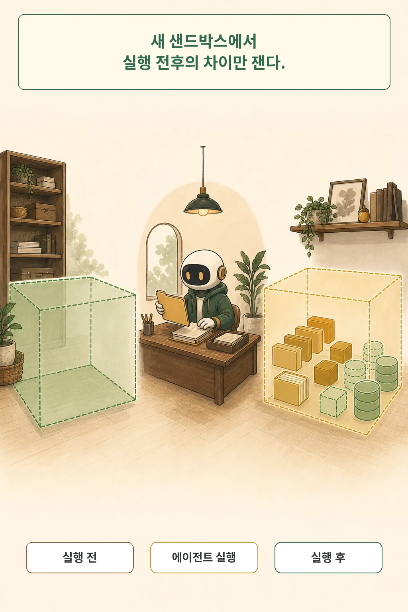
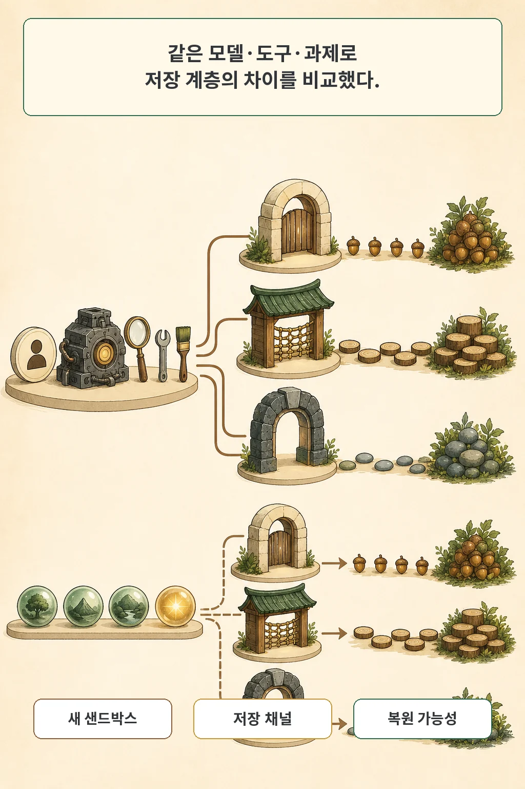
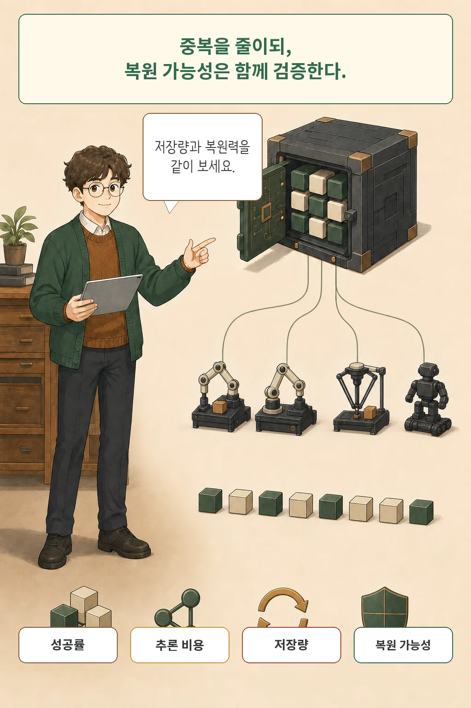

LLM 에이전트가 작업을 끝내면 모델 호출 비용은 멈춥니다. 그러나 로그, 대화 이력, 세션 데이터베이스, 체크포인트, 디버그 추적은 디스크에 남습니다. **The Hidden Footprint: Making Storage a First-Class Metric for LLM Agent Evaluation**은 이 실행 뒤 저장 발자국을 별도 평가 축으로 끌어낸 논문입니다.

글·해설: 다메카솔

## 작업이 끝나도 데이터는 남는다

논문은 저장 발자국을 “실행 뒤 선언된 샌드박스 안에 새로 생기거나 늘어난 바이트”로 정의합니다. 여기에는 에이전트가 만든 산출물뿐 아니라 작업공간 파일, 세션 데이터베이스, 숨은 홈 디렉터리 상태, 로그, 스냅샷, 체크포인트와 추적 데이터가 들어갑니다. 여러 작업이 함께 쓰는 모델 가중치와 패키지·토크나이저 캐시는 제외합니다.

이 구분이 중요한 이유는 저장이 단순한 낭비가 아니기 때문입니다. 남겨 둔 대화와 상태는 장애 뒤 재시작, 실행 재생, 감사와 디버깅의 재료입니다. 반대로 계속 누적되면 보존 기간, 접근 통제, 삭제 요청, 장기 비용이 커집니다. “적게 남기는 시스템이 무조건 좋다”가 아니라, 필요한 복원력을 어느 정도의 바이트로 제공하는지가 질문입니다.

논문이 직접 측정한 공급망 견적 시스템 한 사례에서는 한 작업이 131MB를 남겼습니다. 그중 프레임워크 잔여물은 79MB, 전달 산출물은 2.6MB였습니다. 이 수치는 하나의 운영 사례입니다. 또 39바이트 요약 파일을 만드는 의도적으로 작은 쓰기 과제에서는 잔여물이 산출물의 최대 24,033배에 이르렀지만, 이 극단도 일반 생산 비율로 읽어서는 안 됩니다.

## AgentFootprint는 무엇을 어떻게 쟀나

연구진은 각 프레임워크와 과제 조합을 새 샌드박스에서 실행했습니다. 작업공간과 홈 디렉터리를 실행 전에 스냅샷으로 남기고, 실행 뒤의 변화만 잡아냅니다. 그 위에서 여섯 지표를 계산합니다.

- **총 저장량**: 실행 뒤 늘어난 전체 바이트
- **저장 채널 구성**: 상태·체크포인트, 디버그·이벤트 로그, 대화·행동 등 어디에 남았는지
- **중복 계수**: 논리 내용이 평균 몇 번 다시 저장됐는지
- **성장 지수**: 반복 단계가 늘 때 저장량이 어떤 형태로 커지는지
- **압축 가능성**: 긴 범위 압축으로 얼마나 줄어드는지
- **대화 이력 복원 가능성 R**: 아무것도 복원하지 못하는 0부터 각 호출의 완전한 대화 이력을 재구성하는 3까지

비교 대상은 LangGraph, AutoGen, CrewAI, SmolAgents, OpenAI Agents SDK, LlamaIndex, Agno, InfiAgent의 버전 고정 구성입니다. 연구진은 주 연구 509회와 복제·변형 552회를 합쳐 1,061회 샌드박스 실행을 기록했습니다. “프레임워크 전체”가 아니라 논문에 적힌 버전과 기본 지속 저장 설정의 비교입니다.

## 파일 크기만 재면 중복을 놓칠 수 있다

같은 대화가 여러 번 저장돼도 원시 파일 바이트는 똑같아 보이지 않을 수 있습니다. SQLite는 긴 값을 페이지로 나눠 헤더와 포인터 사이에 섞습니다. JSON은 줄바꿈이나 유니코드 문자를 이스케이프합니다. 원본과 복사본의 바이트 경계가 달라지면 단순 파일 청킹은 반복을 놓칩니다.

논문에서 LangGraph 체크포인트 저장소의 중복 계수는 원시 파일 청킹으로 1.01이었습니다. 하지만 SQLite 셀과 JSONL 레코드를 논리 내용 스트림으로 꺼내 분석하자 12.1로 올라갔습니다. 저장소가 갑자기 더 커진 것이 아니라, 직렬화가 가린 반복이 측정에 잡힌 것입니다.

AgentFootprint는 그래서 파일 전체를 한 덩어리로만 비교하지 않습니다. SQLite 셀과 JSONL 레코드를 논리 스트림으로 풀고, 입력 파일에서 고정적으로 뽑은 내용 프로브를 원시·이스케이프 표현에서 다시 찾습니다. 이 방법도 압축된 중복이나 여러 겹으로 중첩된 모든 표현을 완벽히 잡지는 못합니다. 논문은 중복 계수를 보수적 하한으로 둡니다.

## 같은 조건과 같은 궤적으로 저장 계층을 분리했다

주 실험은 동일한 모델 백엔드, 온도, 최소 도구, 과제 문구를 사용했습니다. 프레임워크마다 권장되는 지속 저장 설정을 적용하고, 파일 질의·장기 반복·쓰기·편집·데이터 분석 과제를 수행합니다. 성공 여부와 저장량을 같이 보되, 각 기본 설정이 제공하는 기능이 다르다는 점을 숨기지 않습니다.

에이전트의 행동 자체가 다르면 저장량 차이가 정책 때문인지 저장 계층 때문인지 나누기 어렵습니다. 연구진은 별도 고정 궤적 통제에서 같은 세 번의 읽기와 한 번의 답변을 일곱 지속 저장 프레임워크에 재생했습니다. 관찰 바이트 대비 저장 증폭은 1.03배에서 6.86배로 6.7배 범위였습니다. 같은 논리 내용을 어떤 객체로 얼마나 자주 직렬화하느냐만으로도 격차가 생긴다는 결과입니다.

복원 가능성도 따로 확인했습니다. R=3인 여섯 구성은 새 프로세스에서 같은 세션을 다시 붙여 대화를 이어 갈 수 있었습니다. CrewAI의 측정 구성은 일부 바이트는 남겼지만 호출별 완전한 구조가 없어 R=1이었고 새 프로세스 재개에 실패했습니다. 이 검사는 대화 상태 재개 범위이며, 도구 실행 중간이나 워크플로 그래프의 정확한 위치까지 복구한다는 뜻은 아닙니다.

## 성공률이 같아도 저장 발자국은 달랐다

파일 질의 실험에서 100% 정확도를 낸 지속 저장 구성끼리 비교했을 때 실행당 보존량은 15.7배 범위로 벌어졌습니다. 한쪽은 더 많이 남겨 더 좋은 시스템이었다거나, 다른 쪽은 적게 남겨 더 효율적이었다고 바로 결론 낼 수는 없습니다. 기본 설정마다 재생·재시작·감사 능력이 다르기 때문입니다.

반복 관찰 과제에서는 성장 형태가 더 중요한 차이였습니다. 2KB 상태 파일을 200회 다시 읽을 때 전체 이력을 매 단계 저장하는 한 구성은 323MB를 남겼습니다. 세 전체 이력 구성은 이 과제에서 초선형 성장을 보였습니다. 이 지수는 반복 관찰 워크로드에 조건부이며 모든 에이전트 작업의 보편 법칙이 아닙니다.

지속 저장을 끈 짧은 검색 과제에서는 다섯 프레임워크의 즉시 정확도가 유지되거나 실행 변동 범위에 머물렀습니다. 하지만 저장량과 R이 동시에 0이 되어 재생과 재시작도 잃었습니다. 성공률만 보면 사라지는 운영 기능을 R이 드러냅니다.

실제 공개 제출에서도 저장량과 성공은 같은 축이 아니었습니다. 연구진이 108개 인스턴스 정규화 SWE-bench Verified 제출의 내보낸 궤적을 비교하자 인스턴스당 용량은 1,617배 범위였고, 해결률과의 Kendall 상관은 0.080, p=0.222로 검출되지 않았습니다. 다만 이 값은 각 시스템이 공개한 궤적 크기이지 디스크에 남은 전체 런타임 잔여물이 아닙니다.

## 중복을 줄이면서 복원력은 지킬 수 있을까

연구진은 여유를 확인하기 위해 콘텐츠 주소 저장소의 참조 구현을 만들었습니다. 1KB보다 큰 문자열과 블롭을 해시로 주소화해 한 번만 저장하고, 기존 저장소에는 참조를 남깁니다. 일곱 지속 저장 구성의 70회 실행에서 보존량은 4.8배에서 32.7배 줄었습니다. 310개 파일 복원 검사와 기존 R 등급도 모두 유지됐습니다.

이 결과는 완성된 운영 저장 시스템이나 새로운 압축 알고리즘을 제안한 것이 아닙니다. 논문도 “존재 증명”이라고 부릅니다. 참조 상태로 바로 소비하려면 프레임워크 쪽 어댑터가 더 필요하고, 삭제와 가비지 컬렉션, 테넌트 경계를 넘는 중복 제거의 개인정보 문제는 남습니다. 같은 해시가 존재한다는 사실 자체가 민감할 수도 있습니다.

## 논문이 말할 수 있는 범위

논문은 여섯 범위 제한을 명시합니다. 통제 과제는 검색과 보존 중심이며 일반 추론을 대표하지 않습니다. 결과는 추상적인 프레임워크 전체가 아니라 버전 고정 구성에 대한 것입니다. SWE-bench 자료는 런타임 잔여물이 아니라 내보낸 궤적입니다. R은 대화 이력만 평가합니다. 프레임워크 목록과 성장 지수는 워크로드에 조건부입니다. 새 샌드박스를 쓰는 측정은 긴 공유 스레드의 누적을 오히려 과소평가할 수 있습니다.

재현성에도 현재 확인 가능한 경계가 있습니다. 부록 A는 MIT 라이선스의 익명 코드·데이터 보충자료가 제출에 동봉됐다고 적습니다. 그러나 2026년 7월 24일 확인한 arXiv PDF와 TeX 소스 번들에는 논문·그림·부록 PDF만 있었고, 해당 코드·데이터 아카이브는 보이지 않았습니다. 따라서 이 글은 공개 코드를 직접 실행해 결과를 재현했다고 주장하지 않습니다.

## 다메카솔의 해석: 보존량과 복원력을 한 표에 두자

에이전트 운영 대시보드가 성공률, 지연 시간, 토큰 비용만 보여 준다면 실행 뒤 남는 자원과 거버넌스 부담은 빠집니다. 실행당 저장량, 장기 성장 형태, 중복 계수, 복원 가능성을 같은 표에 두면 “왜 남기는지 설명 가능한 바이트”와 “관성으로 반복 저장되는 바이트”를 나눠 볼 수 있습니다.

실무에서는 세션과 작업 종류마다 보존 목적과 기간을 먼저 정하는 편이 좋습니다. 전체 이력을 매 단계 다시 직렬화하는 대신 참조, 중복 제거, 최근 구간만 남기는 윈도우 정책을 비교할 수 있습니다. 줄인 뒤에는 재시작·재생·감사 기능이 실제로 유지되는지 회귀 테스트해야 합니다. 삭제 요청이 들어왔을 때 참조만 지우고 공유 블롭이 남지 않는지도 함께 검증해야 합니다.

## 논문 정보

| 항목 | 내용 |
| --- | --- |
| 제목 | The Hidden Footprint: Making Storage a First-Class Metric for LLM Agent Evaluation |
| 저자 | Chenglin Yu, Hongquan Gui, Ying Yu, Tao Zeng, Ming Li |
| arXiv v1 제출 | 2026-07-13 06:44:33 UTC |
| arXiv v3 수정 | 2026-07-23 12:36:42 UTC |
| 분야 | Artificial Intelligence (cs.AI) |
| 라이선스 | CC BY 4.0 |

## 출처

- [The Hidden Footprint, arXiv:2607.11149](https://arxiv.org/abs/2607.11149)
- [논문 원문 PDF](https://arxiv.org/pdf/2607.11149)
- [arXiv TeX 소스 번들](https://arxiv.org/src/2607.11149)
- [Creative Commons Attribution 4.0 International](https://creativecommons.org/licenses/by/4.0/)

이 글과 만화 이미지는 AI로 생성했습니다. 논문의 그림·표·스크린샷과 프레임워크 로고를 복제하지 않고 핵심 의미를 새로운 장면으로 재구성했습니다.

Updated: 2026-07-24
