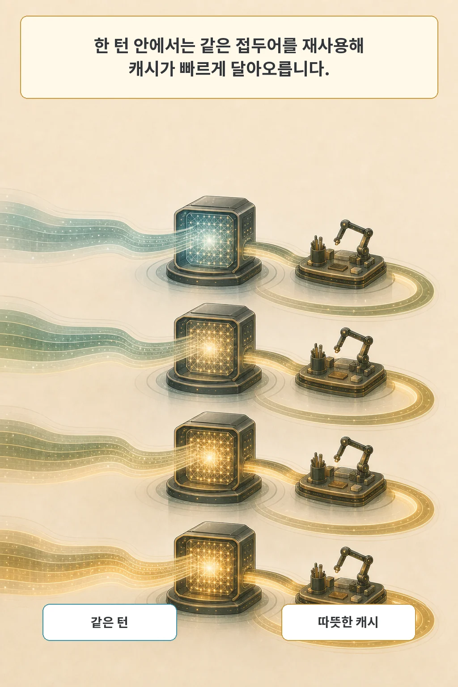
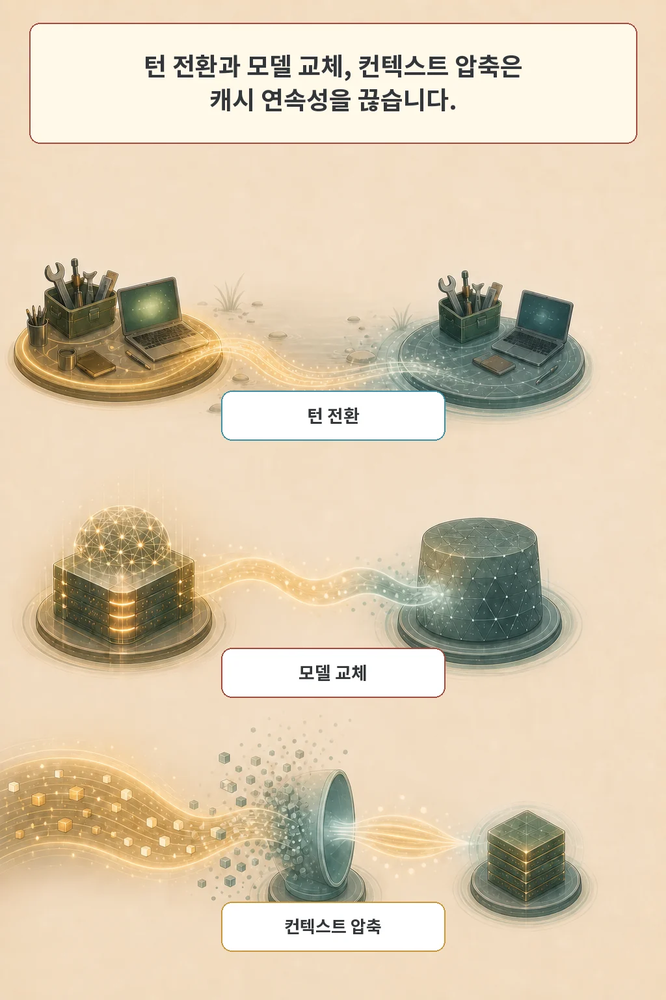

사용자가 한 번 요청하면 코딩 에이전트는 모델을 한 번 부르고 끝나지 않습니다. 모델이 상황을 읽고, 도구를 실행하고, 결과를 다시 읽는 루프가 이어집니다. **Agentic Coding in the Wild: Characterizing GitHub Copilot Traces at Production Scale**는 이 부하를 실험실 벤치마크가 아니라 실제 GitHub Copilot 운영 추적으로 들여다봤습니다.

핵심은 요청 수가 아니라 세션의 단계입니다. 한 턴 안에서는 같은 접두어를 재사용해 KV 캐시가 빠르게 따뜻해지지만, 사용자가 다시 입력하기 전의 긴 공백과 모델 교체, 컨텍스트 압축은 그 연속성을 끊었습니다. 이 글은 관찰, 캐시 사건, 압축 비용, 자원 운영 의미, 한계를 분리해 읽습니다.

글·해설: 다메카솔

## 한 번의 요청은 하나의 호출이 아니다

논문은 코딩 에이전트 실행을 세션, 턴, 단계의 세 층으로 나눴습니다. 세션은 에이전트 작업의 전체 수명입니다. 턴은 사용자 요청 하나와 그 뒤의 자율 실행 사슬입니다. 단계는 그 안에서 일어나는 개별 모델 호출이나 도구 호출입니다.

분석 대상은 2026년 6월 첫째 주 미국 여러 지역의 Visual Studio와 VS Code에서 수집한 익명화 텔레메트리입니다. 세션 1,350만 건, 턴 9,510만 건, 사용자 320만 명, 모델 호출 7억6,050만 건, 도구 호출 7억7,470만 건이 포함됐습니다. 모델은 27종 이상, 도구는 45종 이상이었습니다.

이 숫자는 전 세계 모든 코딩 에이전트를 뜻하지 않습니다. 미국 내 최대 세 시간대의 GitHub Copilot 코딩 에이전트 표본입니다. 저자들은 프롬프트, 파일 내용, 모델 출력, 소스 코드, 도구 인자, 사용자 식별 정보는 수집하지 않았다고 밝혔습니다. 호출 시각, 지속 시간, 토큰 수, 모델·도구 이름, 성공 여부 같은 구조 메타데이터로 실행 흐름을 재구성했습니다.

## 같은 턴 안에서는 캐시가 빠르게 달아올랐다

KV 캐시는 이전 토큰에서 계산한 중간 상태를 재사용합니다. 코딩 에이전트의 한 턴에서는 시스템 프롬프트, 이전 대화, 도구 결과가 다음 호출의 긴 접두어로 반복됩니다. 같은 접두어가 남으면 매번 처음부터 계산할 필요가 줄어듭니다.

논문에서 평균 캐시 적중률은 한 턴의 첫 호출 약 45%에서 두 번째 호출 약 86%로 올랐습니다. 세 번째 이후에는 약 92~94%에 머물렀습니다. 중앙값만 보면 전체 호출의 캐시 적중률은 98%로 높았지만, 첫 호출 같은 cold start가 섞인 양봉 분포였습니다.

따라서 한 턴 안의 다음 호출이 곧 올 가능성이 높을 때는 캐시를 성급히 내리는 정책이 손해가 될 수 있습니다. 논문이 관찰한 턴 안 KV 캐시 유휴 시간 중앙값은 1.2초였습니다. 컨테이너 유휴 시간도 5.8초였습니다.

## 턴 경계와 모델 교체가 연속성을 끊었다

같은 모델을 유지해도 턴 경계에서는 평균 캐시 적중률이 26%포인트 낮아졌습니다. 사용자가 결과를 읽고 다음 요청을 생각하는 동안 캐시가 오래 사용되지 않아 서빙 시스템에서 밀려난 것으로 논문은 해석했습니다. 유휴 시간이 2분을 넘기 시작하면 분포가 넓어지고, 2~10분 구간에서는 중앙값도 크게 떨어졌습니다.

모델 교체는 더 강한 사건이었습니다. 교체 뒤 평균 캐시 적중률은 8%였고, 이전 호출 대비 평균 67%포인트 하락했습니다. 모델마다 토크나이저나 내부 구조가 달라 기존 캐시를 그대로 이어 쓰기 어렵기 때문입니다.

턴을 가로지르는 유휴 시간은 턴 안과 규모가 달랐습니다. 논문이 계산한 중앙값은 컨테이너 243초, KV 캐시 172초였습니다. 별도로 사용자 입력 사이의 대기 시간 중앙값은 25.2분이었습니다. 턴 경계가 자원 회수 후보를 찾는 자연스러운 신호가 된다는 근거입니다.

## 컨텍스트 압축은 세션을 살리지만 캐시를 다시 시작시켰다

긴 코딩 작업에서는 컨텍스트가 모델 한도에 가까워집니다. 에이전트는 오래된 기록을 버리거나 요약해 세션을 이어 갑니다. 기능적으로는 필요한 압축이지만, 이전 프롬프트 접두어 자체가 바뀌므로 캐시에는 큰 사건입니다.

컨텍스트 압축은 전체 세션의 7.8%에서 나타났습니다. 그러나 이 세션들이 전체 토큰의 44.2%, 모델 호출의 37.1%, 도구 호출의 38.9%를 차지했습니다. 압축은 가벼운 세션에 고르게 나타난 것이 아니라 가장 긴 작업에 집중됐습니다.

한 번의 압축은 중앙값 기준 프롬프트 토큰의 72.8%를 줄였습니다. 첫 호출 뒤 캐시 적중률도 중앙값 66.1%포인트 떨어졌습니다. 압축 호출 자체는 중앙값 기준 해당 턴 실행 시간의 약 22%를 썼습니다. 긴 입력을 읽는 prefill과 요약을 생성하는 decode가 모두 턴의 핵심 경로에 놓였기 때문입니다.

이 결과가 “압축하지 말라”는 뜻은 아닙니다. 압축 없이 컨텍스트 한도를 넘으면 작업을 이어 갈 수 없습니다. 논문이 제시한 시스템 질문은 압축 시점을 어떻게 고르고, 이전 접두어 일부를 보존하며, cache-cold 비용을 어떻게 줄일지입니다.

## 다메카솔의 해석: 턴 경계를 자원 정책의 신호로 쓴다

저라면 모든 모델 호출에 같은 보존 시간을 적용하지 않겠습니다. 한 턴 안에서는 다음 호출이 거의 바로 오므로 KV 캐시와 도구 실행 환경을 따뜻하게 유지합니다. 턴이 끝나면 예상 유휴 시간과 상태 복구 비용을 비교해 GPU 캐시를 DRAM이나 디스크로 내리거나, 컨테이너를 hibernate할지 결정합니다.

논문도 턴 경계마다 유휴 시간을 예측하는 경량 모델을 실험했습니다. 첫 주 15만 세션으로 학습하고 다음 주 5만 세션으로 평가했습니다. 60초보다 긴 유휴 구간을 맞히는 ROC-AUC는 0.73이었고, 시간 구간별 정확도가 낮아져도 전체 유휴 시간의 86~90%를 포착했습니다.

다만 이 결과는 곧바로 운영 절감액이 아닙니다. 실제 offload, hibernate, keep-alive를 적용한 온라인 실험이 아니라 언제 자원을 회수할 만한지를 예측한 평가입니다. 복구 지연, GPU 메모리 압력, 배치 효율, 비용 변화는 별도로 검증해야 합니다.

## 품질과 서버 상태는 이 논문만으로 알 수 없다

가장 중요한 한계는 품질 신호가 없다는 점입니다. 프롬프트와 응답 내용을 수집하지 않았으므로 자원을 많이 쓴 세션이 실제로 어려운 문제를 해결했는지, 반복 실패에 빠졌는지 연결할 수 없습니다. 효율을 줄였는데 과제 성공률도 낮아진다면 좋은 정책이라고 말할 수 없습니다.

추적도 클라이언트 측입니다. GPU 활용률, 큐 깊이, 배치 크기, 서버 메모리 압력은 직접 관찰하지 않았습니다. 캐시가 왜 밀려났는지에 대한 일부 설명은 클라이언트가 본 지연과 적중률 패턴에 기반한 시스템 해석입니다.

범위는 미국 내 GitHub Copilot, 2026년 6월 첫째 주입니다. 저자들은 1월부터 6월까지 주요 패턴이 일관됐다고 썼지만, 도구·모델·자율성은 빠르게 바뀝니다. 다른 제품과 지역, 앞으로의 부하에 그대로 일반화하면 안 됩니다. arXiv와 TeX 소스에는 공식 코드나 공개 원시 추적 데이터 링크도 없습니다.

## 운영 체크리스트

1. 한 요청이 아니라 세션·턴·단계 단위로 텔레메트리를 구분하는가.
2. 같은 턴 안의 cache-hot 경로와 턴 사이의 idle 경로에 다른 정책을 쓰는가.
3. 모델 교체와 컨텍스트 압축을 캐시 수명주기 사건으로 기록하는가.
4. 자원 절감과 과제 성공·재시도·사용자 대기 시간을 함께 측정하는가.
5. offload 뒤 복구 지연이 서비스 목표를 넘지 않는지 온라인으로 검증하는가.

## 논문 정보

| 항목 | 내용 |
| --- | --- |
| 제목 | Agentic Coding in the Wild: Characterizing GitHub Copilot Traces at Production Scale |
| 저자 | Banruo Liu, Haoran Qiu, Íñigo Goiri, Rodrigo Fonseca, Ricardo Bianchini, Esha Choukse |
| arXiv v1 제출 | 2026-07-30 20:51:51 UTC |
| arXiv 새 목록 | 2026-08-04 cs.AI |
| 분야 | cs.AI, cs.LG |
| subtype | empirical |

## 출처

- [논문 초록과 메타데이터, arXiv:2608.00101](https://arxiv.org/abs/2608.00101)
- [논문 원문 PDF](https://arxiv.org/pdf/2608.00101)
- [관련 글: AI 코딩 도우미는 보안 API도 안전하게 쓸까](/posts/copilot-security-api-study/)
- [관련 글: AI 에이전트는 로컬 디스크를 얼마나 쓰게 될까](/posts/agentfootprint-storage-benchmark/)

이 글의 본문과 이미지는 생성형 AI로 제작했습니다. 기획과 편집 기준은 다메카솔이 정했습니다.

Updated: 2026-08-06
