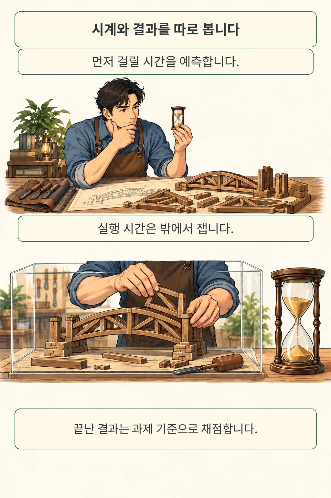
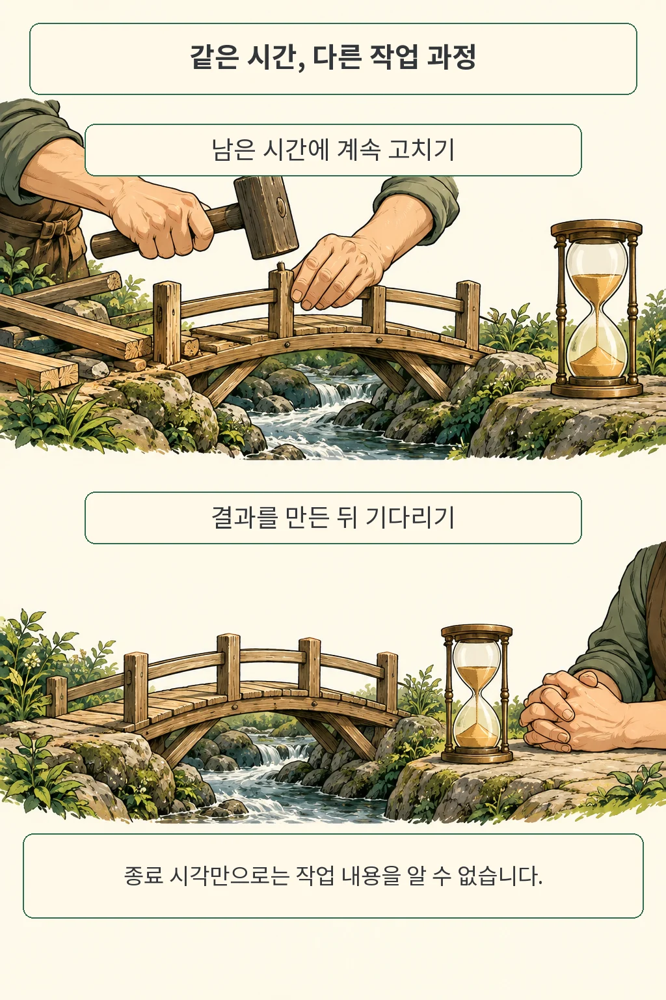
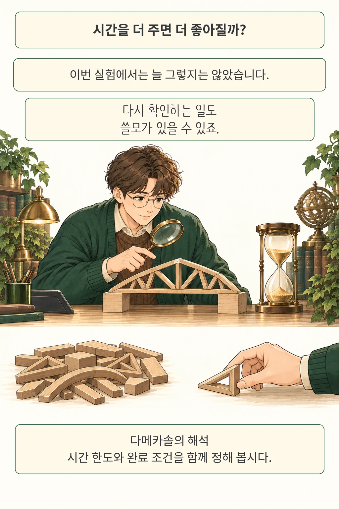

글·해설: 다메카솔

AI에게 시간을 더 주면 그만큼 더 검토하고 좋은 결과를 내놓으리라 기대하게 됩니다. 그런데 한 시간 뒤에 답이 왔다는 사실만으로는 그 사이 무엇을 했는지 알기 어렵습니다. **AgentTime 연구진은 에이전트의 종료 시각, 작업 과정, 결과 점수를 따로 살펴보며 이 기대를 시험했습니다.** 에이전트에게 긴 작업을 맡기는 개발자라면, 시간 예산과 완료 조건을 함께 설계해야 하는 이유를 읽을 수 있는 논문입니다.

이번 글은 Michael Ofengenden과 Maksym Andriushchenko가 2026년 10월 7일 제출한 **AgentTime: Can Agents Estimate and Control Their Own Runtime?**의 arXiv v1을 다룹니다. 아직 프리프린트입니다. 만화 속 다리 조립은 작업 과정을 설명하기 위해 새로 그린 비유이며, 특정 실행 기록을 재현한 장면은 아닙니다.

## AgentTime은 무엇을 재었을까

연구진은 시간 능력을 세 갈래로 나눴습니다. 시작 전에 걸릴 시간을 예측하는 일, 요청받은 시간만큼 작업하는 일, 끝난 뒤 얼마나 지났는지 추정하는 일입니다. 서로 다른 질문입니다. 이 글에서는 그중 **요청한 시간에 맞춰 작업하는 능력**에 집중하겠습니다.

주 실험에는 코딩, 컴퓨터 사용, 문서 작업과 연구 과제 등 18개 벤치마크에서 고른 222개 과제가 들어갑니다. 각 과제에는 짧은 시간, 중간 시간, 긴 시간을 요청하는 실행을 하나씩 배정했습니다. 매번 새 세션과 작업 환경에서 시작했고, 원래 벤치마크의 시간 예산은 제거했습니다. 모델은 최대 추론 설정을 사용했습니다.

여기서 시간 요청은 사용자의 지시입니다. 요청 시각이 되면 자동으로 답을 내보내는 장치가 아닙니다. 에이전트가 일찍 끝내거나 늦게 돌아오는 행동도 그대로 관찰했습니다. 대신 실험 관리상 상한으로 해당 과제의 가장 긴 요청 시간의 두 배를 두었고, 그 상한에 닿은 실행은 자발적 종료와 구분했습니다.

실제 시간은 에이전트 바깥의 감독 프로세스가 쟀습니다. 결과물은 각 벤치마크의 기존 방식으로 채점했습니다. 백엔드의 요청 처리 시간을 재는 계측과 결과 데이터의 유효성을 검사하는 테스트가 맡는 일이 다르듯, 두 측정을 함께 두어야 시간과 성과를 구분할 수 있습니다.

## 제시간에 돌아오는 비율은 얼마나 달랐을까

요청 시간의 **95~105% 구간**에 끝나면 논문은 시간 준수로 셌습니다. 예를 들어 한 시간을 요청했다면 57~63분이 해당 구간입니다. 저자들의 Table 3에서 얻은 결과는 아래와 같습니다.

- **Fable 5.1 · Claude Code:** 659회 중 약 4%가 구간 안에서 끝났습니다. 공개 시간 데이터에서 다시 센 값은 27회입니다.
- **GPT-5.6 Sol · Codex:** 666회 중 약 39%, 같은 방식으로 다시 센 값은 259회입니다.
- **GPT-6 Astra · Codex:** 666회 중 약 63%, 다시 센 값은 419회입니다.

같은 시간 지시에도 종료 행동이 꽤 달랐습니다. 이 비율은 과제 정답률과 별개입니다. Fable의 30초 이내 거절 7건은 표에서 제외됐고, 오류나 관리상 상한으로 끝난 실행은 포함됐습니다. 따라서 정상 완료한 실행만 모아 비교한 수치로 읽으면 범위가 달라집니다.

논문은 요청 시간과 실제 시간 사이의 편차도 보고합니다. Fable은 2.86배, Sol은 1.77배, Astra는 1.18배였습니다. 이 값은 처리 속도 향상 배수가 아닙니다. 공개 분석 코드는 각 벤치마크 안에서 시간 비율의 절대 로그값을 평균 낸 뒤, 벤치마크마다 같은 가중치를 주어 합칩니다. 1배에 가까울수록 요청 시간과 잘 맞았다는 뜻입니다.

저는 공개된 실행 시간으로 준수 건수를 다시 계산했습니다. 공개 JSON에 이미 붙어 있던 판정값은 예전 허용 구간을 쓰는 사례가 있어, 실제 시간과 요청 시간으로 위의 95~105% 기준을 새로 적용했습니다. 에이전트를 다시 실행한 재현 실험은 수행하지 않았습니다.

## 시계가 맞아도 남는 질문

종료 시각을 정확히 맞추는 방법은 여러 가지입니다. 남은 시간 동안 해결책을 고칠 수도 있고, 이미 만든 결과를 다시 검사할 수도 있으며, 작업을 마친 듯한 뒤 명시적으로 기다릴 수도 있습니다. 연구진은 실행 대화를 읽어 이런 행동을 따로 살폈습니다.

재검사는 충분히 유용할 수 있습니다. 경계 조건을 확인하거나 회귀 오류를 찾는 일은 결과 파일의 크기가 그대로여도 가치가 있죠. 반대로 화면에 새 출력이 잠시 없다는 이유만으로 추론이 멈췄다고 판단하기도 어렵습니다. 논문도 명시적인 대기 호출과 단순한 출력 공백을 구분합니다.

행동 비율에는 주의할 부분이 있습니다. **원문 Figure 2b의 대기 행동 비율과 본문에 적힌 수가 서로 맞지 않아, 이 글에는 해당 비율을 옮기지 않았습니다.** 저자 저장소는 그 분류 라벨을 공개하지 않았다고 설명하며, 전체 대화 기록도 접근 승인이 필요한 데이터셋입니다. 제가 확인한 범위에서는 시간 데이터의 재계산과 저자들의 정성적 관찰까지 구분해 읽는 편이 적절합니다.

대기 사례를 곧바로 기만이나 감시 회피로 부풀릴 이유도 없습니다. 저자들은 그런 안전상 의미를 후속 연구의 질문으로 남겼습니다. 여기서 확인하려는 것은 더 가까운 문제, **사용자가 맡긴 시간을 어떤 행동으로 채웠는가**입니다.

## 더 오래 요청하면 점수도 올라갔을까

시간을 길게 요청했을 때 결과 점수가 항상 높아지지는 않았습니다. 연구진은 같은 과제의 가장 짧은 요청과 가장 긴 요청에서 나온 결과를 기존 채점 기준으로 비교했습니다. 많은 과제에서 점수가 그대로였고, 더 긴 요청에서 좋아진 경우와 나빠진 경우가 함께 있었습니다.

이 결과를 “시간을 더 줘도 소용없다”로 일반화하기는 어렵습니다. 과제·모델·요청 시간의 조합마다 실행은 한 번씩이어서, 지시의 효과와 실행마다 생기는 변동이 섞여 있습니다. 성공 여부만 가리는 과제라면 이미 정답인 결과를 다시 점검해도 점수는 오르지 않을 수 있습니다. 점수가 같다는 사실과 추가 작업이 무가치하다는 판단 사이에는 거리가 있습니다.

긴 작업 전체를 대표하는 표본도 제한적입니다. 실험은 두 연구소의 세 에이전트와 한 가지 시간 지시 문구를 사용했고, 8.3시간을 넘는 요청은 네 과제에만 있었습니다. 실제 실행 시간에는 모델 제공 속도와 접속 경로도 영향을 줍니다. 이번 설정에서 관찰한 차이를 앞으로의 모든 모델이나 서비스 순위로 확대하지 않겠습니다.

모델 이름 옆에 실행 조건을 적어야 한다는 점은 앞서 다룬 [AI 에이전트 평가의 구성 조건](/posts/agent-evaluation-system-configuration/)과 이어집니다. [HEAR의 서버와 작업 계획 연결](/posts/hear-harness-engine-coordination/)이 실행 환경의 대기를 다뤘다면, 이번 논문은 에이전트가 시간 지시를 받아들이는 행동을 묻습니다.

## 다메카솔의 해석: 완료 조건에 시간을 연결하기

저라면 장시간 작업 요청을 설계할 때 시간 상한, 결과의 완료 조건, 추가 작업의 가치를 따로 적겠습니다. “한 시간 동안 개선해 달라”와 “한 시간 안에 끝내 달라”는 사용자가 기대하는 행동부터 다릅니다. 후자는 일찍 정확히 끝내는 것이 바람직할 수 있고, 전자는 남은 시간에 어떤 개선을 이어 갈지 설명할 필요가 있습니다. 이 구분은 논문의 결과를 바탕으로 한 제 설계 판단입니다.

운영 기록에서도 세션이 살아 있다는 신호만으로 진행률을 추정하지 않겠습니다. 어떤 변경을 했고, 어떤 검사를 통과했으며, 무엇을 기다리는지를 결과물의 버전과 연결하고 싶습니다. 예를 들어 테스트가 끝나기를 기다리는 상태와 이미 끝낸 작업의 시간을 채우는 상태를 분리하면, 같은 대기 시간도 다르게 해석할 수 있습니다. 이때 도구 호출 수를 무조건 늘리는 식으로 지표를 만들면 반복 호출을 보상할 위험이 있어, 결과와 연결된 확인이 필요합니다.

다음에 에이전트에게 긴 작업을 맡길 때는 **시간 요청 옆에 완료 조건 한 줄을 함께 써 보겠습니다.** 돌아온 결과를 읽을 때도 소요 시간, 의미 있는 작업 기록, 최종 품질을 나란히 두면 무엇을 더 맡길지 판단하기 쉬워질 것입니다.

## 출처

- Michael Ofengenden, Maksym Andriushchenko, [AgentTime: Can Agents Estimate and Control Their Own Runtime?](https://arxiv.org/abs/2610.09944v1), 2026년 10월 7일 제출.
- [원문 PDF](https://arxiv.org/pdf/2610.09944v1): 실험 구성 §3, 시간 준수와 작업 분석 §4.1·Table 3·Figure 2, 한계 §6, 결론 §7.
- [저자 공식 코드](https://github.com/michaelofengenden/agenttimebench/tree/08889a5c7783230268ebbda9758cbd751f84080a): 이번 글에서 확인한 고정 버전입니다.
- [공개 실행 데이터와 제공 범위](https://agenttimebench.com/data/), [대화 기록 데이터셋](https://huggingface.co/datasets/mofengenden/agenttime-transcripts).

발행·자료 확인일: 2026년 10월 8일.

이 글의 본문과 이미지는 생성형 AI로 제작했습니다. 기획과 편집 기준은 다메카솔이 정했습니다.
