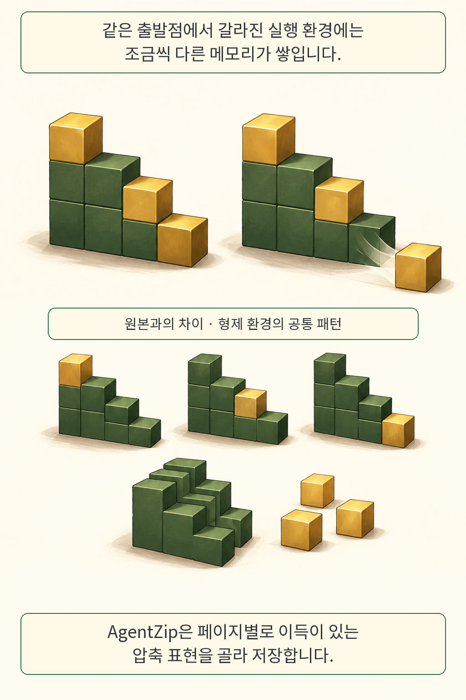
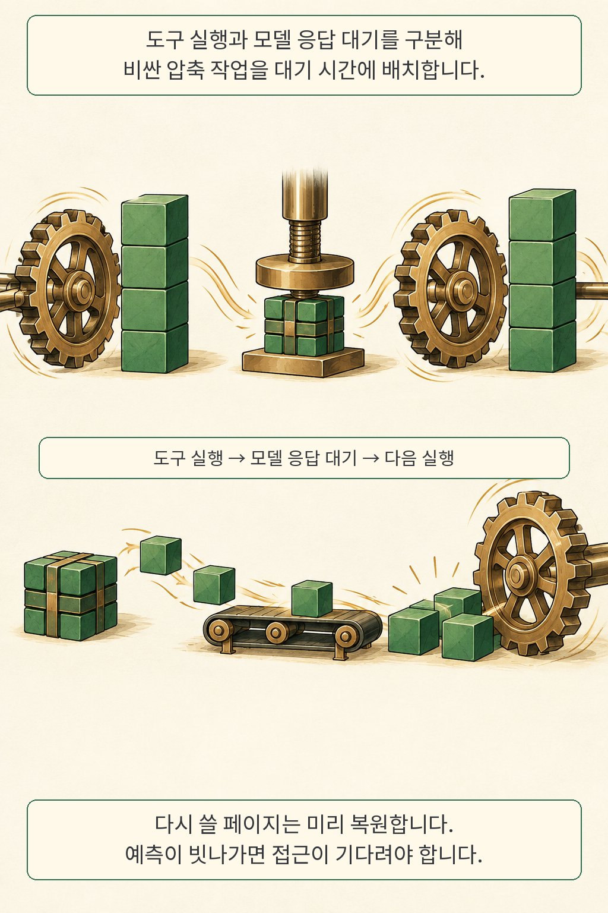
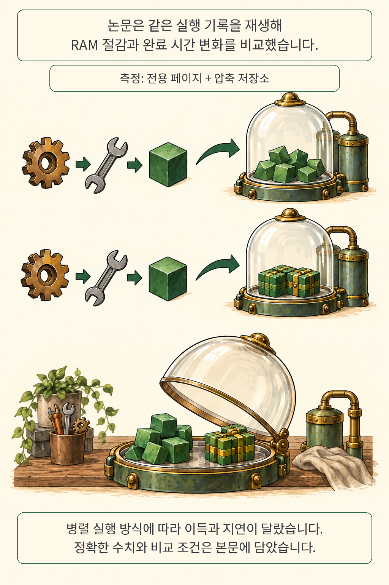

**88.55%의 메모리 절감에도 완료 시간은 늘었습니다.** 비어 있는 공간을 얻는 대신 다음 작업의 기다림을 감수한 셈입니다. AgentZip 연구팀은 여러 AI 실행 환경이 품은 비슷한 메모리를 압축하면서, 모델 응답을 기다리는 시간을 활용했습니다. 이 글에서는 무엇을 줄였고 어떤 시간을 더 썼는지 함께 읽어 보겠습니다.

글·해설: 다메카솔

## 핵심 내용

- 대상은 AI 도구가 실행되는 샌드박스의 RAM입니다.
- 원본과의 차이, 형제 실행 환경의 공통 패턴을 압축에 활용합니다.
- 모델 응답을 기다릴 때 압축하고, 다시 쓸 페이지는 미리 복원합니다.
- 아래 수치는 고정된 실행 기록을 재생한 저자 보고입니다.

## 조금 다른 복사본에 남는 공통 부분

같은 저장소를 여러 에이전트에게 나눠 맡기면 실행 환경도 여러 개 필요합니다. 출발점은 같습니다. 실행 도중 바뀐 메모리 페이지에는 원본의 흔적이 남고, 서로 다른 실행에서도 비슷한 바이트가 나타납니다.

AgentZip은 템플릿 대비 차이, 같은 실행 집단의 공통 사전, 반복 바이트 압축을 조합합니다. 페이지마다 저장 이득이 있는 표현을 고릅니다. 완전히 같은 페이지를 공유하는 KSM, 페이지 안의 반복을 활용하는 일반 zswap 압축보다 넓은 유사성을 이용하려는 설계입니다. [논문 2~4절](https://arxiv.org/html/2609.11294v1#S4)

블록과 유리 돔은 설명용으로 새로 그렸습니다. 블록 개수·크기는 실제 바이트 수나 성능 비율을 나타내지 않습니다. 한 블록은 메모리의 일부, 돔은 실행 환경을 뜻합니다.

## 압축할 시간과 다시 꺼낼 시간

압축한 페이지를 프로그램이 다시 찾으면 복원이 필요합니다. 여기서 기다림이 생깁니다. AgentZip은 도구 실행 중 가벼운 후보 탐색을 하고, 비싼 압축은 모델 응답 대기에 배치합니다. 다음에 쓸 페이지는 미리 복원하되, 예상하지 못한 접근에는 요청 시 복원이 필요합니다. [논문 4.3~4.4절](https://arxiv.org/html/2609.11294v1#S4.SS3)

이 그림의 압축기·톱니·컨베이어는 작업 순서를 보이기 위한 비유입니다. 실제 구현에서는 메모리 페이지와 복원 요청을 다룹니다. 모델의 답변을 짧게 요약하는 방식과는 대상이 다릅니다.

## 같은 실행을 재생했을 때의 결과

저자들은 R2E-Gym의 Python 저장소 10개에서 얻은 기록으로 비교했습니다. Rollout은 과제당 16개, GAF는 4개 후보 궤적을 동시 재생합니다. 도구 순서와 그 앞의 모델 대기 시간은 비교 설정마다 같습니다. 구현 기반은 Zeroboot이며, 실험 환경은 Xeon Platinum 8480C와 Linux 5.15.0입니다.

| 실행 방식 | 설정 | 평균 메모리 절감률 | 완료 시간 배율 |
| --- | --- | ---: | ---: |
| Rollout | zswap | 48.66% | 1.436배 |
| Rollout | KSM + zswap | 51.24% | 1.517배 |
| Rollout | AgentZip | 88.55% | 1.403배 |
| GAF | zswap | 4.86% | 1.118배 |
| GAF | KSM + zswap | 21.25% | 1.159배 |
| GAF | AgentZip | 64.29% | 1.468배 |

기준은 각 실행 기록의 **압축을 끈 경우**입니다. 메모리는 전용 물리 페이지와 메타데이터를 포함한 압축 저장소의 시간평균입니다. 완료 시간은 재생 시작부터 마지막 샌드박스 종료까지이며, 기록된 모델 대기도 포함합니다. [원문 8쪽, 5~6.1절 및 그림 5·6](https://arxiv.org/pdf/2609.11294v1)

Rollout에서는 비교한 압축 설정 중 AgentZip의 메모리 절감이 가장 컸고 지연도 가장 작았습니다. GAF에서는 더 많이 줄이는 대신 다른 압축 설정보다 오래 걸렸습니다. 초록의 최대 8.7배는 Rollout에서 남은 평균 메모리 11.45%의 역수에 대응합니다. 서버 전체 RAM·GPU 메모리·요금의 감소 배율로 옮기기에는 측정 범위가 다릅니다.

## 원문과 확인 범위

2026년 9월 13일 기준으로 12쪽 원문과 HTML, 제출 이력을 확인했습니다. 이번 확인에서 공식 구현과 실행 기록은 확보하지 못했습니다. 모델 평가나 성능 실험을 독립 재현했다고 주장하지 않으며, 특정 서버와 고정 기록 재생의 결과로 읽었습니다. 모델 정답률 개선은 이 메모리 실험의 검증 대상 밖입니다.

## 다메카솔의 해석: 밀도와 지연을 함께 볼 이유

저는 이 연구를 읽고 동시 실행 수를 정하는 지표부터 나눠야겠다고 봤습니다. 메모리가 먼저 차는 서버에서는 압축으로 더 많은 작업을 수용할 여지가 생깁니다. 그러나 사용자가 기다리는 대화형 서비스라면 다음 도구 호출이 멈추는 시간이 더 민감할 수 있습니다. 용량과 응답성의 목표가 갈리는 지점입니다.

평가용 실행 기록을 따로 두는 것도 도움이 되겠습니다. 같은 도구 호출을 재생하면 압축 정책을 바꿨을 때의 영향을 비교하기 쉽습니다. 여기에 실제 서비스의 대기 시간 분포와 유난히 오래 걸리는 복원 요청을 더 봐야 합니다. 모델 응답이 짧아지거나 작업 내용이 다양해지면 압축할 여유와 공통 패턴도 달라질 것입니다. 이 부분은 논문 결과에서 출발한 제 운영상 해석입니다.

공유 경계 역시 검토할 대상입니다. 같은 템플릿을 쓴다는 이유만으로 서로 다른 고객의 작업을 같은 집단으로 묶어도 된다는 결론은 나오지 않습니다. 사전의 수명과 접근 범위, 복원 실패 때의 처리까지 자기 서비스의 격리 요구에 맞춰 살펴보겠습니다. 이 논문으로 보안 격리가 인증됐다고 주장하지는 않습니다.

에이전트의 실행 조건을 분리해서 읽는 관점은 [JarvisGUI의 기기 간 상태 전달 실험](/posts/jarvisgui-cross-device-state/)과도 이어집니다. 그 글은 기기를 넘나드는 작업 성공을, 이번 글은 그 작업을 담는 실행 환경의 자원 비용을 다룹니다. **실행 수를 늘리기 전에, 우리 작업에서 줄일 RAM과 늘어날 기다림을 같은 기록으로 재보는 것**이 제가 가져갈 다음 단계입니다.

## 출처

- Mengming Li, Ceyu Xu 외, [Memory Compression for High-Fanout Agent Sandboxes, arXiv:2609.11294v1](https://arxiv.org/abs/2609.11294v1), 2026-09-10 09:25:43 UTC 제출. 프리프린트.
- [원문 PDF](https://arxiv.org/pdf/2609.11294v1) · [원문 HTML](https://arxiv.org/html/2609.11294v1). 방법 3~4절, 측정 5절, 결과 6절.

확인·작성일: 2026-09-13. 만화의 블록·기계·유리 돔은 의미를 설명하기 위한 재작화이며 원문 그림을 복제하지 않았습니다.

이 글의 본문과 이미지는 생성형 AI로 제작했습니다. 기획과 편집 기준은 다메카솔이 정했습니다.
