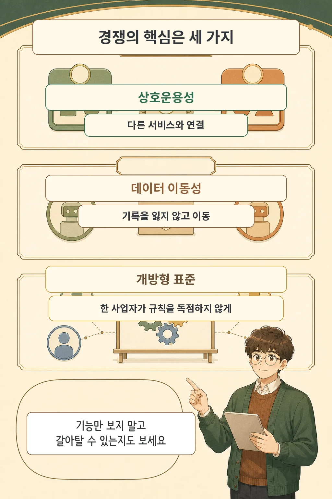

에이전트가 메일을 보내고 상품을 추천하는 순간, 모델 성능만으로 제품을 고르기 어려워집니다. 프랑스 경쟁당국은 2026년 7월 17일 공개한 의견서에서 **AI 에이전트 경쟁의 병목이 사용자 접점, 데이터 이동, 상호운용성과 표준 거버넌스로 옮겨갈 수 있다**고 진단했습니다. 이 문서는 법 위반 판정이나 새 규제 확정이 아니라, 시장 위험을 정리하고 대응 방향을 권고한 의견서입니다.

글·해설: 다메카솔

## 핵심 내용

- 에이전트 개발 진입은 생성형 모델 훈련보다 쉽지만, 사용자 접근과 데이터·추론 비용·상호운용성이 규모 확장을 막을 수 있습니다.
- 한 화면이 여러 서비스를 대신하면 추천·순위·노출 조건을 정하는 힘도 그 화면에 모일 수 있습니다.
- 프랑스 경쟁당국은 기존 규제의 집행과 함께 상호운용성, 데이터 이동성, 개방형 표준을 강조했습니다.
- 의견서는 미래의 경쟁법 판단이나 집행을 미리 정하지 않습니다.

이번 발표가 던진 질문은 누가 가장 강한 모델을 가졌느냐에 머물지 않습니다. 사용자가 어느 에이전트를 기본 입구로 만나고, 다른 서비스로 옮겨갈 수 있는지가 경쟁 조건이 됩니다.

## 에이전트가 새 ‘입구’가 되면 무엇이 달라지는가

프랑스 경쟁당국은 AI 에이전트를 디지털 서비스의 새로운 관문으로 봅니다. 사용자는 하나의 인터페이스에서 검색하고, 문서를 만들고, 상품을 추천받고, 다른 서비스까지 실행할 수 있습니다. 여러 단계를 줄이는 편리함이 에이전트의 핵심 가치인 셈입니다.

관문은 무엇을 먼저 보여 줄지도 결정할 수 있습니다. 당국은 서비스 선택과 순위, 추천, 노출 기준이 불투명하거나 특정 계열사를 우대하면 차별과 자기우대 위험이 생길 수 있다고 지적했습니다. 운영체제·브라우저·업무 도구처럼 이미 널리 쓰이는 제품에 기본 탑재된 에이전트는 사용자에게 도달하는 비용에서도 유리합니다.

이 진단은 모든 에이전트가 실제로 경쟁을 해치고 있다는 판정이 아닙니다. 에이전트가 플랫폼으로 커질 때 발생할 수 있는 위험을 미리 구분한 것입니다.

## 진입은 낮아도 확장은 어렵다는 진단

모델 API나 공개 가중치 모델을 활용하면 직접 대형 모델을 훈련하지 않고도 에이전트를 만들 수 있습니다. 그래서 당국은 진입 장벽이 생성형 모델 훈련보다 낮다고 봤습니다. 문제는 제품을 만든 다음입니다.

에이전트를 널리 쓰이게 하려면 사용자 접점, 품질 좋은 데이터, 지속적인 추론 비용을 감당해야 합니다. 기존 서비스와의 연결이 막히거나 사용 기록을 다른 에이전트로 옮기기 어렵다면 사용자는 한 제품에 묶이기 쉽습니다. 당국은 OpenAI·Google·Anthropic이 2026년 5월 세계 AI 에이전트 부문의 84% 이상을 차지했다고 기술했지만, 이 수치는 의견서가 제시한 특정 시점과 범위의 판단으로 읽어야 합니다.

## 경쟁을 지키는 세 가지 축

당국의 권고는 세 갈래로 모입니다. 먼저 기존 경쟁법과 AI Act, DMA 등 이미 마련된 틀을 충실히 적용하라고 제안합니다. 새로운 규칙이 필요하더라도 우선 지침과 이해관계자 협의 같은 유연한 수단을 검토하고, 규범 변화는 유럽연합 차원에서 추진하라는 입장입니다.

제품 구조에는 **상호운용성**과 **데이터 이동성**이 중요합니다. 제3자 에이전트가 기존 서비스에 연결할 수 있어야 하고, 사용자는 정보나 기능을 크게 잃지 않은 채 다른 에이전트로 옮길 수 있어야 합니다. 문서화된 인터페이스와 실제로 작동하는 내보내기·가져오기 경로가 필요한 이유입니다.

표준의 운영 방식도 경쟁 조건입니다. 당국은 에이전트 상거래 표준을 투명하고 개방적이며 협력적인 절차로 만들고, 보안과 신뢰성에 맞는 범위에서 개방형 구현과 상호운용 가능한 표준을 채택하라고 권고했습니다. 한 사업자가 연결 규칙을 사실상 독점하면 후발 제품은 기술보다 접속 조건에서 밀릴 수 있습니다.

## 다메카솔의 해석: 성능표에 ‘갈아탈 수 있는가’를 추가하자

기능 비교표에는 보통 모델 성능, 가격, 도구 수가 먼저 놓입니다. 이제는 다른 서비스와 연결되는지, 대화·작업 기록을 내보낼 수 있는지, 추천 순서와 제휴 관계를 설명하는지도 함께 확인할 필요가 있습니다.

개발 단계에서는 네 가지 질문으로 바꿀 수 있습니다.

- 인증과 도구 연결이 공개 문서로 제공되는가
- 사용자 기록과 설정을 표준 형식으로 내보낼 수 있는가
- 추천·순위·노출 기준과 상업적 관계를 설명할 수 있는가
- 핵심 연결 표준을 한 업체가 일방적으로 바꿀 수 있는가

이번 의견서는 집행 결정이 아닙니다. 당국도 미래의 경쟁법 판단을 미리 정하지 않는다고 밝혔습니다. 다만 에이전트가 실행까지 맡는 시대에는 ‘무엇을 할 수 있는가’와 ‘다른 선택으로 이동할 수 있는가’를 같은 제품 요구사항으로 봐야 한다는 신호는 분명합니다.

## 출처

- [프랑스 경쟁당국 영문 보도자료 — AI agents: the Autorité de la concurrence issues its opinion on the competitive functioning of the AI agents sector](https://www.autoritedelaconcurrence.fr/en/press-release/ai-agents-autorite-de-la-concurrence-issues-its-opinion-competitive-functioning-ai)
- [프랑스 경쟁당국 의견서 26-A-05 공식 페이지](https://www.autoritedelaconcurrence.fr/fr/avis/relatif-au-fonctionnement-concurrentiel-du-secteur-des-agents-dintelligence-artificielle)
- [프랑스 경쟁당국 의견서 발표자료 PDF](https://www.autoritedelaconcurrence.fr/sites/default/files/2026-07/Avis_26-A-05_ADLC_conference_compressed.pdf)

이 글의 만화 이미지는 AI로 생성했습니다.

