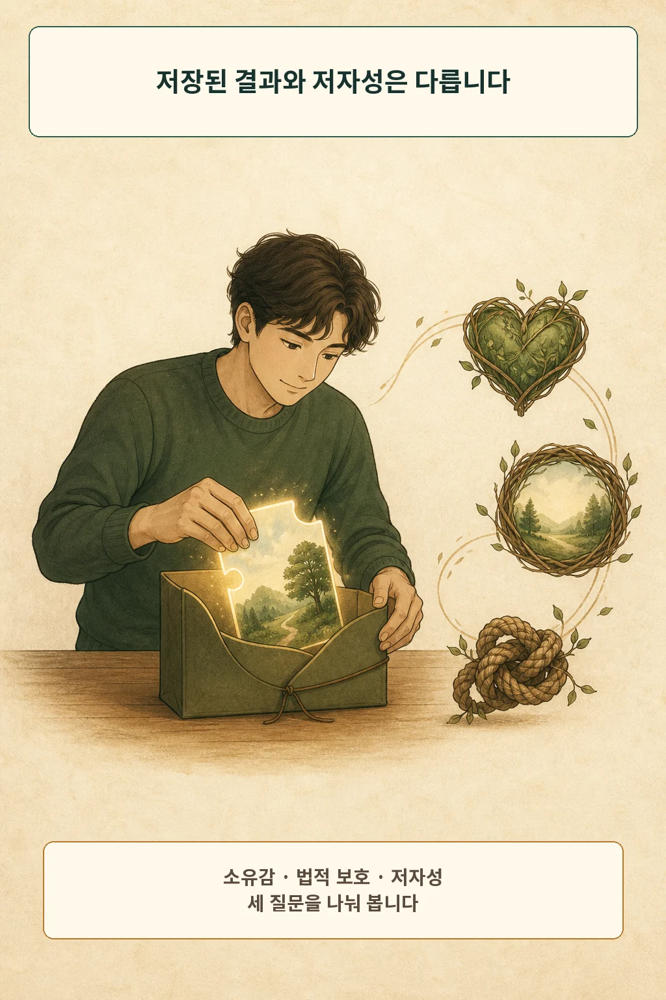
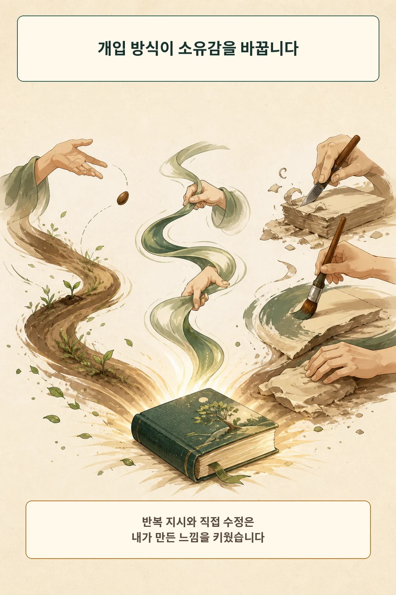
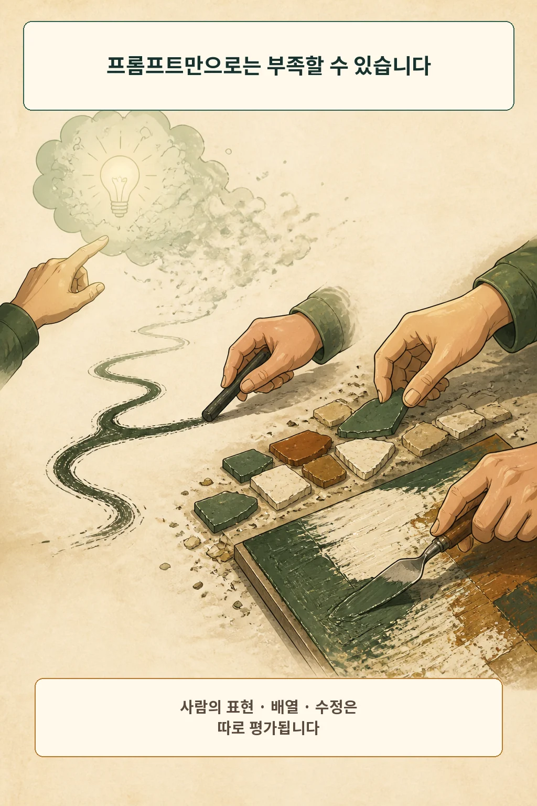
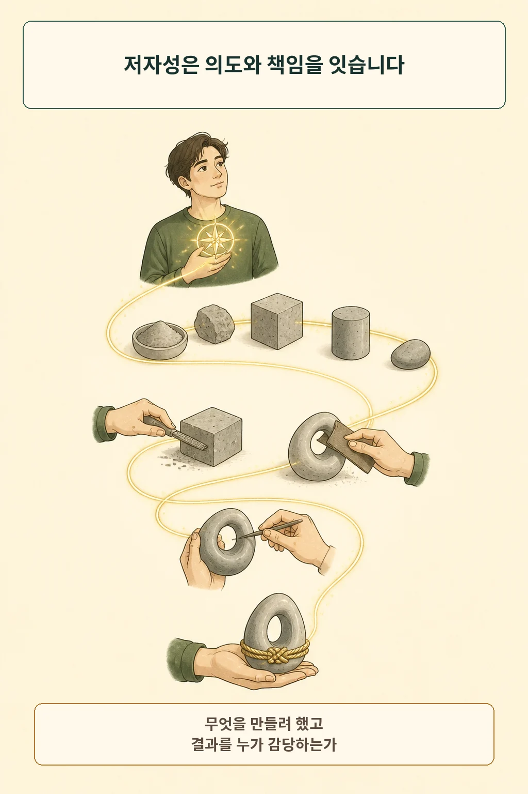
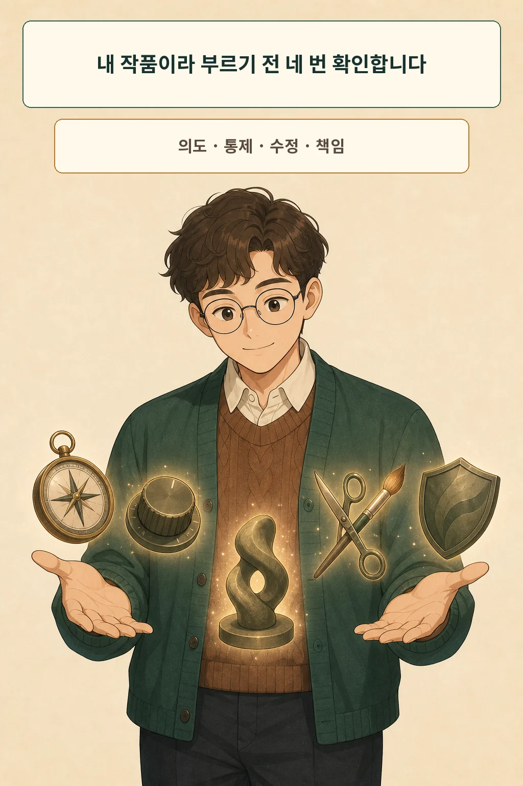

AI가 만든 결과물을 내 작품이라 부르려면 생성 버튼보다 더 많은 흔적이 필요합니다. 어떤 의도를 세웠고, 어느 표현을 직접 바꿨으며, 무엇을 거절했고, 최종 결과를 설명하고 고칠 준비가 되어 있는지가 그 흔적입니다. **AI를 썼다는 사실 하나로 저자성이 사라지지는 않지만, 파일을 저장했다는 사실만으로 저자성이 완성되지도 않습니다.**

글·해설: 다메카솔

## 저장하면 내 것이 될까

AI가 만든 문장을 고쳐 회의 자료에 넣거나, 생성 이미지를 골라 게시하면 “내가 만들었다”는 감각이 생깁니다. 이 감각은 가짜라고 밀어낼 필요가 없습니다. 시간과 취향, 판단을 투자했기 때문입니다.

여기서 세 질문을 나누겠습니다. **소유감**은 결과물이 내 것처럼 느껴지는 경험입니다. **법적 보호**는 특정 관할의 규칙이 어떤 인간 기여를 보호하는지 묻습니다. **저자성**은 누가 작품의 방향을 만들었고 결과를 자기 이름으로 감당하는지 묻습니다. 셋은 겹치지만 같은 답을 주지는 않습니다.

## 개입 방식은 소유감을 바꿉니다

2026년 Pennanen 등은 온라인 참가자 273명이 짧은 이야기를 쓰는 사전등록 실험을 진행했습니다. 완전 수동 작성과 AI 보조 작성을 비교하고, AI 조건에서는 한 번의 프롬프트와 반복 프롬프팅, 생성 뒤 직접 수정 가능 여부를 나눴습니다. [How prompting and editing shape psychological ownership](https://doi.org/10.1016/j.chbah.2026.100381)

직접 수정은 특히 한 번의 프롬프트로 생성한 조건에서 심리적 소유감을 높였습니다. 직접 고칠 수 없을 때는 반복 프롬프팅도 소유감을 높였습니다. 두 방식 모두 사람이 통제하고 자기 판단을 투자할 기회를 만든 셈입니다. 완전 수동 작성의 소유감은 모든 AI 보조 조건보다 높았고, 이 차이는 노력·품질 인식·내적 동기를 보정한 탐색 분석에서도 남았습니다.

연구가 측정한 것은 짧은 이야기 쓰기에서의 **심리적 소유감**입니다. 이 결과만으로 저작권이나 철학적 저자성을 판정할 수는 없습니다. 대신 한 번 맡기고 고르는 흐름과, 생성 과정에 방향과 수정을 남기는 흐름이 사람의 경험부터 다르게 만든다는 근거를 줍니다.

## 저작권은 소유감과 다른 질문입니다

미국 저작권청은 2025년 보고서에서 현재 일반적으로 이용 가능한 기술의 프롬프트만으로는 출력 저자가 되기에 충분한 인간 통제가 제공되지 않는다고 결론 내렸습니다. 자세한 프롬프트도 시스템이 최종 표현 요소를 어떻게 구현할지 사람이 충분히 결정했는지 사례별로 봅니다. [Copyright and Artificial Intelligence, Part 2](https://www.copyright.gov/ai/Copyright-and-Artificial-Intelligence-Part-2-Copyrightability-Report.pdf)

반면 AI가 인간 창작을 보조하고, 사람이 만든 표현이 결과에 드러나거나 AI 재료를 창의적으로 선택·배열·수정했다면 그 인간 기여는 보호 대상이 될 수 있다고 정리했습니다. 이 설명은 미국 저작권 행정의 현재 관점이며, 한국을 포함한 다른 관할의 법률 자문으로 옮겨 쓸 수 없습니다.

## 철학의 렌즈는 의도와 책임을 연결합니다

철학 논문 《Complete Artworks without Authors》는 작품 저자성을 설명하는 여러 이론을 검토합니다. 그중 Livingston의 설명을 정리한 대목은 저자를 만드는 의도가 작품 생산에 인과적으로 기여하고, 그 사람이 적어도 일부는 작품에 궁극적 책임을 지는 연결을 강조합니다. [Complete Artworks without Authors](https://doi.org/10.1017/can.2024.10)

이 렌즈가 AI 창작의 정답을 대신하지는 않습니다. 그래도 “아이디어가 있었는가”보다 더 구체적인 질문을 줍니다. 내가 의도한 표현이 결과에 어떤 결정으로 남았는가, 그리고 잘못된 결과가 드러났을 때 출처와 수정 이유를 설명하며 다시 고칠 사람은 누구인가. 저자성은 영감의 소유권보다 결정과 책임의 연결에 가까워집니다.

## 다메카솔의 판단: 네 흔적만큼 말합니다

저는 AI 보조 결과물의 저자성을 네 흔적으로 확인하겠습니다.

1. **의도:** 생성 전에 전달할 질문과 기준을 내가 정했는가?
2. **통제:** 분위기만 주문한 것이 아니라 결과를 바꾸는 결정을 내렸는가?
3. **수정:** 선택에 그치지 않고 표현을 직접 고치고 필요하면 버렸는가?
4. **책임:** 출처와 AI 사용을 밝히고 오류를 설명·수정할 수 있는가?

한 번 생성해 마음에 드는 결과를 고른 경우라면 “AI 생성 결과를 골랐다”가 정확합니다. 의도를 세우고 반복 조율하며 직접 수정하고 최종 책임까지 맡았다면 “AI 보조로 만든 내 작업”이라고 말할 근거가 커집니다. 공개할 때는 AI 사용 사실도 함께 밝힙니다.

정리하면 소유감은 내가 느끼는 관계, 저작권은 관할이 인정하는 보호, 저자성은 결과에 남긴 의도와 책임의 관계입니다. 세 문장을 구분하면 “전부 내 것”과 “아무것도 내 것이 아님” 사이에서 실제 기여만큼 정확하게 말할 수 있습니다.

## 출처

- [Pennanen et al., How prompting and editing shape psychological ownership in AI-assisted creative writing](https://doi.org/10.1016/j.chbah.2026.100381)
- [U.S. Copyright Office, Copyright and Artificial Intelligence, Part 2: Copyrightability](https://www.copyright.gov/ai/Copyright-and-Artificial-Intelligence-Part-2-Copyrightability-Report.pdf)
- [Kelly Trogdon, Complete Artworks without Authors](https://doi.org/10.1017/can.2024.10)

이 글의 본문과 이미지는 생성형 AI로 제작했습니다. 기획과 편집 기준은 다메카솔이 정했습니다.

이미지는 텍스트 없는 원화에 결정적 레터링을 합성해 제작했습니다.
