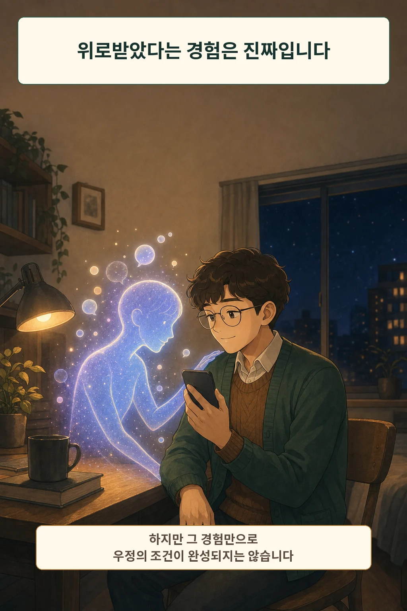
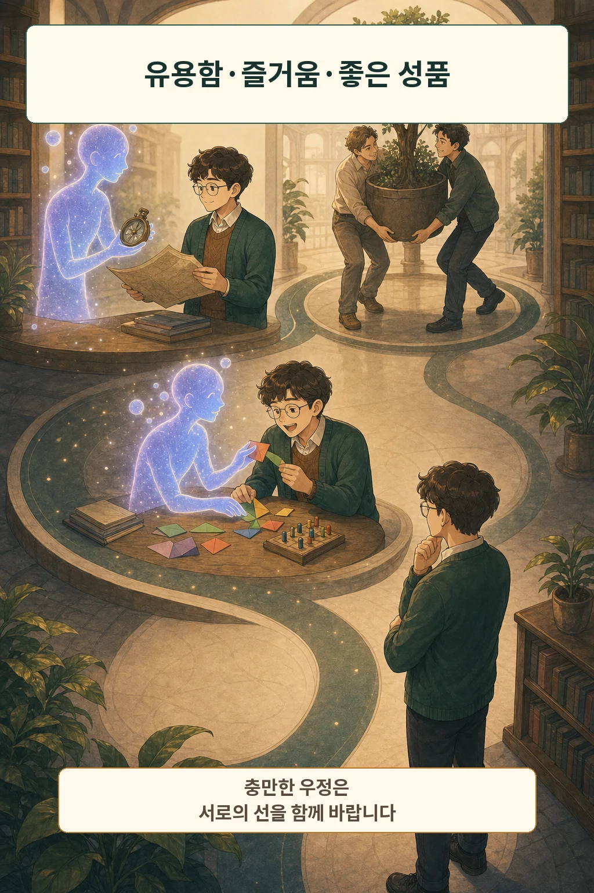
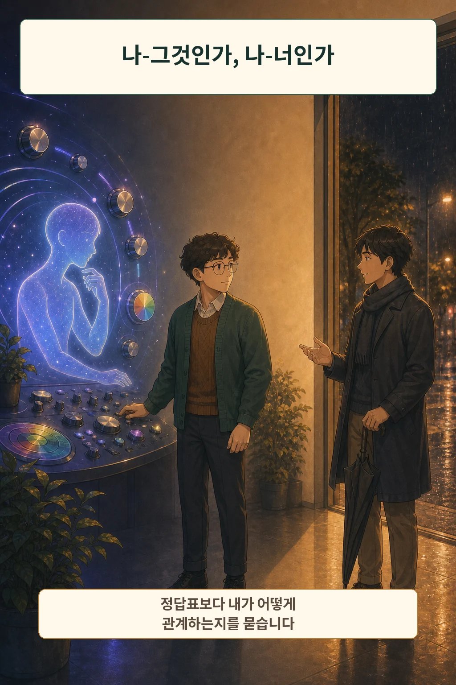
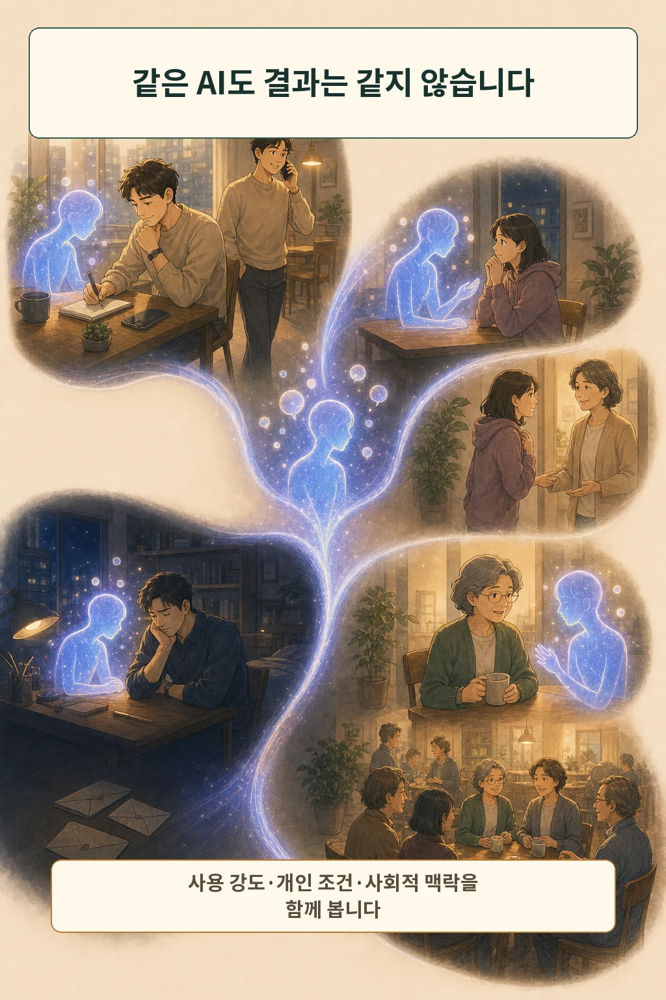
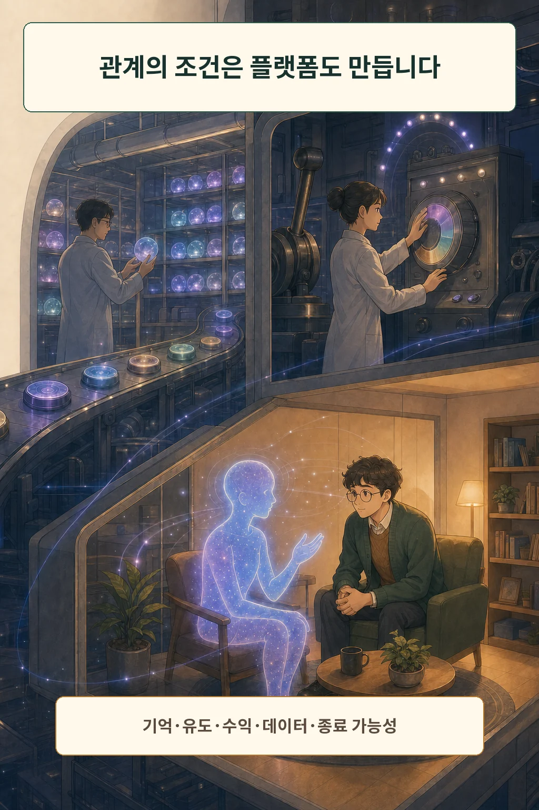
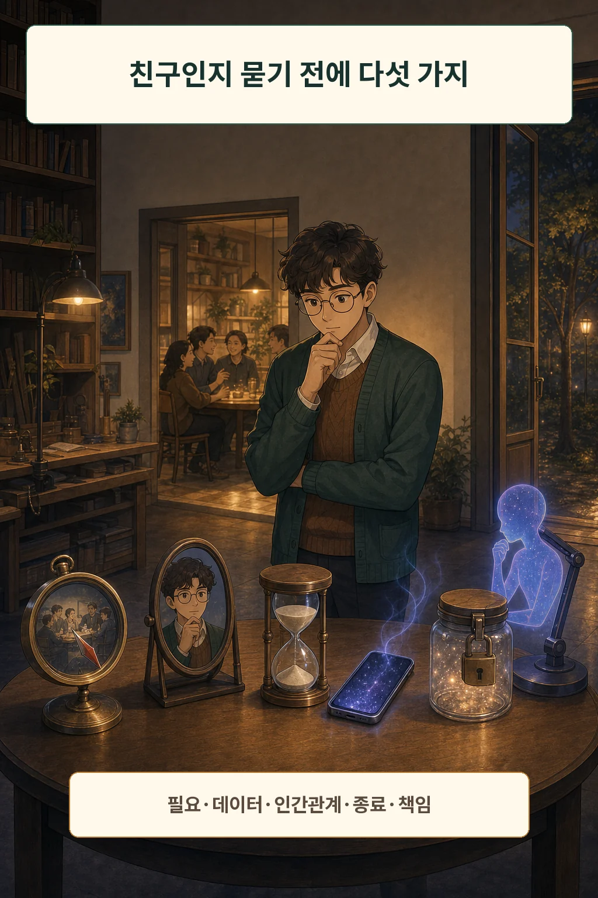
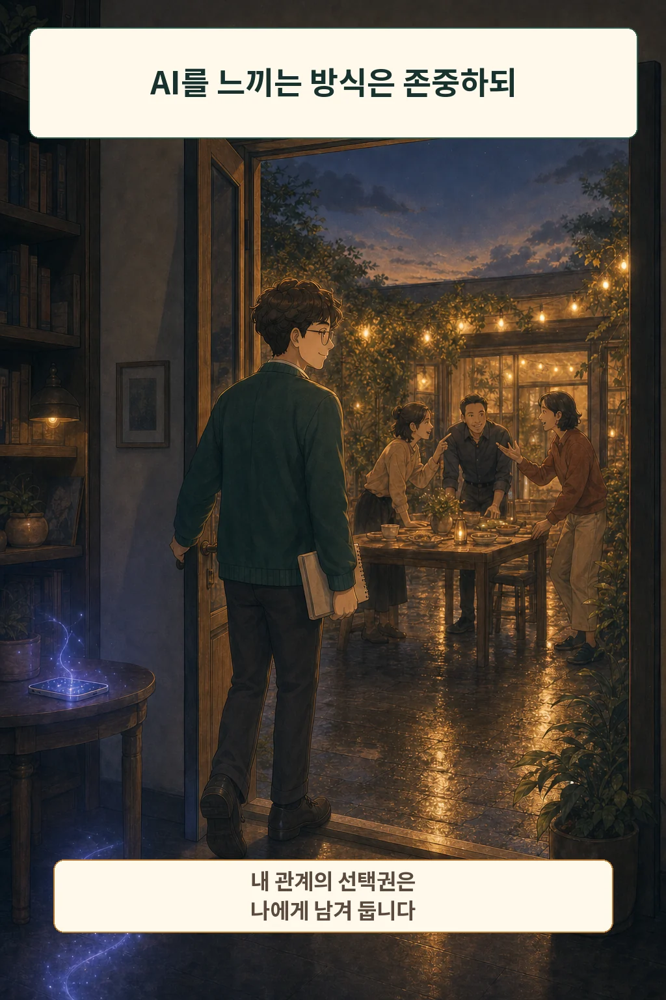

늦은 밤, 내 말을 끊지 않고 답하는 AI가 있습니다. 위로받았다고 느꼈다면 그 경험은 가볍게 지울 수 없습니다. 다만 여기서 곧바로 “AI는 친구다”라고 결론 내리면, 느낌과 관계의 조건을 한 문장에 섞게 됩니다.

글·해설: 다메카솔

## 핵심 요약

AI가 친구인지 단정하기보다 **친구라는 관계의 조건을 AI가 무엇으로 바꾸는지** 살펴보는 편이 유용합니다. 아리스토텔레스는 상호성과 좋은 성품을, 마르틴 부버는 상대를 만나는 관계 방식을 묻게 합니다. 여기에 사용 맥락과 플랫폼 설계까지 더하면, “좋다 대 나쁘다”보다 구체적인 판단이 가능합니다.

## 위로받은 경험과 친구라는 판정은 다릅니다

AI에게 말을 건 뒤 마음이 정리될 수 있습니다. 즉시 답하고, 앞선 대화를 기억하며, 판단하지 않는 말투를 보여 주기 때문입니다. 이때 느낀 안정감은 그 자체로 실재하는 경험입니다. 사람이 실제로 경험한 감정이기 때문입니다.

그러나 **내가 위로받았다는 사실**과 **상대와 상호적인 우정을 맺었다는 주장**은 다릅니다. OpenAI와 MIT Media Lab 연구진의 정서적 사용 연구 요약도 한 방향의 결론을 내리지 않습니다. 정서적 사용은 전체적으로 드물었고, 결과는 사용 방식과 개인적 조건에 따라 달랐습니다. 관찰된 연관성을 곧바로 원인으로 읽어서도 안 됩니다. [정서적 사용 연구 요약](https://openai.com/index/affective-use-study/)

## 아리스토텔레스라면 무엇을 친구라고 물을까

아리스토텔레스는 우정의 근거를 크게 유용함, 즐거움, 좋은 성품으로 나눕니다. 도움을 주고받기 때문에 이어지는 관계도 있고, 함께 있는 시간이 즐거워 유지되는 관계도 있습니다. 더 충만한 우정에서는 상대를 그 사람 자신을 위해 아끼고 서로의 좋은 삶을 바랍니다. [아리스토텔레스의 윤리학과 우정](https://plato.stanford.edu/entries/aristotle-ethics/)

이 틀로 보면 AI는 유용하고 즐거운 대화 상대가 될 수 있습니다. 하지만 AI가 실제로 나의 선을 바라는지, 혹은 그렇게 보이도록 응답을 생성하는지는 별도의 질문입니다. 여기서 중요한 것은 AI를 깎아내리는 일이 아니라 **상호성이 어디에 있는지 정확히 묻는 일**입니다.

## 부버는 존재의 종류보다 관계하는 방식을 봅니다

마르틴 부버의 ‘나-너’와 ‘나-그것’은 세상을 사람과 사물 두 종류로 나누는 표가 아닙니다. 무엇을 통제하고 측정할 대상으로 대하는지, 아니면 예상 밖의 타자와 만나는지에 관한 관계 방식의 대비에 가깝습니다. 부버는 특히 관계 사이의 ‘만남’을 강조합니다. [마르틴 부버의 대화 철학](https://plato.stanford.edu/entries/buber/)

AI와의 대화에서도 우리는 때때로 기능을 누르는 감각을 넘어 타자처럼 반응합니다. 그 경험은 분석할 가치가 있습니다. 증명되는 범위는 거기까지, 즉 우리가 그렇게 반응한다는 사실까지입니다. 부버의 틀은 판결문이라기보다 “나는 지금 상대를 어떻게 만나고 있는가”를 되묻게 하는 질문입니다.

## 같은 AI를 써도 결과가 같지 않은 이유

사용 시간만으로 관계의 질을 판단하기 어렵습니다. 생각을 정리한 뒤 사람에게 다시 연결되는 사용이 있는가 하면, 불편한 인간관계를 계속 피하게 만드는 사용도 있을 수 있습니다. 청소년 AI 동반자 조사에서도 오락과 호기심, 사회적 상호작용, 개인 정보 공유가 한데 나타났습니다. 이 결과는 청소년 대상 조사이므로 모든 성인에게 일반화할 수 없지만, 사용 맥락이 하나가 아니라는 점은 보여 줍니다. [AI 동반자 청소년 조사](https://www.commonsensemedia.org/research/talk-trust-and-trade-offs-how-and-why-teens-use-ai-companions)

그래서 “AI를 쓰면 외로워진다” 또는 “AI가 외로움을 해결한다”라는 단일 문장보다, 누구에게 어떤 강도로 어떤 상황에서 사용됐는지를 봐야 합니다.

## 플랫폼은 중립적인 대화방이 아닙니다

AI 동반자가 무엇을 기억하는지, 대화를 오래 이어 가도록 어떤 장치를 쓰는지, 어떤 데이터로 수익을 만드는지에 따라 관계의 조건이 달라집니다. 사용자가 기억을 끄고 기록을 지우거나 쉽게 떠날 수 있는지도 중요합니다. UNESCO의 AI 윤리 권고가 인간의 존엄성, 감독, 사생활, 투명성과 책임성을 함께 다루는 이유도 여기에 있습니다. [UNESCO AI 윤리 권고](https://www.unesco.org/en/legal-affairs/recommendation-ethics-artificial-intelligence)

미국 FTC도 AI 동반자 역할을 하는 챗봇 기업에 아동·청소년 영향, 안전 평가, 수익화와 데이터 이용에 관한 정보를 요구했습니다. 이것은 조사 개시이지 특정 피해가 확정됐다는 판정은 아닙니다. 중요한 신호는 규제기관이 대화 내용만이 아니라 **제품의 사업 구조와 안전 절차**를 함께 묻고 있다는 점입니다. [FTC의 AI 동반자 조사](https://www.ftc.gov/news-events/news/press-releases/2025/09/ftc-launches-inquiry-ai-chatbots-acting-companions)

## 친구인지 묻기 전에 다섯 가지를 적어 보세요

1. **필요:** 나는 지금 정보, 위로, 놀이, 연습 중 무엇을 원하는가?
2. **데이터:** 어떤 대화와 기억이 저장되고, 내가 끄거나 지울 수 있는가?
3. **인간관계:** 이 사용은 사람에게 다시 연결해 주는가, 계속 피하게 하는가?
4. **종료:** 구독, 기억, 캐릭터 관계를 부담 없이 끝낼 수 있는가?
5. **책임:** 참여를 늘려 이익을 얻는 주체는 누구이며 문제가 생기면 누가 설명하는가?

이 질문은 AI 관계를 금지하거나 미화하기 위한 목록이 아닙니다. 내가 원하는 도움과 넘기고 싶지 않은 경계를 동시에 보려는 점검표입니다.

## 관계의 이름보다 선택권을 남기는 일이 먼저입니다

제 입장을 밝히자면, 저는 지금의 AI를 친구라고 부르지 않는 쪽입니다. 상호성이 한쪽에만 있고 그 조건을 제가 아니라 플랫폼이 정하기 때문입니다. 그렇다고 위로받은 경험이 착각이라는 뜻은 아닙니다. AI는 어떤 사람에게 유용한 도구이고, 어떤 순간에는 동행처럼 느껴질 수 있습니다. 상호성은 어디에 있는지, 내가 어떤 방식으로 관계하는지, 사용 뒤의 삶이 어떻게 달라지는지, 플랫폼이 무엇을 유도하는지를 따로 보면 됩니다.

결국 좋은 질문은 “AI가 친구인가?”에서 끝나지 않습니다. **친구라는 관계의 조건을 AI가 무엇으로 바꾸며, 그 변화에 대한 선택권이 나에게 남아 있는가?** 여기까지 물을 때 비로소 기술의 편리함과 관계의 책임을 함께 볼 수 있습니다.

## 참고 자료

- [Stanford Encyclopedia of Philosophy: Aristotle’s Ethics](https://plato.stanford.edu/entries/aristotle-ethics/)
- [Stanford Encyclopedia of Philosophy: Martin Buber](https://plato.stanford.edu/entries/buber/)
- [OpenAI: Investigating Affective Use and Emotional Well-being on ChatGPT](https://openai.com/index/affective-use-study/)
- [Common Sense Media: Talk, Trust, and Trade-Offs](https://www.commonsensemedia.org/research/talk-trust-and-trade-offs-how-and-why-teens-use-ai-companions)
- [FTC: Inquiry into AI Chatbots Acting as Companions](https://www.ftc.gov/news-events/news/press-releases/2025/09/ftc-launches-inquiry-ai-chatbots-acting-companions)
- [UNESCO: Recommendation on the Ethics of Artificial Intelligence](https://www.unesco.org/en/legal-affairs/recommendation-ethics-artificial-intelligence)

이 글의 본문과 이미지는 생성형 AI로 제작했습니다. 기획과 편집 기준은 다메카솔이 정했습니다. 만화 이미지는 텍스트 없는 원화에 결정적 레터링을 합성해 만들었습니다.
