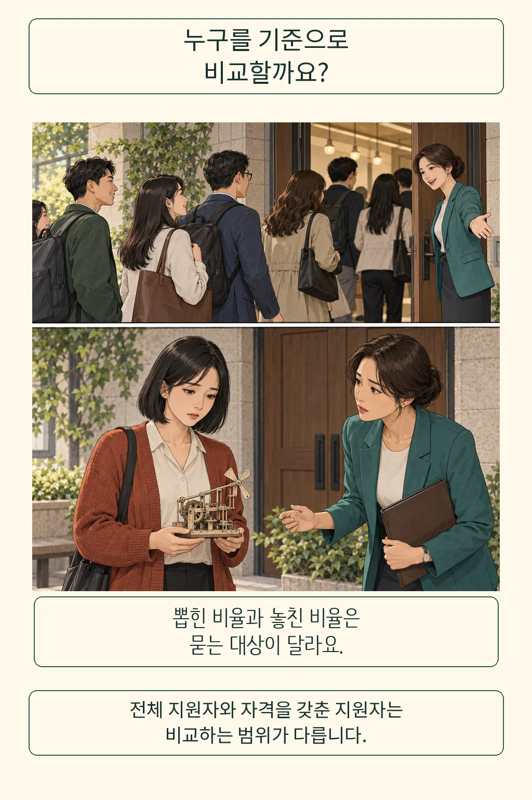

AI가 누구에게나 같은 기준으로 점수를 매기면 공정할까요? 사람의 기분에 따라 결과가 바뀌는 것보다는 믿음직해 보입니다. 하지만 **무엇을 점수로 만들었는지, 어떤 사람을 잘못 탈락시켰는지까지 살펴야 공정성을 판단할 수 있습니다.** 저는 일관된 계산에 더해, 평가받는 사람이 이유를 묻고 오류를 고칠 길이 있어야 한다고 봅니다.

글·해설: 다메카솔

## 같은 비율도 누구를 세느냐에 따라 달라집니다

선발 비율을 같게 하는 일과 억울한 탈락을 줄이는 일은 서로 다른 질문입니다. 설명을 위해 AI가 교육 과정의 지원자를 고르는 장면을 떠올려 봅니다. 한 담당자는 각 집단에서 뽑힌 사람의 비율을 비교하고, 다른 담당자는 과정을 따라갈 준비가 된 사람 중 누가 잘못 탈락했는지 살핍니다. 두 사람이 보는 분모가 다릅니다.

솔론 바로카스, 모리츠 하르트, 아르빈드 나라야난은 『Fairness and Machine Learning』에서 이런 통계적 기준을 구분합니다. 전체 지원자를 기준으로 선발 비율을 맞출 수도 있고, 자격을 갖춘 지원자 안에서 잘못 탈락한 비율을 맞출 수도 있습니다. 뒤의 조건은 두 종류의 오류를 모두 맞추는 기준에서 일부만 살핀 것입니다. [저자들의 설명](https://fairmlbook.org/classification.html)

어느 비율을 볼지는 가치 판단입니다. 참여 기회를 넓히는 목적과 준비된 사람을 놓치지 않는 목적은 관심사가 다르므로, 지표 이름만 보고 정답을 고르기 어렵습니다. 더구나 ‘준비됐다’는 판정에 과거의 불공정한 평가가 섞여 있다면, 그 판정을 정답으로 삼은 계산도 다시 살펴야 합니다. 저는 먼저 이 점수가 예측하려는 결과를 일상적인 말로 설명해 달라고 요청하겠습니다.

## 준비할 기회도 같았을까요?

앞의 질문을 채용으로 옮기면 점수에 들어가기 전의 시간도 보입니다. 가상의 두 지원자가 같은 대회 경력 항목으로 평가받습니다. 한 사람은 충분히 준비했고, 다른 사람은 생활비를 벌며 틈틈이 준비했습니다. 이 장면만으로 누가 더 적합한지 정할 수는 없지만, 경력 차이를 만들 기회가 어땠는지는 물을 수 있습니다.

기회균등은 이때 쓸 만한 철학적 렌즈입니다. 같은 책의 저자들은 롤스의 공정한 기회균등을 해설하면서, 비슷한 능력과 의욕을 지닌 사람이 태어난 환경 때문에 성공 기회에서 뒤처지지 않도록 사회 제도를 살피는 넓은 관점을 소개합니다. 여기서는 롤스의 원전을 직접 인용하지 않고 이 해설을 참고했습니다. [기회균등의 여러 관점](https://fairmlbook.org/relative.html)

이 관점은 특정 지원자에게 무조건 가산점을 주라는 계산식까지 정해 주지는 않습니다. 대신 경력을 쌓을 자원과 교육 기회가 어떻게 배분됐는지 질문하게 합니다. 실제 과제를 해 볼 기회를 제공할지, 입사 뒤 교육을 늘릴지처럼 평가 이전과 이후에도 선택지가 생깁니다. 이는 가상 장면에 대한 제 해석이며, 효과가 입증된 채용 처방으로 제시하는 것은 아닙니다.

## 다메카솔의 해석: 점수 뒤에도 대화가 이어져야 합니다

저라면 평가 결과 화면에 점수만 남기는 설계부터 다시 보겠습니다. 어떤 능력을 평가했는지, 잘못된 입력은 어디서 고치는지, 이의를 제기하면 누가 어떤 기준으로 검토하는지까지 하나의 평가 과정에 넣겠습니다. 모델의 결과를 저장하는 일과 사람의 기회를 결정하는 일은 연결돼 있기 때문입니다. 이 제안은 특정 서비스를 운영해 얻은 실측 결론이 아닙니다.

앤드루 셀브스트와 동료들은 공정성을 모델의 속성으로만 다루며 주변 제도와 사람을 제외하는 접근의 한계를 논증했습니다. 설계 범위에 사회적 행위자와 상호작용을 포함하자는 주장입니다. 이 논문은 특정한 재검토 절차가 얼마나 효과적인지 측정한 실험은 아니므로, 제 제안의 효과는 별도로 살펴야 합니다. [논문 원문](https://doi.org/10.1145/3287560.3287598)

물론 담당자를 한 명 더 두는 것만으로 충분하지는 않습니다. 사람도 편견을 가질 수 있고, 점수를 바꿀 권한 없는 담당자에게 문의가 쌓일 수도 있습니다. 그래서 저는 검토 기준과 수정 권한, 답변 과정을 함께 설계하겠습니다. [AI가 실수했을 때의 책임](/posts/ai-mistake-responsibility-boundary/)을 묻는 일도 여기서 이어집니다.

처음의 질문에 대한 제 답은 이렇습니다. 같은 계산 규칙은 공정성을 살피는 한 조건이고, 평가의 목적과 기회의 조건, 오류를 고치는 과정까지 함께 판단해야 합니다. 결과를 받았을 때 건넬 첫 문장을 골라 봅니다. “제 점수는 무엇을 평가했고, 잘못 반영된 정보는 어떻게 고칠 수 있나요?”

## 출처

- Barocas, S., Hardt, M. & Narayanan, A. [Fairness and Machine Learning, 3장](https://fairmlbook.org/classification.html): Independence, Separation 및 정답 변수의 한계.
- 같은 책 [4장](https://fairmlbook.org/relative.html): 기회균등의 넓은 관점. 롤스 철학에 관한 해설로 참고.
- Selbst, A. D. et al. (2019). [Fairness and Abstraction in Sociotechnical Systems](https://doi.org/10.1145/3287560.3287598), 서론과 §2.1.

발행일: 2026-10-06 · 출처 확인일: 2026-10-06

이 글의 본문과 이미지는 생성형 AI로 제작했습니다. 기획과 편집 기준은 다메카솔이 정했습니다.
