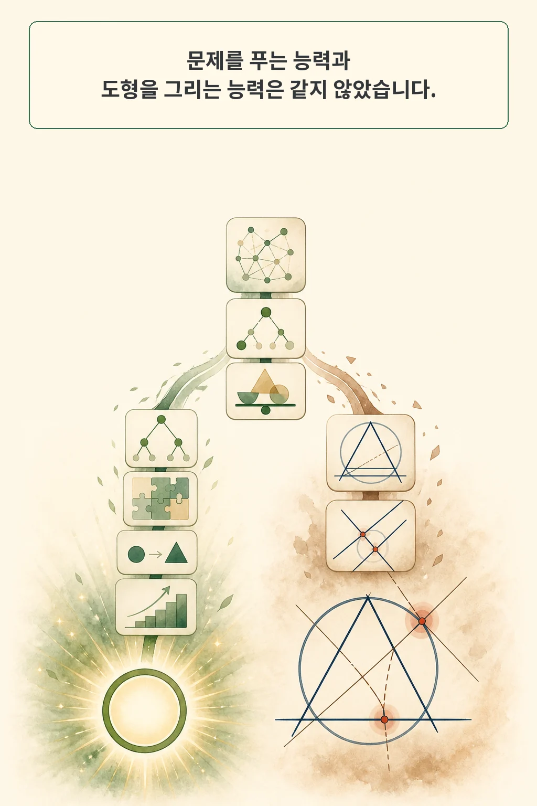
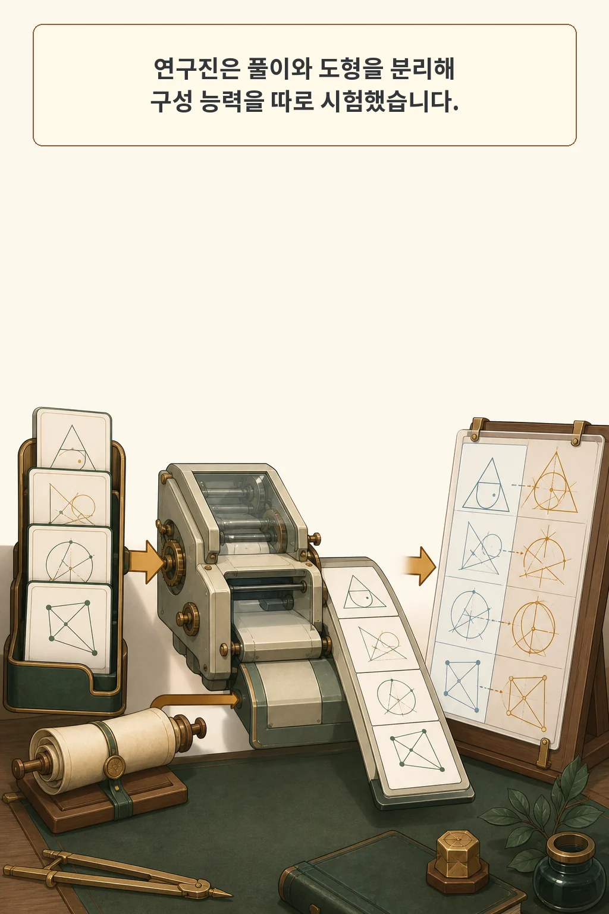
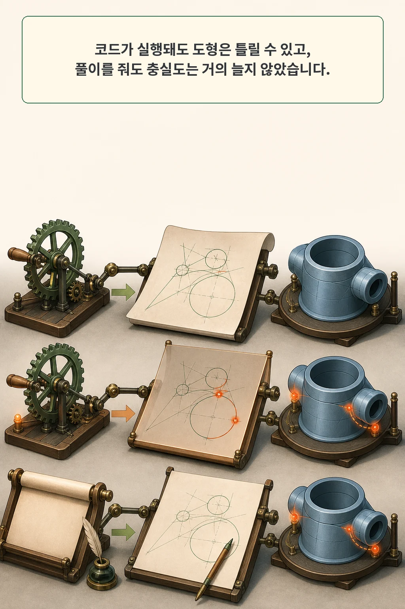
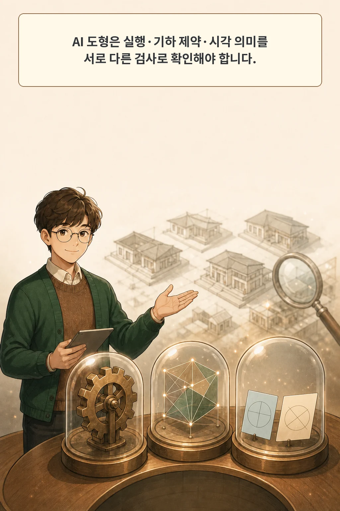

36.14%. 올림피아드 기하 문제를 도형 코드로 바꾸게 했을 때, 실험 전체의 평균 컴파일 성공률입니다. 실행에 성공한 결과도 점의 배치와 선의 관계가 맞는지는 다시 확인해야 했습니다.

2026년 8월 20일 arXiv의 cs.AI 신규 목록에 나타난 **「Solving Is Not Drawing: A Benchmark for Diagrammatic Reasoning in Olympiad Geometry」**는 이 간극을 따로 측정합니다. 모델이 답을 구하는 과정과, 문제에 적힌 관계를 충실한 그림으로 구성하는 과정은 같은 능력일까요?

논문의 답은 조심스러운 경고에 가깝습니다. 공개된 풀이 성적이 높은 모델도 도형 구성에서는 크게 흔들렸고, 참조 풀이를 함께 줘도 렌더된 도형의 충실도는 거의 오르지 않았습니다.

글·해설: 다메카솔

## 핵심 내용

- 논문은 텍스트 문제 풀이와 도형 구성을 분리해, 올림피아드 기하 문제의 Asymptote 도형 생성 능력을 평가했습니다.
- 저자들이 보고한 전체 수집분은 954문제이고 실제 벤치마크 평가는 어려운 297문제 하위 집합에서 진행됐습니다.
- 모델과 조건을 평균한 컴파일 성공률은 36.14%, VLM 비평 점수는 100점 만점에 46.58점이었습니다.
- 참조 풀이를 주면 텍스트·코드 겹침은 늘었지만 렌더 도형의 충실도는 거의 좋아지지 않거나 일부 조건에서 낮아졌습니다.
- 이 연구는 도형을 한 번씩만 생성했고 VLM 심사에도 한계가 있습니다. 제품에서는 실행, 기하 제약, 시각 의미를 나눠 검사해야 합니다.

## ‘풀었다’와 ‘그렸다’ 사이

기하 문제의 정답을 구하는 모델은 텍스트나 수식으로 관계를 추론합니다. 도형을 그리는 모델은 그 관계를 좌표, 점, 선, 원, 교점으로 배치해야 합니다. 후자에는 문제에 직접 쓰이지 않은 공간 제약까지 일관되게 맞추는 일이 포함됩니다.

예를 들어 풀이가 “두 선의 교점”을 올바르게 사용해도 생성된 그림에서 그 선들이 만나지 않으면 시각 설명은 틀립니다. 각의 크기나 길이가 축척상 정확할 필요가 없는 도식이라도, 평행·수직·공선·내접 같은 핵심 관계는 보존돼야 합니다.

저자들은 이 능력을 **diagrammatic reasoning**, 여기서는 **도형적 추론**이라고 부릅니다. 문제의 명시적·암묵적 기하 관계를 만족하는 시각 구성을 만들고 검증하는 능력입니다. 이 정의는 정답 풀이 점수를 곧바로 도형 품질 점수로 쓰지 못하게 합니다.

## 무엇을 어떻게 시험했나

논문은 사람이 작성한 Asymptote 해설 도형이 있는 자족적 올림피아드 기하 문제 954개를 모았다고 보고합니다. 그중 어려운 297문제 하위 집합을 골라 다섯 모델 계열을 시험했습니다. 각 모델에는 문제만 주는 조건과 참조 풀이까지 주는 조건을 적용했습니다.

생성 결과는 한 점수로 합치지 않고 여러 층으로 나눴습니다.

| 평가 층 | 확인하는 것 | 놓칠 수 있는 것 |
| --- | --- | --- |
| 텍스트·코드 겹침 | 참조 설명이나 코드와 표현이 비슷한가 | 다른 표현으로 만든 올바른 도형 |
| 컴파일 성공 | Asymptote 코드가 실행되는가 | 실행되지만 기하 관계가 틀린 그림 |
| 이미지 유사도 | 렌더 결과가 참조 이미지와 시각적으로 가까운가 | 동치인 다른 배치와 미세한 관계 오류 |
| VLM 비평 | 시각 모델이 문제 조건과 그림을 함께 보고 평가하는가 | 심사 모델이 놓치거나 잘못 판단한 오류 |

이 분리는 중요합니다. 프로그램이 실행된다는 사실, 이미지가 비슷해 보인다는 사실, 문제의 기하 관계가 맞는다는 사실은 서로 다른 증거입니다.

## 실행 성공은 기하 충실도가 아니었다

모델과 입력 조건을 평균한 Asymptote 컴파일 성공률은 36.14%였습니다. 모델별·조건별 성공률은 20.8%에서 59.3%까지 벌어졌습니다. 코드 생성 단계부터 안정적이지 않았다는 뜻입니다.

컴파일된 결과의 시각 품질도 높지 않았습니다. 평균 VLM 비평 점수는 100점 만점에 46.58점이었고, 어떤 개별 설정도 53.2점을 넘지 못했습니다. 저자들은 실행 성공이 기하 충실도의 약한 대리 지표라고 해석합니다. 문법적으로 유효한 코드는 시작 조건이지 완료 증거가 아닙니다.

참조 풀이를 제공한 실험은 더 흥미롭습니다. 모델은 설명의 키워드와 코드 표현을 더 잘 맞췄지만, 렌더 이미지의 유사도와 VLM 비평 같은 시각 충실도 지표는 거의 개선되지 않거나 일부 설정에서 낮아졌습니다. 풀이에 필요한 관계를 읽는 것과 그 관계를 일관된 좌표계에 배치하는 것 사이에 별도 병목이 있다는 신호입니다.

## 결과를 읽을 때 지켜야 할 경계

이 실험을 “수학을 잘 푸는 AI가 그림은 못 그린다”는 직접적인 쌍대 비교로 읽으면 범위를 넘습니다. 논문은 같은 297문제에서 모델의 풀이 정확도를 다시 측정하지 않았습니다. 대신 공개된 AIME 2025 시스템 카드 성적과 이번 도형 생성 결과를 나란히 비교했습니다.

또한 각 문제·모델·조건에서 도형을 한 번씩만 생성했습니다. 생성의 무작위성을 바꿨을 때 결과가 얼마나 흔들리는지는 측정되지 않았습니다. VLM 심사자는 미묘한 기하 오류를 놓치거나 올바른 변형을 잘못 낮게 평가할 수 있고, 텍스트·코드 겹침 지표는 상투적 표현을 보상할 수 있습니다.

자료 공개 범위도 구분해야 합니다. 논문은 954문제 전체를 보고하지만, 2026년 8월 20일 제가 보존한 공식 Hugging Face 리비전에는 어려운 하위 집합 297행이 있었습니다. 각 행의 문제, 풀이, Asymptote 코드 필드는 확인할 수 있었지만 전체 954문제와 논문의 정확한 실행 환경은 공개 스냅숏에서 확보하지 못했습니다. 따라서 이번 글은 자료 구조를 감사했을 뿐 전체 벤치마크를 독립 재현했다고 주장하지 않습니다.

## 다메카솔의 해석: 생성 도형은 세 번 검사한다

이 논문을 제품 운영으로 옮기면 생성 도형을 세 층으로 검증할 수 있습니다.

1. **실행 검사**: 코드나 SVG가 파싱·렌더되는지 확인합니다.
2. **기하 제약 검사**: 교점, 공선, 평행, 수직, 내접처럼 문제의 핵심 관계를 계산 가능한 규칙으로 검사합니다.
3. **시각 의미 검사**: 레이블 위치, 겹침, 가독성, 교육적 오해 가능성을 사람이나 독립 심사기가 확인합니다.

세 검사는 서로를 대신하지 않습니다. 실행 검사를 통과한 틀린 도형도 있고, 참조 이미지와 배치가 달라도 관계는 올바른 도형도 있습니다. 반복 생성의 변동성과 심사기 편향까지 보려면 여러 샘플과 사람 검토를 추가해야 합니다.

이것은 논문이 입증한 제품 처방이 아니라, 결과를 생성형 교육 자료의 품질 게이트로 바꾼 **다메카솔의 해석**입니다. 다음 도형 생성 작업부터는 “렌더됐는가?”에서 멈추지 않고 “관계가 맞는가?”, “독자가 같은 의미로 읽는가?”를 별도 체크 항목으로 남기겠습니다.

## 논문 정보

| 항목 | 내용 |
| --- | --- |
| 제목 | Solving Is Not Drawing: A Benchmark for Diagrammatic Reasoning in Olympiad Geometry |
| 저자 | Hsien Xin Peng, Anthony Kim, Alvin Li, Calvin Supasanya, Shivank Garg, Kevin Zhu |
| 공개 이력 | arXiv v1 제출 2026-06-23, cs.AI 신규 목록 2026-08-20 |
| 발표 정보 | ICML 2026 AI4MATH Workshop |
| 이 글의 분류 | 경험적 벤치마크 연구 |

## 자주 묻는 질문

### 컴파일에 성공하면 도형도 맞는 것 아닌가요?

컴파일은 코드 문법과 실행 가능성을 확인합니다. 점과 선이 문제의 기하 관계를 만족하는지는 별도 제약 검사와 시각 검토가 필요합니다.

### 참조 풀이를 주면 왜 그림이 바로 좋아지지 않나요?

풀이에는 필요한 관계가 담겨 있어도 이를 좌표와 객체로 배치하는 과정이 남습니다. 논문에서도 텍스트·코드 겹침은 늘었지만 렌더 충실도는 거의 개선되지 않았습니다.

### 공개 데이터로 결과를 재현할 수 있나요?

공식 저장소의 297행 하위 집합은 감사할 수 있습니다. 현재 공개 스냅숏에는 논문이 보고한 전체 954문제와 정확한 실행 환경이 없어 전체 결과를 독립 재현했다고 말할 수는 없습니다.

## 함께 읽기

- [AI가 과학 도형을 고칠 때, 무엇을 보존해야 할까 — SciDiagramEdit 논문 리뷰](/posts/scidiagramedit-paper-figure-revision/)

## 출처

- [Hsien Xin Peng 외, “Solving Is Not Drawing: A Benchmark for Diagrammatic Reasoning in Olympiad Geometry,” arXiv:2608.18111](https://arxiv.org/abs/2608.18111)
- [arXiv HTML 본문](https://arxiv.org/html/2608.18111v1)
- [공식 Hugging Face 데이터셋](https://huggingface.co/datasets/max98765/hard_geometry_problems_with_diagrams)

이 글의 본문과 이미지는 생성형 AI로 제작했습니다. 기획과 편집 기준은 다메카솔이 정했습니다.

Updated: 2026-08-20
