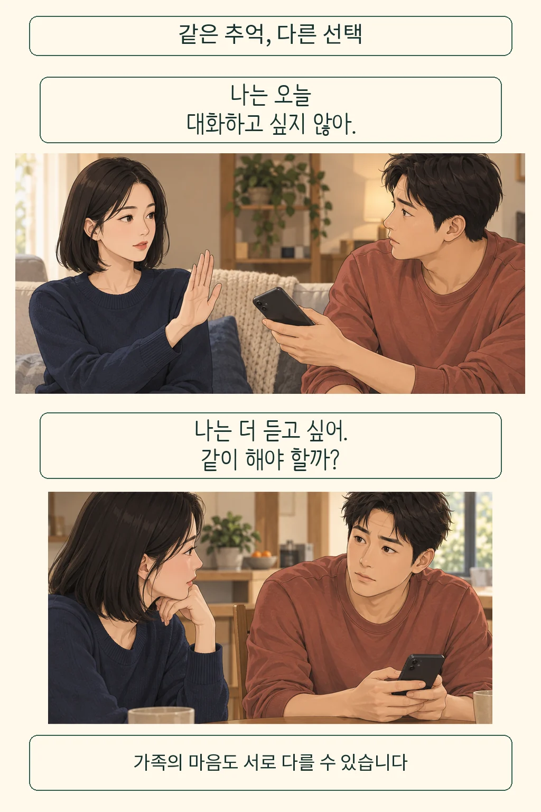
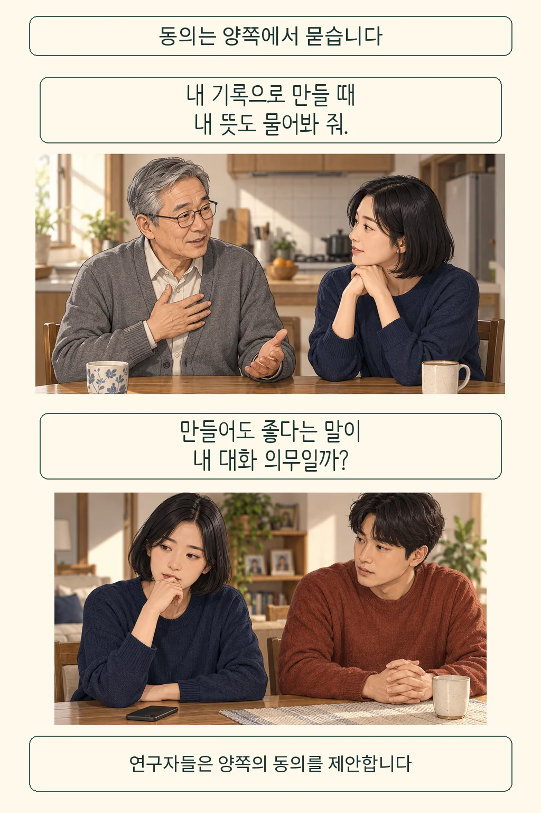
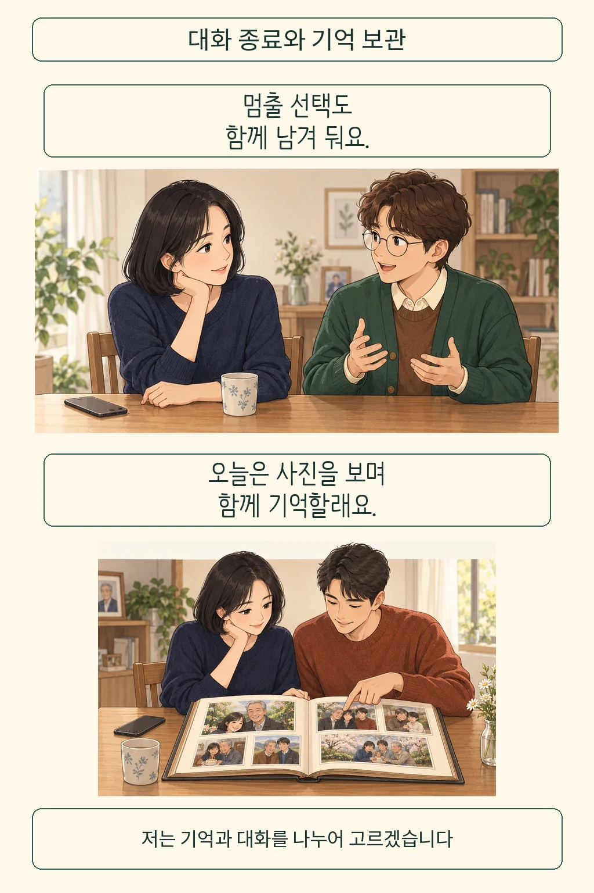

AI 대화창을 닫는 일과 아버지를 잊는 일은 어디서 갈라질까요? 아버지의 옛 사진은 간직하고 싶어도, 그 말투로 새 답을 내놓는 AI에는 오늘 답하기 어려울 수 있습니다. 기록 보관과 대화 참여를 한 선택으로 묶으면 이 차이를 놓치게 됩니다. **저는 추억을 남기면서 AI 대화는 멈출 수 있다고 봅니다.** 생전의 뜻과 현재 참여자의 의사를 함께 살피자는 입장입니다.

글·해설: 다메카솔

## 같은 가족이어도 원하는 거리는 다릅니다

설명을 위해 성인 남매의 장면을 상상해 봅니다. 오빠가 아버지의 옛 메시지로 대화 AI를 만들고 동생에게 접속을 권합니다. 오빠는 익숙한 표현을 다시 읽고 싶지만, 동생은 오늘 그 말투를 마주할 준비가 없습니다. 두 사람 모두 아버지를 소중하게 기억하면서도 원하는 거리는 다를 수 있습니다.

오빠에게 메시지 파일이 있다는 사실만으로 동생의 참여까지 정할 수 있을까요? 저는 기록을 가진 사람과 대화를 건네받을 사람을 나누어 생각하겠습니다. 가족 전체를 대표하는 동의 한 번으로 묶으면, 한 사람에게 반가운 초대가 다른 사람에게는 거절하기 어려운 부탁이 될 수 있기 때문입니다. 이 장면은 설명을 위한 창작 예시입니다.

[AI와 친구 관계를 다룬 글](/posts/ai-companion-friendship-philosophy/)에서는 관계의 조건을 물었습니다. 이번 질문에는 고인이 된 당사자의 의사와 남은 가족 사이의 차이까지 들어옵니다. AI가 얼마나 비슷하게 말하는지 평가하기 전에, 누가 그 대화를 원하고 있는지부터 확인할 이유가 있습니다.

## 생전의 허락과 지금의 참여는 다른 질문입니다

아버지가 생전에 AI 재현을 허락했더라도, 동생이 매일 답할 의무까지 맡았다고 볼 수 있을까요? 이 물음을 살필 렌즈가 상호 동의입니다. 토마시 홀라네크와 카타지나 노바치크바신스카는 2024년 철학 논문에서 기록의 당사자, 기록을 가진 사람, AI와 대화할 사람의 관점을 구분합니다. 저자들은 생전 당사자와 대화 참여자 양쪽의 동의를 고려하고, 재현 서비스임을 알리는 설명과 종료 절차를 마련하자고 제안합니다. [논문 원문](https://doi.org/10.1007/s13347-024-00744-w)

저자들은 가상의 서비스 시나리오로 윤리 문제를 분석했습니다. 이 글에서 확인한 근거는 그런 설계 논증이며, AI 대화가 애도에 도움이 되거나 해롭다는 임상시험 결과까지 포함하지 않습니다. 개인에게 맞는 애도 방식을 이 논문 하나로 정할 수도 없습니다.

이 렌즈를 가족의 장면에 적용하면 질문이 구체화됩니다. 아버지는 어떤 기록을 어떤 용도로 쓰기를 바랐을까요? 동생은 초대를 받고 자유롭게 거절할 수 있을까요? 저는 생전의 의사를 살피는 일과 현재 상대의 선택을 듣는 일을 함께 하겠습니다. 생전 뜻이 확인되지 않는다면, 가족이 가진 추측을 확인된 허락처럼 말하지 않는 태도도 필요합니다.

## 다메카솔의 해석: 기억할 길과 멈출 길을 함께 둡니다

대화를 그만두려는 순간에도 선택을 잘게 나누어 볼 수 있습니다. AI와의 대화를 쉬는 일, 원본 사진을 보관하는 일, 생성된 대화를 다른 가족에게 공유하는 일은 각각 다른 결정입니다. 저는 이 셋을 한꺼번에 처리하기보다, 무엇을 남기고 누구에게 보여 줄지 따로 합의하겠습니다. 실제로 가능한 보관·삭제 범위는 이용하는 서비스에서 확인해야 합니다.

이 기준은 추억을 말하는 권한도 돌아보게 합니다. AI가 새로 만든 답을 읽고 “아버지라면 이렇게 말했을 것”이라고 느낄 수는 있습니다. 그래도 가족에게 전할 때는 아버지가 실제로 남긴 말과 생성된 답을 구별해 설명하고 싶습니다. 닮았다는 느낌이 생전의 새로운 약속이나 뜻을 대신 결정하도록 두고 싶지는 않습니다.

물론 계속 대화하고 싶은 사람도 있을 것입니다. 그 선택에도 존중받을 자리가 있습니다. 참여를 원하는 사람의 자유와 원하지 않는 사람의 거리를 함께 존중하자는 입장입니다. 가족 사이에서도 재현된 말을 보내기 전에 받을 뜻이 있는지 물을 수 있습니다.

처음의 동생은 오늘 접속을 쉬겠다고 말합니다. 오빠는 그 선택을 받아들이고, 둘은 함께 볼 사진 몇 장을 고릅니다. 사진을 보는 길도, 다른 날 대화를 고려하는 길도 남아 있습니다. 오래된 사진 한 장을 꺼내는 선택에도 그리움은 남아 있습니다. 기억할 방법과 멈출 시점을 스스로 고를 여지가 있는 관계를 지지합니다.

## 출처

- Hollanek, T. & Nowaczyk-Basińska, K. (2024). [Griefbots, Deadbots, Postmortem Avatars](https://doi.org/10.1007/s13347-024-00744-w). *Philosophy & Technology* 37, 63. 방법과 범위는 §3, 동의와 종료 제안은 §§4.3, 5.3, 6.3을 참고했습니다.

발행일: 2026-10-03 · 출처 확인일: 2026-10-03

이 글의 본문과 이미지는 생성형 AI로 제작했습니다. 기획과 편집 기준은 다메카솔이 정했습니다.
