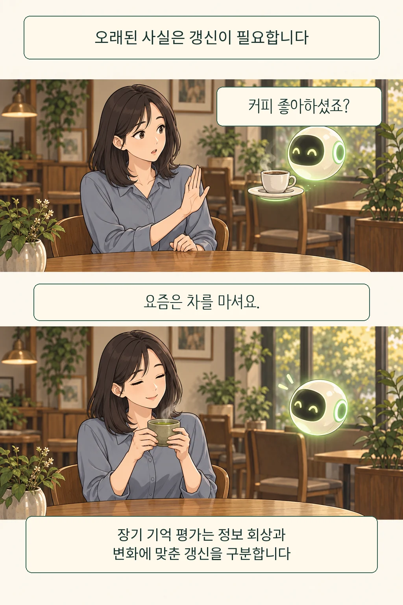

“요즘은 커피 대신 차를 마시는데, AI는 왜 계속 커피를 권할까?” 이런 가상 장면에서 기억의 불편함이 보입니다. 예전에 한 말은 정확해도 지금의 설명과 어긋날 수 있습니다. **AI의 기억을 신뢰하려면 내가 바뀐 사실을 고칠 수 있고, 그 정보가 쓰일 자리도 확인할 수 있어야 합니다.**

글·해설: 다메카솔

## 어제의 취향에 오늘의 날짜를 붙여 봅니다

지난달 즐긴 메뉴와 오늘 원하는 메뉴는 함께 기록될 수 있습니다. 문제는 둘 중 어느 것을 지금 답에 적용하느냐입니다. “커피를 좋아한다”는 요약만 남으면 취향이 달라졌다는 설명도 같은 무게의 문장 하나로 쌓입니다. 사용자는 이미 고쳤다고 생각하고, AI는 예전 취향을 다시 꺼내는 상황을 상상해 볼 수 있죠. 날짜가 빠진 기억입니다.

LongMemEval 연구진은 장기 대화 기억을 평가하면서 정보 회상 외에 사용자 상태 변화에 맞춘 기억 갱신, 시간 추론, 답할 근거가 부족할 때의 유보를 구분했습니다. 이 구분은 기억을 많이 찾는 능력과 지금 맞는 정보를 고르는 능력이 서로 다른 평가 대상임을 보여 줍니다. [LongMemEval, §3](https://arxiv.org/html/2410.10813v2)

여기서 빌리는 것은 평가의 관점입니다. 특정 서비스가 오늘 어느 정도로 잘 기억하는지는 별도 검증이 필요합니다. 커피와 차는 설명용 가상 사례이고, 논문의 실제 사용자 실험 결과를 옮긴 장면은 아닙니다. “내가 차를 마신다고 기억하니?”에 이어 “오늘 무엇을 권하니?”를 물으면 기록 확인과 적용 확인을 나누게 됩니다.

기억의 출처도 따라가야 합니다. 내가 직접 말한 취향인지, 한 번 주문한 메뉴에서 AI가 추측한 취향인지에 따라 고칠 대상이 달라지기 때문입니다. [맞춤형 AI와 정체성 글](/posts/ai-personalization-authentic-self/)에서 다룬 취향의 되먹임 문제에, 이번에는 정정할 통로를 더하는 셈입니다.

## 그 이야기를 꺼내도 되는 자리는 따로 있습니다

그렇다면 최신 정보만 쓰면 충분할까요? 친구에게 털어놓은 고민이 정확하게 기억되더라도 업무 소개문을 만들 때 갑자기 등장하면 당황스럽습니다. 내가 한 말이라는 사실과 이번 작업에서 써도 된다는 판단 사이에는 간격이 있습니다. 장소가 바뀌었습니다.

철학자 헬렌 니센바움은 2004년 논문에서 프라이버시를 맥락에 맞는 정보의 적절성과 정보 흐름의 규범으로 설명했습니다. 어떤 정보를 나누는 것이 그 관계에 적절한지, 누구에게 어떤 방식으로 전달되는지를 함께 살핍니다. 정보를 이미 공개했는지만으로 모든 이용을 판단하기 어려운 이유입니다. [Privacy as Contextual Integrity, pp. 138–141](https://nissenbaum.tech.cornell.edu/papers/H.%20Nissenbaum,%20_Privacy%20as%20Contextual%20Integrity.pdf)

니센바움의 논문은 당시 정보 수집과 유통을 논했습니다. AI 기억의 설정 메뉴를 설명한 글은 아닙니다. 여기서부터는 그 렌즈를 AI에 적용한 제 해석입니다. 사적인 대화와 업무 작성이 같은 창에서 이어져도 사용 목적은 달라집니다. 그러므로 오래된 정보를 지우는 기능과 특정 목적에서 그 정보를 사용하지 않게 하는 기능은 각각 검토할 가치가 있습니다.

## 다메카솔의 해석: 정정은 다음 응답까지 이어져야 합니다

저는 기억을 고치는 기능을 검색 기능만큼 중요한 기본 기능으로 봅니다. 서비스를 설계한다면 기억마다 출처와 확인 시점, 적용할 목적을 남기고, 사용자가 수정한 뒤에는 실제 응답까지 검사하겠습니다. 저장된 한 줄만 바뀌었다고 끝낼 일이 아닙니다. 예전 요약이나 검색용 사본이 다음 답에 들어가면 사용자는 같은 설명을 또 해야 합니다.

백엔드에서 원본 데이터를 고쳐도 캐시에 이전 값이 남는 문제와 닮았습니다. 이때 필요한 것은 친절한 완료 메시지에 더해, 바뀐 정보가 읽히는 경로를 확인하는 테스트입니다. 개인 기억에도 “커피 선호를 차로 정정했다”는 입력과 “차를 권하는 새 응답”을 이어 보는 검사가 필요하다고 제안합니다. 업무 목적에서 제외한 정보가 다시 섞이는지도 따로 살펴야 합니다. 이것은 특정 제품을 실험한 보고가 아니라 공개 자료에서 도출한 설계 제안입니다.

물론 매번 모든 것을 잊으면 반복 설명의 수고가 돌아옵니다. 계속 유지하고 싶은 표현 방식과 그날만의 사정은 다르게 다루는 편이 좋겠습니다. 최신 설명이 모호할 때는 확인을 요청하고, 사용 범위가 달라지면 다시 묻는 방식입니다. 기억의 편리함과 정정의 수고를 함께 줄여야 오래 쓰기 편합니다.

처음의 독자는 차를 한 모금 마십니다. AI가 커피를 정확히 기억했다는 칭찬보다, 새 설명을 듣고 실제로 차를 권했다는 변화가 남습니다. 나를 오래 안다는 말의 무게는 기억한 항목 수보다, 내가 달라졌을 때 함께 고칠 수 있는 여지에서 드러납니다.

## 출처

- [Wu et al., LongMemEval: Benchmarking Chat Assistants on Long-Term Interactive Memory](https://arxiv.org/html/2410.10813v2)
- [Helen Nissenbaum, Privacy as Contextual Integrity (2004)](https://nissenbaum.tech.cornell.edu/papers/H.%20Nissenbaum,%20_Privacy%20as%20Contextual%20Integrity.pdf)

작성·출처 확인: 2026-09-12

이 글의 본문과 이미지는 생성형 AI로 제작했습니다. 기획과 편집 기준은 다메카솔이 정했습니다.
