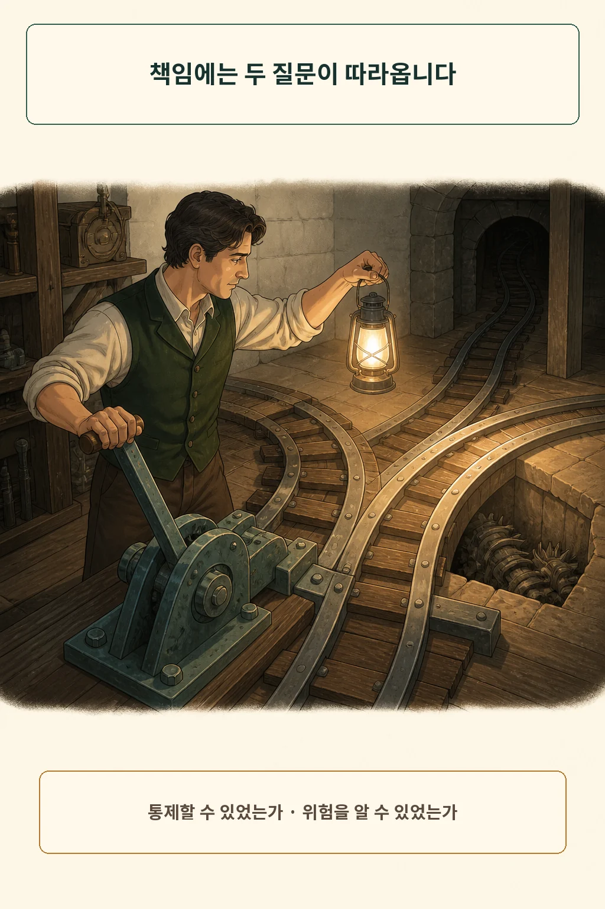
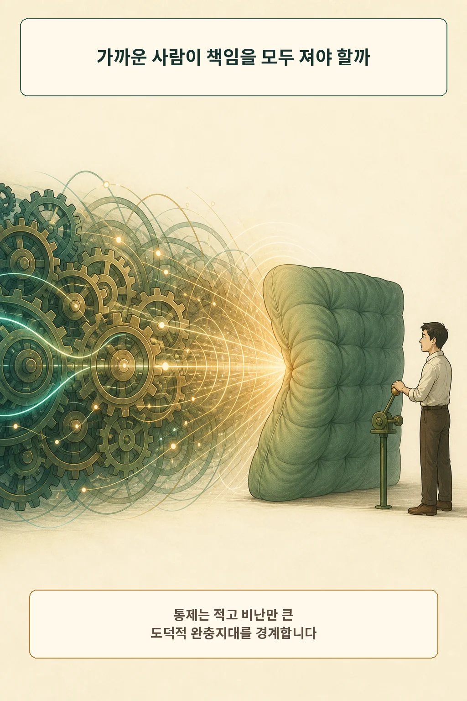
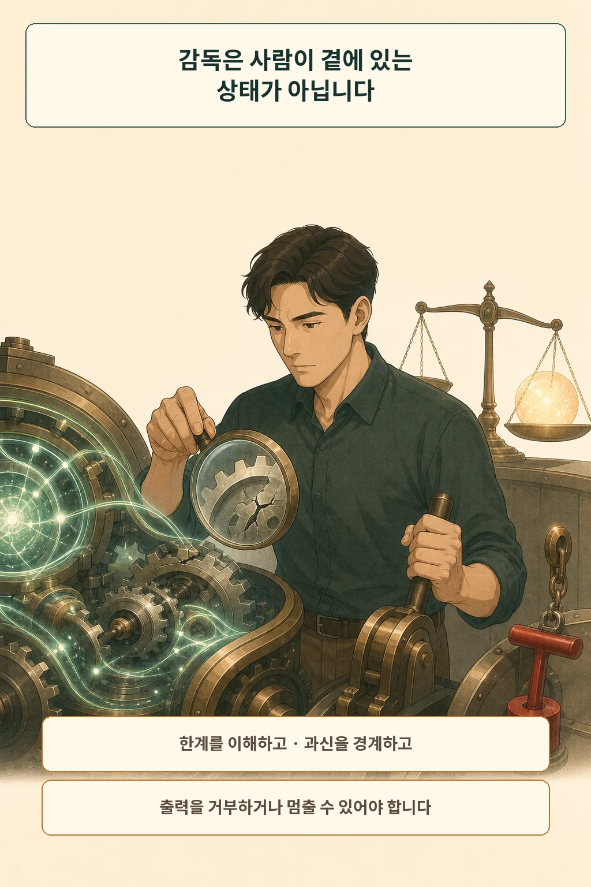
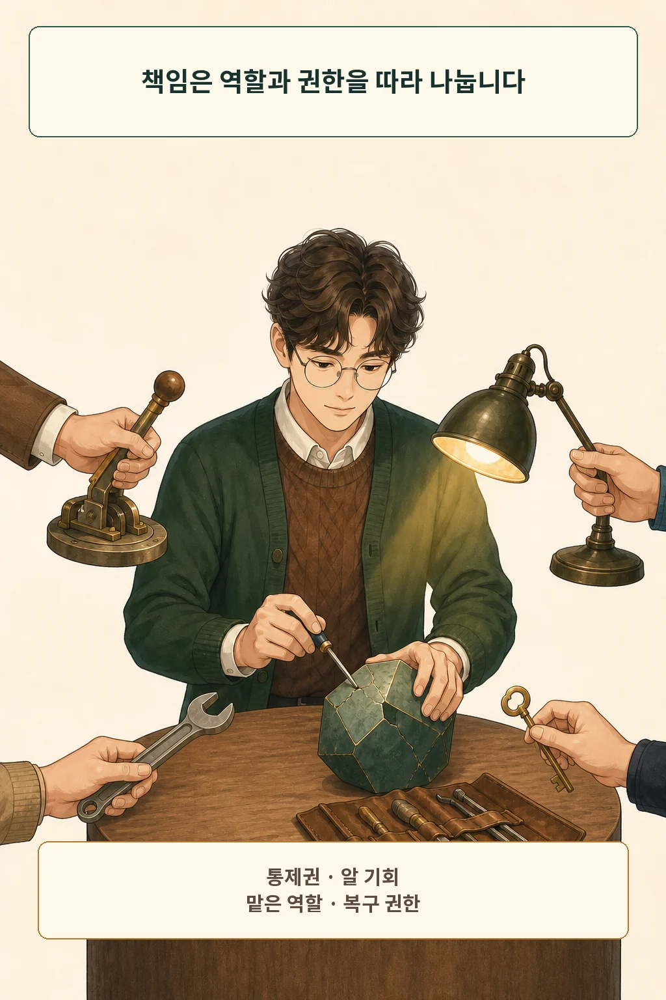

AI가 짜 준 여행 일정대로 움직였는데 예약 날짜가 틀렸습니다. 결제를 누른 사람, 답을 만든 서비스, 검토 규칙을 정한 조직 중 누구 책임일까요? **“AI가 그랬다”는 말은 원인을 가리키지만 책임 배분까지 끝내 주지 못합니다. 책임은 통제권과 위험을 알 기회, 맡은 역할, 문제를 고칠 권한에 맞춰 나눠야 합니다.**

글·해설: 다메카솔

## AI가 원인이라고 책임이 사라질까

AI의 답을 실제 행동으로 옮긴 사람에게는 자기 판단 범위의 책임이 남습니다. 되돌리기 어려운 결정을 근거 확인 없이 확정했다면 “도구가 추천했다”는 말만으로 설명을 마칠 수 없습니다. 서비스 제공자와 조직도 빠져나갈 수 없습니다. 어떤 한계를 알렸는지, 검토 시간을 줬는지, 오류를 신고하고 고칠 길을 열었는지 따져야 합니다.

그래서 책임은 원인의 개수보다 **누가 무엇을 할 수 있었는가**를 따라가야 합니다. AI는 결과에 기여한 원인일 수 있지만, 현재의 많은 AI 시스템을 칭찬이나 비난을 이해하고 답하는 도덕적 행위자로 곧바로 확정하기는 어렵습니다. 이번 글은 사람과 조직의 책임 배분에 초점을 둡니다.

## 책임에는 통제와 인식이 필요합니다

책임을 묻는 첫 단계는 통제와 인식의 범위를 확인하는 일입니다. Stanford Encyclopedia of Philosophy는 도덕적 책임 논의에서 적절한 통제나 자유를 가졌는지, 그리고 무엇을 하고 어떤 결과가 생길 수 있는지 알 수 있었는지를 함께 살핀다고 정리합니다. 인식의 내용에는 행위, 도덕적 의미, 가능한 결과, 대안이 포함될 수 있습니다. [The Epistemic Condition for Moral Responsibility](https://plato.stanford.edu/entries/moral-responsibility-epistemic/)

이 렌즈는 책임을 자동 계산하는 공식이 아닙니다. 법적 책임도 관할과 계약, 과실 기준에 따라 달라집니다. 그래도 “멈출 수 있었는가”와 “위험을 알 수 있었는가”를 분리하면, 마지막으로 버튼을 누른 사람에게 모든 비난을 몰아주는 오류를 줄일 수 있습니다.

## 가장 가까운 사람은 완충재가 아닙니다

자동화된 시스템에서 사고가 나면 화면 앞에 있던 사람이 가장 먼저 보입니다. Madeleine Clare Elish는 복잡한 자동화 사고 사례를 분석하며, 실제 통제가 제한된 인간이 시스템 전체의 도덕적·법적 책임을 흡수하는 현상을 **도덕적 완충지대(moral crumple zone)**라고 불렀습니다. [Moral Crumple Zones](https://doi.org/10.17351/ests2019.260)

이 개념이 모든 운영자를 면책하지는 않습니다. 통제할 수 있었고 위험을 알면서도 무시했다면 책임이 커집니다. 반대로 설계자는 자동 결정을 만들고, 조직은 속도 목표를 정하고, 운영자에게는 몇 초 안에 승인만 요구했다면 “사람이 검토했다”는 문구와 실제 통제권 사이에 틈이 생깁니다.

## 좋은 인간 감독에는 권한과 정보가 필요합니다

NIST AI RMF 1.0은 조직 전체의 AI 위험관리 역할과 연락선을 분명히 하고, 경영진이 개발·배포 위험에 관한 결정의 책임을 맡도록 제안합니다. 이는 법률이 아니라 자발적 위험관리 프레임워크입니다. [NIST AI RMF 1.0](https://doi.org/10.6028/NIST.AI.100-1)

EU AI Act Article 14는 범위를 고위험 AI로 한정해 인간 감독의 조건을 더 구체화합니다. 감독자는 시스템의 역량과 한계를 이해하고 자동화 편향을 경계하며, 출력을 해석하고 필요하면 무시·뒤집거나 안전하게 중단할 수 있어야 합니다. 모든 일상 챗봇에 그대로 적용되는 조항은 아니지만, 사람에게 책임을 맡기려면 실제 권한도 줘야 한다는 판단 렌즈는 남습니다. [EU AI Act, Article 14](https://eur-lex.europa.eu/eli/reg/2024/1689/oj)

## 다메카솔의 판단: 네 요소로 책임을 나눕니다

저는 AI 관련 책임을 네 요소에 맞춰 나누겠습니다.

1. **통제권:** 출력을 거부하고 수정하거나 시스템을 멈출 수 있었는가?
2. **알 기회:** 한계와 위험, 대안을 이해할 정보와 시간이 있었는가?
3. **맡은 역할:** 사용·승인·설계·배포 가운데 무엇을 책임지기로 했는가?
4. **복구 권한:** 문제가 생겼을 때 취소·정정·보상·재발 방지를 실행할 수 있는가?

일상 사용자는 돈, 건강, 직업처럼 되돌리기 어려운 결정을 AI 답 하나로 확정하지 말고 근거를 확인해야 합니다. 팀은 승인자에게 멈출 시간과 거부권을 주고, 조직과 제공자는 한계·기록·이의제기·복구 경로를 설계해야 합니다. 책임은 AI에게 넘길 짐도, 마지막 클릭을 한 사람에게 몰아줄 벌도 아닙니다. **결과를 바꿀 힘이 있던 곳에 설명과 복구의 의무도 함께 놓는 것**, 그것이 제 기준입니다.

## 출처

- [Stanford Encyclopedia of Philosophy, The Epistemic Condition for Moral Responsibility](https://plato.stanford.edu/entries/moral-responsibility-epistemic/)
- [Madeleine Clare Elish, Moral Crumple Zones](https://doi.org/10.17351/ests2019.260)
- [NIST, Artificial Intelligence Risk Management Framework 1.0](https://doi.org/10.6028/NIST.AI.100-1)
- [European Union, Regulation (EU) 2024/1689, Article 14](https://eur-lex.europa.eu/eli/reg/2024/1689/oj)

이 글의 본문과 이미지는 생성형 AI로 제작했습니다. 기획과 편집 기준은 다메카솔이 정했습니다.

이미지는 텍스트 없는 원화에 결정적 레터링을 합성해 제작했습니다.
