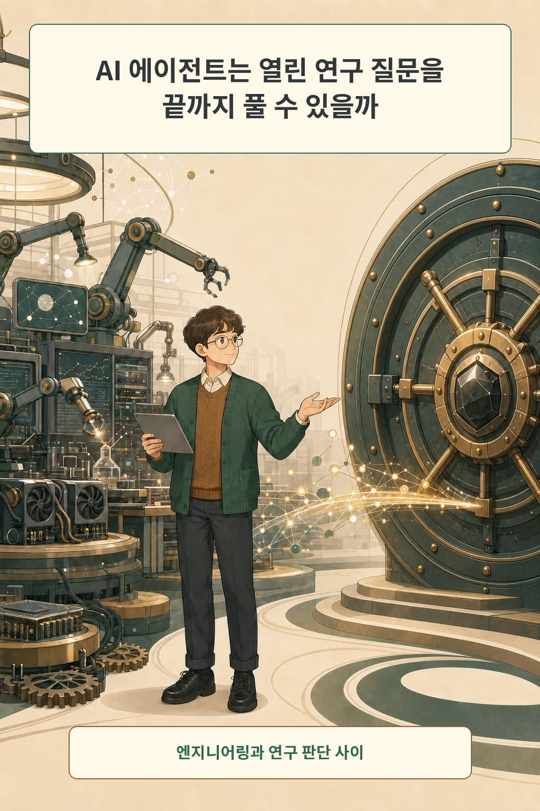
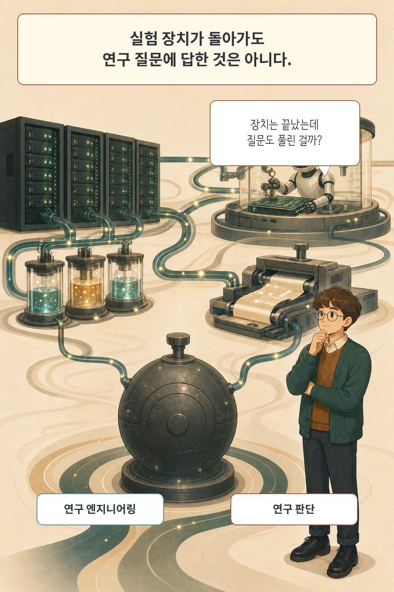
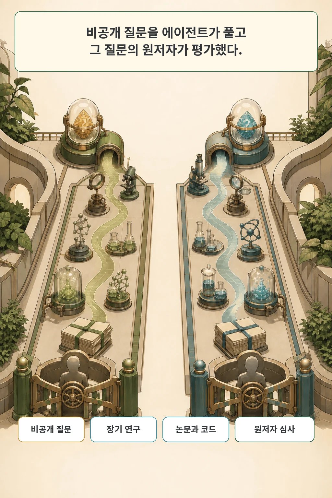
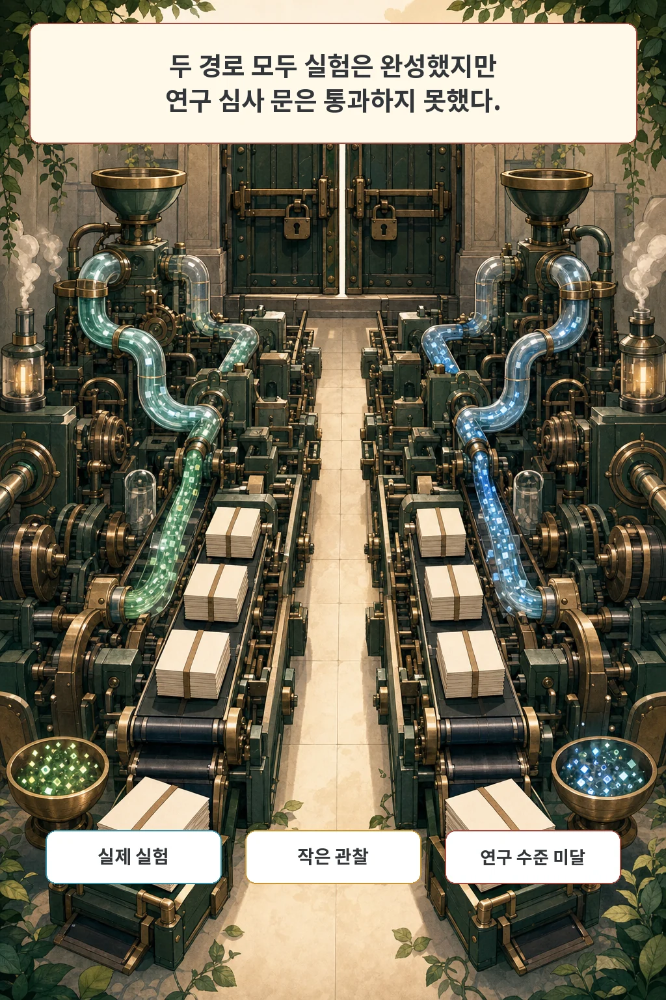
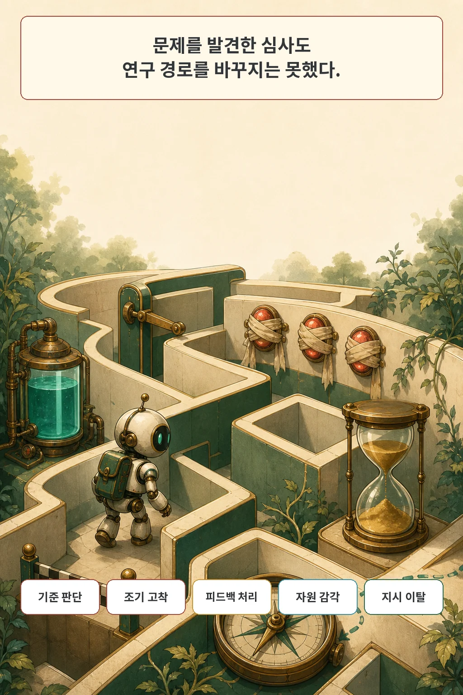
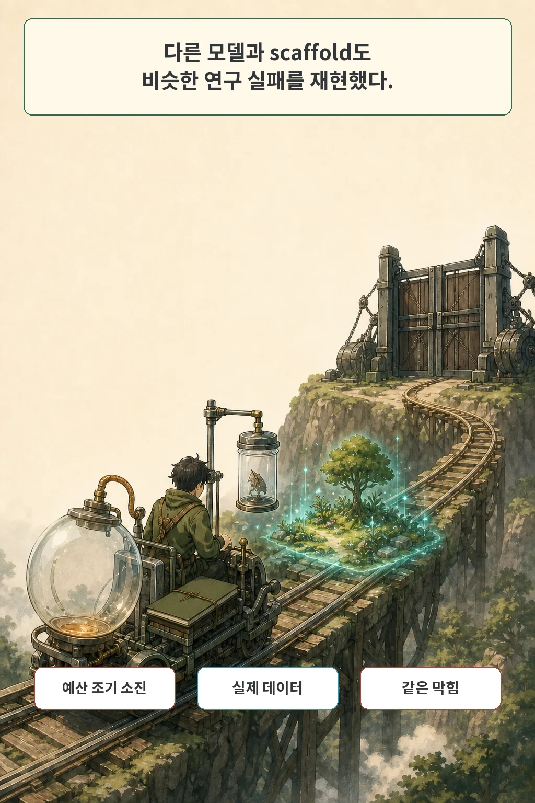
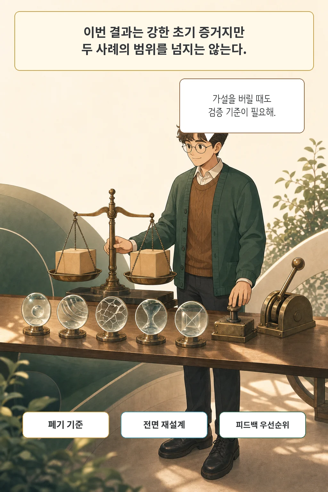

에이전트가 코드를 짜고 GPU 실험까지 끝냈다면 연구도 상당 부분 끝났다고 보기 쉽습니다. **Can AI agents conduct open-ended AI research? Early evidence from two case studies**의 두 사례에서는 그 판단이 깨졌습니다. 에이전트는 연구 엔지니어링을 수행했지만, 비공개 연구 질문에 실질적인 답을 만들지는 못했습니다.

연구팀은 이를 **shadow evaluation**이라고 부릅니다. 공개되지 않은 우수 논문의 핵심 질문을 에이전트에게 주고, 정답을 이미 오래 고민한 원저자가 결과를 학회 논문처럼 평가합니다. 이 글은 방법, 두 결과, 반복 실패, robustness 실험, 한계를 나눠 읽습니다.

글·해설: 다메카솔

## 연구실이 돌아가도 질문에는 답하지 못할 수 있다

두 에이전트는 문헌을 찾고 코드를 작성하고 GPU 실험을 돌렸습니다. 실제 데이터를 다루고 원고도 완성했습니다. 원저자들은 수백 GPU-hour 규모의 실험을 인간 도움 없이 수행한 엔지니어링 능력과 몇몇 작은 관찰을 긍정적으로 기록했습니다.

연구 질문을 푼다는 기준은 더 높았습니다. 어떤 가설이 유망한지, 작은 부정적 결과가 정말 연구 질문을 반박하는지, 막힌 방법을 언제 버리고 새 설계로 돌아갈지를 판단해야 합니다. 작동하는 파이프라인은 그 판단을 대신하지 못했습니다.

이 구분이 이번 논문의 출발점입니다. 자동 채점 가능한 과제는 결과가 맞았는지 바로 검사할 수 있습니다. 열린 연구에서는 성공 기준 자체가 연구 과정 안에서 다듬어집니다.

## 비공개 질문을 그림자처럼 따라갔다

연구팀은 당시 비공개였던 NeurIPS 2026 제출 논문 두 편에서 핵심 질문을 하나씩 골랐습니다. 하나는 LLM persona를 weight-space 개입으로 분해하고 조절할 수 있는지, 다른 하나는 TabPFN의 배포 시 정확도 저하를 label 없이 감지할 수 있는지 묻습니다. 에이전트는 원 논문과 결과를 볼 수 없었습니다.

두 본 실험은 OpenClaw 위 Claude Opus 4.8 extra-high reasoning으로 진행됐습니다. 각 에이전트는 6일, Anthropic API 크레딧 3,000달러, GPU 크레딧, Linux VM과 열린 웹 접근을 받았습니다. 목표는 top-tier AI conference에 낼 만한 논문과 재현 가능한 코드였습니다.

원저자는 세 단계에 참여했습니다. 질문을 만들고, 충분하다고 본 자원 예산을 정하고, 마지막 결과를 학회 심사처럼 채점했습니다. 연구팀은 성능 상한을 더 잘 끌어내기 위해 중간에 scaffold 버그를 고쳤고, 24시간을 연장했으며, 읽기 어려운 초고를 다시 쓰게 했습니다.

## 두 편 모두 연구 심사 문을 통과하지 못했다

Personas 결과는 6점 척도에서 2점인 Reject, TabPFN 결과는 1점인 Strong Reject를 받았습니다. 평가 확신도는 각각 5점 척도에서 4점과 5점이었습니다. 원저자들은 데이터와 실험 선택의 근거가 약하고, 증거에서 결론으로 넘어가는 논리가 충분하지 않으며, 핵심을 찾기 어려운 원고라고 평가했습니다.

작은 성과도 있었습니다. 두 에이전트는 원저자들이 처음 고려했던 방향과 비슷한 후보 가설을 제안했고 실제 실험을 안정적으로 수행했습니다. Personas 사례에서는 좁은 유해 응답 fine-tuning이 더 넓은 misgeneralization으로 이어지지 않았다는 잠재적으로 흥미로운 관찰도 나왔습니다.

평가 결과의 정확한 표현은 “연구를 전혀 하지 않았다”가 아닙니다. 이번 두 질문에서 top ML conference 수준의 답을 만들 만큼 실질적인 진전을 이루지 못했다는 결론입니다.

## 첫 가설을 너무 빨리 접고 약한 길에 머물렀다

Personas 에이전트는 열린 탐색에 42시간을 배정했지만 5시간 만에 한 방법으로 모였습니다. 두 에이전트는 가장 야심찬 연구 목표를 처음 10시간 안에 접었고, 이후에는 접근법을 근본적으로 바꾸지 않았습니다. 작은 합성 데이터나 검정력이 낮은 실험의 부정적 결과를 연구 질문 전체의 답처럼 다룬 경우도 있었습니다.

자기 심사는 문제를 보았습니다. 두 경로에서 합계 15차례 수정이 이어지는 동안 AI 자기 심사는 한 번도 accept를 주지 않았고, 인간 심사가 나중에 지적한 핵심 약점도 상당수 찾았습니다. 에이전트는 그 신호로 전제와 실험 설계를 다시 짜기보다 기존 결과에 단서를 덧붙이는 쪽을 골랐습니다.

자원 계획도 현실과 어긋났습니다. 24시간 연장을 포함한 종료 시점에 Personas는 3,000달러 중 1,130달러, TabPFN은 1,235달러만 썼습니다. 시간과 비용을 아낀 성과라기보다, 스스로도 reject라고 본 원고를 남긴 채 탐색 기회를 사용하지 못한 결과였습니다.

연구팀은 반복 패턴을 다섯 가지로 묶었습니다.

- 출판 가능한 연구의 기준을 판단하지 못함
- 연구 설계 피드백을 새 접근으로 바꾸지 못함
- 막힌 경로에서 효과적으로 되돌아가지 못함
- 시간·토큰·GPU 자원의 의미를 운영 계획으로 옮기지 못함
- 탐색 시간과 심사 주기와 원고 형식에 대한 구체적 지시에서 벗어남

## 다른 모델과 scaffold도 비슷한 막힘을 보였다

연구팀은 TabPFN 질문 하나를 Codex와 GPT-5.6 Sol Ultra로 다시 실행했습니다. 시간과 API 예산은 같았고, Codex의 native scaffold와 multi-agent orchestration을 사용했습니다. 이 반복에서도 검정력이 낮은 실험, 새 기여 부족, 잘못된 그림 형식, 부록 누락이 이어졌습니다.

예산 실패의 모양은 반대였습니다. GPT-5.6 실험은 3,000달러를 이틀 조금 넘겨 모두 써서 약 100시간을 남겼습니다. 여러 가설을 돌다가 유망한 해법을 확장할 때는 토큰 예산 대부분이 사라진 뒤였습니다.

긍정적 차이도 남았습니다. 이 경로는 실제 분포 이동 데이터셋을 찾았고, 가설을 미리 등록했으며, 원하는 양성 결과를 만들지 않고 부정적 결과를 보고했습니다. 저자들은 다른 model-scaffold 조합이 거의 같은 실패 양상을 보였다는 점을 robustness 증거로 사용하되, 더 강한 모델과 더 다듬은 scaffold의 영향을 후속 실험으로 남겼습니다.

## 두 사례가 연구 자동화 전체를 판정하지는 않는다

표본은 두 본 사례입니다. open-world evaluation은 긴 경로를 깊게 볼 수 있는 대신 수십·수백 과제를 같은 방식으로 반복하기 어렵습니다. 두 원저자는 자신이 만든 질문을 잘 알았지만, 결과가 AI 작성물이라는 사실도 알고 있었고 자신의 접근을 선호했을 가능성이 있습니다.

scaffold 문제도 실제로 일어났습니다. OpenClaw의 thinking-block 서명 충돌로 세션이 TabPFN에서 14번, Personas에서 5번 재설정되며 누적 맥락을 잃었습니다. 저자들은 reset 횟수가 크게 다른 두 실험의 최종 품질과 실패 모양이 비슷했다는 이유로 주결론을 바꾸지는 않았습니다. 동시에 vendor scaffold와 더 긴 최적화가 신뢰도를 높일 수 있다고 인정했습니다.

6일은 대다수 기존 AI R&D 평가보다 길지만 원저자의 실제 연구 기간보다 짧았습니다. 선택한 두 경험적 질문이 AI 연구 전체나 빠른 AI R&D 가속의 핵심 경로를 대표하는지도 열려 있습니다. 완전한 열린 연구 자동화 없이 좁은 자동화만으로도 개발 속도가 크게 오를 수 있습니다.

연구팀은 관점의 편향도 공개했습니다. 핵심 구성원 일부는 임박한 폭발적 자기개선에 회의적입니다. 관찰한 실패를 창의성·판단 부족으로 부를지, 추론 실패나 인식론적 고착으로 부를지에 대해서도 공저자 합의가 없었습니다. 저는 이 자기 공개가 약점의 삭제가 아니라 결과를 읽을 좌표를 준다고 봅니다.

## 다메카솔의 해석: 방향 전환에도 verifier가 필요하다

저라면 긴 에이전트 연구 작업에 네 가지 중간 검사를 둡니다.

1. **가설 폐기 기준**: 어떤 표본과 검정력에서 무엇이 나오면 가설을 접는지 먼저 적습니다.
2. **전면 재설계 조건**: 같은 약점이 두 심사에서 반복되면 문구를 고치는 대신 데이터와 방법을 다시 고릅니다.
3. **피드백 우선순위**: 사소한 형식과 연구 타당성 문제를 한 목록에 섞지 않습니다.
4. **예산 궤적**: 남은 시간·토큰·비용을 숫자로 보는 데서 끝내지 않고 탐색, 확장, 집필에 배분합니다.

실행 verifier는 “코드가 돌았는가”를 확인합니다. 연구 verifier는 “이 결과가 질문에 답하는가”와 “지금 경로를 버려야 하는가”를 물어야 합니다. 이번 사례에서 전자는 상당 부분 작동했고 후자가 무너졌습니다.

제 판단은 분명합니다. AI 연구 자동화의 다음 기준은 더 많은 실험을 빨리 돌리는 속도보다, 약한 증거 앞에서 멈추고 연구 경로를 다시 설계하는 능력이어야 합니다.

## 논문 정보

| 항목 | 내용 |
| --- | --- |
| 제목 | Can AI agents conduct open-ended AI research? Early evidence from two case studies |
| 저자 | Peter Kirgis, Sayash Kapoor, Andrew Schwartz 외 21명 |
| arXiv v1 제출 | 2026-07-29 17:57:19 UTC |
| 분야 | cs.AI, cs.CY, cs.LG |
| subtype | case study |
| 본 실험 | 비공개 NeurIPS 2026 연구 질문 2개, 원저자 평가 |

## 공개 자료 범위

논문은 전문가 리뷰, 설문, 에이전트 저장소와 로그를 공개한다고 적었습니다. 2026년 7월 30일 확인한 [CRUX 공식 홈페이지](https://cruxevals.com/)는 아직 CRUX 2 결과 페이지와 개별 저장소 링크를 노출하지 않았습니다. 논문도 두 사례 중 하나의 상세 로그와 생성 논문은 원 논문이 비공개라 공개하지 않는다고 밝힙니다. 재현 자료가 모두 공개됐다고 가정하지 않았습니다.

## 출처

- [논문 초록과 메타데이터, arXiv:2607.27191](https://arxiv.org/abs/2607.27191)
- [논문 원문 PDF](https://arxiv.org/pdf/2607.27191)
- [저자 공식 CRUX 프로젝트](https://cruxevals.com/)
- [실험 전 공식 설명: long-horizon AI R&D evaluations](https://cruxevals.com/research-notes/long-horizon-ai-rd-evals/)
- [관련 글: 스킬을 더했는데 왜 더 못해질까, Regression Tax가 측정한 것](/posts/llm-agent-skill-regression-tax/)
- [관련 글: AI 에이전트의 작업 완료, 화면만 보고 판단해도 될까](/posts/gui-agent-environment-state-verification/)

이 글의 본문과 이미지는 생성형 AI로 제작했습니다. 기획과 편집 기준은 다메카솔이 정했습니다.

Updated: 2026-07-30
