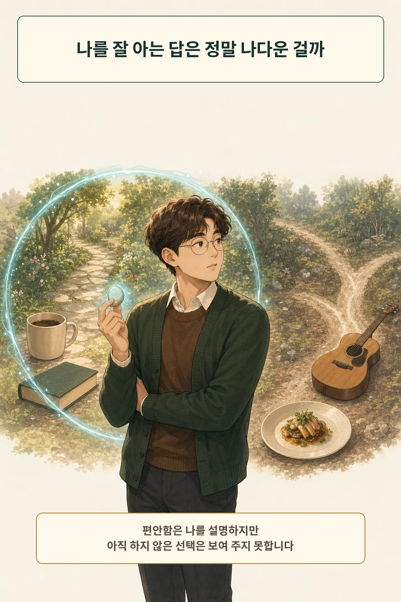
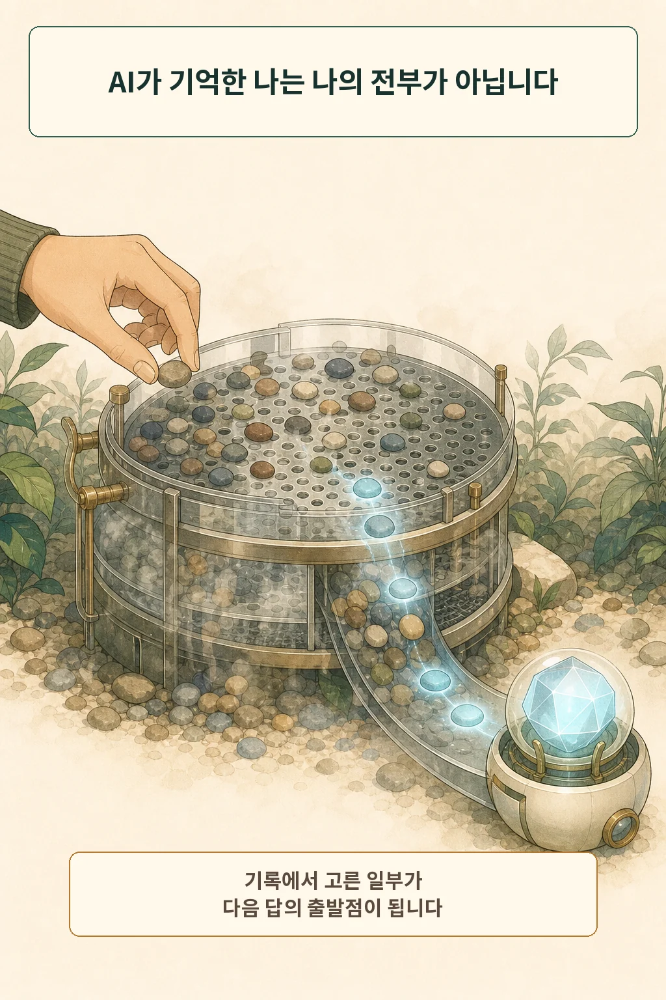
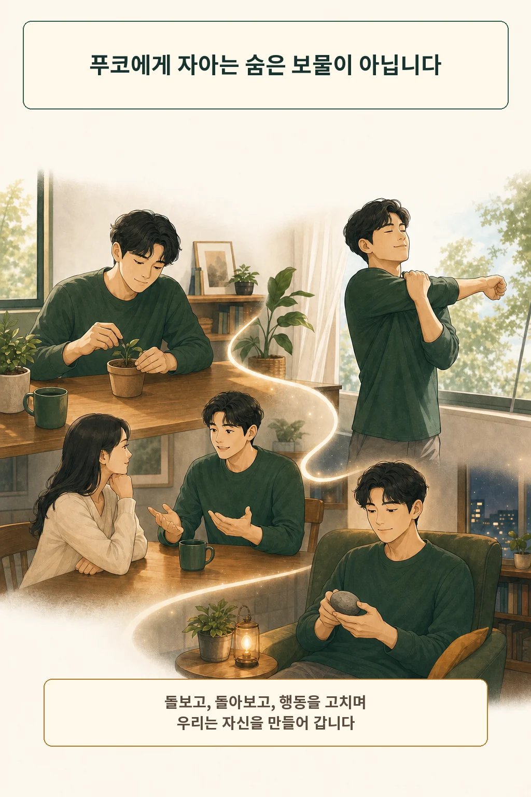
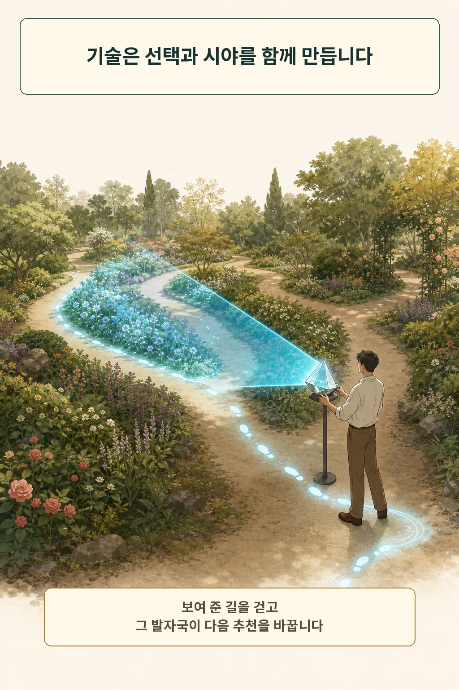
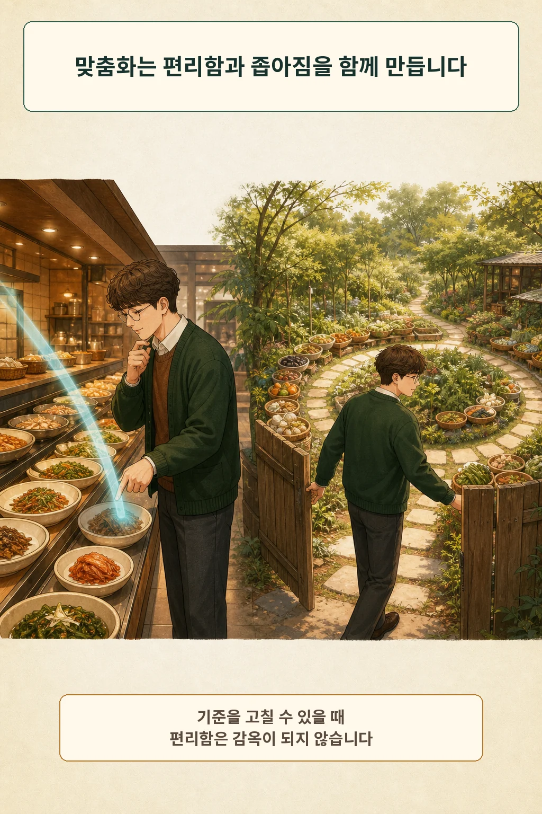
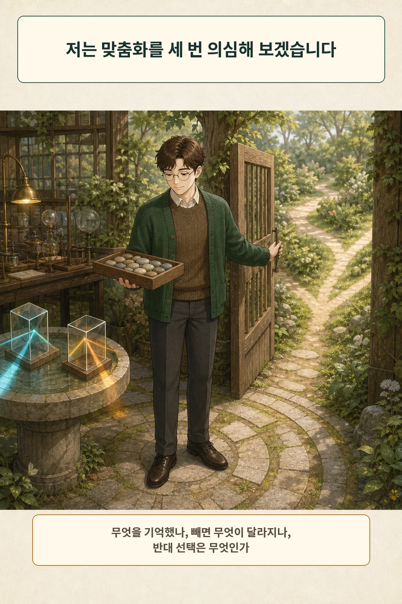

맞춤형 AI가 나를 더 나답게 해 주는지 묻는다면 제 답은 “자동으로 그렇지는 않다”입니다. 과거 취향을 잘 맞히는 답은 편리합니다. 그 답을 반복해서 고르는 동안 아직 해 보지 않은 선택은 화면 밖에 남을 수 있습니다. **맞춤화는 나를 발견하는 거울이라기보다, 기록과 반응이 서로를 키우는 되먹임 고리입니다.**

글·해설: 다메카솔

## 익숙한 답은 현재의 나를 빠르게 불러옵니다

어제 먹은 메뉴, 자주 읽는 장르, 싫어하는 말투를 AI가 기억하면 매번 설명할 수고가 줄어듭니다. OpenAI의 Memory FAQ도 메모리를 켜면 채팅·파일·연결된 앱의 맥락을 활용해 경험을 개인화한다고 설명합니다. 사용자는 설정에서 메모리를 켜거나 끌 수 있습니다. 이 내용은 제가 2026년 8월 6일 확인한 ChatGPT의 현재 문서 범위입니다. [OpenAI Memory FAQ](https://help.openai.com/en/articles/8590148-memory-faq)

편리함은 분명한 가치입니다. 알레르기나 접근성 요구처럼 반복해서 놓치면 곤란한 조건도 있습니다. 그러나 “지금까지 자주 골랐다”와 “앞으로도 이것이 나답다”는 같은 문장이 아닙니다.

## AI가 기억한 나는 선택된 기록입니다

같은 FAQ는 메모리 요약을 보고 수정할 수 있다고 안내합니다. 동시에 그 요약과 개인화 출처 표시가 응답을 만든 모든 요소를 보여 주지는 않을 수 있다고 밝힙니다. 사용자가 들여다볼 창구는 있지만, 화면에 보인 목록을 곧 나의 완전한 초상으로 읽을 근거는 없습니다.

여기서 첫 번째 구분이 생깁니다. AI의 답은 내 삶 전체에서 곧장 나온 결론이 아니라, 접근 가능한 기록 가운데 시스템이 관련 있다고 고른 맥락에서 시작합니다. 빠진 기록, 바뀐 마음, 말하지 않은 욕구는 그 출발점에 없을 수 있습니다.

## 푸코의 질문은 “참자아가 어디 있나”가 아닙니다

푸코는 1982년 강연에서 자기 테크놀로지를 사람이 혼자 또는 다른 이의 도움을 받아 자신의 생각, 행위, 존재 방식에 작업을 가하는 실천으로 설명했습니다. 그가 살핀 글쓰기와 자기 점검은 숨겨진 본질을 복사하는 작업보다 무엇에 주의를 두고 어떻게 살지를 훈련하는 일에 가까웠습니다. [Michel Foucault, Technologies of the Self](https://foucault.info/documents/foucault.technologiesOfSelf.en/)

이 역사적 논의를 곧바로 AI 이론으로 바꾸면 무리가 생깁니다. 제가 가져오는 렌즈는 한 가지입니다. AI와 나눈 대화도 나를 기록할 뿐 아니라, 다음에 무엇을 말하고 어떤 기준을 연습할지 바꾸는 실천이 될 수 있습니다.

## 기술은 선택을 돕고 선택의 모양도 만듭니다

기술철학자 피터폴 버빅은 기술을 중립적인 물건이나 사람의 단순한 연장으로만 보지 않습니다. 기술은 인간이 세계를 경험하고 해석하며 행동하는 관계를 함께 형성하는 매개입니다. 사람 역시 그 매개를 그대로 받기만 하지 않고 의미를 붙이고 자신의 실천에 통합합니다. [Peter-Paul Verbeek, Toward a Theory of Technological Mediation](https://ris.utwente.nl/ws/files/21754033/theory_of_mediation.pdf)

맞춤형 AI에 대입하면 고리는 이렇게 돕니다. 과거 기록이 답의 일부를 정하고, 그 답이 몇 가지 선택을 더 눈에 띄게 만들며, 내가 고른 행동은 다음 기록이 됩니다. AI 혼자 나를 빚는다는 뜻은 아닙니다. 사용자도 기억을 고치고 질문을 바꾸며 다른 길을 넣습니다.

## 다메카솔의 판단: 정확도보다 수정 가능성을 보겠습니다

저는 “나를 얼마나 잘 맞혔나”보다 “내가 이 고리를 고칠 수 있나”를 보겠습니다. 맞춤화가 나다움을 키우는 순간은 익숙한 답만 더 빨리 내놓을 때가 아닙니다. 기억과 기준을 수정하고, 예상 밖의 선택을 만날 여지가 남아 있을 때입니다.

세 번이면 충분합니다.

1. **기억 보기:** AI가 나에 대해 무엇을 전제로 삼았는지 확인합니다.
2. **빼고 비교하기:** 메모리를 쓰지 않는 대화에서 같은 질문을 던져 차이를 봅니다.
3. **옆길 넣기:** 평소 취향과 반대되는 선택지나 아직 시도하지 않은 관점을 요청합니다.

이 습관은 개인화를 없애지 않습니다. 편리함을 누리면서도 과거의 내가 미래의 선택을 독점하지 못하게 합니다. 나다움은 AI가 맞혀 내는 정답보다, 무엇을 이어 가고 무엇을 바꿀지 스스로 수정하는 과정에 더 가깝다고 저는 봅니다.

AI에게 생각을 맡기는 경계가 궁금하다면 [AI에게 생각을 맡기면 나는 덜 생각하게 될까](/posts/ai-thinking-cognitive-offloading-philosophy/)를, AI와 관계를 맺는 조건을 보고 싶다면 [AI는 친구가 될 수 있을까](/posts/ai-companion-friendship-philosophy/)를 이어서 읽을 수 있습니다.

## 참고 자료

- [OpenAI, Memory FAQ](https://help.openai.com/en/articles/8590148-memory-faq)
- [Michel Foucault, Technologies of the Self](https://foucault.info/documents/foucault.technologiesOfSelf.en/)
- [Peter-Paul Verbeek, Toward a Theory of Technological Mediation](https://ris.utwente.nl/ws/files/21754033/theory_of_mediation.pdf)

이 글의 본문과 이미지는 생성형 AI로 제작했습니다. 기획과 편집 기준은 다메카솔이 정했습니다.

이미지는 텍스트 없는 원화에 결정적 레터링을 합성해 제작했습니다.
