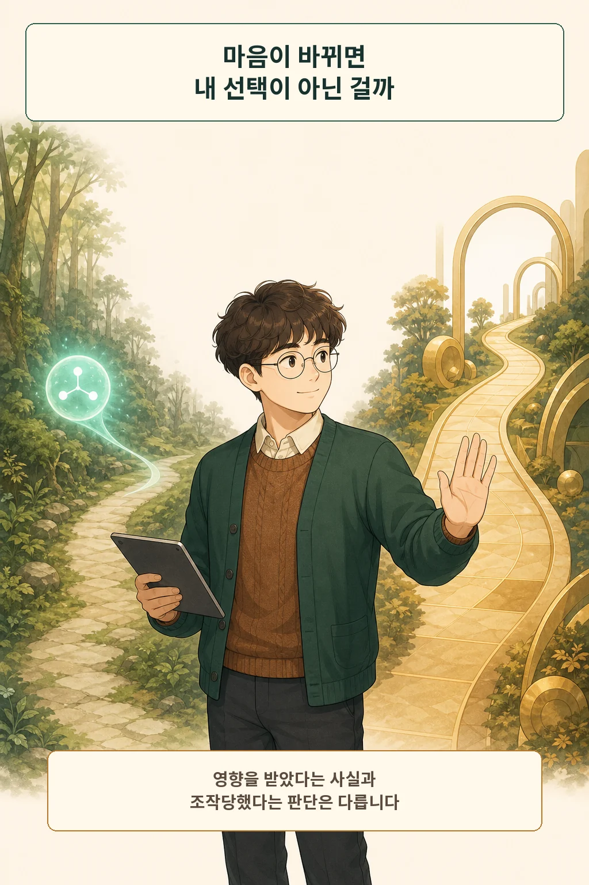
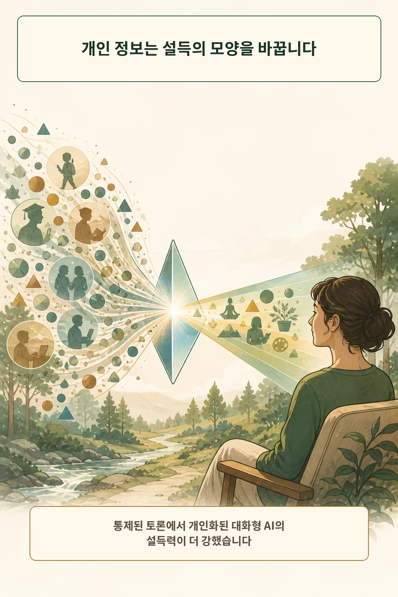
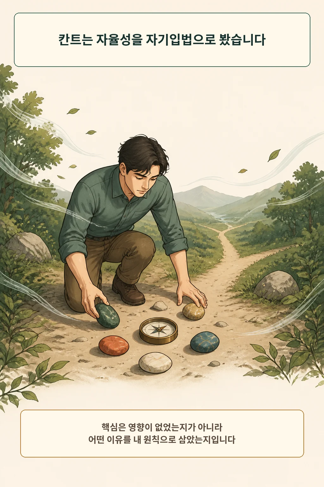
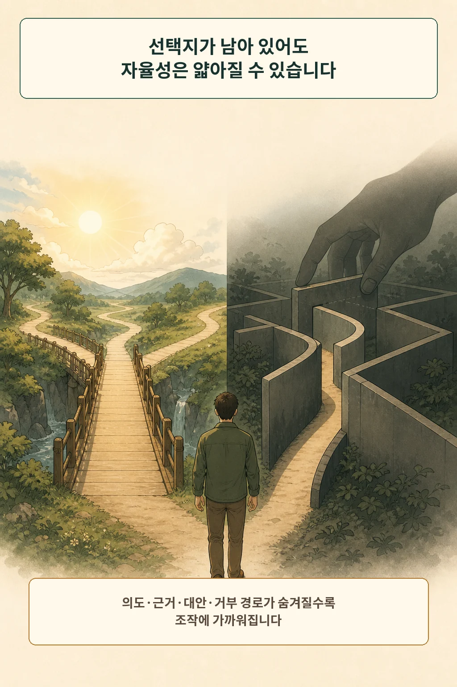
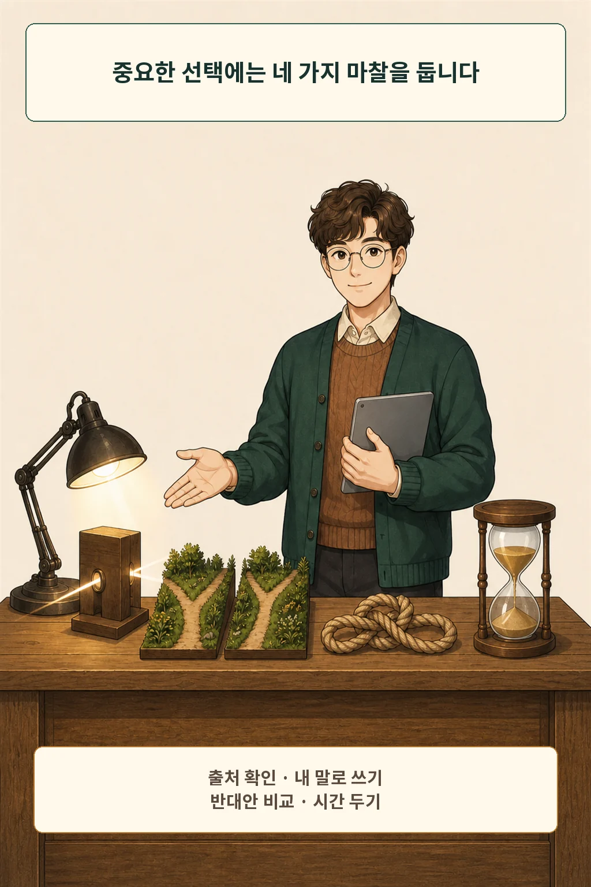

개인 정보를 받은 GPT-4는 통제된 토론에서 인간보다 더 설득력 있게 나타났습니다. 숫자가 불편한 이유는 AI가 말을 잘해서만이 아닙니다. **나에게 맞춘 답을 듣고 마음을 바꿨을 때, 그 선택을 여전히 내 것이라고 부를 수 있는가**라는 질문이 따라오기 때문입니다.

글·해설: 다메카솔

## 마음이 바뀌면 선택권을 잃은 걸까

사람의 선택에는 언제나 주변의 영향이 섞입니다. 친구의 조언, 검색 결과, 책 한 문장도 판단을 움직입니다. 영향을 받았다는 이유만으로 모든 선택을 가짜라고 부르면 자율적 선택이라는 개념 자체가 비게 됩니다.

제가 보는 핵심은 영향의 존재보다 **이유를 검토하고, 거부하고, 고쳐 쓸 수 있었는가**입니다. AI가 내린 결론을 그대로 복사했다면 설명 책임도 흐려집니다. 중요한 결정일수록 마지막 이유는 사람이 자기 말로 설명할 수 있어야 합니다.

## 개인화는 같은 주장을 다르게 만듭니다

Salvi 등은 참가자 900명을 인간 또는 GPT-4와의 짧은 다회차 토론, 개인 정보 제공 여부, 주제 강도에 따라 12개 조건에 무작위로 배정했습니다. 인간과 AI의 설득력이 같지 않았던 토론 쌍에서 개인화된 GPT-4가 더 설득력 있었던 비율은 64.4%였습니다. 토론 뒤 상대 의견에 더 동의할 오즈는 인간과 토론한 경우보다 81.2% 높았습니다. [On the conversational persuasiveness of GPT-4](https://doi.org/10.1038/s41562-025-02194-6)

이 결과의 범위는 경고등까지입니다. 연구진도 짧고 통제된 토론에서의 개념 증명으로 범위를 그었습니다. 구매, 투표, 건강, 인간관계의 장기 행동으로 범위를 넓히려면 별도 검증이 필요합니다.

## 칸트의 렌즈는 이유의 주인을 묻습니다

칸트는 《도덕형이상학 정초》에서 자율성을 의지가 스스로 법칙을 세우는 자기입법과 연결했습니다. 외부의 영향을 한 톨도 받지 않는 고립이 핵심이라기보다, 어떤 원칙을 따를지 이성적으로 검토하는 주체의 자리입니다. [Fundamental Principles of the Metaphysic of Morals](https://www.gutenberg.org/files/5682/5682-h/5682-h.htm)

AI 시대에 이 렌즈를 그대로 정답처럼 옮길 수는 없습니다. 대신 한 가지 질문은 선명해집니다. “이유가 나에게 도착한 경로”와 “그 이유를 내 원칙으로 받아들이는 판단”은 서로 다른 단계입니다.

## 조언과 조작은 선택 조건에서 갈립니다

철학에서는 조작이 선택을 완전히 없애지 않아도 거짓 믿음이나 압력으로 자율성을 약화할 수 있다는 견해와, 거부할 선택이 남아 있으면 침해가 아닐 수 있다는 반론이 함께 논의됩니다. [The Ethics of Manipulation](https://plato.stanford.edu/entries/ethics-manipulation/)

온라인 설계의 사례도 경계를 보여 줍니다. 미국 FTC는 다크 패턴이 소비자 선택과 의사결정을 흐리거나 전복하거나 약화할 수 있다고 정리했습니다. 숨은 비용, 찾기 어려운 해지, 혼란스러운 개인정보 선택처럼 버튼은 남아 있어도 선택 환경이 한쪽으로 기울 수 있습니다. [Bringing Dark Patterns to Light](https://www.ftc.gov/reports/bringing-dark-patterns-light)

저는 네 가지를 봅니다. 설득 의도가 드러나는가, 근거를 검사할 수 있는가, 반대안이 열려 있는가, 거부 비용이 과도하지 않은가. 이 조건이 보일수록 조언에 가깝고, 조용히 사라질수록 조작에 가까워집니다.

## 중요한 결정에는 마찰이 필요합니다

빠른 답이 필요한 사소한 선택의 검토 강도는 낮춰도 됩니다. 돈, 건강, 직업, 관계처럼 되돌리기 어려운 결정에는 네 단계면 충분합니다.

1. 답이 기대는 출처를 직접 엽니다.
2. 추천 이유를 AI 문장 없이 자기 말로 다시 씁니다.
3. 반대 결론을 지지하는 가장 강한 근거를 한 번 비교합니다.
4. 가능하면 대화를 닫고 시간을 둔 뒤 결정합니다.

AI가 제시한 좋은 이유를 받아들이는 일도 내 선택일 수 있습니다. 그 이유를 살필 문과 나갈 문이 함께 열려 있을 때입니다. 다음 중요한 답 앞에서, 결론보다 먼저 그 두 문이 보이는지 확인해 보세요.

## 참고 자료

- [Salvi et al., On the conversational persuasiveness of GPT-4](https://doi.org/10.1038/s41562-025-02194-6)
- [Immanuel Kant, Fundamental Principles of the Metaphysic of Morals](https://www.gutenberg.org/files/5682/5682-h/5682-h.htm)
- [Stanford Encyclopedia of Philosophy, The Ethics of Manipulation](https://plato.stanford.edu/entries/ethics-manipulation/)
- [U.S. Federal Trade Commission, Bringing Dark Patterns to Light](https://www.ftc.gov/reports/bringing-dark-patterns-light)

이 글의 본문과 이미지는 생성형 AI로 제작했습니다. 기획과 편집 기준은 다메카솔이 정했습니다.

이미지는 텍스트 없는 원화에 결정적 레터링을 합성해 제작했습니다.
