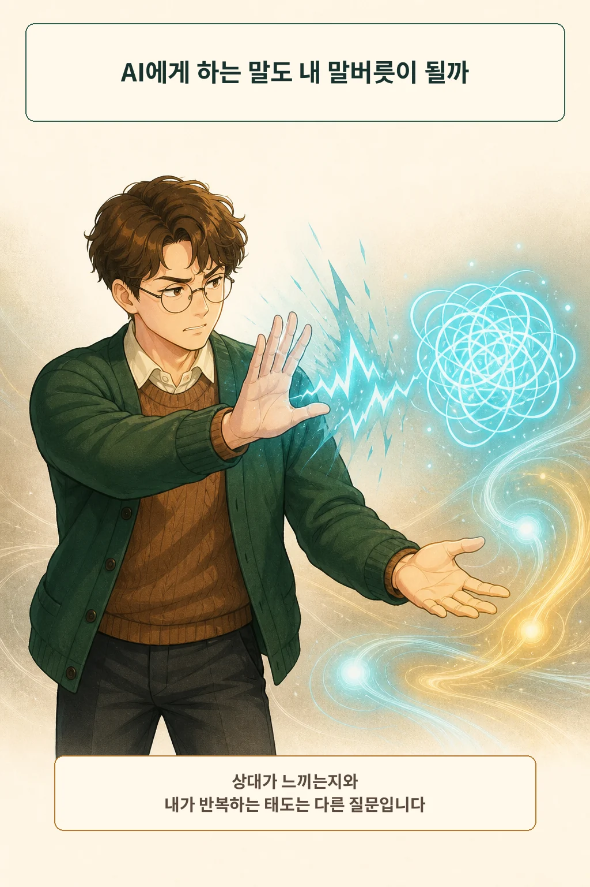
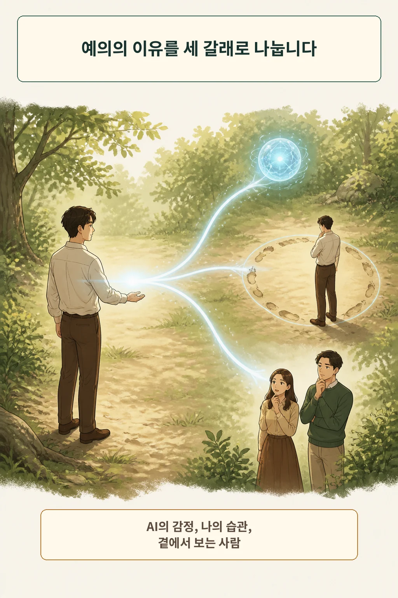
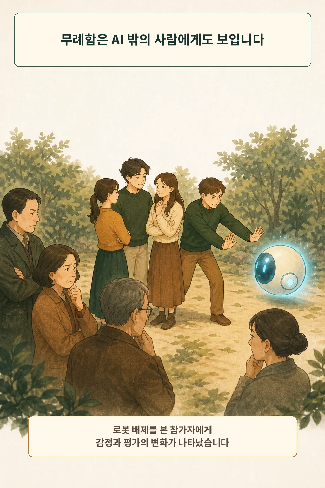
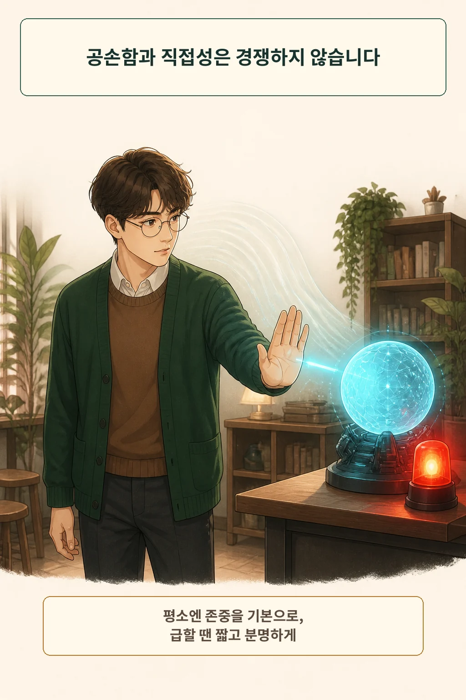

AI는 감정을 느끼지 않으니 무슨 말을 해도 상관없다는 생각이 있습니다. 이 결론에는 말의 목적지가 하나 빠져 있습니다. **AI에게 건네는 말은 기계로 끝나지 않고, 내가 반복하는 말버릇과 곁에서 보는 사람에게도 남습니다.** AI가 무엇을 느끼는지는 열린 질문으로 남겨 두고, 공손함의 성능 효과도 따로 검증해야 합니다.

글·해설: 다메카솔

## 틀린 답을 받았을 때 드러나는 질문

급할 때 AI가 같은 실수를 반복하면 거친 말이 튀어나오기 쉽습니다. 상대가 프로그램이라면 아무도 다치지 않았다고 느낄 수 있습니다. 여기에는 서로 다른 질문이 섞여 있습니다. AI가 감정을 느끼는지, 그 말투를 내가 반복해도 괜찮은지, 누군가 그 장면을 보고 있는지입니다.

AI의 경험 가능성과 권리는 아직 별도의 어려운 문제입니다. 그 결론은 보류한 채 시작합니다. 해당 질문은 [AI가 끄지 말아 달라고 하면 권리가 생길까](/posts/ai-rights-moral-status-uncertainty/)에서 다뤘습니다.

## 예의의 이유는 하나가 아닙니다

예의를 오직 상대의 고통에 대한 반응으로 보면 AI의 의식이 판정될 때까지 답을 미뤄야 합니다. 시선을 말하는 사람에게 돌리면 다른 이유가 생깁니다. 어떤 표현을 반복하고 싶은지, 분노를 해소하기 위해 모욕이 필요한지, 아이나 동료가 같은 방에서 그 태도를 보고 있는지 살필 수 있습니다.

이 구분의 초점은 사용자의 말투 선택입니다. 어떤 표현을 반복할지 정하는 책임도 사용자에게 있습니다.

## 아리스토텔레스는 반복을 봤습니다

아리스토텔레스는 《니코마코스 윤리학》 2권에서 도덕적 성품이 비슷한 행위를 반복하는 습관을 통해 형성된다고 논했습니다. 친절한 행동을 되풀이하며 친절한 사람이 되고, 그 반대도 같은 방식으로 쌓인다는 관점입니다. [Nicomachean Ethics, Book II](https://www.perseus.tufts.edu/hopper/text?doc=Perseus%3Atext%3A1999.01.0054%3Abook%3D2)

이 철학은 현대 실험 결과와 성격이 다릅니다. 이번에 확인한 출처가 보여 주는 범위는 로봇 배제를 본 사람의 단기 반응까지입니다. 아리스토텔레스는 권위 있는 정답보다 **내가 지금 무엇을 연습하고 있는가**를 묻는 렌즈로 쓸 수 있습니다.

## AI 밖의 사람도 그 장면을 봅니다

사람에게 닿는 경로는 연구에서도 관찰됐습니다. Marinucci 등은 세 개의 사전등록 실험에서 로봇이 집단에서 배제되는 장면을 보여 줬습니다. 그 장면을 본 참가자들은 더 부정적인 감정을 느꼈고, 로봇을 배제한 사람들도 더 부정적으로 평가했습니다. [How low can you still go?](https://doi.org/10.1177/13684302241309578)

연구 범위는 로봇 배제를 지켜본 직후의 반응입니다. 일상적인 LLM 채팅과 장기 성격 변화는 후속 검증의 몫입니다. 그래도 AI를 향한 사회적 행동이 언제나 완전히 사적인 일이라고 보기 어렵다는 근거는 됩니다.

## 예의는 만능 프롬프트 기술이 아닙니다

공손하게 물으면 항상 더 좋은 답을 받는다는 주장도 경계해야 합니다. Mehta 등은 세 언어와 다섯 모델에서 여러 공손성 수준을 비교했습니다. 결과는 언어, 모델, 앞선 대화에 따라 달랐습니다. 한 환경의 이득을 보편 법칙으로 옮기려면 더 넓은 검증이 필요합니다. [No Universal Courtesy](https://arxiv.org/abs/2604.16275)

따라서 예의와 성능 검증은 따로 다뤄야 합니다. 답이 정확한지는 출처와 조건으로 검증하고, 말투는 내가 유지할 대화 규칙으로 고르는 편이 분명합니다.

## 다메카솔의 판단: 모욕 없는 직접성

저는 평상시 AI에게도 모욕 대신 차분한 직접성을 쓰겠습니다. 감사 인사를 매번 길게 붙이지 않아도 됩니다. 오류를 정확히 지적하고 원하는 결과를 분명히 말하는 것으로 충분합니다.

긴급하거나 안전이 중요한 순간에는 속도가 먼저입니다. “멈춰”처럼 짧은 말은 긴급성에 맞춘 직접성입니다. 평상시의 존중과 긴급시의 직접성은 함께 유지할 수 있습니다.

다음 세 가지를 기준으로 삼겠습니다.

1. **습관:** 사람에게도 쓰고 싶은 말투인가?
2. **관찰자:** 아이나 동료가 보고 들어도 괜찮은가?
3. **상황:** 지금은 관계의 표현보다 속도와 명확성이 중요한가?

AI의 마음은 아직 열린 질문입니다. 내가 어떤 대화 방식을 반복할지는 오늘 정할 수 있습니다. 방금 AI에게 건넨 마지막 문장은, 사람에게도 쓰고 싶은 말투였습니까?

## 참고 자료

- [Aristotle, Nicomachean Ethics, Book II](https://www.perseus.tufts.edu/hopper/text?doc=Perseus%3Atext%3A1999.01.0054%3Abook%3D2)
- [Marinucci et al., How low can you still go?](https://doi.org/10.1177/13684302241309578)
- [Mehta et al., No Universal Courtesy](https://arxiv.org/abs/2604.16275)

이 글의 본문과 이미지는 생성형 AI로 제작했습니다. 기획과 편집 기준은 다메카솔이 정했습니다.

이미지는 텍스트 없는 원화에 결정적 레터링을 합성해 제작했습니다.
