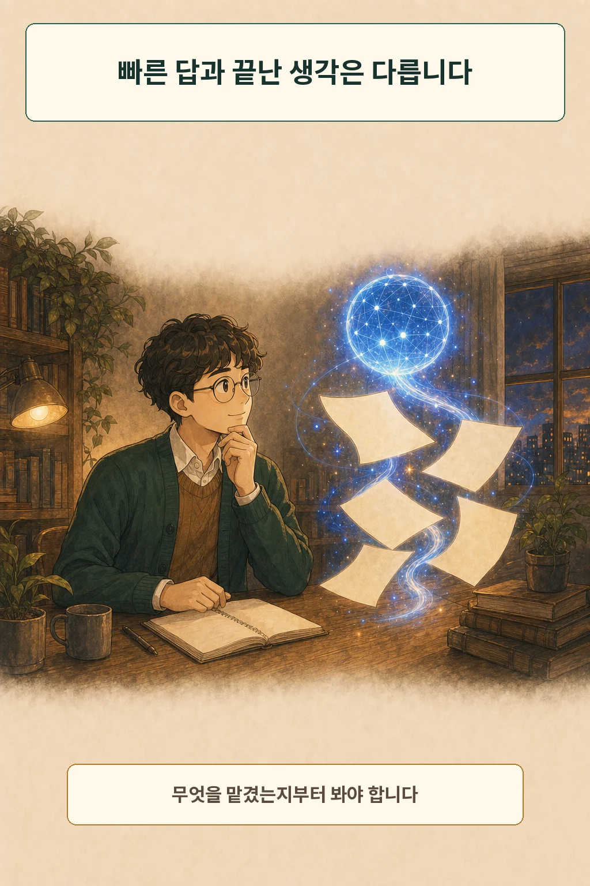
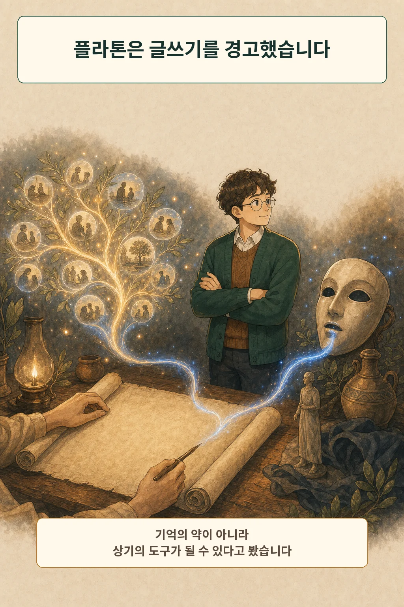
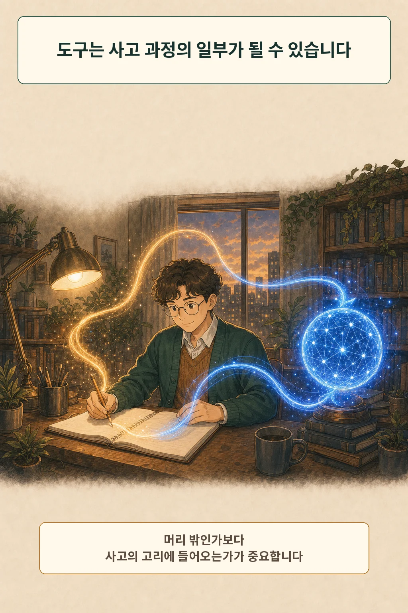
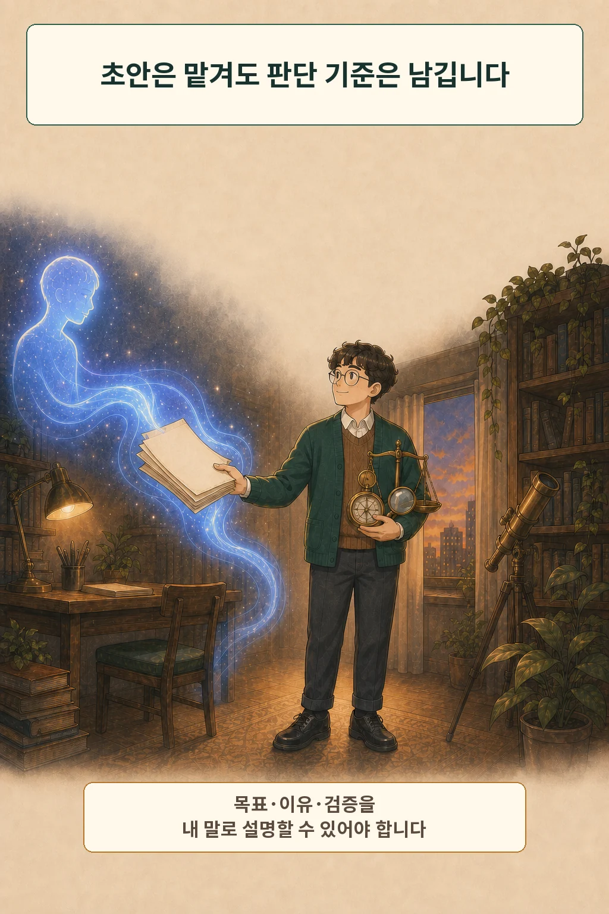

몇 줄을 입력했더니 AI가 제법 그럴듯한 초안을 내놓습니다. 전에는 한 시간 걸렸을 일을 몇 분 만에 끝냈다면 편해진 만큼 덜 생각한 것일까요? **빠르게 답을 얻은 일과 생각을 끝낸 일은 같지 않습니다.** 먼저 기억, 초안, 비교, 판단 중 무엇을 맡겼는지 나눠 봐야 합니다.

글·해설: 다메카솔

## 핵심 요약

사람은 메모와 계산기처럼 생각의 일부를 오래전부터 밖에 맡겨 왔습니다. 플라톤은 외부 기록이 기억의 연습을 약하게 하고 지혜의 외양을 만들 수 있다고 경고했습니다. 반대로 확장된 마음 이론은 도구가 우리의 사고 고리에 깊이 들어오면 인지 과정의 일부가 될 수 있다고 봅니다. AI 시대의 쟁점은 도구 사용 자체보다 **목표·이유·검증과 최종 판단을 누가 맡는가**에 있습니다.

## 매끈한 답에서 무엇이 사라졌을까

AI로 초안을 만들면 문장을 떠올리고 순서를 잡는 부담이 줄어듭니다. 줄어든 노력은 곧 사고력의 손실일 수도 있지만, 더 중요한 문제에 집중할 여유일 수도 있습니다. 계산기를 썼다고 수학적 판단이 모두 사라지는 것은 아니듯, AI를 썼다는 사실만으로 결과를 정할 수 없습니다.

차이는 사용자가 여전히 문제를 정의하고 있는지에서 생깁니다. 무엇을 원하는지 모른 채 첫 답을 붙여 넣었다면 초안뿐 아니라 판단의 시작점도 맡긴 셈입니다. 반면 목표와 기준을 먼저 세우고 여러 답을 비교했다면 AI는 생각을 없애기보다 탐색 범위를 넓힌 도구가 됩니다.

## 플라톤은 글쓰기도 같은 눈으로 보았습니다

플라톤의 『파이드로스』에는 글자를 발명한 테우트와 이를 평가하는 왕 타무스의 이야기가 나옵니다. 타무스는 사람들이 외부 표식에 의존하면 자신의 기억을 연습하지 않게 되고, 실제 지혜보다 지혜로워 보이는 상태를 얻을 수 있다고 비판합니다. 글은 질문을 받아도 같은 말만 되풀이한다는 지적도 이어집니다. [『파이드로스』 275a~275e](https://www.perseus.tufts.edu/hopper/text?doc=Perseus%3Atext%3A1999.01.0174%3Atext%3DPhaedrus%3Apage%3D275)

이 대목을 “플라톤은 글쓰기를 반대했다”로 줄이면 핵심을 놓칩니다. 같은 부분에서 글은 이미 아는 사람에게 상기의 역할을 할 수 있다고 말합니다. 문제는 기록이 아니라 **기록을 이해와 지혜 그 자체로 착각하는 일**입니다. 오늘날 AI가 만든 답을 읽었다는 사실과 그 이유를 이해했다는 사실도 같은 방식으로 구분할 수 있습니다.

## 생각을 밖에 맡기는 일은 원래 인간적입니다

인지과학에서는 머릿속에서 처리해야 할 부담을 외부 행동과 도구로 줄이는 일을 **인지적 오프로딩**이라고 부릅니다. 스마트폰에 약속 알림을 넣거나 종이에 긴 계산을 적는 행동도 여기에 들어갑니다. 이런 전략을 쓰면 기억과 계산에 드는 자원을 다른 곳에 쓸 수 있습니다. [Risko와 Gilbert의 인지적 오프로딩 리뷰](https://discovery.ucl.ac.uk/id/eprint/1508770/)

따라서 “밖에 맡겼다”는 말 자체에는 좋고 나쁨이 정해져 있지 않습니다. 어떤 부담을 줄였고, 그 덕분에 무엇을 더 잘하게 됐으며, 도구가 틀렸을 때 알아차릴 수 있는지가 함께 필요합니다.

## 도구는 내 생각의 일부가 될 수 있을까

앤디 클라크와 데이비드 차머스는 「확장된 마음」에서 마음의 경계를 피부와 두개골로만 정하지 말자고 제안했습니다. 종이 위에서 계산하거나 도형을 직접 돌리고, 노트를 기억처럼 꾸준히 쓰는 과정이 행동을 실시간으로 이끈다면 외부 도구도 인지 시스템의 일부로 볼 수 있다는 주장입니다. [Clark와 Chalmers의 원문](https://www.consc.net/papers/extended.html)

그렇다고 연결된 모든 도구가 자동으로 마음의 일부가 되는 것은 아닙니다. 철학자들은 단순한 인과적 연결과 인지 시스템의 구성을 구분해야 한다고 비판해 왔습니다. [확장된 인지를 둘러싼 논쟁](https://plato.stanford.edu/entries/embodied-cognition/) AI가 내 사고를 확장하는지는 사용 횟수보다 목표를 주고, 결과를 읽고, 틀린 부분을 고쳐 다시 묻는 순환이 실제로 있는지에 달렸다고 보는 편이 안전합니다.

## AI는 비판적 사고를 없애기보다 자리를 옮길 수 있습니다

Microsoft Research와 Carnegie Mellon 연구진은 생성형 AI를 업무에 주 1회 이상 쓰는 지식 노동자 319명에게 936개의 사용 사례를 받아 분석했습니다. 생성형 AI에 대한 신뢰가 높을수록 비판적 사고를 덜 했다고 보고하는 경향이 있었고, 자신의 과제 수행 능력에 자신이 있을수록 더 많이 했다고 보고하는 경향이 있었습니다. 이는 자기보고 조사에서 나타난 연관성이지, AI가 사고력 저하를 일으켰다는 인과 증명은 아닙니다. [CHI 2025 연구](https://www.microsoft.com/en-us/research/publication/the-impact-of-generative-ai-on-critical-thinking-self-reported-reductions-in-cognitive-effort-and-confidence-effects-from-a-survey-of-knowledge-workers/)

흥미로운 점은 비판적 사고의 초점이 옮겨 갔다는 보고입니다. 참여자들은 정보를 처음부터 만드는 일보다 AI 결과를 검증하고, 자신의 작업에 통합하고, 최종 결과를 책임지는 데 사고를 사용했습니다. AI가 초안을 대신할수록 검토자의 역할은 사라지는 것이 아니라 더 선명해질 수 있습니다.

## 저는 초안보다 판단 기준을 지키는 쪽을 택합니다

제 판단으로는 AI가 생각을 빼앗는다기보다 **생각의 일부를 너무 매끈하게 숨기는 위험**이 더 큽니다. 완성된 문장만 보면 내가 어떤 가정을 건너뛰었는지 알아채기 어렵습니다. 결과가 맞아 보여도 왜 그 답을 골랐는지 설명하지 못한다면, 편의와 함께 판단의 주도권도 넘긴 상태에 가깝습니다.

그래서 저는 다음 세 가지를 남겨 둡니다.

1. **목표:** 요청하기 전에 무엇을 결정하려는지와 판단 기준을 한 문장으로 적습니다.
2. **이유:** 첫 답을 받으면 반대 근거, 다른 선택지, 숨은 가정을 함께 묻고 비교합니다.
3. **검증과 책임:** 중요한 사실은 원 출처에서 확인하고, 최종 선택의 이유를 자신의 말로 설명합니다.

초안, 요약, 기억 보조는 AI에게 맡길 수 있습니다. 그러나 무엇을 좋은 답으로 볼지 정하는 기준까지 넘기면, 나중에는 AI가 틀렸을 때 고칠 출발점도 사라집니다.

## 생각의 경계는 도구가 아니라 사용 방식에서 드러납니다

플라톤의 경고와 확장된 마음은 정반대처럼 보이지만 한 지점에서 만납니다. 외부 도구는 우리를 무지하게 만들 수도 있고, 혼자서는 할 수 없던 사고를 가능하게 할 수도 있습니다. 어느 쪽이 되는지는 도구 안에 답을 저장했는지가 아니라 그 답이 나의 질문·검토·수정과 연결돼 있는지에 달렸습니다.

다음에 AI가 멋진 답을 내놓으면 “내가 덜 생각했나?”만 묻지 않아도 됩니다. **나는 무엇을 맡겼고, 무엇을 이해했으며, 마지막 판단을 다시 설명할 수 있는가?** 이 질문에 답할 수 있다면 AI는 생각의 종착점보다 생각이 오가는 작업대에 가까워집니다.

AI와 인간의 관계 자체가 궁금하다면 앞선 글 [AI는 친구가 될 수 있을까](/posts/ai-companion-friendship-philosophy/)도 이어서 읽을 수 있습니다.

## 참고 자료

- [Plato, Phaedrus, page 275](https://www.perseus.tufts.edu/hopper/text?doc=Perseus%3Atext%3A1999.01.0174%3Atext%3DPhaedrus%3Apage%3D275)
- [Andy Clark & David J. Chalmers, The Extended Mind](https://www.consc.net/papers/extended.html)
- [Stanford Encyclopedia of Philosophy, Embodied Cognition](https://plato.stanford.edu/entries/embodied-cognition/)
- [Risko & Gilbert, Cognitive Offloading](https://discovery.ucl.ac.uk/id/eprint/1508770/)
- [Microsoft Research, The Impact of Generative AI on Critical Thinking](https://www.microsoft.com/en-us/research/publication/the-impact-of-generative-ai-on-critical-thinking-self-reported-reductions-in-cognitive-effort-and-confidence-effects-from-a-survey-of-knowledge-workers/)

이 글의 본문과 이미지는 생성형 AI로 제작했습니다. 기획과 편집 기준은 다메카솔이 정했습니다.

이미지는 텍스트 없는 원화에 결정적 레터링을 합성해 제작했습니다.
