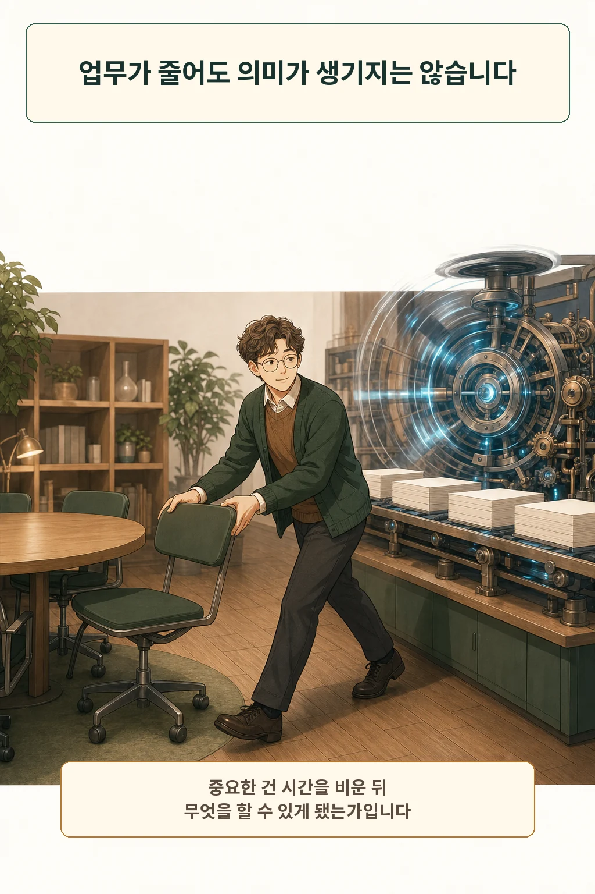
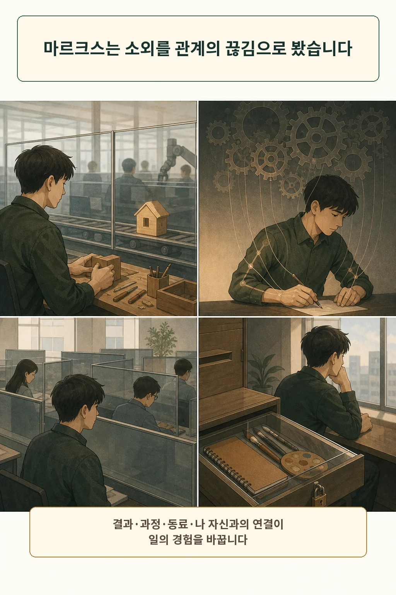
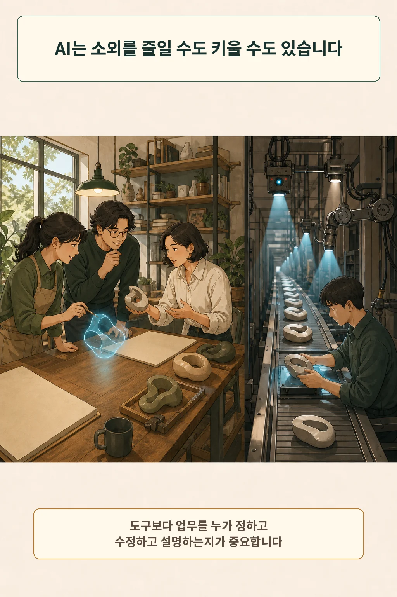
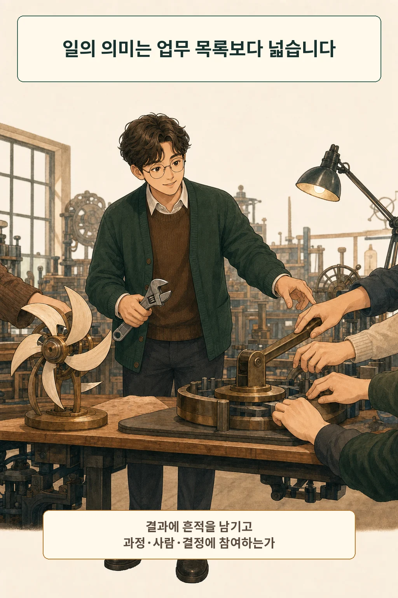
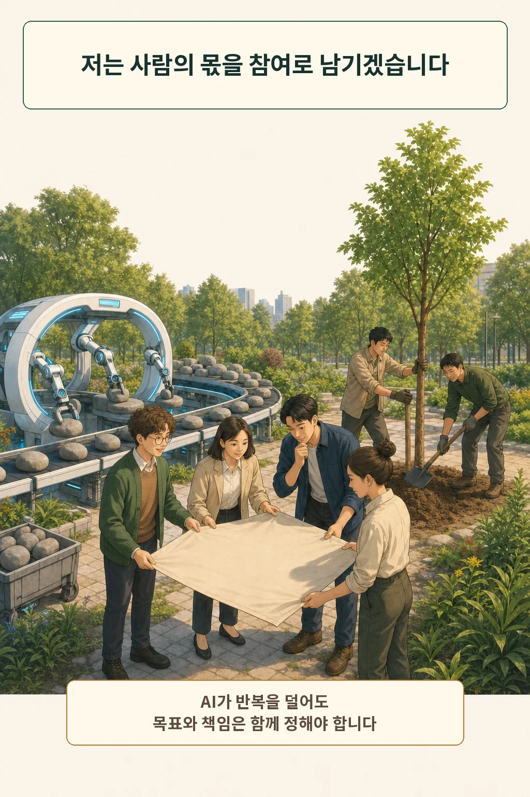

AI가 더 많은 업무를 대신하면 사람은 덜 일하고 더 자유로워질 거라는 기대가 있습니다. 실제 변화는 그렇게 한 방향으로 흐르지 않습니다. 반복 과업이 줄어도 처리 속도만 높아질 수 있고, 비워진 시간이 판단과 협력에 쓰일 수도 있습니다. **일의 의미는 없어진 업무의 수보다 결과·과정·동료·결정과 맺는 관계에서 드러납니다.**

글·해설: 다메카솔

## 노출된 직업 수는 해고 예측이 아닙니다

ILO와 NASK는 2025년 지수에서 전 세계 노동자 네 명 중 한 명이 생성형 AI에 어느 정도 노출된 직업에 있다고 추정했습니다. 최고 노출 구간은 전 세계 고용의 3.3%였습니다. 이 수치는 직업 안의 과업이 생성형 AI로 자동화되거나 변형될 가능성을 분류한 결과입니다. 많은 직업이 여전히 사람의 입력이 필요한 과업을 포함해, 연구진은 대체보다 직무 변형을 더 가능성 높은 영향으로 설명했습니다. [ILO 2025 보고서](https://www.ilo.org/publications/generative-ai-and-jobs-refined-global-index-occupational-exposure)

2026년 ILO는 해석의 선을 더 분명히 그었습니다. 노출 지표는 조기 경보이며 실제 해고, 임금, 전직을 혼자 예측하지 못합니다. 고용과 노동조건이 어떻게 바뀌었는지는 별도 자료로 확인해야 합니다. [ILO의 노출 지표 해설](https://www.ilo.org/resource/news/new-ilo-brief-explains-what-ai-exposure-indicators-reveal-about-jobs)

## 마르크스가 묻는 것은 기계보다 관계입니다

마르크스의 1844년 수고는 소외된 노동을 네 가지 끊김으로 설명합니다. 사람은 자신이 만든 생산물을 소유하거나 통제하지 못하고, 생산 과정도 스스로 정하지 못합니다. 동료는 협력자보다 경쟁자나 수단이 되며, 자유롭고 의식적으로 무언가를 만드는 능력에서도 멀어집니다. [Stanford Encyclopedia of Philosophy의 마르크스 항목](https://plato.stanford.edu/entries/marx/)

여기서 기계가 자동으로 악역이 되지는 않습니다. 마르크스의 비판은 산업 기술보다 생산을 조직하는 사회관계를 향합니다. AI가 귀찮은 일을 덜어도 사람이 결과를 통제하지 못하고 과정의 재량까지 잃는다면 소외는 남습니다. 반대로 도구가 선택지를 넓히고 결과를 고칠 힘을 준다면 같은 기술도 다른 경험을 만듭니다.

## AI는 자율성을 넓히기도, 좁히기도 합니다

OECD가 정리한 제조·금융 분야 조사와 사례에서는 AI가 반복 과업을 덜고 의사결정을 돕는다는 응답이 나왔습니다. 알고리즘 관리 아래에서는 자율성이 줄고 업무 강도와 사생활 침해 위험이 커졌다는 보고도 함께 나왔습니다. 조사 대상은 AI 도입 뒤에도 일하고 있던 제조·금융 노동자의 인식이므로 모든 직업에 그대로 옮길 수는 없습니다. [OECD Employment Outlook 2023](https://www.oecd.org/en/publications/oecd-employment-outlook-2023_08785bba-en/full-report/artificial-intelligence-job-quality-and-inclusiveness_a713d0ad.html)

그래서 “AI를 썼는가”보다 “누가 목표와 속도를 정하고, 결과를 수정하며, 결정에 이의를 제기할 수 있는가”가 더 구체적인 질문이 됩니다.

## 아렌트는 한 직업 안의 세 활동을 나눕니다

아렌트는 『인간의 조건』에서 활동적 삶을 노동, 작업, 행위로 구분했습니다. 노동은 먹고 돌보는 것처럼 생명을 유지하는 반복 활동입니다. 작업은 의자, 건물, 제도처럼 한동안 남아 사람이 살아갈 세계를 만듭니다. 행위는 여러 사람이 말과 행동으로 자신을 드러내고 함께 새 시작을 여는 활동입니다. [Stanford Encyclopedia of Philosophy의 아렌트 항목](https://plato.stanford.edu/entries/arendt/)

이 구분을 직업의 서열표로 쓰면 아렌트의 엄격한 공사 구분이 가진 약점까지 되풀이하게 됩니다. 현실의 돌봄과 생계 노동에도 관계와 판단이 있고, 경제 문제 역시 권력과 정의의 문제입니다. 저는 이 세 갈래를 한 직업 안에서 무엇이 줄고 무엇이 남는지 보는 렌즈로 사용합니다.

## 다메카솔의 판단: 사람의 몫은 참여입니다

저라면 자동화율보다 네 관계부터 확인하겠습니다.

1. **결과:** 완성물에 내 판단과 책임의 흔적이 남는가?
2. **과정:** 목표와 방법을 고치고 다른 선택을 제안할 수 있는가?
3. **동료:** AI가 대화를 없애는가, 더 깊은 협력을 위한 시간을 만드는가?
4. **결정:** 나에게 영향을 주는 평가와 배분에 설명을 요구하고 참여할 수 있는가?

제 입장은 분명합니다. AI가 반복을 덜어 낸 자리에 더 빠른 처리량과 촘촘한 감시만 채우면 일의 의미는 얇아집니다. 그 자리에 목표를 함께 정하고, 오래 남을 것을 만들고, 동료와 새 일을 시작할 여지를 남겨야 합니다. 자동화가 주는 시간은 그 자체로 자유가 아닙니다. 그 시간을 어디에 쓸지 함께 결정할 때 비로소 자유의 재료가 됩니다.

AI에 생각을 맡기는 기준이 궁금하다면 [AI에게 생각을 맡기면 나는 덜 생각하게 될까](/posts/ai-thinking-cognitive-offloading-philosophy/)를, 조직의 인력 재편 전망을 구분해서 보고 싶다면 [AI는 인력 전략을 어떻게 바꾸고 있나](/posts/thomson-reuters-ai-workforce-shift/)를 이어서 읽을 수 있습니다.

## 참고 자료

- [ILO, Generative AI and Jobs: A Refined Global Index of Occupational Exposure](https://www.ilo.org/publications/generative-ai-and-jobs-refined-global-index-occupational-exposure)
- [ILO, What AI exposure indicators tell us — and what they do not](https://www.ilo.org/resource/news/new-ilo-brief-explains-what-ai-exposure-indicators-reveal-about-jobs)
- [Stanford Encyclopedia of Philosophy, Karl Marx](https://plato.stanford.edu/entries/marx/)
- [Stanford Encyclopedia of Philosophy, Hannah Arendt](https://plato.stanford.edu/entries/arendt/)
- [OECD Employment Outlook 2023, Artificial intelligence, job quality and inclusiveness](https://www.oecd.org/en/publications/oecd-employment-outlook-2023_08785bba-en/full-report/artificial-intelligence-job-quality-and-inclusiveness_a713d0ad.html)

이 글의 본문과 이미지는 생성형 AI로 제작했습니다. 기획과 편집 기준은 다메카솔이 정했습니다.

이미지는 텍스트 없는 원화에 결정적 레터링을 합성해 제작했습니다.
