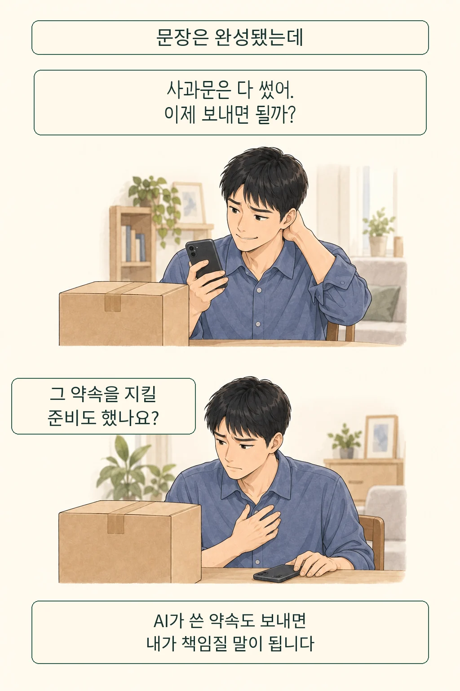
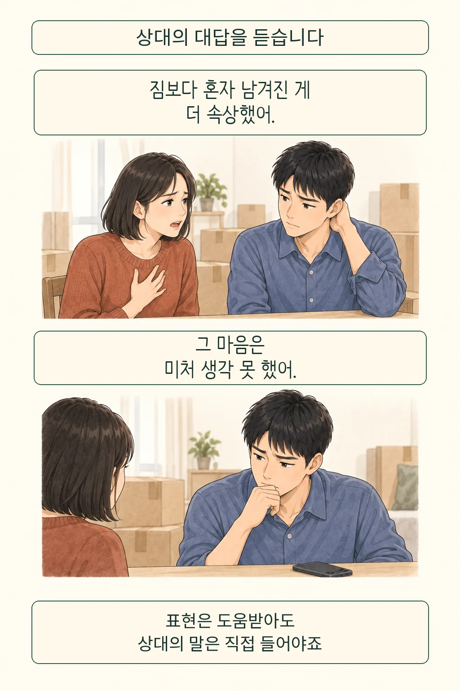
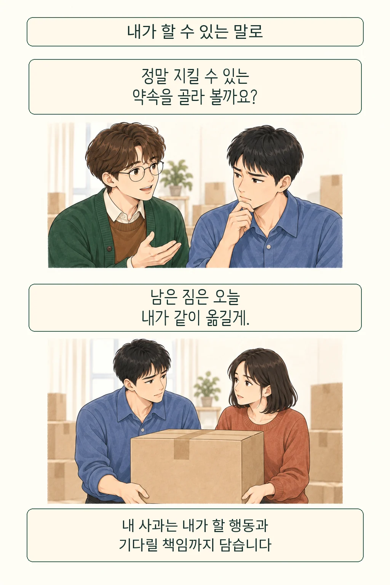

친구에게 보낼 사과문을 AI에게 부탁해도 괜찮을까요? AI로 문장을 다듬어도 사과의 책임은 보낸 사람에게 남습니다. **저는 잘못의 인정과 실행할 약속을 직접 정하고, 상대의 반응까지 받아들일 준비가 있다면 내 사과로 설 수 있다고 봅니다.** 매끄러운 문장을 고른 뒤 대화를 끝내려 할 때가 더 걱정스럽습니다.

글·해설: 다메카솔

## 문장을 고르는 사람과 약속을 지키는 사람

설명을 위해 이런 장면을 상상해 봅니다. 친구의 이사를 돕기로 해 놓고 늦잠을 잤습니다. 민망해서 AI에게 정중한 사과문을 부탁하니, 재발 방지와 보상을 약속하는 답이 나옵니다. 그런데 그 약속을 지킬 시간이나 방법은 아직 생각하지 못했습니다. 전송 버튼을 누르는 순간, 초안 속 약속은 친구가 나에게 물을 수 있는 말이 됩니다.

여기서 제가 살피려는 것은 글솜씨보다 약속의 주인입니다. 무엇을 잘못했는지 직접 설명할 수 있고, 상대가 입은 불편을 인정하며, 감당할 행동을 고르면 문장 도움을 받을 자리가 생깁니다. 반대로 직접 쓴 문장도 지킬 뜻 없는 약속을 담을 수 있습니다. [AI와 저자성에 관한 글](/posts/ai-assisted-authorship-ownership/)에서 결과물에 대한 관여를 물었다면, 이번에는 그 말을 들은 사람에게 무엇을 책임질지 묻습니다.

연구에서도 문장과 사람의 평가는 갈렸습니다. Khadpe 연구진은 가상 상황의 사과 메시지에 AI 도움 표시를 붙였을 때, 그 말이 보낸 사람의 따뜻한 성품을 보여 준다는 평가가 약해졌다고 보고했습니다. 비교한 것은 메시지의 표시와 인물 평가였으므로, 실제로 얼마나 후회했는지나 오랜 관계가 회복됐는지까지 확인한 결과로 읽기는 어렵습니다. [연구 원문](https://arxiv.org/html/2509.09645v1)

## 불편한 대답을 듣는 자리까지 남겨 둡니다

친구가 “짐보다 혼자 남겨진 게 속상했어”라고 답하면 상황이 달라집니다. 내가 중요하다고 생각한 손해와 상대가 겪은 일이 어긋난 것입니다. 이 대목에서 새 문장을 빨리 만드는 일보다 필요한 것은, 처음 이해가 부족했음을 받아들이고 다시 듣는 일입니다. 설명용 장면의 갈등은 사과문 한 장으로 해소되지 않습니다.

철학자 데지레 림은 2026년 논문에서 AI가 쓴 사과를 언제나 무효하거나 비도덕적이라고 단정하기 어렵다고 논합니다. 대신 가까운 관계에서 서로의 표현을 해석하고 응답하는 연습이 약해질 위험을 제기합니다. 상대를 이해하려고 조정하는 수고까지 매끄러운 대필에 넘겨 버릴 수 있다는 우려입니다. 이는 철학적 논증이며 AI 사용이 실제 관계를 반드시 악화시킨다는 실험 결과와는 구별해야 합니다. [Lim, §§3–4](https://onlinelibrary.wiley.com/doi/full/10.1111/phpe.70013)

이 렌즈로 보면 서툶을 무조건 보존할 이유도 줄어듭니다. 외국어로 사과하거나 감정을 말로 옮기기 어려운 사람에게 표현 도움은 대화의 입구가 될 수 있습니다. 도움을 받은 뒤 상대의 질문에 직접 답할 여지를 남기는지가 제 판단 기준입니다. 직접 쓴 문장인지 따지는 데서 멈추면 이런 필요를 놓치기 쉽습니다.

## 다메카솔의 해석: 보내기 전에 내 몫을 정합니다

저라면 AI를 켜기 전에 인정할 사실과 감당할 약속을 먼저 적겠습니다. “늦잠으로 약속을 어겼고 네가 혼자 짐을 옮기게 했다”처럼 사건을 구체화한 뒤, 실제로 가능한 도움만 골라 문장을 다듬는 것입니다. AI가 넣은 변명이나 큰 약속은 보내기 전에 제 말로 설명할 수 있는지 확인하겠습니다.

이 기준을 서비스에 적용한다면 초안 생성과 전송 사이에 확인 단계를 두겠습니다. 사용자가 제공하지 않은 사유나 보상 약속을 구분해 보여 주고, 본인이 확인한 문장만 보내도록 하는 설계입니다. 자동 생성이 곧 외부 행동으로 이어지지 않게 하는 백엔드 승인 경계와 닮았습니다. 관계를 다루는 기능에서도 편리함과 함께 약속이 생기는 시점을 설계해야 한다는 제안입니다.

AI 도움을 받았다고 밝히는 것만으로 그 책임이 끝나지는 않습니다. 상대가 작성 과정을 중요하게 여긴다면 어디까지 도움받았는지 정직하게 설명하고, 불편하다는 반응에도 답해야 합니다. 사과를 받아 줄 시점은 상대가 정합니다. 공개 여부를 용서를 얻어 낼 조건처럼 거래하고 싶지는 않습니다.

처음의 친구는 “앞으로 늘 잘할게”라는 큰 문장을 지웁니다. 대신 오늘 남은 상자를 함께 옮길 수 있는지 묻습니다. 상대가 시간을 더 달라고 하면 기다릴 몫도 남아 있습니다. 제가 신뢰하고 싶은 사과는 그런 다음 행동으로 이어지는 말입니다.

## 출처

- [Désirée Lim, The Relational Risks of Generative Artificial Intelligence (2026)](https://onlinelibrary.wiley.com/doi/full/10.1111/phpe.70013)
- [Khadpe et al., AI-assisted messages and moral character (2025)](https://arxiv.org/html/2509.09645v1) · [AIES 정식 출판 정보](https://ojs.aaai.org/index.php/AIES/article/view/36641)

작성·출처 확인: 2026-09-21

이 글의 본문과 이미지는 생성형 AI로 제작했습니다. 기획과 편집 기준은 다메카솔이 정했습니다.
