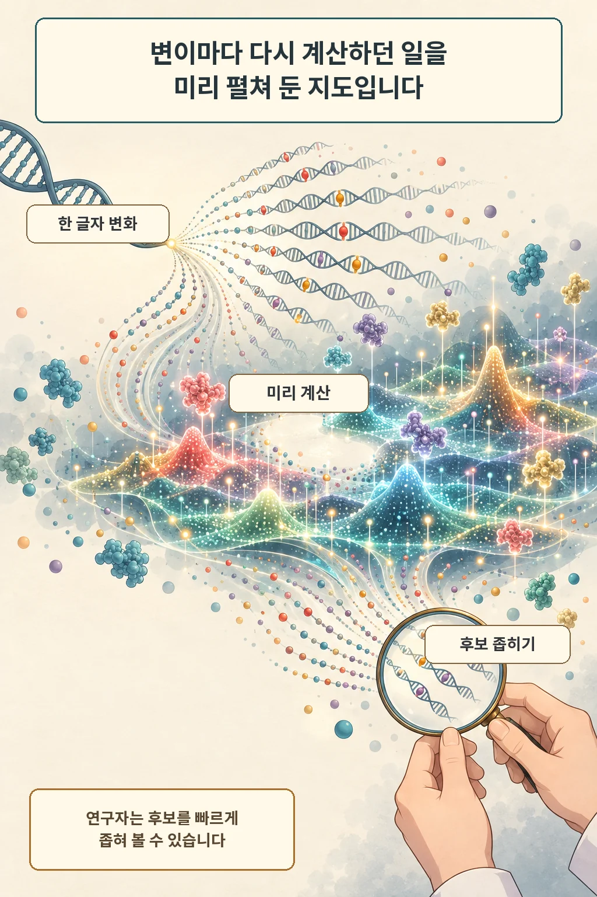
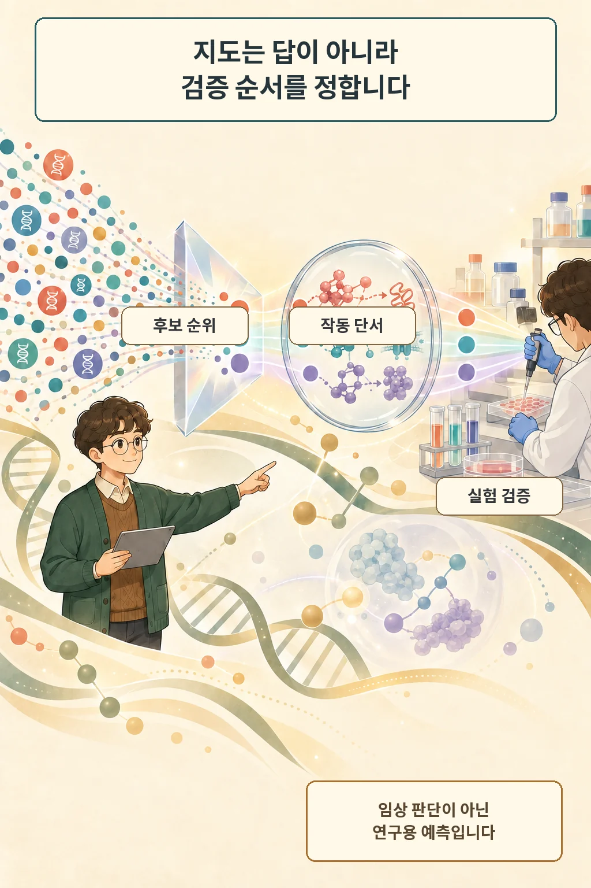

90억 개. 인간 유전체에서 가능한 단일염기 변이를 하나씩 놓고 보면 그만큼의 경우가 생깁니다. Google DeepMind는 2026년 9월 8일 이 변이들의 분자적 영향 예측을 미리 계산한 `AlphaGenome Atlas`를 공개했습니다. 핵심은 정답 자동 생성보다 연구자가 먼저 볼 후보를 빠르게 좁히는 데 있습니다.

글·해설: 다메카솔

## 90억 변이를 실험으로 모두 확인할 수는 없습니다

한 위치의 DNA 글자가 바뀌면 유전자 발현, RNA 스플라이싱, 염색질 접근성처럼 여러 분자 과정에 영향을 줄 수 있습니다. 가능한 변이를 모두 실험실에서 하나씩 검사하는 방식은 현실적인 시간과 비용 안에 들어오지 않습니다. Google DeepMind는 이 탐색 문제를 줄이기 위해 AlphaGenome의 예측을 전 유전체 규모로 미리 계산했습니다.

회사는 Atlas가 1페타바이트 규모이며 AlphaFold Database보다 30배 넘게 크다고 설명했습니다. 숫자는 데이터의 넓이를 보여 주지만 성능이나 임상 가치를 보증하지는 않습니다. 실제 쓸모는 연구 질문에 맞는 변이를 찾고, 왜 그 후보가 눈에 띄는지 추적할 수 있느냐에 달렸습니다.

## 사전 계산은 탐색 순서를 바꿉니다

Atlas는 변이별 분자 효과 예측을 저장하고, `AlphaGenome Variant Impact(AVI)` 점수와 그 점수에 기여한 생물학적 특성을 연결합니다. 연구자는 점수만 보고 끝내지 않고 스플라이싱, 유전자 발현, 보존성 같은 어떤 신호가 후보를 밀어 올렸는지 살필 수 있습니다. 반복 계산보다 탐색과 비교에 더 많은 시간을 쓰게 만드는 구조입니다.

2026년 9월 8일 기준 비상업 연구자는 웹 포털과 공식 API로 Atlas를 이용할 수 있습니다. 상업용 Atlas 접근은 Google Cloud에서 추후 제공할 계획입니다. 현재 이용 가능성과 미래 계획은 여기서 갈립니다.

## 협업 사례도 예측과 검증을 따로 봐야 합니다

Google DeepMind가 소개한 희귀질환 연구에서는 Atlas가 DNM1 관련 후보 변이와 잘못된 RNA 스플라이싱 경로를 가리켰고, 연구진이 후속 실험으로 그 예측과 인접 변이의 유사 효과를 확인했습니다. Atlas가 실험을 없앴다고 읽기보다, 실험할 위치를 고르는 데 도움을 준 사례로 보는 편이 정확합니다.

또 다른 협업에서는 영국 바이오뱅크 참가자 5만4천 명 이상의 전장유전체 자료에 예측 점수를 적용해 기존 통계 잡음 속에서 보이지 않던 비암호화 변이 연관성을 22% 더 찾았다고 회사가 보고했습니다. 이 결과는 Google DeepMind가 소개한 협업 성과이며, 모든 질환이나 데이터셋에 같은 증가율이 재현된다는 뜻은 아닙니다.

## 지도는 실험과 임상 판단을 대신하지 않습니다

예측 점수는 후보의 우선순위를 정합니다. 특성 기여도는 가능한 작동 경로를 보여 줍니다. 질병 원인과 치료 결정을 확정하려면 독립 데이터, 실험 재현, 임상 근거가 더 필요합니다.

Google DeepMind와 공식 API 문서는 AlphaGenome Atlas가 임상용으로 검증되거나 승인되지 않았으며 의료 조언·진단·치료를 대신하지 않는다고 명시합니다. 이 경계는 부가 주의문을 넘어 제품의 현재 상태를 정의합니다. 연구용 예측을 환자 판단으로 건너뛰면 Atlas가 줄인 탐색 비용보다 더 큰 오류 비용을 만들 수 있습니다.

## 다메카솔의 해석

제가 보는 Atlas의 가치는 거대한 계산 결과 자체보다 병목의 이동에 있습니다. 변이마다 모델을 다시 돌리는 단계가 줄면 다음 병목은 좋은 질문을 고르고, 후보 순위의 근거를 읽고, 실패한 실험까지 기록하는 일로 옮겨갑니다. 소프트웨어 팀이 테스트 자동화를 늘린 뒤 실패 분류와 회귀 기준이 더 중요해지는 흐름과 닮았습니다.

저라면 예측 점수 하나를 승인 신호로 쓰지 않겠습니다. 후보를 만든 모델 버전, 데이터 범위, 점수 근거, 실험 결과를 한 계보로 묶고, 재현되지 않은 후보도 남겨 다음 판단의 편향을 줄이겠습니다. AlphaGenome Atlas는 연구 질문을 빠르게 좁히는 지도입니다. 마지막 결론은 여전히 검증 과정에서 만들어집니다.

## 출처

- [Google DeepMind, AlphaGenome Atlas: A predictive map of every possible DNA letter change in the human genome (2026-09-08)](https://deepmind.google/blog/alphagenome-atlas-a-predictive-map-of-every-possible-dna-letter-change-in-the-human-genome/)
- [Google DeepMind, AlphaGenome API 공식 저장소](https://github.com/google-deepmind/alphagenome)

이 글의 본문과 이미지는 생성형 AI로 제작했습니다. 기획과 편집 기준은 다메카솔이 정했습니다.
