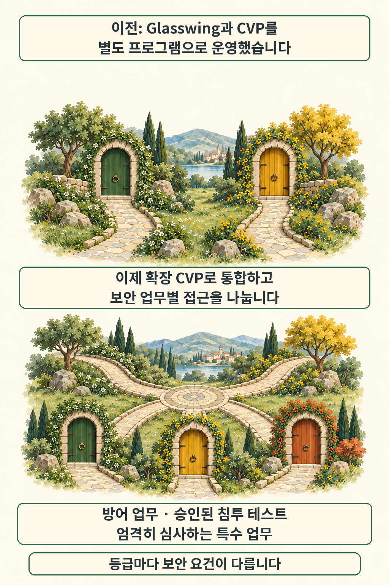

글·해설: 다메카솔

발행·확인: 2026-10-07

**보안팀이 Claude 사용 승인을 받았더라도, 어떤 업무를 어느 작업공간에서 실행할지는 따로 살펴야 합니다.** Anthropic은 2026년 10월 6일 사이버 검증 프로그램(CVP)을 확대하면서 방어·레드팀·특수 접근을 구분했습니다. 이번 변화는 보안 업무의 범위에 맞춰 이용 조건을 정하는 데 초점이 있습니다. [공식 발표](https://www.anthropic.com/news/cyber-verification-program)

## 별도 프로그램에서 업무별 접근 등급으로

기존 Glasswing 참여 조직은 확장 CVP의 Specialized Access로 옮겨갑니다. Anthropic은 현재 모델에 대한 재승인은 필요하지 않다고 안내했습니다. 종전 Glasswing과 CVP를 하나의 프로그램으로 통합하는 변화입니다. [Glasswing의 10월 6일 안내](https://www.anthropic.com/glasswing)

업무 범위가 기준입니다. 공식 발표의 세 등급을 읽을 때는 모델 이름보다 수행할 작업을 먼저 대조하는 편이 이해하기 쉽습니다.

| 접근 등급 | 발표에서 설명한 업무 범위 |
| --- | --- |
| Defense Access | 보안 관제, 사고 대응, 취약점 분석 등 방어 업무 |
| Red Team Access | 방어 업무에 더해 권한을 받은 시스템의 침투 테스트·레드팀 활동 |
| Specialized Access | 엄격한 심사를 받는 제한된 조직의 고위험 안전 시스템 테스트 |

등급마다 신청자 확인과 보안 요건이 다릅니다. Red Team에서도 물리적 피해나 대규모 장애를 일으킬 수 있는 작업에는 차단이 남는다는 설명입니다. [등급별 범위](https://www.anthropic.com/news/cyber-verification-program)

개인 연구자는 어디에 해당할까요? 도움말 FAQ는 유료 요금제의 개인 신청자에게 Defense Access를 안내하고, 나머지 두 등급은 조직 대상으로 설명합니다. 일반 공개 모델도 안전한 코드 리뷰, 알려진 문제의 패치, 소유한 소스 코드의 취약점 탐색 등에 계속 사용할 수 있습니다. [신청 대상과 일반 이용 범위](https://support.claude.com/en/articles/14604842-cyber-verification-program)

## 승인 다음에는 실제 작업공간을 봅니다

권한은 어디에 적용될까요? Claude Console 안내에 따르면 조직에 부여된 프로그램 이용 권한은 해당 요건을 충족한 작업공간의 API 요청에 적용됩니다. 조직 관리자나 소유자는 프로그램과 작업공간의 상태, 충족하지 못한 요건을 확인할 수 있습니다. [작업공간 적용 안내](https://support.claude.com/en/articles/16764810-assign-a-program-to-workspaces-in-claude-console)

자동 적용되는 프로그램도 있고 작업공간 지정이 필요한 경우도 있습니다. 실제 계정에 표시되는 상태를 확인하는 것이 출발점입니다. 조직 승인 소식만 듣고 기존 API 요청이 모두 같은 권한을 쓴다고 가정하면, 문제를 찾을 위치부터 어긋날 수 있습니다. 열쇠와 문은 이 적용 범위를 설명하는 비유이며 제품 화면을 재현한 그림은 아닙니다.

데이터 보관 조건도 함께 읽어야 합니다. CVP는 데이터 보존을 요구하지만, Fable 또는 Mythos의 무보존(ZDR) 이용 자격을 가진 조직에는 EFS 제공 전까지 예외가 안내돼 있습니다. 고객이 관리하는 클라우드에 데이터를 보관하도록 하는 Enterprise Frontier Safeguards(EFS)는 향후 제공 계획으로 구분해야 합니다. [보존 조건과 예외](https://support.claude.com/en/articles/14604842-cyber-verification-program)

## 다메카솔의 해석: 권한의 적용 지점을 좁혀 봅니다

보안 도구를 서비스에 연결할 때 저는 승인된 업무, 요청을 보내는 작업공간, 데이터를 남기는 위치를 함께 맞추겠습니다. 예를 들어 방어 분석용 요청과 침투 테스트용 요청을 한곳에서 보내면, 실패 원인을 권한 문제로 봐야 할지 작업 범위 문제로 봐야 할지부터 헷갈릴 수 있습니다. 필요한 범위로 작업공간을 나누고 요청이 어느 조건으로 실행됐는지 추적하는 설계가 도움이 되겠습니다. 이는 공개 자료를 바탕으로 한 운영 설계 제안입니다.

모델의 접근 등급과 연결된 도구의 권한도 함께 살펴볼 문제입니다. 운영체제가 에이전트의 파일 접근을 통제하는 사례는 [Apple의 Full Disk Access 안내](/posts/apple-full-disk-access-ai-agent-controls/)에서 다뤘습니다. 이번 CVP 설명은 직접 신청하거나 API 동작을 시험한 결과를 포함하지 않으며, 승인 후에도 Anthropic의 이용 정책은 계속 적용됩니다. [승인 후 조건](https://support.claude.com/en/articles/14604842-cyber-verification-program)

도입을 검토한다면 팀의 대표 보안 작업 하나를 골라 보세요. 그 작업이 어느 등급에 속하는지, 실제 요청은 어느 작업공간에서 나가는지부터 연결해 보면 필요한 준비가 구체적으로 드러납니다.

## 출처

- [Anthropic, Expanding the Cyber Verification Program — 2026-10-06](https://www.anthropic.com/news/cyber-verification-program)
- [Anthropic, Project Glasswing — 2026-10-06 업데이트](https://www.anthropic.com/glasswing)
- [Claude Help Center, Cyber Verification Program](https://support.claude.com/en/articles/14604842-cyber-verification-program)
- [Claude Help Center, Assign a program to workspaces in Claude Console](https://support.claude.com/en/articles/16764810-assign-a-program-to-workspaces-in-claude-console)

이 글의 본문과 이미지는 생성형 AI로 제작했습니다. 기획과 편집 기준은 다메카솔이 정했습니다.
