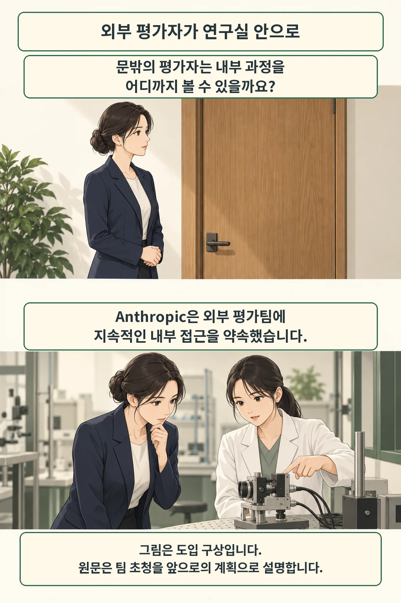
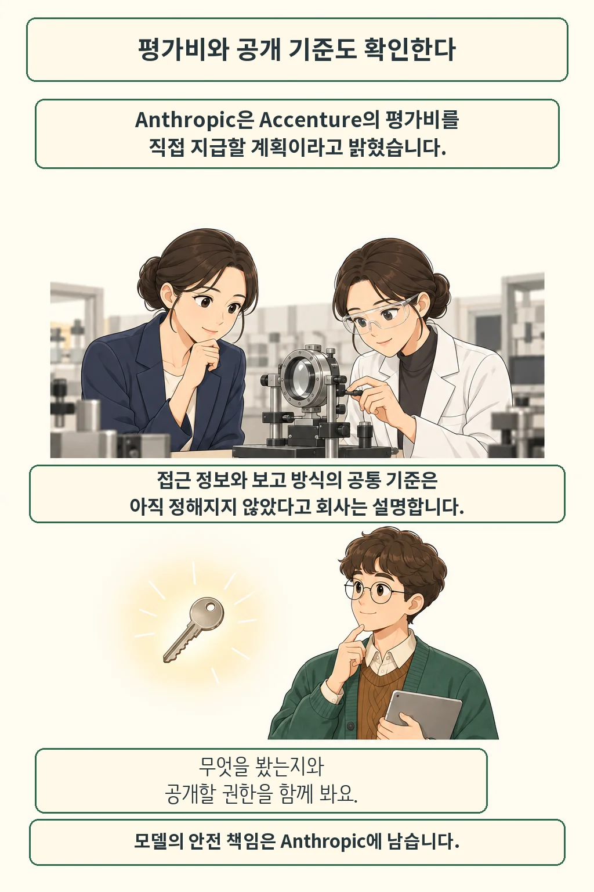

외부 평가자에게 연구실 안을 볼 권한을 주겠다는 약속이 나왔습니다. Anthropic의 다리오 아모데이는 [9월 에세이](https://darioamodei.com/post/we-must-pace-the-frontier)에서 AI 능력 향상 속도를 조절해 안전 검증 시간을 확보하자고 제안했습니다. 출발점은 상주 외부 평가팀입니다. 2026년 9월 14일 확인한 원문을 기준으로 약속과 이행을 나눠 읽었습니다.

글·해설: 다메카솔

Updated: 2026-09-14

## 문 안에서 확인할 수 있는 것

평가팀에 지속적인 직원 유사 접근권을 주겠다고 아모데이는 밝혔습니다. 안전 관행 준수, 사건 보고, 학습 과정의 정렬 상태를 살피도록 하겠다는 구상입니다. 초청은 앞으로의 계획으로 서술돼 있습니다. 도입 약속과 배치 완료를 구분해야 합니다. 그림도 이 구상을 설명합니다.

## 어디까지 보고 무엇을 발표하나

접근 범위에는 개인정보·계약·법적 예외가 붙습니다. 핵심 결과를 발표할 권리와 민감정보를 제한적으로 가릴 조건도 계약에 담겠다는 계획입니다. 민주국가 내 기업 협력과 국제 협력은 더 넓은 조정이 필요한 제안으로 남아 있습니다. 현재 원문만으로 공동 합의의 성립까지 확인할 수는 없습니다.

비슷한 논의의 배경으로는 데미스 하사비스의 [7월 공동 평가기구 구상](https://demishassabis.substack.com/p/a-framework-for-frontier-ai-and-the-dawning-of-a-new-age)이 있습니다. 모델을 별도 기구가 검토하고 평가 기준을 갱신하는 제안입니다. 이는 이전 구상이며 이번에 체결된 합의를 뜻하지 않습니다. 아모데이가 인용한 [최근 정렬 사건에 대한 회사 평가](/posts/claude-cyber-incidents-alignment-assessment/)도 약속의 배경과 실제 검증 결과를 나눠 읽을 필요가 있습니다.

## 다메카솔의 해석: 공개된 결과까지 따라가기

저는 후속 소식에서 실제 접근 범위와 공개 결과를 먼저 보겠습니다. 평가팀에 이름을 올렸다는 소식만으로는 내부에서 어떤 작업을 관찰했는지 알기 어렵습니다. 예를 들어 시험 계획만 받은 경우와 실행 기록까지 대조한 경우라면, 독자가 부여할 신뢰도 달라져야 합니다. 이 예시는 원문의 실제 운영 사례를 옮긴 것이 아니라 제가 확인할 항목을 설명한 것입니다.

회사의 설명과 평가팀의 판단이 어긋났을 때 그 차이를 공개하는지도 살피겠습니다. 불리한 결과가 나온 뒤 접근 범위가 유지되는지, 막힌 정보가 무엇인지 독자에게 설명하는지에 따라 약속의 무게가 달라질 수 있습니다. 다음에 기다릴 소식은 평가팀이 현장에서 확인한 내용입니다.

## 출처

- [Dario Amodei — We Must Pace the Frontier](https://darioamodei.com/post/we-must-pace-the-frontier): 원문 표기 2026년 9월. 현재 약속과 제안의 당사자 원문, 9월 14일 확인.
- [Demis Hassabis — A Framework for Frontier AI and the Dawning of a New Age](https://demishassabis.substack.com/p/a-framework-for-frontier-ai-and-the-dawning-of-a-new-age): 2026년 7월 14일. 과거 제안의 배경 자료.

이 글의 본문과 이미지는 생성형 AI로 제작했습니다. 기획과 편집 기준은 다메카솔이 정했습니다.
