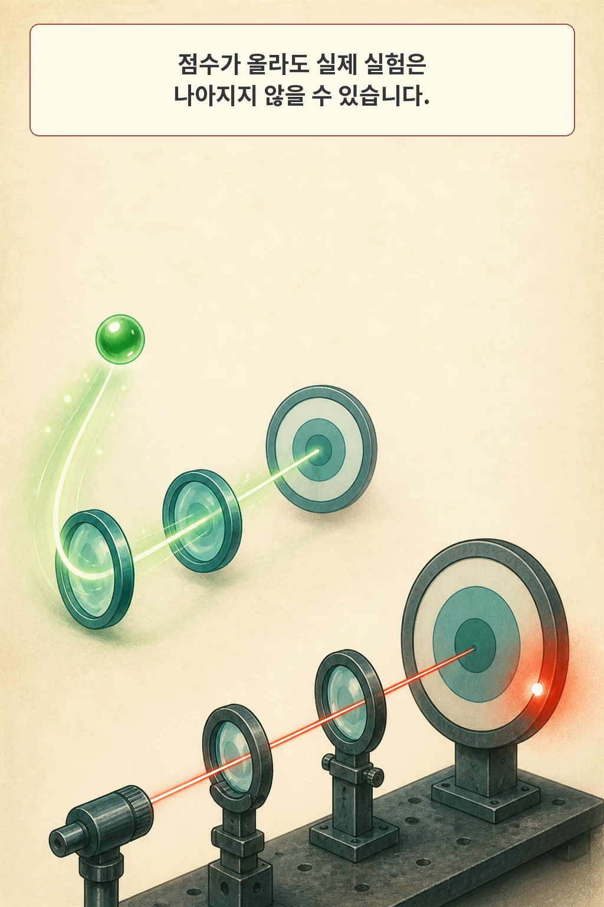
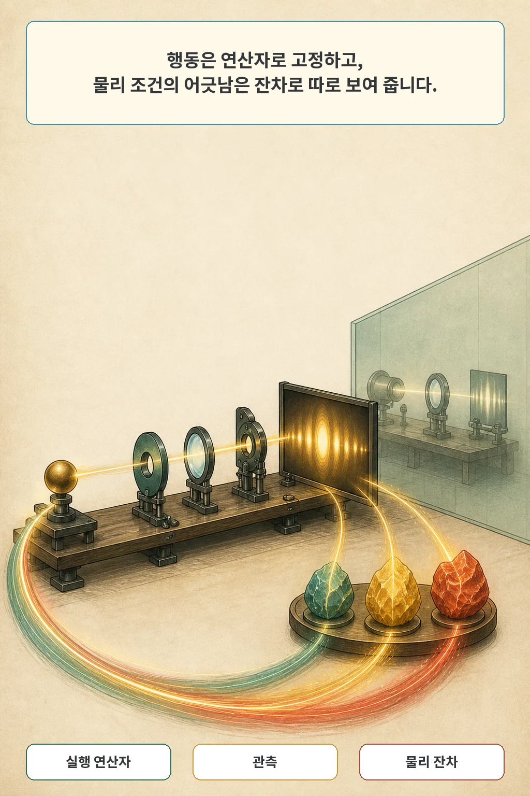
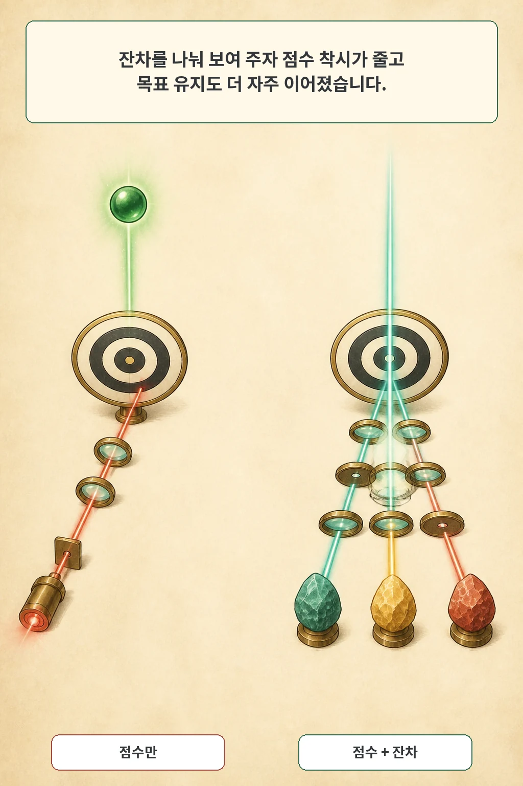
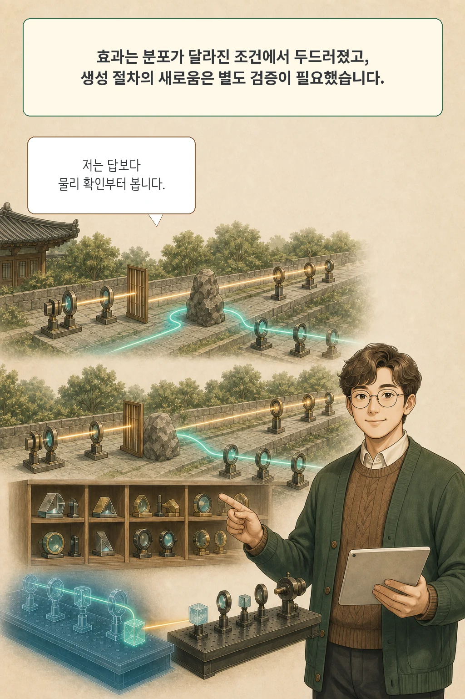

점수는 올랐는데 실제 광학 성능은 나아지지 않은 결정이 최대 39.0%였습니다. 실험을 맡은 AI가 틀린 답을 낸 문제가 아닙니다. 에이전트가 볼 수 있는 점수와 우리가 정말 개선하려는 물리 상태가 어긋난 문제입니다. 그렇다면 다음 행동을 고를 때 점수 말고 무엇을 보여 줘야 할까요?

2026년 8월 6일 공개된 preprint **OPERA: Operator–Residual Feedback for Reliable Autonomous Optical Experiments with Language-Model Agents**는 실행 가능한 광학 행동을 `연산자`로 제한하고, 관측 결과가 물리 조건에서 얼마나 벗어났는지를 `잔차`로 나눠 보여 줍니다. 연구진은 이 구조가 점수만 좇는 결정을 줄이고, 분포가 달라진 조건에서 실험을 더 안정적으로 이어 가는지 검증했습니다.

글·해설: 다메카솔

## 점수 상승과 실제 물리 개선은 다른 사건이다

논문의 연구 질문은 단순합니다. 언어 모델 에이전트가 보이는 점수만 높이려 할 때, 그 결정이 실제 광학 성능을 나쁘게 만들거나 그대로 두는 일을 어떻게 줄일 것인가입니다.

저자들은 빔 성형, 구조광 3차원 재구성, 간섭계의 세 과제에서 GPT-5.1, DeepSeek v4 pro, Qwen 3.7-max, Claude Opus 4.7을 같은 실행 하네스로 평가했습니다. 점수 착시를 비교한 주 실험은 독립 문제 90개를 포함했고, 신뢰구간은 문제 단위로 5,000회 부트스트랩해 계산했습니다.

점수만 제공한 조건에서는 점수가 올라도 실제 물리 개선이 없었던 결정이 과제에 따라 23.6~39.0%였습니다. 연산자-잔차 피드백을 제공하자 이 비율은 0.9~1.9%로 보고됐습니다. 이 수치는 세 과제의 범위이며, 모든 과학 실험 에이전트에 그대로 일반화할 수 있는 보편값은 아닙니다.

## 행동, 관측, 물리 잔차를 분리한다

OPERA의 `연산자`는 측정·제어·재구성을 바꾸는 검사 가능한 실행 단위입니다. 에이전트가 임의의 장비 명령을 새로 만드는 대신, 무엇을 실행할 수 있는지 먼저 고정합니다. `잔차`는 실행 뒤 관측이 지정한 물리 조건에서 얼마나 벗어났는지를 나타냅니다.

여기에는 세 층이 있습니다.

1. 에이전트가 실행 중 보는 점수
2. 이름·방향·단위와 함께 분리해 보여 주는 물리 잔차
3. 에이전트에게 숨기고 오프라인 평가에만 쓰는 최종 물리 성능 기준

목표 도달과 유지 분석은 독립 테스트 문제 270개와 54,000개 궤적 기록을 사용했습니다. 목표에 닿지 못한 궤적도 과제별 예산 상한까지 포함했습니다. 이 구분 덕분에 “보이는 점수를 올렸는가”와 “실제 목표 상태를 만들고 유지했는가”를 같은 것으로 취급하지 않습니다.

## 잔차를 나누자 점수 착시와 예산 낭비가 줄었다

270개 독립 테스트 문제에서 연산자-잔차 피드백은 목표에 도달한 뒤 끝까지 유지한 비율이 75.8%였습니다. 네 기준 전략은 33.9~60.1%였습니다. 같은 분석에서 OPERA는 과제별 예산 상한의 61.7%를 썼고, 기준 전략은 70.8~86.0%를 썼습니다.

잔차 표현 방식도 중요했습니다. 물리 위반을 하나의 스칼라로 압축했을 때 점수 상승과 물리 개선의 불일치 비율은 점수만 본 39.5%에서 11.6%로 줄었습니다. 잔차를 분리된 벡터로 보여 주자 2.3%까지 낮아졌습니다. 잔차 채널의 이름·방향·단위·운영 한계를 안정적으로 제공했을 때 예산 사용은 상한 대비 8.6% 줄었고, 물리 설명을 더하자 5.3%가 추가로 줄었습니다.

복제한 상태에서 여섯 후보 연산자를 오프라인으로 비교한 감사에서는 구조광 3차원 재구성의 최선 연산자 선택률이 점수만 본 2%에서 잔차를 본 34%로 늘었습니다. 다만 잔차 반응 예측 정확도와 낮은 예산 사용의 관계는 관찰된 연관입니다. 저자들도 이 분석이 인과성을 증명하지 않는다고 선을 그었습니다.

## 이점은 낯선 조건에서 컸고, 새로움은 별도 결과다

강한 과제 특화 알고리즘과 비교하면 OPERA의 예산 이점은 분포가 달라진 조건에 집중됐습니다. 익숙한 조건에서는 대응 이점이 없었고, 과제 특화 방법이 더 적은 예산을 쓰기도 했습니다. OPERA의 최종 물리 성능도 약간 낮았습니다. “언어 모델이 기존 최적화 알고리즘을 항상 이겼다”는 결론은 이 결과와 맞지 않습니다.

전략 생성 결과도 실행 가능성과 새로움을 나눠 읽어야 합니다. 미리 정한 60회 시도에서 53회가 실행 가능한 절차를 만들었습니다. 이 가운데 24개는 대응 기준과 같거나 더 나았고 17개는 더 낮았습니다. 나머지는 조건부 수용 1개와 거부 11개였습니다. 실행 가능한 53개 중 52개는 기존 알고리즘 계열과 일치했고 1개는 부분 일치했으며, 기존 계열과 맞지 않는 전략은 없었습니다. 실행 가능하고 성능이 좋다는 사실이 곧 새로운 알고리즘이라는 뜻은 아닙니다.

디지털 트윈에서 고른 절차는 세 물리 장비로 전사됐습니다. 구조광 3차원 재구성의 주 하드웨어 설정에서 전사 절차는 예산 상한의 평균 60.0%를 사용했고, 고정 Gray code는 95.8%를 사용했습니다. 그러나 절차는 장비로 옮기기 전에 고정됐고, 하드웨어 잔차로 온라인 갱신하지 않았습니다. 라이브 장비를 닫힌 고리로 계속 제어했다는 결과로 읽으면 안 됩니다.

## 다메카솔의 해석: 답보다 물리 확인부터 본다

제가 이 논문을 실무 규칙으로 옮긴다면 최종 점수부터 보지 않겠습니다. 먼저 세 가지를 묻겠습니다.

- 에이전트가 실행할 수 있는 행동은 검사 가능한 단위로 제한됐는가?
- 실행 뒤 어떤 물리 조건의 어긋남을 관측했는가?
- 최종 평가는 에이전트가 최적화하는 신호와 분리돼 있는가?

이 구조는 광학 장비에만 머물지 않습니다. 코드 에이전트라면 실행 가능한 도구, 테스트 실패의 분해된 원인, 모델에게 숨긴 최종 회귀 테스트로 바꿔 생각할 수 있습니다. 이 연결은 논문이 소프트웨어 에이전트에서 직접 검증한 결론이 아니라, 결과를 제품 평가에 옮긴 다메카솔의 해석입니다.

## 공개 코드와 데이터의 재현성 경계

저자들은 공식 GitHub 저장소와 Zenodo 레코드를 공개했습니다. 2026년 8월 9일 확인한 저장소 커밋 `9fabab3991edbf092c2d7a6391895567cd5bca28`에는 백엔드, 인터페이스, 동결 기록, 검증기와 테스트가 포함돼 있습니다. 반면 제공자 SDK·자격 증명·네트워크 호출, 라이브 장비 제어, 최종 통계 집계와 그림 생성 파이프라인은 제외됐다고 README가 밝힙니다.

압축본을 펼쳐 제공된 `release_integrity.py`를 실행했을 때는 서명 매니페스트가 기대한 `fig2_*` 경로와 실제 `fig3_*` 경로의 차이, 미서명 추가 파일 때문에 그대로 통과하지 않았습니다. 이는 논문의 성능 결과가 틀렸다는 증거가 아니라, 현재 공개 묶음만으로 무결성 검사를 바로 재현할 때 만나는 경계입니다. 라이브 모델이나 장비를 포함한 전체 실험의 완전 재현으로 표현하지 않겠습니다.

## 논문 정보

| 항목 | 내용 |
| --- | --- |
| 제목 | OPERA: Operator–Residual Feedback for Reliable Autonomous Optical Experiments with Language-Model Agents |
| 저자 | Ning Xu 외 |
| arXiv v1 제출 | 2026-08-06 13:03:22 UTC |
| 분야 | cs.AI, physics.optics |
| 상태 | arXiv preprint, 동료심사 채택 여부 미확인 |

## 출처

- [논문 초록과 메타데이터 — arXiv:2608.05990](https://arxiv.org/abs/2608.05990)
- [논문 원문 PDF](https://arxiv.org/pdf/2608.05990)
- [공식 OPERA 코드 저장소](https://github.com/ningxu1995/OPERA/tree/9fabab3991edbf092c2d7a6391895567cd5bca28)
- [공식 Zenodo 공개 묶음](https://zenodo.org/records/21504254)
- [관련 글: AI 영상 평가가 점수 하나로 끝나면 안 되는 이유](/posts/videoargus-evidence-video-evaluation/)
- [관련 글: AI가 화면을 본다고 정말 더 잘 푸는 걸까](/posts/visual-tool-use-causal-audit/)

이 글의 본문과 이미지는 생성형 AI로 제작했습니다. 기획과 편집 기준은 다메카솔이 정했습니다.

Updated: 2026-08-09
