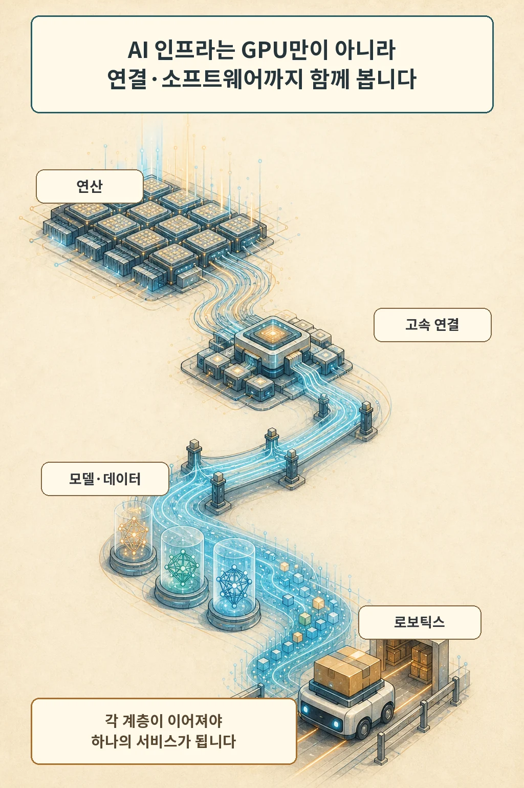

글·해설: 다메카솔

AWS와 NVIDIA는 2026년 8월 26일 AI 인프라 협력 확대를 공동 발표했습니다. 제목의 핵심 수치는 GPU 200만 장이지만, 이 물량은 지금 이용 가능한 용량이 아닙니다. 두 회사가 밝힌 시점은 2027~2028년이며, 발표의 범위도 GPU에서 끝나지 않고 CPU·고속 연결·모델·데이터 처리·로보틱스까지 이어집니다.

## 200만 장은 추가 배치 계획입니다

AWS는 2026년 3월부터 NVIDIA GPU 100만 장 이상을 추가하겠다는 계획을 공개해 왔습니다. 이번 공동 발표는 그 물량과 별도로 2027~2028년에 Blackwell Ultra, Rubin, Rubin Ultra 계열 GPU 200만 장을 더 배치하겠다는 약속입니다. 이미 설치를 마쳤다는 실적 발표와는 시제가 다릅니다.

구체성의 한계도 분명합니다. 8월 27일 현재 보도자료에는 새 물량을 어느 리전에 언제 배치할지, 고객이 선택할 인스턴스 이름과 가격이 무엇인지에 관한 정보가 빠져 있습니다. NVIDIA는 이런 가용성·성능·통합 효과 관련 문장을 미래예측진술로 분류하고 실제 결과가 달라질 수 있다고 고지했습니다.

## 전체 스택을 함께 묶는 발표입니다

이번 협력은 가속기 수량만 늘리는 계약으로 보기 어렵습니다. 두 회사는 NVIDIA Vera CPU 기반 인프라, NVLink Fusion과 고대역폭 메모리의 연동, 미국 정부용 AI 팩토리, 데이터 처리와 벡터 인덱싱 가속, Amazon Robotics의 피지컬 AI 활용을 한 묶음으로 제시했습니다.

인프라 계층은 서로 기다립니다. GPU가 늘어도 CPU가 작업을 제때 공급하지 못하거나 네트워크가 여러 랙을 잇지 못하면 전체 처리량은 따라오지 않습니다. 모델을 제공하는 Bedrock·SageMaker, 데이터를 다루는 EMR·OpenSearch, 실제 로봇 작업까지 연결해야 클라우드 서비스가 됩니다. 이 연결이 제가 이번 발표에서 보는 새 각도입니다.

기존 [NVIDIA Vera Rubin 랙 스케일 아키텍처 글](/posts/nvidia-vera-rubin-full-production/)이 한 랙 안의 GPU·CPU·네트워크 구조를 설명했다면, 이번 발표는 그 하드웨어를 AWS의 서비스 계층과 함께 공급하려는 계획을 다룹니다. 하드웨어 설계와 고객 가용성은 이어져 있지만 상태가 다릅니다.

## 지금 쓸 수 있는 항목도 따로 있습니다

모든 항목이 미래 계획인 것은 아닙니다. AWS의 EC2 G7 인스턴스는 2026년 6월부터 미국 동부 오하이오와 미국 서부 오리건에서 정식 제공됩니다. Nemotron 모델의 Bedrock·SageMaker 지원, AWS Nitro System과 EFA를 통한 GPU 인스턴스 연결도 보도자료가 현재 기반으로 든 항목입니다.

회사 측 성능 수치는 이 현재 기반과 미래 협력 효과를 설명하는 근거로 제시됐습니다. G7의 이전 세대 대비 추론 성능, EMR의 처리 속도와 가격 대비 성능, OpenSearch의 벡터 인덱싱 속도와 비용 수치가 포함됩니다. 비교 워크로드와 구성, 반복 측정 자료를 모두 공개한 독립 검증은 아니므로 공급사 발표 범위로 읽어야 합니다.

## 발표 뒤에는 세 개의 게이트가 남습니다

첫 게이트는 리전과 인스턴스입니다. 필요한 지역에 원하는 GPU 세대가 실제로 열려야 합니다. 둘째는 가격과 예약 조건입니다. 온디맨드·예약·용량 블록 가운데 어떤 방식으로 확보할지 알아야 총비용을 계산할 수 있습니다. 셋째는 운영 증거입니다. 자체 모델의 처리량, 지연, 네트워크 포화, 장애 복구를 같은 조건에서 확인해야 합니다.

GPU 숫자는 공급 방향을 보여 줍니다. 구매 결정을 대신하지는 않습니다. 계획이 실제 제품이 되는 순간은 콘솔과 API에서 인스턴스를 선택하고, 가격표를 확인하고, 내 워크로드로 반복 측정할 수 있을 때입니다.

## 다메카솔의 해석

저는 이번 발표를 GPU 확보 경쟁의 크기보다 조달 단위가 넓어졌다는 신호로 봅니다. 이제 대형 클라우드 계약은 가속기만 사는 일이 아니라 CPU, 랙 연결, 모델 배포, 데이터 처리, 물리 시스템까지 한 공급망으로 묶는 방향으로 움직입니다.

그만큼 종속 지점도 늘어납니다. 특정 GPU 세대가 준비돼도 리전, 네트워크, 관리형 모델, 데이터 서비스 중 하나가 늦으면 전체 일정이 밀립니다. 발표 수치보다 계층별 가용성 표가 더 중요한 이유입니다.

## 출처

- [AWS, AWS and NVIDIA to Deliver 2 Million Additional GPUs and Next-Generation Infrastructure for Agentic and Physical AI (2026-08-26)](https://press.aboutamazon.com/aws/2026/8/aws-and-nvidia-to-deliver-2-million-additional-gpus-and-next-generation-infrastructure-for-agentic-and-physical-ai)
- [NVIDIA Newsroom, 같은 공동 보도자료 (2026-08-26)](https://nvidianews.nvidia.com/news/aws-and-nvidia-to-deliver-2-million-additional-gpus-and-next-generation-infrastructure-for-agentic-and-physical-ai)
- [AWS, AWS and NVIDIA deepen strategic collaboration to accelerate AI from pilot to production (2026-03-16)](https://aws.amazon.com/blogs/machine-learning/aws-and-nvidia-deepen-strategic-collaboration-to-accelerate-ai-from-pilot-to-production/)
- [AWS, Amazon EC2 G7 instances are now generally available (2026-06-18)](https://aws.amazon.com/about-aws/whats-new/2026/06/amazon-ec2-g7-generally-available/)

이 글의 본문과 이미지는 생성형 AI로 제작했습니다. 기획과 편집 기준은 다메카솔이 정했습니다.
