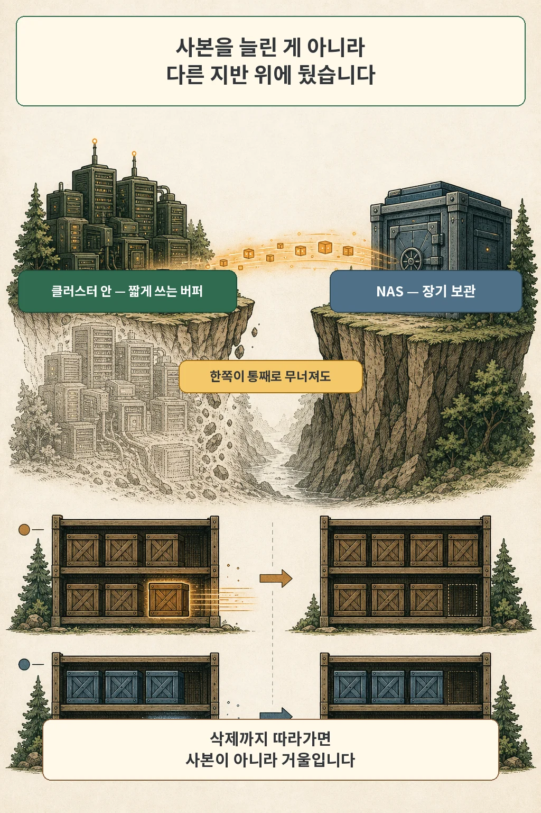
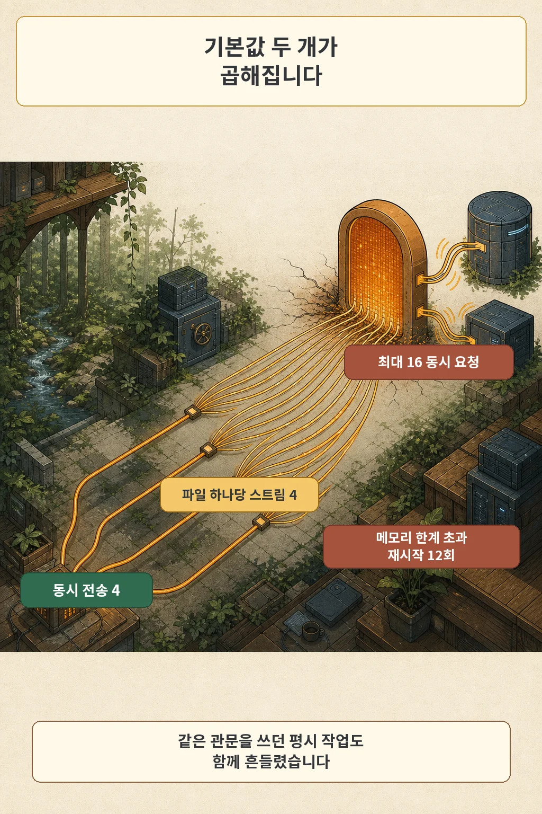
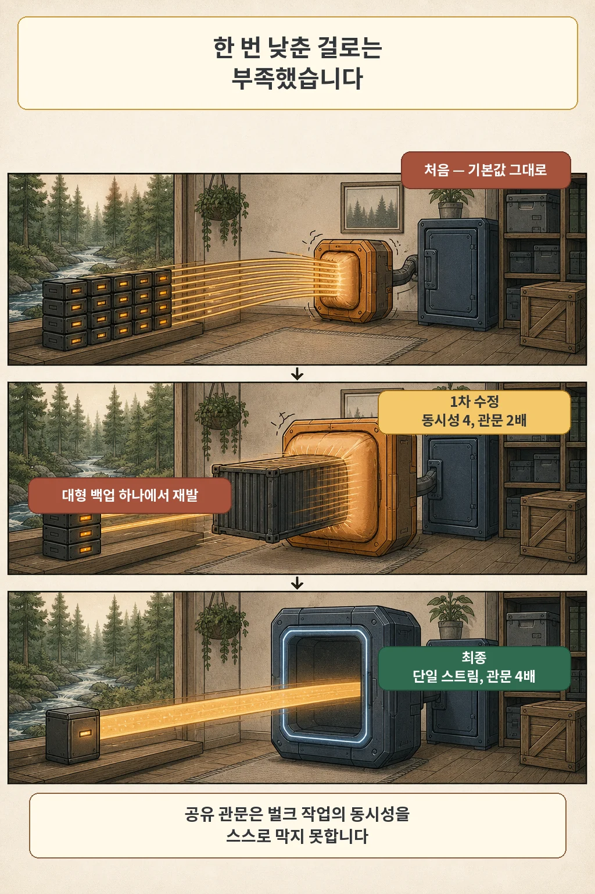

글·해설: 다메카솔

옮겨야 할 백업은 약 90GB였습니다. 2026년 7월 19일에 돌린 첫 수동 동기화는 47분 동안 아무 문제 없이 복사하다가 `connection refused`로 멈췄습니다. 끊어진 쪽은 복사하던 작업이 아니었습니다. 그 작업이 읽고 있던 인클러스터 S3 게이트웨이가 먼저 무너져 있었습니다.

> 이 글은 2026년 7월 19일 GitOps 커밋과 같은 폴더의 CronJob 매니페스트·운영 문서, 개인 인프라 변경 기록과 실패 패턴 원장을 대조해 썼습니다. 버킷 이름, 저장소 주소, NAS 경로와 계정은 공개하지 않고 역할 이름으로만 부릅니다. 게이트웨이가 대형 객체 구간에서 다시 죽은 원인은 당시 기록에 「의심」으로 남아 있고, 힙 프로파일 같은 직접 증거는 회수하지 못했습니다.

## 사본을 하나 더 두는 게 아니라, 다른 지반 위에 둡니다

이 작업이 지키려는 날은 클러스터 스토리지를 통째로 잃는 날입니다. 그때까지 백업은 인클러스터 오브젝트 스토리지 안에만 있었고, 그 저장소는 클러스터와 같은 지반 위에 서 있었습니다. 사본이 하나 더 있어도 같은 지반에 있으면 같이 무너집니다. 그래서 NAS를 두 번째 계층으로 두었습니다. 인클러스터 저장소는 짧게 쓰는 버퍼, NAS는 장기 보관입니다.



배선하기 전에 한 가지를 먼저 고쳤습니다. 운영 문서는 NAS가 장기 보관을 맡는다고 선언해 두었는데, 실제 코드는 목적지를 소스와 일치시키는 명령을 쓰고 있었습니다. 소스에서 보존 기간이 지나 지워진 백업을 다음 동기화가 NAS에서도 지운다는 뜻입니다. 그건 장기 사본이 아니라 며칠짜리 거울입니다. 삭제를 전파하지 않는 복사 명령으로 바꾸고, 대신 NAS 쪽 보존 정리를 이 작업 안으로 옮겼습니다.

보존은 경로마다 다릅니다. 최근 백업 계층은 14일, 월간 논리 덤프 계층은 400일로 두었습니다. 덤프 계층이 최근 백업 경로 **안에** 들어 있어서, 14일 정리를 걸 때 그 하위 경로를 명시적으로 빼지 않으면 400일짜리를 함께 지웁니다. 이런 종류의 실수는 실행되고 나서야 보입니다.

## 47분 뒤에 시작된 connection refused

첫 실행은 순조로웠습니다. 로그에 전송 통계가 규칙적으로 찍혔고, 그러다 47분 지점부터 `connection refused`가 나오기 시작했습니다.

여기가 오진하기 좋은 자리입니다. 자격증명이 잘못됐거나 네트워크 정책이 막고 있다고 보기 쉽습니다. 그런데 그 두 가지였다면 처음부터 실패했을 겁니다. 47분 동안 정상 복사했다는 사실이 오히려 단서였습니다. **중간부터 시작되는 접속 거절은 상대 서비스가 재시작하고 있다는 신호로 먼저 읽는 편이 빠릅니다.**

그래서 잡 로그를 더 파는 대신 상대 쪽 파드를 봤습니다.

```bash
kubectl -n <저장소 네임스페이스> get pods -l <게이트웨이 라벨>
kubectl -n <저장소 네임스페이스> get pod <게이트웨이 파드> \
  -o jsonpath='{.status.containerStatuses[0].lastState.terminated.reason}'
```

재시작 횟수가 12였고, 직전 종료 이유는 `OOMKilled`였습니다. 게이트웨이의 메모리 limit은 1Gi였습니다.



원인은 제가 정하지 않은 숫자 두 개였습니다. rclone의 `--transfers` 기본값은 4로, 파일 네 개를 동시에 옮깁니다. `--multi-thread-streams` 기본값도 4인데, 이쪽은 **파일 하나를** 네 갈래로 나눠 받는 설정입니다. 두 값이 곱해집니다. 최대 열여섯 개의 요청이 게이트웨이 한 대로 동시에 들어가고 있었습니다.

같은 게이트웨이를 조용히 쓰던 다른 소비자들도 이때 함께 흔들렸습니다. 데이터베이스 백업 아카이빙과 원격 로그 경로가 그 뒤에 있었습니다. 공유 게이트웨이는 벌크 소비자의 동시성을 스스로 막지 못합니다. 상한은 클라이언트가 정해 줘야 합니다.

## 동시성은 두 번 낮춰야 했습니다

숫자를 낮추는 일은 간단해 보였습니다. 게이트웨이 메모리를 1Gi에서 2Gi로 올리고, 클라이언트 쪽을 전송 2개 × 파일당 스트림 2개로 낮췄습니다. 최대 동시 요청이 열여섯에서 넷으로 줄었습니다.

그리고 다시 죽었습니다. 이번에는 약 22GB짜리 대형 백업 객체를 받는 구간이었습니다. 요청 수를 넷으로 줄여도 그중 하나가 아주 큰 파일을 여러 갈래로 나눠 받고 있으면 게이트웨이가 다루는 메모리는 요청 수에 비례하지 않았습니다. 당시 기록에는 파일을 분할해 받는 방식이 대형 객체의 메모리 사용을 부풀린 것으로 **의심된다**고 적어 두었습니다. 프로파일을 뜨지 않았으니 여기까지가 제가 말할 수 있는 범위입니다.



최종 구성은 가장 온화한 형태를 골랐습니다. 파일 분할을 아예 끄고 단일 스트림으로 받게 한 뒤, 게이트웨이 메모리를 4Gi로 올렸습니다.

```bash
rclone copy <소스>:<버킷> <NAS 경로>/<버킷> \
  --checksum \
  --transfers 2 \
  --multi-thread-streams 1
```

느려졌을까요. 결과적으로는 문제가 되지 않았습니다. 뒤에 적을 최종 회차의 소요 시간이 그 답입니다.

## 복사가 끝났다는 로그는 무엇을 증명할까요

복사 명령이 오류 없이 끝났다는 것은 「보낸 쪽이 실패를 보고하지 않았다」는 뜻입니다. 사본이 소스와 같다는 뜻까지는 아직 아닙니다. 그래서 이 작업은 복사와 검증을 서로 다른 컨테이너로 나눴습니다.

복사는 init 컨테이너에서 돌고, 검증은 메인 컨테이너에서 돕니다. Kubernetes에서 init 컨테이너는 앱 컨테이너보다 먼저 완료돼야 하므로, 복사가 실패하면 검증은 아예 시작되지 않습니다. 순서가 설계로 강제됩니다. 「복사는 실패했는데 검증은 통과」라는 조합이 만들어질 수 없습니다.

검증은 소스의 모든 객체를 목적지와 하나씩 맞춰 봅니다.

```bash
rclone check <소스>:<버킷> <NAS 경로>/<버킷> \
  --one-way \
  --checksum \
  --min-age 30m
```

`--one-way`는 목적지에만 있는 여분 파일을 무시합니다. 소스가 사라진 걸 목적지가 아직 갖고 있는 상태는 장기 보관 계층에서 정상이기 때문입니다. 여러 조각으로 나눠 업로드된 객체는 체크섬을 직접 비교할 수 없어 크기 대조로 넘어가는데, 해시를 확인할 수 없다는 메시지가 뜨더라도 그건 오류가 아닙니다.


`--min-age 30m`이 붙은 이유는 세 번째와 네 번째 시도에서 나왔습니다. 소스는 계속 쓰이는 라이브 버킷이라, 복사가 끝나고 검증이 도는 3분 사이에도 새 객체가 도착합니다. 검증은 방금 도착한 객체 15개를 「목적지에 없다」고 보고 잡을 실패시켰습니다. 그 시점에 기존 6,111개는 전부 정합이었습니다. 방금 도착한 것을 이번 회차에서 빼면 다음 회차 복사가 가져갑니다.

네 번의 시도는 이렇게 정리됩니다.

| 회차 | 어디서 멈췄나 | 원인 | 고친 것 |
| --- | --- | --- | --- |
| 1 | 47분 뒤 `connection refused` | 최대 16 동시 요청이 게이트웨이 메모리 상한 초과, `OOMKilled` 12회 | 게이트웨이 1Gi→2Gi, 동시성 전송 2 × 스트림 2 |
| 2 | 약 22GB 대형 객체 구간 | 2Gi에서도 재발. 파일 분할 수신이 메모리를 부풀린 것으로 의심 | 단일 스트림 수신, 게이트웨이 4Gi |
| 3 | 복사 시작 직후 | 빈 소스 가드가 정당하게 비어 있는 버킷에서 오발 | 개별 버킷은 건너뛰고, 전부 비었을 때만 자격 오류로 판정 |
| 4 | 검증 단계 | 복사와 검증 사이 3분 창에 도착한 신착 15개를 누락으로 오탐 | 검증 대상에 최소 나이 30분 조건 추가 |

네 번째를 고친 뒤 다섯 번째 회차가 완주했습니다. 데이터베이스 백업 버킷의 객체 6,094개를 하나씩 대조해 차이 0개였고, 작업 전체가 8분 2초에 끝났습니다. 이 8분은 앞선 시도들이 이미 대부분의 데이터를 올려 둔 뒤에 측정한 일일 운영 규모입니다. 90GB를 8분에 옮겼다는 뜻으로 읽으면 곤란합니다. 그날 자동 스케줄을 켰고, 2차 사본은 그때부터 매일 돌고 있습니다.

## 이 작업이 증명하지 않는 것

제가 이 작업을 믿는 근거는 로그의 마지막 줄이 아니라 「6,094개를 대조해 차이 0」이라는 줄입니다. 그리고 그 줄도 여기까지만 말해 줍니다. 소스에 있는 모든 객체가 같은 내용으로 NAS에 있다는 것까지입니다. 그 백업 파일들로 데이터베이스를 실제로 되살릴 수 있는지는 다른 질문이고, 복원 리허설이 답합니다. 두 가지를 같은 증거로 취급하면 가장 필요한 날에 틀린 걸 알게 됩니다.

이 검증에도 나중에 경계가 하나 더 붙었습니다. 2026년 8월 3일에, 잡이 보존 정리로 NAS에서 지운 객체를 검증이 「소스에 있으니 목적지에도 있어야 한다」고 단언해 실패하는 일이 있었습니다. 4,292개가 정합인데 1개가 누락으로 잡혔고, 그 1개는 이 작업이 스스로 지운 것이었습니다. 검증 범위를 최소 나이와 최대 나이 사이로 좁혀 해결했습니다. 검증이 정리와 다른 규칙을 쓰고 있으면 언젠가 서로를 고장으로 신고합니다.

공유 게이트웨이 뒤에 벌크 작업을 붙일 일이 또 생긴다면, 저라면 세 가지를 먼저 하겠습니다. 클라이언트 동시성 상한을 기본값에 맡기지 않고 명시하고, 게이트웨이 메모리 상한을 평시가 아니라 벌크 피크 기준으로 잡고, 첫 실행 동안 게이트웨이의 재시작 횟수를 함께 지켜보는 것입니다. 세 번째가 특히 싸게 먹힙니다. 저는 그걸 47분 뒤에야 봤습니다.

> 검증 환경: k3s 노드 3대, 인클러스터 S3 호환 오브젝트 스토리지 게이트웨이, NAS의 NFS export, rclone 1.74.4 컨테이너 이미지. 2026년 7월 실측입니다. 다른 게이트웨이 구현이나 스토리지 조합에서는 메모리 거동이 다를 수 있습니다.

이어지는 편에서는 노드 점검을 위해 실행한 `kubectl drain`이 단일 Vault의 PDB 앞에서 멈춘 사건과, 같은 시기 애플리케이션 복제와 스토리지 복제 수를 따로 정한 이유를 다룹니다.

## 함께 읽을 개념 글

- [NetworkPolicy가 Synced였는데, 막히는지는 따로 시험했습니다](/posts/networkpolicy-negative-test/): 같은 홈랩에서 「적용됐다」와 「집행된다」를 나눠 시험한 4편입니다.
- [RAM은 32GB인데 Airflow DAG가 계속 실패한 이유](/posts/why-homelab-kubernetes/): 이 클러스터를 왜 세웠는지, 밤에 꺼지는 NAS에 무엇이 묶여 있었는지 설명합니다.
- [애플리케이션보다 먼저 살아 있어야 한다: DB·오브젝트 스토리지 가동시간 설계](/posts/state-service-uptime-design/): 오브젝트 스토리지를 의존성 그래프 안에서 보는 방법입니다.

## 출처

- 개인 GitOps 저장소 기록: 백업 2차 사본 CronJob 활성화와 4회 시도 이력, 2026-07-19, commit `777f2d838`
- 개인 GitOps 저장소 문서: 백업 2차 사본 CronJob 매니페스트와 운영 문서(복사·검증 분리, 동시성 상한, 보존 계층, 검증 창 상한)
- 개인 인프라 변경 기록: 게이트웨이 OOM 교정과 2차 사본 가동, 2026-07-19
- 개인 인프라 실패 패턴 원장: 공유 게이트웨이 뒤 벌크 소비자, 2026-07-19
- [rclone: Global Flags](https://rclone.org/flags/)
- [rclone: Documentation — multi thread transfers](https://rclone.org/docs/)
- [rclone: rclone check](https://rclone.org/commands/rclone_check/)
- [Kubernetes: Init Containers](https://kubernetes.io/docs/concepts/workloads/pods/init-containers/)
- [Kubernetes: Resource Management for Pods and Containers](https://kubernetes.io/docs/concepts/configuration/manage-resources-containers/)

사설 주소, 내부 도메인과 호스트명, 버킷 이름, NAS 경로와 계정은 공개하지 않았습니다. 본문의 명령은 실제 값을 자리표시자로 바꾼 것입니다. 2026년 8월 4일 공식 문서를 다시 확인했습니다.

이 글의 본문과 이미지는 생성형 AI로 제작했습니다. 기획과 편집 기준은 다메카솔이 정했습니다. 만화 이미지는 텍스트 없는 원화에 결정적 레터링을 합성해 만들었습니다. 공식 로고·UI·문서 도표 등 외부 이미지 자산은 사용하지 않았습니다.
