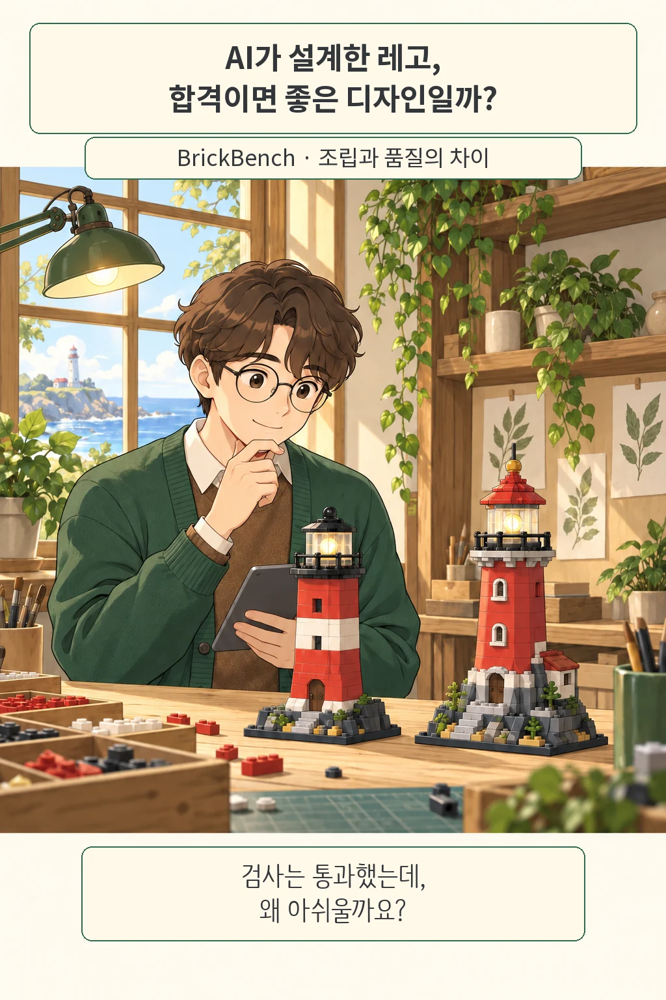
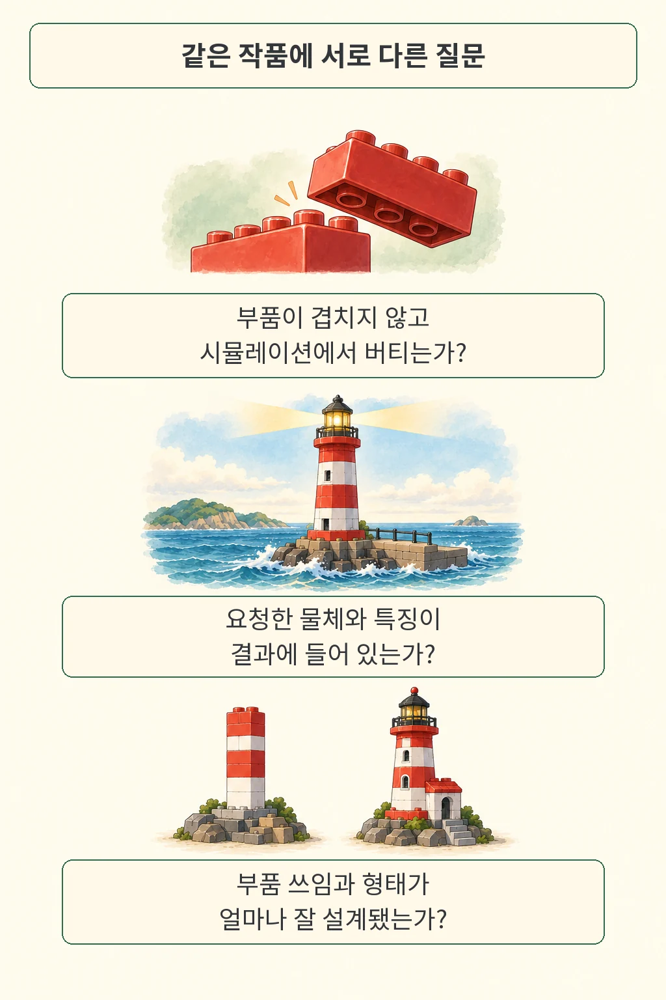
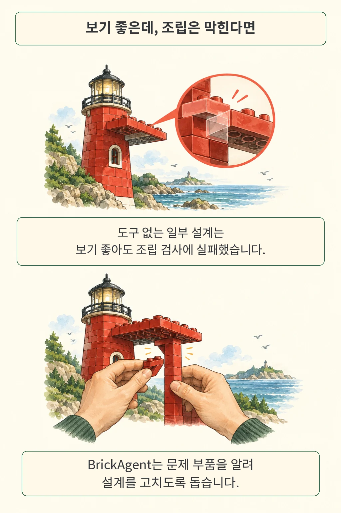
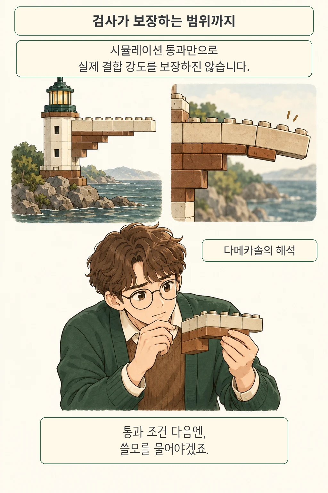

글·해설: 다메카솔

테스트는 전부 초록색인데 결과물을 열어 보면 고개가 갸웃해지는 순간이 있습니다. AI가 만든 레고 설계를 평가한 **BrickBench**는 이런 간격을 살펴봅니다. 연구진은 조립 조건을 만족하는지, 요청한 특징이 들어갔는지, 디자인이 좋은지를 따로 평가했습니다. 자동 검사를 에이전트의 완료 조건으로 삼는 개발자에게 익숙한 질문입니다.

## BrickBench는 무엇을 따로 보았을까

연구진은 300개 요청을 부품 수와 재고가 다른 세 조건에 배정했습니다. Model은 최대 400개, Set은 400~4000개, Alt-Build는 특정 세트의 부품만 쓰는 조건입니다. **조립 판정은 부품 제한·충돌·시뮬레이션 안정성을**, 요청 충족은 렌더링 이미지에 대한 문답을, 디자인은 작품 간 상대 평가를 사용했습니다.

검사마다 질문이 다릅니다. 저는 이 구분이 결과물 평가에서 유용하다고 봅니다. API 응답이 스키마를 통과했다고 업무 목적까지 달성했다고 결론 내리면, 검사하지 않은 부분까지 성공의 의미가 넓어지기 때문입니다.

## 도구를 빼자 무엇이 달라졌을까

BrickAgent는 부품을 찾고 연결하고 렌더링하는 도구와 문제 부품을 알려 주는 검사를 제공합니다. 저자들은 같은 실행 환경과 과제에서 이 도구 묶음을 제거하는 비교도 했습니다. LDraw 부품 라이브러리와 형식 설명은 남겼습니다.

| 300개 요청의 조립 검사 통과율 | BrickAgent 사용 | 도구 묶음 제거 |
| --- | --- | --- |
| GPT-6 Astra | 100% | 40% |
| GPT-5.6 Luna | 100% | 1/300 |

결과 차이가 큽니다. 이 비교에서 Astra는 high, Luna는 max 추론 설정과 요청당 최대 300턴을 사용했습니다. 특정 검사 하나의 효과만 떼어 낸 실험으로 해석할 때는 주의가 필요합니다.

흥미롭게도 도구 없는 Luna 결과는 요청 충족과 상대 평가 점수가 더 높았습니다. 보기 좋은 결과와 조립 가능한 결과가 갈라진 셈입니다. 해당 시각 평가에는 조립 검사에서 탈락한 결과도 포함됩니다. 자세한 조건은 [원문 4.4절과 표 2](https://arxiv.org/html/2610.12452v1#S5.T2)에서 확인할 수 있습니다.

## 사람 평가와 실제 조립에는 어떤 한계가 있을까

시뮬레이션은 연결된 부품을 단단한 덩어리로 취급합니다. 결합 강도나 처짐은 검사 범위 밖이므로, 통과한 설계를 실제로 만들었을 때의 안정성은 추가 검증이 필요합니다.

사람 작품 식별 실험에서는 5명이 360회 중 323회 사람 작품을 골랐습니다. 그러나 작품은 **부품 수만 맞췄고 같은 요청에 대한 설계가 아니었습니다.** 선호 투표와도 다릅니다. 나중에 추가된 Opus 5.5와 GPT-6.1 Sol은 이 사람 실험에 포함되지 않았습니다. 저자들은 디자인 격차로 해석하지만, 저는 이 수치를 보편적인 인간 우위의 비율로 쓰기보다 비교 조건과 함께 읽겠습니다.

## 다메카솔의 해석: 완료 조건을 두 층으로 설계하기

제가 에이전트의 완료 조건을 설계한다면, 자동으로 판정할 수 있는 오류부터 막고 그다음에 사용 목적을 충족했는지 살피겠습니다. 앞 단계에는 파일 형식, 참조 무결성, 실행 결과처럼 명확히 확인할 항목을 두고, 뒤 단계에는 설명의 이해도나 편집 가능성처럼 실제 사용 과정에서 드러나는 품질을 둘 수 있습니다. 이는 논문 결과를 백엔드 작업에 연결해 본 제 해석입니다.

두 단계는 서로 도와야 합니다. 오류 메시지가 실패한 대상을 구체적으로 가리키면 에이전트가 같은 결과를 무작정 다시 만드는 대신 해당 부분을 수정하기 쉬워집니다. 반대로 자동 점수만 높이는 방향으로 반복하면, 검사 항목에 없는 사용자의 불편은 그대로 남을 수 있습니다. 그래서 결과를 고치는 도구와 마지막으로 결과를 판단하는 기준을 함께 설계하는 일이 중요합니다.

이 관점은 [에이전트 평가에 실행 설정을 함께 적어야 하는 이유](/posts/agent-evaluation-system-configuration/)와도 연결됩니다. 같은 모델이라도 사용할 도구와 피드백이 달라지면 수행 과정이 달라지므로, 모델 이름 옆에 환경을 남겨야 비교가 쉬워집니다.

검사에 무엇을 넣을지는 구현 문제이면서 제품 판단입니다. 오류가 없는 결과를 얻은 뒤, 우리가 실제로 쓰고 싶어지는 결과의 기준은 누가 정해야 할까요?

## 출처와 확인 범위

- Peter Kulits, Yiqing Xu, R. Kenny Jones, Cordelia Schmid, Jiajun Wu. [BrickBench: Evaluating Agentic Brick Design, arXiv:2610.12452v1](https://arxiv.org/abs/2610.12452v1). 2026년 10월 8일 제출된 프리프린트.
- [원문 PDF](https://arxiv.org/pdf/2610.12452v1)의 평가 정의, 표 2, 사람 실험과 한계를 대조했습니다.
- [저자 프로젝트](https://www.brickben.ch)는 확인 시 403 응답으로 접근하지 못했습니다. 코드·데이터의 현재 공개 상태는 미확인이며, 모델 실행과 실제 브릭 조립을 재현하지 않았습니다.
- 만화는 개념을 설명하기 위한 창작 장면입니다. 논문의 도표나 실험 결과물을 복제하지 않았습니다.

확인·업데이트: 2026-10-09

이 글의 본문과 이미지는 생성형 AI로 제작했습니다. 기획과 편집 기준은 다메카솔이 정했습니다.
