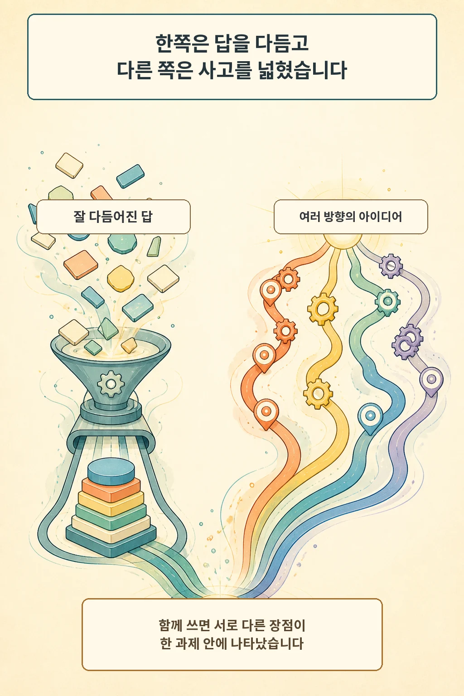
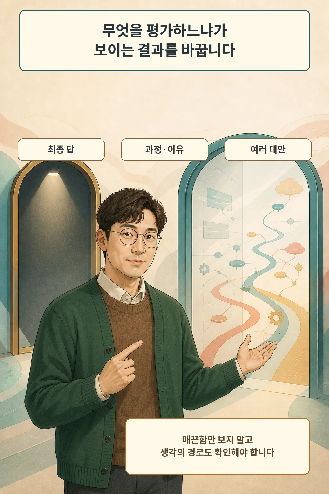

글·해설: 다메카솔

OpenAI는 2026년 8월 27일 Bocconi University 연구진 등이 수행한 무작위 대조 실험을 소개했습니다. 질문은 단순했습니다. 초보 학습자에게 ChatGPT를 주는 것과 인과추론을 훈련하는 것은 과제 결과를 어떻게 바꿀까요? 결론은 승패가 아니었습니다. 둘은 서로 다른 부분을 바꿨습니다.

## 네 조건으로 나눈 교실 실험입니다

연구진은 경제·경영·금융 전공 1학년 1,053명을 13개 수업 단위로 네 조건에 배정했습니다. 인과추론 훈련만 받은 집단, ChatGPT Edu에서 GPT-4o를 쓴 집단, 둘 다 받은 집단, 둘 다 받지 않은 집단입니다. 개인별 무작위 배정이 아니라 교실 단위 배정이었다는 점도 결과를 읽을 때 중요합니다.

참가자는 45분 동안 대학 굿즈 매장의 인지도와 이용을 높이는 추천안을 180단어 안으로 작성했습니다. 석사과정 평가자 20명이 표준 마케팅 기준으로 답을 채점했고, 연구진은 별도의 전문가 세 명이 만든 추천안과도 비교했습니다.

## ChatGPT는 표준 답의 완성도를 높였습니다

ChatGPT 접근 집단의 평가 점수는 통제집단의 추정 점수 2.09보다 5점 척도에서 0.862점 높았습니다. 답에는 더 많은 아이디어가 들어갔고 논리적 일관성이 커졌으며, 전문가 추천안과도 더 비슷해졌습니다. 연구진은 표현이 매끄러워진 효과만으로는 전체 차이를 설명할 수 없다고 보고했습니다.

다만 이것은 ChatGPT가 모든 종류의 사고를 늘렸다는 뜻이 아닙니다. 참가자 사이의 아이디어 다양성은 ChatGPT만 제공한 조건에서 뚜렷하게 늘지 않았습니다. 이 실험에서 ChatGPT가 잘한 일은 정해진 과제와 평가 기준에 맞는 아이디어를 더 많이 묶고, 일관된 답으로 만드는 쪽에 가까웠습니다.

## 인과추론 훈련은 다른 부분을 바꿨습니다

인과추론 훈련을 받은 학생은 왜 효과가 생기는지 메커니즘을 더 설명했고, 어떤 조건에서 주장이 틀릴 수 있는지 더 많이 적었습니다. 한 답 안의 아이디어와 참가자 사이의 아이디어도 더 다양해졌습니다. 그러나 이 변화는 표준 평가 점수를 높이지 못했습니다.

둘을 함께 제공했을 때는 서로 다른 장점이 한 과제 안에 나타났습니다. 논리적 일관성과 아이디어 수는 ChatGPT 접근의 효과를 보였고, 메커니즘·반증 가능성·다양성은 인과훈련의 효과를 유지했습니다. 평가 점수에서 둘을 합친 추가 보너스가 뚜렷했다고 말할 수는 없습니다.

## 평가표가 보지 않으면 결과에도 잘 안 보입니다

이 실험의 평가표는 인지도와 이용이라는 표준 목표에 얼마나 잘 답했는지를 봤습니다. 참신한 대안이나 반례를 많이 제시하는 일은 중심 보상 항목이 아니었습니다. 그러면 익숙한 정답 공간에서 벗어난 답은 오히려 점수를 얻기 어렵습니다. 연구가 드러낸 것은 사고력의 무가치가 아니라 평가 기준의 시야입니다.

학교나 조직이 AI 시대의 이해도를 보고 싶다면 최종 답만 제출하게 해서는 부족합니다. 어떤 가정을 세웠는지, 원인과 결과를 어떻게 연결했는지, 반례는 무엇인지, 여러 대안 가운데 왜 하나를 골랐는지를 함께 요구해야 합니다.

## 이 결과를 어디까지 믿을 수 있을까요?

대상은 한 유럽 대학의 1학년 학생이었고 과제는 한 번의 마케팅 추천안이었습니다. 배정은 교실 단위였고, AI는 GPT-4o였으며, 사용 준수 일부는 자기보고였습니다. 대학 이름과 사전분석 등록번호도 저자 익명성을 위해 공개하지 않았습니다. 다른 학년, 수학 문제, 장기 학습, 최신 모델에서 같은 결과가 나온다고 단정할 수 없습니다.

## 다메카솔의 해석

저는 이 연구를 “AI를 쓰면 생각하지 않는다”거나 “AI가 사고훈련보다 낫다”는 증거로 읽지 않습니다. 더 정확한 질문은 이것입니다. 우리가 좋은 답이라고 부르는 기준이 매끈한 최종물만 보는지, 아니면 여러 이유와 실패 가능성까지 보는지입니다.

AI는 답의 완성도를 빠르게 끌어올릴 수 있습니다. 인과추론 훈련은 다른 길을 찾게 할 수 있습니다. 둘을 함께 쓸 때 교육이 해야 할 일은 도구를 막는 것이 아니라, 생각의 경로가 드러나도록 과제와 평가표를 다시 설계하는 일입니다.

## 출처

- [OpenAI, Better answers, broader thinking: What students gain from ChatGPT and critical-thinking training (2026-08-27)](https://openai.com/index/what-students-gain-from-chatgpt-critical-thinking-training/)
- [Asirvatham et al., Training novices to think, or giving them LLMs? Evidence from an RCT (2026-08)](https://cdn.openai.com/pdf/novices-and-llm-august-2026.pdf)

이 글의 본문과 이미지는 생성형 AI로 제작했습니다. 기획과 편집 기준은 다메카솔이 정했습니다.
