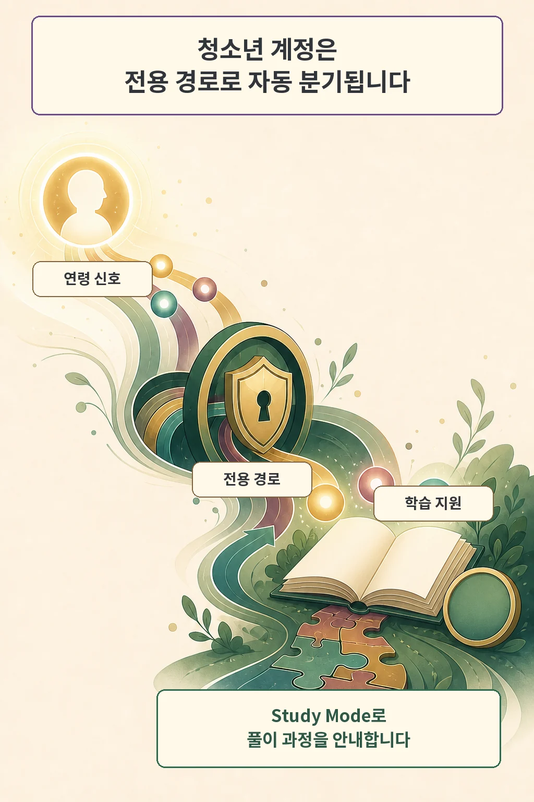
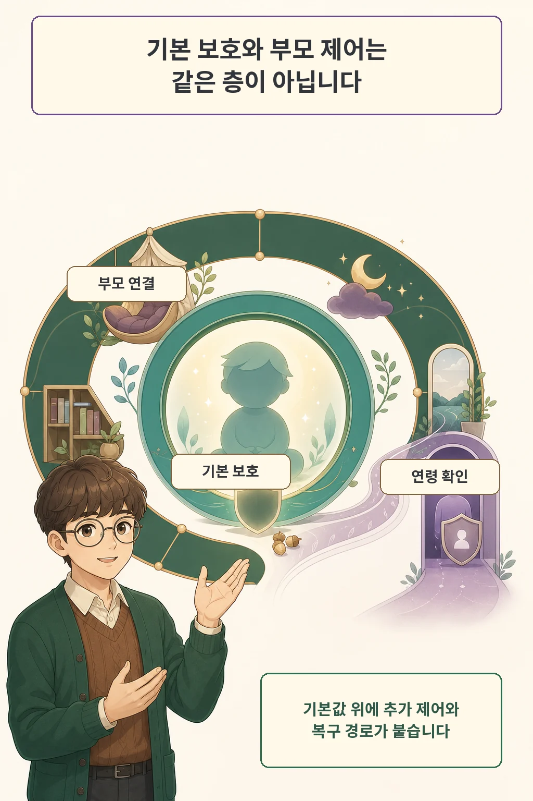

청소년용 AI를 성인용 ChatGPT에 차단 규칙 몇 개만 더한 버전으로 보면 제품 경계가 흐려집니다. OpenAI는 2026년 8월 18일 `ChatGPT for Teens`를 발표하며 자동 계정 분기, 학습 도구, 기본 보호, 부모 연결 제어를 하나의 제품 경험으로 묶었습니다.

글·해설: 다메카솔

## 청소년 계정은 전용 경로로 자동 분기됩니다

OpenAI가 발표한 첫 변화는 계정 경로입니다. 시스템이 사용자를 18세 미만으로 추정하거나 가입 과정에서 13~17세라고 밝히면 ChatGPT for Teens가 자동 적용됩니다. 부모 계정과 먼저 연결해야만 기본 보호가 시작되는 구조는 아닙니다.

적용 완료 시점은 지역마다 다릅니다. OpenAI 도움말은 연령 예측이 전 세계에 순차 적용 중이고, EU에서는 지역 요구사항 때문에 이후 몇 주에 걸쳐 적용된다고 안내합니다. 계정마다 실제 적용 여부를 확인해야 하는 이유입니다.

청소년 경로에는 `Study Mode`, 책임 있는 숙제 알림, 퀴즈, 학습 시각화, `Study Hours`가 포함됩니다. 빠른 정답을 요구하는 상황에서도 단계와 질문을 통해 풀이를 돕겠다는 것이 OpenAI의 제품 설명입니다. 이 설명은 설계 의도를 보여 주지만 모든 학습 과제에서 성과가 개선된다는 독립 검증 결과로 읽을 수는 없습니다.

## 기본 보호와 부모 제어는 서로 다른 층입니다

계정이 청소년 경로에 들어가면 고위험 영역의 연령 적합 보호가 기본 적용됩니다. OpenAI는 자해, 폭력, 섭식장애, 위험 활동, 성적·그래픽 콘텐츠를 주요 보호 영역으로 열거했습니다. 제품이 AI임을 알리는 단서와 휴식 알림도 건강한 사용을 돕는 장치로 소개했습니다.

부모 연결은 기본 보호 위에 선택 가능한 제어를 더합니다. 연결된 부모는 Quiet Hours를 정하고 음성, 메모리, 이미지 생성, 모델 개선용 데이터 사용 같은 일부 설정을 관리할 수 있습니다. 제한된 고위험 상황의 안전 알림도 이 연결에 속하며, 모든 대화 내용을 상시 공유하는 기능으로 설명되지는 않았습니다.

이 구분은 권한 설계에서 중요합니다. 청소년 안전의 최소선은 보호자 연결 여부에 기대지 않고 자동 적용하며, 가정별 사용 시간과 기능 선택은 연결된 부모에게 위임합니다. 보호와 관리 권한을 한 스위치로 합치면 연결되지 않은 계정의 기본 안전이 약해지거나 부모에게 지나치게 넓은 접근 권한을 줄 수 있습니다.

## 잘못 분류된 성인은 연령 확인으로 복구합니다

자동 분류에는 복구 절차가 함께 필요합니다. OpenAI 도움말은 18세 이상 사용자가 청소년 경험에 잘못 들어간 경우 Persona를 통한 셀피 연령 확인으로 전체 접근을 복구할 수 있다고 설명합니다. 사용자는 설정에서 보호 적용 여부를 확인하고 절차를 시작할 수 있습니다.

이 과정에도 확인할 지점이 남습니다. 연령 예측의 오분류율과 지역별 적용 완료 시점은 현재 공개 자료만으로 독립 검증할 수 없습니다. OpenAI도 보호 체계와 평가를 계속 개선하고 공개하겠다고 밝혔으므로, 실제 계정 상태와 후속 안전 평가를 따로 봐야 합니다.

## 다메카솔의 해석

저는 이번 출시의 핵심을 청소년용 화면 하나보다 세 층의 제품 구조에서 찾습니다. 첫째는 자동으로 적용되는 안전 기본값, 둘째는 부모에게 위임된 추가 제어, 셋째는 성인 오분류를 되돌리는 복구 경로입니다.

AI 제품을 운영한다면 이 세 층을 서로 다른 테스트로 검증해야 합니다. 기본 보호는 부모 연결 없이도 작동하는지, 연결 제어는 허용된 설정만 바꾸는지, 연령 확인은 필요한 사용자에게 복구 출구를 주는지 확인해야 합니다. 출시 발표가 확인한 것은 기능과 의도이며, 장기적인 학습·안전 효과는 사용 데이터와 외부 평가가 쌓인 뒤 판단할 영역입니다.

## 출처

- [OpenAI, Introducing ChatGPT for Teens: Built for learning, backed by protections (2026-08-18)](https://openai.com/index/chatgpt-for-teens/)
- [OpenAI Help Center, Age prediction in ChatGPT (2026-08-14 확인)](https://help.openai.com/en/articles/12652064-age-prediction)
- [OpenAI, Introducing parental controls (2025-09-29, 2026-07-13 갱신)](https://openai.com/index/introducing-parental-controls/)
- [OpenAI, Updating our Model Spec with teen protections (2025-12-18)](https://openai.com/index/updating-model-spec-with-teen-protections/)

이 글의 본문과 이미지는 생성형 AI로 제작했습니다. 기획과 편집 기준은 다메카솔이 정했습니다.
