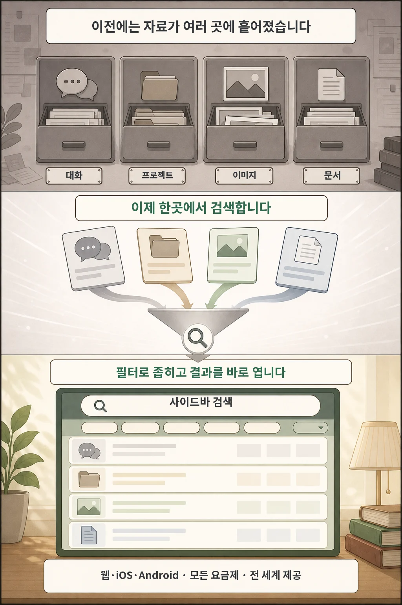

글·해설: 다메카솔

"지난달에 ChatGPT랑 나눴던 특정 아키텍처 토론이나, 분석을 맡겼던 CSV 엑셀 파일이 어느 대화방에 있었더라?"

ChatGPT를 업무에 적극적으로 쓰다 보면 사이드바의 수백 개 대화 목록을 일일이 스크롤하고 프로젝트 폴더를 뒤적이느라 시간을 허비하는 경우가 많았습니다.

OpenAI가 **ChatGPT 웹, iOS, Android 전 플랫폼에 과거 대화, 프로젝트, 이미지, 업로드 문서를 단일 창에서 빠르게 찾아주는 '통합 검색(Unified Search)'을 공식 배포**했습니다.

이번 글에서는 새로워진 통합 검색의 기능과, 외부 실시간 웹 검색과의 차이점을 정리합니다.

## 분산되어 있던 작업물이 단 하나의 검색창으로

기존에는 대화 제목 검색만 지원되어 파일이나 프로젝트 내부 컨텍스트를 찾기 어려웠습니다. 이번 업데이트를 통해 사이드바 상단 검색창에서 다음 4가지 자산을 통합 탐색할 수 있습니다:

1. **과거 대화 세션**: 대화 본문 내용 및 키워드 매칭
2. **프로젝트(Projects)**: 커스텀 지침 및 프로젝트별 작업 이력
3. **생성된 이미지**: DALL-E로 생성한 이미지 에셋
4. **문서 및 파일(Library)**: PDF, 코드, 스프레드시트 등 업로드 파일

검색창 상단의 필터 탭(`대화`, `프로젝트`, `이미지`, `문서`)을 클릭하면 원하는 파일 포맷으로 결과를 즉시 좁혀볼 수 있습니다.

## '내부 자료 검색'과 '외부 웹 검색'의 차이

두 기능 모두 '검색'이라는 이름을 쓰지만 동작 영역이 완전히 다릅니다:

| 구분 | 사이드바 통합 검색 (내부) | ChatGPT 웹 검색 (외부) |
| :--- | :--- | :--- |
| **탐색 대상** | 내가 ChatGPT 안에서 생성/업로드한 내 작업물 | 인터넷 공개 웹의 최신 뉴스, 공식 문서 |
| **동작 목적** | 이전 대화방 다시 열기, 과거 파일 찾기 | 실시간 주가, 최신 릴리스 정보 확인 |
| **주요 기능** | 콘텐츠 유형 필터, 빠른 링크 이동 | URL 출처 인용 각주 표시 |

## 다메카솔의 해석: ChatGPT를 '개인화 지식 저장소'로 활용하는 팁

ChatGPT가 단순한 일회성 챗봇을 넘어 **'개인 지식 베이스(PKM)'**로 진화하고 있습니다. 통합 검색의 효율을 극대화하려면 다음 습관을 추천합니다:

1. **대화 첫 턴에 명확한 도메인 키워드 부여**: 나중에 검색하기 쉽도록 대화 시작 시 "K8s-Ingress-디버깅"처럼 핵심 주제를 명시하세요.
2. **프로젝트 단위의 작업 격리**: 장기 프로젝트는 일반 채팅창 대신 'Projects' 기능을 활용하여 관련 파일과 지침을 한곳에 모아두면 검색과 컨텍스트 유지가 훨씬 수월해집니다.

## 출처

- [OpenAI — ChatGPT Release Notes: Search across chats, projects, and files](https://help.openai.com/en/articles/6825453-chatgpt-release-notes)
- [OpenAI — File Storage and Library in ChatGPT](https://help.openai.com/en/articles/20001052/library)

이 글의 본문과 이미지는 생성형 AI로 제작했습니다. 기획과 편집 기준은 다메카솔이 정했습니다.
