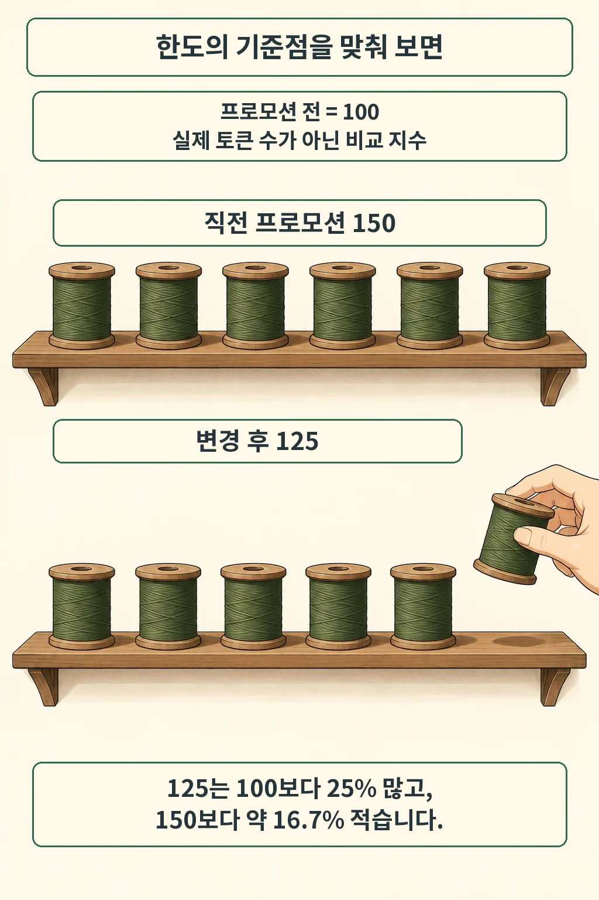
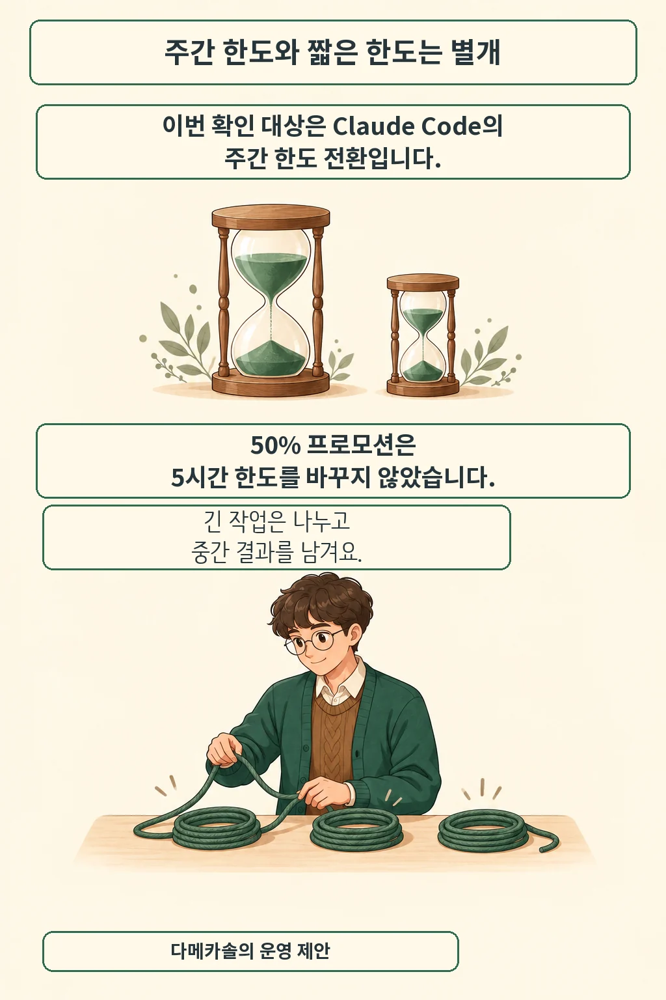

**25% 증가와 약 16.7% 감소가 동시에 맞습니다.** 비교하는 시점이 다릅니다. Anthropic [공식 도움말](https://support.claude.com/en/articles/15910845-claude-code-may-august-2026-weekly-limits-promotion)에 따르면 2026년 9월 14일부터 Claude Code 주간 한도는 프로모션 전보다 25% 높습니다. 직전의 50% 추가 프로모션과 비교하면 줄어든 셈입니다. 9월 15일 확인한 전환 내용을 정리했습니다.

글·해설: 다메카솔

Updated: 2026-09-15

## 100에서 150으로, 이제 125로

기준점을 맞추면 계산은 간단합니다. 프로모션 전 한도를 100으로 두면 직전은 150, 변경 후는 125입니다. 실제 토큰 개수를 뜻하는 숫자는 아닙니다.

| 비교 기준 | 계산 | 변화 |
| --- | --- | --- |
| 프로모션 전 | (125 − 100) ÷ 100 | 25% 증가 |
| 직전 프로모션 | (125 − 150) ÷ 150 | 약 16.7% 감소 |

공식 종료 시각은 9월 13일 오후 11시 59분 PT입니다. 한국 시각으로는 9월 14일 오후 3시 59분입니다. 새 기준 대상은 Pro, Max, Team, 좌석 기반 Enterprise입니다. 이번 글은 이미 예고된 정책의 적용 전환을 다룹니다.

## 5시간 한도와 구분해 읽기

50% 프로모션은 주간 한도에만 적용됐습니다. 도움말은 5시간 한도와 다른 Claude 제품 한도가 이 프로모션으로 바뀌지 않았다고 설명합니다. CLI의 `/usage`에서 자신의 한도를 확인하세요. 절대 토큰 할당량이나 계정별 실제 사용 가능량은 이번에 직접 시험하지 않았습니다.

## 다메카솔의 해석: 멈춘 뒤 이어 갈 수 있게

저는 긴 자동 작업의 완료 시간을 잡을 때 직전 프로모션 한도를 그대로 계산에 넣지 않겠습니다. 한 주의 총량과 짧은 시간에 쓸 수 있는 양은 서로 다른 제약입니다. 주간 여유가 보여도 한 번에 큰 작업을 밀어 넣으면 중간에 멈출 수 있습니다. 여기부터는 운영 설계에 대한 제 판단입니다.

예를 들어 여러 모듈을 고치는 작업이라면 모듈 하나의 수정과 검증이 끝날 때 변경 파일과 다음 단계를 남기겠습니다. 한도가 소진돼도 완료한 구간을 다시 읽고 만들 필요가 줄어듭니다. [에이전트 실행 구조](/posts/openai-agents-api-managed-harness/)를 고를 때도 이런 재개 지점을 보존하는지 따져 볼 만합니다. 구독 한도를 시간당 생산성으로 곧장 환산하기보다, 중단 후 복구 비용을 작게 만드는 편이 제 운영 기준입니다.

## 출처

- [Anthropic 도움말 — Claude Code 주간 한도 프로모션](https://support.claude.com/en/articles/15910845-claude-code-may-august-2026-weekly-limits-promotion): 전환 시점, 대상, 적용 범위. 2026년 9월 15일 확인. 변화율 표는 공식 수치로 계산했습니다.

이 글의 본문과 이미지는 생성형 AI로 제작했습니다. 기획과 편집 기준은 다메카솔이 정했습니다.
