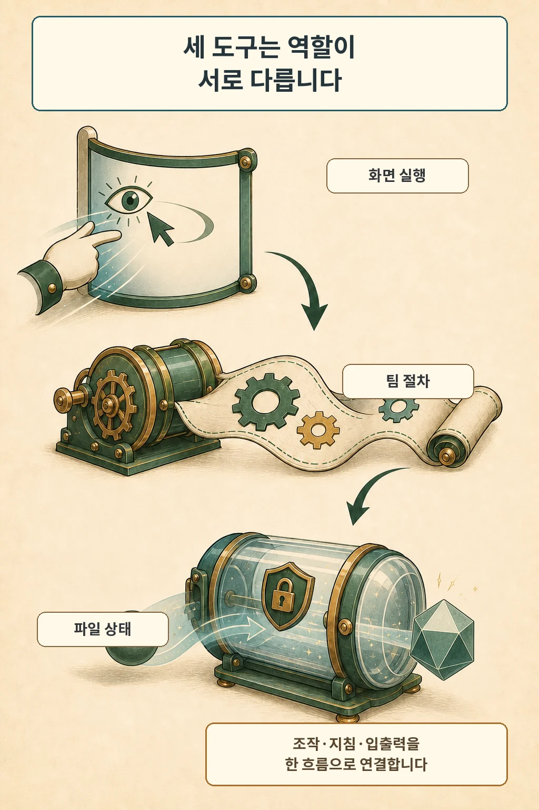

Anthropic은 2026년 8월 20일 Claude Platform의 `computer use`, `Skills API`, `Files API`를 정식 제공하고 새 `browser use` 도구를 공개했습니다. 이번 변화의 실무적 의미는 에이전트가 보이는 소프트웨어를 조작하고, 팀 절차를 불러오고, 입력과 결과 파일을 같은 작업 흐름에서 이어갈 수 있다는 데 있습니다.

글·해설: 다메카솔

## 화면 조작은 브라우저와 데스크톱으로 나뉩니다

computer use는 스크린샷을 보고 마우스와 키보드 동작을 요청하는 도구입니다. 모델이 직접 데스크톱에 접속하는 구조가 아니라, 애플리케이션이 통제하는 환경에서 각 동작을 실행한 뒤 결과를 모델에 돌려줍니다. 새 toolset은 여러 동작을 한 응답에 담을 수 있어 왕복을 줄이지만, 앞 동작이 실패하면 뒤 동작을 멈추고 결과를 정확히 되돌려야 합니다.

웹페이지 안에서 끝나는 작업에는 browser use가 더 좁은 도구입니다. 이 도구는 화면 좌표만 따라가는 대신 페이지 구조를 읽고 특정 필드나 버튼을 대상으로 삼습니다. 전체 데스크톱 환경을 열지 않아도 되는 만큼 웹 자동화의 실행 면적을 줄일 수 있습니다.

## 팀 절차와 파일 상태는 별도 구성요소입니다

Skills API는 팀의 지침, 스크립트, 템플릿을 폴더 단위로 올리고 버전 관리해 요청에 연결합니다. 작업이 필요할 때 해당 스킬을 불러와 Claude의 code execution sandbox에서 실행하므로, 절차와 모델 프롬프트를 분리해 관리할 수 있습니다.

Files API는 작업에 들어가는 자료와 작업 뒤에 나오는 산출물을 잇습니다. 한 번 업로드한 파일을 `file_id`로 여러 요청에서 참조하고, 스킬이나 code execution이 만든 결과 파일도 내려받습니다. 매 요청에 같은 문서를 다시 싣는 방식보다 파일 수명과 작업 상태를 명시적으로 다루기 쉽습니다.

세 기능을 합치면 흐름은 단순해집니다. 에이전트가 파일을 읽고, 팀 절차를 적용하고, API가 없는 웹 업무를 조작한 뒤, 확인 파일을 다시 저장하는 구조입니다. 각 구성요소의 실행 위치와 권한은 그대로 다릅니다.

## GA가 운영 책임을 없애지는 않습니다

Files API에 올린 파일은 개별 사용자나 대화가 아니라 workspace 전체에서 접근됩니다. 한 조직의 여러 고객을 다루는 서비스라면 `file_id`를 사용자 입력으로 그대로 믿지 말고, 애플리케이션이 사용자와 파일의 매핑을 보관해야 합니다. Anthropic 문서는 멀티테넌트 격리가 필요할 때 workspace를 경계로 나누라고 설명합니다.

화면 조작에는 별도의 위험이 있습니다. 웹페이지나 이미지에 숨은 지시가 원래 명령을 덮으려는 prompt injection이 생길 수 있고, 분류기 방어만으로 운영 경계를 대신할 수 없습니다. 최소 권한 VM이나 컨테이너, 제한된 인터넷 allowlist, 민감 데이터 분리, 결제나 약관 동의처럼 실질적 결과가 있는 행동의 사람 확인을 함께 설계해야 합니다.

## 플랫폼마다 제공 상태를 다시 확인해야 합니다

Claude API의 새 computer use toolset은 beta header 없이 GA입니다. 발표는 Skills API와 Files API도 Claude Platform에서 정식 제공한다고 밝혔습니다. Microsoft Foundry와 Google Cloud 같은 외부 플랫폼은 기능마다 상태와 도착 시점이 다르므로, 사용하는 배포 경로의 지원 모델과 호환성 표를 따로 확인해야 합니다.

## 다메카솔의 해석

저는 이번 발표를 ‘에이전트가 모든 것을 알아서 한다’는 변화보다 세 종류의 상태를 연결하는 제품화로 봅니다. 화면 실행은 애플리케이션이 통제하는 환경, 팀 절차는 버전이 있는 스킬, 자료와 산출물은 workspace 파일로 남습니다. 이 셋을 분리해 두면 어느 단계에서 권한이 커졌고 어느 단계가 실패했는지 추적하기가 쉬워집니다.

production agent의 준비 기준도 여기서 나옵니다. 실행 환경을 격리하고, 스킬 버전을 고정하고, 파일 소유권을 애플리케이션에서 검증하고, 실제 결과가 큰 행동에는 사람 승인을 두는 팀이 이번 GA를 안전하게 활용할 수 있습니다. 제품의 GA와 운영의 준비 완료는 서로 다른 체크포인트입니다.

## 출처

- [Anthropic, Build production agents with computer use, the Skills API, and the Files API (2026-08-20)](https://claude.com/blog/computer-use-skills-api-files-api)
- [Claude Platform Docs, Computer use tool (2026-08-21 확인)](https://platform.claude.com/docs/en/agents-and-tools/tool-use/computer-use-tool)
- [Claude Platform Docs, Agent Skills (2026-08-21 확인)](https://platform.claude.com/docs/en/agents-and-tools/agent-skills/overview)
- [Claude Platform Docs, Files API (2026-08-21 확인)](https://platform.claude.com/docs/en/build-with-claude/files)

이 글의 본문과 이미지는 생성형 AI로 제작했습니다. 기획과 편집 기준은 다메카솔이 정했습니다.
