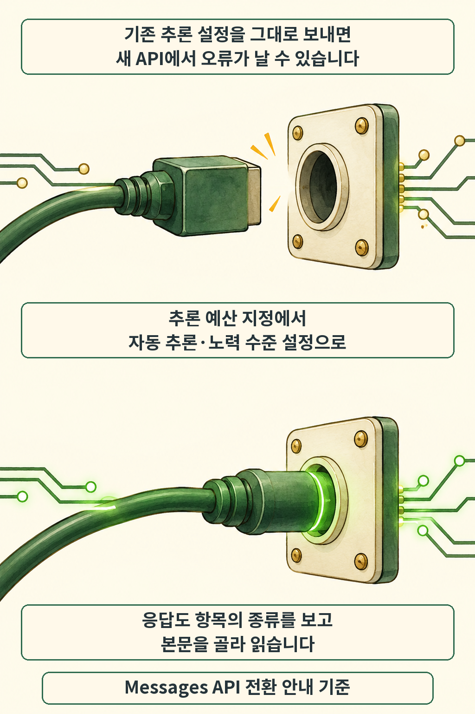

글·해설: 다메카솔

발행·확인: 2026-10-08

**Claude Haiku 5.5의 입력 가격은 짧은 프롬프트 구간에서 100만 토큰당 0.10달러부터 시작합니다.** 반복 호출이 많은 서비스라면 눈길이 갈 만한 가격입니다. Anthropic은 2026년 10월 7일 이 모델을 공개하면서 요약·분류·추출처럼 범위가 좁은 작업에 맞췄다고 설명했는데요, 기존 API를 옮길 때는 요청 설정과 토큰 계산도 함께 바뀝니다. [공식 발표](https://www.anthropic.com/claude-haiku-5-5)

## 모델을 바꾸기 전에 요청 설정부터 맞춥니다

기존 Haiku 4.5 요청에서 모델 ID만 교체하면 설정에 따라 오류가 납니다. Messages API에서 `thinking: {"type": "enabled", "budget_tokens": N}`을 보내던 코드는 `adaptive` 방식과 `output_config.effort`를 사용하는 형태로 바꿔야 한다는 안내입니다. 그림의 플러그는 이 호환성 차이를 나타내는 비유입니다. [전환 문서](https://platform.claude.com/docs/en/models/haiku-5-5/migration-guide)

응답을 읽는 부분도 대상입니다. 자동 추론이 기본으로 켜져 있어 첫 번째 응답 항목에 곧바로 답변 문자열이 올 것이라고 가정하기 어렵습니다. 문서는 항목의 `type`을 확인해 본문을 고르고, 추론 토큰도 `max_tokens`에 포함된다는 점을 고려하라고 안내합니다. 호출이 성공했는데 화면에는 답이 없는 상황까지 시험해야 하는 이유가 여기에 있습니다.

이 글은 전환 항목의 일부를 다룹니다. 샘플링 매개변수, 미리 작성한 assistant 답변으로 이어 쓰게 하는 방식, 컴퓨터 사용 도구와 대화 재생을 쓰는 서비스는 [전체 마이그레이션 목록](https://platform.claude.com/docs/en/models/haiku-5-5/migration-guide)도 대조해야 합니다. Claude Managed Agents에는 모델명 갱신 외 변경이 필요하지 않다는 별도 안내가 있습니다.

공식 문서가 열거한 제공 경로는 Claude API, Amazon Bedrock, Google Cloud, Microsoft Foundry, Claude Platform on AWS입니다. Claude API의 모델 ID는 `claude-haiku-5-5`이며, 플랫폼마다 식별자가 다를 수 있습니다. [모델 정보와 제공 경로](https://platform.claude.com/docs/en/models/haiku-5-5/overview)

## 낮은 단가를 우리 서비스 비용으로 바꾸려면

가격표는 프롬프트 길이에 따라 두 구간으로 나뉩니다. 아래는 2026년 10월 8일 확인한 공식 요금으로, 모두 미국 달러·100만 토큰 기준입니다. 입력과 출력은 각각 사용량을 계산합니다. [공식 가격표](https://platform.claude.com/docs/en/models/haiku-5-5/overview)

| 항목 | 프롬프트 10만 토큰 이하 | 프롬프트 10만 토큰 초과 |
| --- | ---: | ---: |
| 입력 | $0.10 | $0.50 |
| 출력 | $0.50 | $2.50 |
| 캐시 읽기 | $0.01 | $0.05 |

캐시 쓰기 같은 다른 비용은 별도입니다. 더 중요한 변화는 같은 글을 넣어도 토큰 수가 달라진다는 점인데요, 공식 문서는 새 토큰 분할 방식 때문에 Haiku 4.5보다 입력 토큰이 약 30% 많아지며 내용에 따라 증가폭이 다르다고 설명합니다. 기존 사용량에 새 단가만 곱하기보다 새 모델로 다시 센 사용량을 기준으로 계산해야 합니다. [토큰 재계산 안내](https://platform.claude.com/docs/en/models/haiku-5-5/migration-guide)

Anthropic이 발표한 평균 약 75% 실행 비용 절감도 이런 조건을 포함한 회사 추정입니다. 기존 Haiku 요청의 길이 분포와 모델별 토큰 사용량 변화 등을 반영한 값이므로, 개별 서비스의 절감률은 실제 요청으로 확인할 부분입니다. 주판 그림은 재계산을 설명하며 특정 절감 비율을 나타내지 않습니다. [추정 조건과 각주](https://www.anthropic.com/claude-haiku-5-5)

같은 발표에서 Sonnet 5.5의 캐시 읽기 단가는 100만 토큰당 $0.20에서 $0.10으로 내려갔습니다. Max·Team 구독자의 새 월간 API 크레딧은 이번 주 순차 제공 계획으로 소개됐습니다. 지금 발표된 모델과 앞으로 계정에 적용될 혜택의 시점은 구분해 읽어야 합니다. [추가 발표](https://www.anthropic.com/claude-haiku-5-5)

## 다메카솔의 해석: 성공한 작업 하나의 비용을 봅니다

저라면 범위가 명확한 반복 작업부터 두 모델을 나란히 시험하겠습니다. 예를 들어 문의 분류라면 같은 입력 묶음으로 분류 성공률, 재시도 횟수, 응답 시간과 최종 비용을 함께 비교하는 방식입니다. 값싼 호출이 여러 번 실패하면 성공 결과 하나를 얻는 비용은 예상과 달라질 수 있습니다. 이는 공개 자료를 바탕으로 한 설계 판단이며, 이 글에서 모델 API를 직접 실행한 결과는 포함하지 않았습니다.

복잡한 코딩 전체를 한꺼번에 맡기는 경우는 별도로 판단할 일입니다. Anthropic도 그 범위에는 Sonnet 5.5와 Opus 5.5가 더 적합하다고 설명합니다. 평가 기준을 정할 때는 [ReviewBench가 누락과 잘못된 지적을 나눠 보는 방식](/posts/github-reviewbench-code-review-evaluation/)이 참고가 됩니다. 보안 작업의 이용 범위가 궁금하다면 [CVP의 업무별 접근 등급](/posts/anthropic-cvp-three-access-tiers/)도 함께 살펴볼 수 있습니다.

이번 출시의 활용 가치는 작은 작업을 얼마나 안정적으로 끝내느냐에 달려 있다고 봅니다. 단가, 토큰 수, 실패 후 재시도를 한 계산에 담으면 우리 서비스에서의 이득이 드러납니다.

## 출처

- [Anthropic — Introducing Claude Haiku 5.5, 2026-10-07](https://www.anthropic.com/claude-haiku-5-5)
- [Claude Platform Docs — Claude Haiku 5.5 overview](https://platform.claude.com/docs/en/models/haiku-5-5/overview)
- [Claude Platform Docs — Claude Haiku 5.5 migration guide](https://platform.claude.com/docs/en/models/haiku-5-5/migration-guide)

이 글의 본문과 이미지는 생성형 AI로 제작했습니다. 기획과 편집 기준은 다메카솔이 정했습니다.
