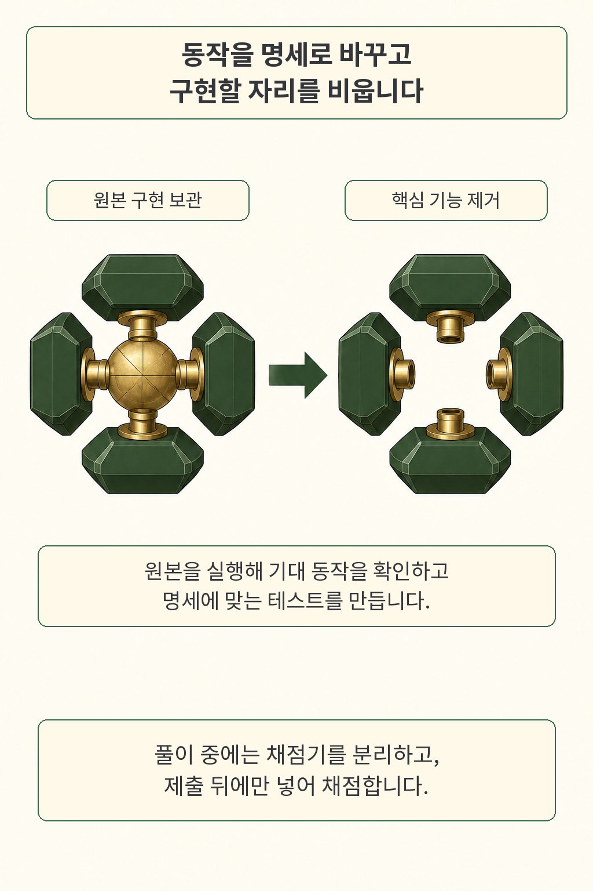
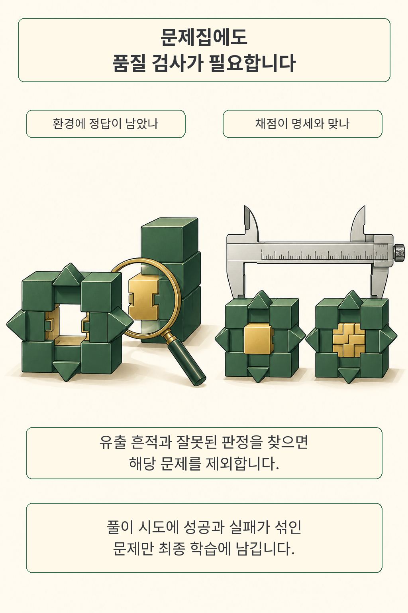
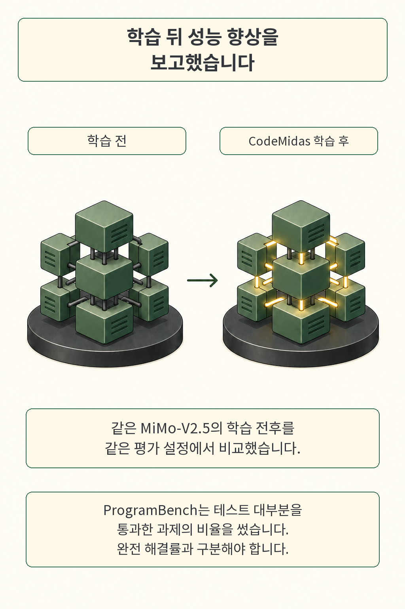

잘 돌아가는 코드에서 기능 하나를 지우면 코딩 AI의 연습문제가 될 듯합니다. 원본 구현이라는 정답도 이미 있으니까요. 그런데 다른 방식으로 올바르게 구현한 코드를 테스트가 탈락시키거나, 빌드 폴더에 남은 정답을 그대로 가져와 통과한다면 학습 신호부터 어긋납니다. **CodeMidas는 코드에서 문제를 만드는 과정에 채점과 환경 검증까지 묶은 연구입니다.**

글·해설: 다메카솔

## 코드에서 무엇을 문제로 만들까

구현을 덜어내기 전에, 외부에서 관측할 동작을 먼저 정합니다. 연구팀은 기존 코드의 공개 진입점과 의존 관계를 살펴 명세를 쓰고, 핵심 구현을 제거한 시작 환경을 구성합니다. 원본은 따로 보관해 기대 동작을 확인하는 데 씁니다. 풀이 중 채점기는 환경 밖에 두고 제출 뒤에만 넣습니다. [원문 3절](https://arxiv.org/html/2609.22068v1#S3)

여기서 명세와 구현의 경계가 중요합니다. 예를 들어 요구사항에 예외의 종류만 적혀 있다면 오류 문구까지 똑같아야 한다고 채점할 이유는 약합니다. CodeMidas에서도 명세에 없는 제약을 검사하는지 테스트를 검토합니다. 저는 이런 구분이 생성한 테스트를 읽을 때 특히 유용하다고 봅니다. 통과 조건이 촘촘해 보여도, 그 조건을 요구한 사람이 누구인지는 다시 물어야 하니까요.

만화의 블록과 측정 도구는 이 관계를 설명하려고 새로 만든 비유입니다. 실제 하드웨어 구조나 논문 도표를 옮긴 그림은 아닙니다.

## 정답이 새거나 채점이 틀린 문제를 거른다

문제 설명과 테스트를 만들었으니 바로 학습해도 될까요. 저자들은 시작 코드가 실패하고 원본 구현이 성공하는지 새 컨테이너에서 반복 확인한 뒤, 정답 유출과 채점 오류를 추가로 찾습니다. 시작 코드 두 번은 모두 실패하고 원본 네 번은 모두 성공해야 합니다. 컴파일 결과, 캐시, 설치 사본도 유출 점검 대상입니다. [3.3~3.4절](https://arxiv.org/html/2609.22068v1#S3.SS3)

또한 제출한 구현을 검토한 판단과 테스트 결과가 어긋나면 해당 문제를 제외합니다. 마지막에는 선별 모델의 풀이 시도에서 성공과 실패가 섞인 문제를 남깁니다. 이 조건은 해당 모델과 시도 예산에 묶여 있습니다. 모든 시도가 실패했다는 사실만으로 원인이 어려운 문제인지, 불완전한 명세인지 확정되지는 않습니다.

이 흐름을 사내 평가에 적용한다면 저는 실패 로그도 문제 데이터의 일부로 보관하겠습니다. 풀이를 못한 것과 환경을 못 띄운 것을 같은 실패로 합치면, 어느 쪽을 고쳐야 할지 흐려집니다. 검사할 동작·실행 환경·판정 근거를 연결해 두어야 나중에 테스트를 수정할 때 영향 범위를 추적하기도 쉽습니다. 여기부터는 운영 설계에 관한 제 해석입니다.

## 같은 모델의 학습 전후를 비교했다

연구팀은 3,185개 코드베이스에서 선별한 5,545문제로 MiMo-V2.5를 강화학습하고, 동일한 평가 설정에서 학습 전과 비교했습니다. 문제집에는 23개 언어와 15개 기술 분야가 포함됩니다. 아래는 저자가 보고한 외부 평가 결과입니다. [4절·그림 5](https://arxiv.org/html/2609.22068v1#S4)

| 평가 | 학습 전 | 학습 후 | 변화 |
| --- | ---: | ---: | ---: |
| SWE-bench Pro | 50.3% | 54.4% | +4.1%p |
| DeepSWE v1.1 | 10.0% | 21.7% | +11.7%p |
| ProgramBench | 4.5% | 21.5% | +17.0%p |
| RepoZero C2Rust | 40.5% | 51.8% | +11.3%p |
| Terminal-Bench v2.1 | 63.7% | 72.2% | +8.5%p |

ProgramBench의 변화가 눈에 띕니다. 거의 해결 단계에 도달한 과제가 늘었다는 결과입니다. **이 행은 테스트 95% 이상을 통과한 과제 비율인 Almost Solved이며, 완전 해결률과 구분해야 합니다.** 다른 행은 pass rate입니다. 변화 열은 상대 증가율이 아닌 퍼센트포인트 차이이고, 5,545는 학습 문제 수이지 이 표의 평가 분모가 아닙니다. 저자들은 공식 평가 과제 집합을 사용하고 학습 문제와의 중복을 제거했다고 보고합니다.

정제한 3,000문제만 쓴 경우에도 정제하지 않은 약 8,000문제보다 세 평가에서 점수가 높았습니다. 다만 환경 정리와 여러 필터가 함께 달라진 비교여서, 정답 유출 검사 하나가 얼마를 개선했는지는 여기서 분리하기 어렵습니다. [5.1절](https://arxiv.org/html/2609.22068v1#S5.SS1)

확인 범위도 남겨 둡니다. 이번 글에서는 원문 PDF와 원천 문서를 확인했으며 학습이나 벤치마크를 직접 재현하지 않았습니다. 2026년 9월 21일 저자 연결 프로젝트 URL은 MiMo-v2.6 학습 대시보드를 반환했고, CodeMidas 전용 구현·데이터 공개는 확인하지 못했습니다. 실험한 기반 모델은 MiMo-V2.5입니다. 다른 모델이나 실제 개발팀의 생산성으로 결과를 넓히려면 별도 근거가 필요합니다.

## 다메카솔의 해석: 채점도 검증 대상입니다

저는 이 연구에서 문제 생성량보다 **채점이 무엇을 보상하는지 점검하는 절차**를 먼저 가져오고 싶습니다. 테스트를 통과한 결과만 모으면 그 테스트가 놓친 오류는 기록에서 사라집니다. 정답 구현이 통과한다는 확인에 더해, 다른 올바른 구현도 받아들이는지와 잘못된 구현을 실제로 거르는지를 함께 살펴야 하는 이유입니다.

가령 JSON 객체의 키 순서가 요구사항에 없다면, 문자열을 그대로 비교하는 테스트는 정상 구현을 떨어뜨릴 수 있습니다. 반대로 빈 결과만 검사한다면 입력을 무시하고 빈 객체를 반환하는 코드가 통과할 수 있겠지요. 이는 원문에서 발견한 실패 사례가 아니라 제가 구성한 예시입니다. 테스트 수를 늘리는 일과 판정의 타당성을 높이는 일은 이렇게 다른 작업입니다.

원본 구현 역시 검토가 필요합니다. 원본의 결함을 기대값으로 굳히면 AI가 그 결함을 잘 재현할수록 보상을 받는 상황이 생깁니다. 저는 명세·원본·테스트 사이의 불일치를 사람이 살필 수 있게 남겨 두고, 불일치한 문제는 자동 학습 집합에서 분리하겠습니다. 그런 검토에는 비용이 들지만, 잘못된 보상을 반복해서 학습시키는 비용과 함께 비교할 만합니다.

코드 생성 과정에 검사를 붙이는 또 다른 접근은 [Generative Compilation의 컴파일러 피드백](https://blog.damecasol.com/posts/generative-compilation/)에서 읽을 수 있습니다. 그 연구가 생성 중인 프로그램의 검사 시점을 다뤘다면, 여기서는 학습 문제와 채점 기준을 만드는 쪽에 초점을 맞춥니다.

좋은 문제집에는 어떤 풀이를 정답으로 인정할지에 관한 판단이 들어갑니다. 그렇다면 명세와 원본 동작이 충돌할 때, 우리 팀은 어느 쪽을 기준으로 삼고 그 결정을 어디에 남길까요.

## 출처

- Bowen Ye 외, [CodeMidas 원문과 버전 정보](https://arxiv.org/abs/2609.22068v1), 2026년 9월 18일 제출된 v1 프리프린트.
- [원문 PDF](https://arxiv.org/pdf/2609.22068v1): 방법 3절, 평가 4절, 정제 비교 5.1절, 학습 설정 부록 A.
- [저자 연결 프로젝트 URL](https://mimo.xiaomi.com/rl/): 확인일에는 MiMo-v2.6 RL 대시보드가 표시됨. CodeMidas 구현 공개의 증거로 사용하지 않았습니다.

출처 확인·작성: 2026년 9월 21일.

이 글의 본문과 이미지는 생성형 AI로 제작했습니다. 기획과 편집 기준은 다메카솔이 정했습니다.
