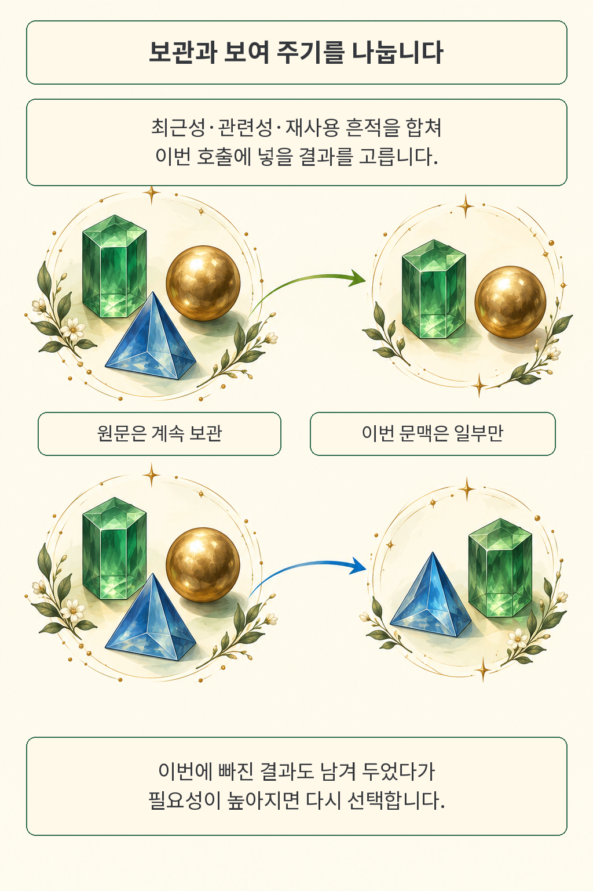

**AI 에이전트의 문맥을 줄일 때는 도구 결과를 따로 보관하고, 뒤에서 다시 쓰인 결과를 선택 후보로 남기는 방법이 있습니다.** ContextRender는 최근에 나온 정보와 현재 질문에 비슷한 정보에 더해, 실행 중 실제로 반복된 값의 흔적을 활용합니다. 방금 받은 긴 검색 결과보다 몇 단계 전에 조회한 식별자가 다음 호출에 더 중요할 수 있기 때문입니다.

*글·해설: 다메카솔*

확인·작성: 2026년 9월 30일

도구를 여러 번 호출하는 작업에서는 이 차이가 쉽게 드러납니다. 고객을 조회하고 주문을 찾은 뒤 환불 단계로 넘어가는 예를 생각해 보겠습니다. 중간 검색 결과가 길어졌다는 이유로 첫 고객 조회를 문맥에서 빼면, 다음 단계에서 필요한 고객 번호도 함께 사라질 수 있습니다. 이 예는 방법을 설명하기 위한 재구성이며 실제 서비스 장애 기록은 아닙니다.

이번에 읽은 **ContextRender: From Execution Dependencies to Agent Context**는 미시간대 Savini Kashmira, Jayanaka L. Dantanarayana, Lingjia Tang, Jason Mars가 공개한 시스템 논문입니다. 2026년 9월 29일 제출된 arXiv v1을 기준으로 방법과 실험을 읽었습니다. 제가 주목한 질문은 “얼마나 짧게 요약할까”에서 한 걸음 더 나아갑니다. **어떤 결과를 계속 보관하고, 그중 무엇을 이번 호출에 보여 줄 것인가**입니다.

## 앞선 결과가 다시 쓰였다는 흔적

첫 도구 결과에 고객 번호 `C142XYZ`가 들어 있고, 이후 모델 출력과 다른 도구 호출에서 같은 값이 등장했다고 해 보겠습니다. ContextRender의 **Tool-Flow Analysis(TFA)**는 이 사용 흔적을 그 값을 처음 담았던 도구 결과에 연결합니다. 뒤의 여러 작업에서 다시 등장한 값이라면, 그 값을 담은 결과의 선택 점수가 올라갑니다.

비슷해 보이는 문장을 찾는 과정과는 구분됩니다. 이 부분은 대소문자를 구별한 정확한 문자열 일치를 사용합니다. 원문 부록 A.2에는 구분자로 후보를 나눈 뒤 길이와 문자 조합을 검사하는 규칙이 나옵니다. 다듬은 후보가 여섯 글자 이상이어야 하고, 대문자·숫자·밑줄·하이픈·마침표 같은 조건도 만족해야 합니다. 첫 글자만 대문자인 순수 알파벳 단어는 제외하며, 경로는 슬래시로 나눠 각 조각을 검사합니다.

따라서 이 그림의 연결선은 **관찰된 값의 재등장**을 뜻합니다. 처음부터 사용자 메시지에 있던 값이 도구 결과에 다시 적힌 경우에도, 이후 반복을 그 값을 처음 담은 도구 결과에 귀속할 수 있습니다. 논문 역시 이 규칙이 값의 진짜 원산지나 인과적 의존성을 보장하지 않는다고 설명합니다. 여러 도구 결과에 공통으로 등장하는 값은 결과 수의 역수로 가중해 영향력을 낮춥니다.

그림 속 결정 모양은 결과나 값의 관계를 보여 주기 위한 시각적 비유입니다. 실제 저장 구조나 논문 실험 데이터를 복제한 도식은 아닙니다. 한 결과 안의 값 하나가 재사용되면 그 결과 전체의 점수가 올라가므로, 같이 들어 있던 다른 정보가 남는 데도 도움이 될 수 있습니다. 저자들이 이용하는 가정은 이런 정보의 묶임입니다.

## 이번에 안 보여 줘도 원문은 남습니다

보관소와 입력창을 분리하면 문맥에서 빠진 결과도 다음 호출에서 다시 고를 여지가 생깁니다. ContextRender는 메시지, 도구 호출, 결과 원문과 재사용 관계를 영속 그래프에 남깁니다. 모델 호출 전에는 세 신호를 함께 계산합니다. 얼마나 최근 결과인지, 현재 작업과 의미가 얼마나 가까운지, 이후 실행에서 얼마나 다시 쓰였는지입니다.

선택기는 이미 고른 결과와 지나치게 비슷한 항목의 점수를 낮추면서, 이력 예산에 들어가는 결과를 차례로 고릅니다. 실제 모델 입력에서는 시간 순서로 배치합니다. 이번에 제외된 결과도 저장소에는 남고, 다음 호출 때 점수를 다시 계산합니다. 그림의 파란 물체가 두 번째 장면에서 다시 선택되는 이유입니다.

기본 실험의 **6K토큰은 과거 실행 이력의 예산**입니다. 과거 사용자·모델 메시지, 관련 호출, 선택한 도구 결과 등이 여기에 들어갑니다. 시스템 프롬프트와 현재 사용자 메시지는 별도로 계산하므로 모델 입력 전체가 6K라는 의미로 읽으면 범위가 달라집니다. 개별 결과 하나가 예산보다 큰 경우에는 압축본을 사용하는 예외 경로도 있으나, 저자들은 평가 실행에서 이 경우를 관찰하지 않았다고 적었습니다.

저는 이 구조를 볼 때 복원 경로부터 확인하게 됩니다. 저장소에 원문이 있어도 선택기가 그 결과의 우선순위를 다시 높이지 못하면 모델에게는 계속 보이지 않을 수 있습니다. 보관과 복원 가능성은 출발점이고, 올바른 시점에 선택하는지는 별도의 평가 대상입니다. 물리적인 샌드박스 메모리를 줄이는 [AgentZip 연구](/posts/agentzip-sandbox-memory/)와도 대상이 다릅니다. 여기서는 모델에게 전달할 실행 이력을 고릅니다.

## 무엇을 얼마만큼 비교했나

저자들은 세 모델로 AppWorld의 Test-Normal 168과제, Test-Challenge 417과제, 8-objective QA 100과제를 평가했습니다. 모델은 GPT-4.1, Muse Glimmer 30B, DeepSeek V4 Pro이며, 과제마다 각 방법을 한 번 실행했습니다. 설정은 temperature 0, top-p 1, seed 42입니다. AppWorld에서는 작업 목표 검사 통과율인 TGC를, QA에서는 답변의 토큰 단위 F1을 보고합니다.

비교에는 최근 결과만 남기는 방법, 전체 이력을 요약하는 방법, 최근 결과와 요약을 섞는 방법, 의미 검색, ACON이 포함됩니다. 이 다섯 방법은 같은 이력 예산을 쓰며, 별도로 **전체 기록을 그대로 넣는 Full history**를 비교 기준으로 둡니다. 표의 성능은 전체 평가 과제에서 계산한 값입니다.

원문 표 6의 GPT-4.1 결과를 과제별로 풀어 쓰면 차이가 드러납니다. 아래 화살표는 모두 **전체 기록(Full history) → ContextRender** 순서입니다. 비용은 표준화한 평균 추론비용이며, 단위는 원문의 `reference USD`입니다.

- **Normal**: 작업 목표 통과율 TGC는 **77.4% → 75.6%**, 평균비용은 **0.177 → 0.120**입니다.
- **Challenge**: TGC는 **51.1% → 55.4%**, 평균비용은 **0.302 → 0.215**입니다.
- **QA**: 토큰 단위 F1은 **50.8% → 53.1%**, 평균비용은 **0.167 → 0.150**입니다.

Normal에서는 평균비용이 줄어든 대신 TGC가 1.8%포인트 낮아졌습니다. 더 적은 문맥으로 얻는 이득 옆에 놓치게 된 과제도 함께 보입니다. 전체 세 모델·세 과제 조합에서는 Full history 대비 표준화 평균비용이 10.2~32.2% 낮았고, 성능은 아홉 조합 중 일곱 조합에서 높았습니다. 나머지 두 조합은 GPT-4.1 Normal과 DeepSeek V4 Pro Challenge입니다.

다른 예산형 방법과 비교할 때도 성능과 비용을 따로 봐야 합니다. 예를 들어 DeepSeek V4 Pro의 Challenge에서는 의미 검색보다 TGC가 상대적으로 13.6% 높지만 비용도 11.7% 높았습니다. 여기의 상대 백분율과 앞 문단의 %포인트는 계산 기준이 다릅니다.

## 비용과 재사용 지표가 말해 주는 범위

비용 비교 대상은 전체 기록 기준 실행에서 이력이 6K를 넘겨 문맥 관리가 필요한 것으로 분류된 고정 과제 집합입니다. 같은 모델·벤치마크 안에서 모든 방법을 그 과제들로 비교했고, 성공과 실패 실행을 모두 평균에 넣었습니다. 성능의 분모인 전체 과제와 비용의 대상 집합이 다르다는 점이 중요합니다.

저자들은 모델 호출, 요약·압축 호출, 임베딩 호출의 토큰을 공통 단가로 환산했습니다. 입력·캐시 입력·출력·임베딩은 각각 백만 토큰당 2·0.5·8·0.13달러를 적용하며, 캐시 비율은 해당 모델·벤치마크의 Full history에서 관찰한 값을 모든 방법에 공통으로 사용합니다. 그래프 저장 비용과 로컬 선택 연산은 이 계산에서 빠집니다. 그래서 이 숫자로 특정 공급자의 청구액이나 전체 운영비 절감률을 예측하기는 어렵습니다.

재사용 신호 자체를 살펴본 비교도 있습니다. GPT-4.1과 6K 예산에서 최근성·관련성만 쓴 선택기에 재사용을 더하자, Normal TGC는 72.6에서 75.6으로, QA F1은 50.8에서 53.1로 높아졌습니다. 같은 표에서 나중에 다시 쓰인 결과의 원문이 문맥에 있었던 비율은 AppWorld 61.6→87.2%, QA 76.1→91.0%였습니다.

이 원문 가용성 지표는 Full history의 실행 기록을 고정해 선택기를 비교한 값입니다. 평가용 문자열 규칙과 운영 TFA의 규칙도 다릅니다. 평가에서는 값이 대화 전체에서 처음 등장한 곳이 도구 결과여야 하는 등 별도 조건을 씁니다. 따라서 이 수치는 정해진 반복 사건에서 결과를 얼마나 잘 보여 줬는지에 관한 근거이며, TFA가 실제 의존성을 얼마나 정확히 검출하는지의 정답률로 읽을 수는 없습니다.

## 다메카솔의 해석: 선택 이유가 남는 문맥 관리

저라면 이 방법을 도입하기 전에, 우리 도구 결과에서 식별자가 어떤 형태로 반복되는지부터 측정하겠습니다. 안정된 고객 번호나 파일 이름이 자주 이어지는 작업에서는 재사용 신호를 관찰하기 쉽습니다. 반대로 자연어를 바꿔 설명하거나 같은 대상을 다른 값으로 표현하는 작업에서는 정확한 문자열 일치가 놓치는 부분이 커질 수 있습니다. 이 구분은 논문의 일치 규칙에서 출발한 제 해석입니다.

운영 설계에서는 **원문 보존, 선택 이유, 실제 입력**을 함께 남기는 쪽에 무게를 두겠습니다. 어떤 결과를 저장했는지만으로는 장애를 재구성하기 어렵습니다. 실패한 호출에 무엇을 보여 줬는지와 어떤 점수 때문에 다른 결과를 뺐는지가 남아야 선택 정책을 비교할 수 있습니다. 원문 저장을 확대하면 보존 기간과 접근 권한도 함께 설계해야 합니다. 이런 관측 가능성과 보존 정책의 효과를 이 논문이 실험으로 증명한 것은 아니며, 시스템 구조에서 제가 도출한 운영 과제입니다.

현재 단계의 근거도 선명하게 구분합니다. 논문은 다섯 런타임의 연결 지점을 소개하지만, opencode는 통합만, OpenClaw는 간단한 정상 동작 점검, Meta ARE는 통합 확인으로 표시했습니다. 주요 성능 평가는 AppWorld와 ACON 에이전트를 사용합니다. 모델 입력을 가로채거나 수정할 연결점이 없는 런타임까지 자동으로 호환된다는 주장은 없습니다.

2026년 9월 30일 확인한 원문과 arXiv 링크, 제목 검색에서는 제가 검증할 수 있는 ContextRender 공식 코드·평가 데이터 배포를 확보하지 못했습니다. 연구실 프로젝트 소개는 검색 결과에서 확인했으나 직접 열기는 403으로 제한됐습니다. 이 글은 원문 대조와 표의 수치 확인을 바탕으로 작성했으며, 모델 실험을 독립 재현했다는 보고가 아닙니다.

다음 실험은 작게 시작해도 됩니다. 도구 결과 원문을 보관한 한 실행 기록에서, 최근성만으로 골랐을 때와 재사용을 더했을 때 어떤 결과가 빠지는지 비교해 보는 것입니다. [조사 단계까지 맞춰 장애 기록을 검색하는 RAFT](/posts/raft-stateful-troubleshooting/)가 검색 시점의 상태를 강조했다면, 여기서는 앞선 정보가 실행 중 어떻게 다시 쓰였는지를 질문하게 됩니다.

## 출처

- [ContextRender arXiv v1 및 서지 정보](https://arxiv.org/abs/2609.37743v1): 제출 2026-09-29 14:57 UTC, 확인 2026-09-30.
- [원문 PDF v1](https://arxiv.org/pdf/2609.37743v1): 방법 §3, 실험 §4, 표 1·2·6~9, 부록 A~D. CC BY 4.0. 원문 도표를 복제하지 않고 의미를 새로 그렸습니다.
- [원문 HTML v1](https://arxiv.org/html/2609.37743v1): PDF의 방법·조건·표와 대조했습니다.

이 글의 본문과 이미지는 생성형 AI로 제작했습니다. 기획과 편집 기준은 다메카솔이 정했습니다.
논문의 주장과 다메카솔의 해석을 구분해 읽어 주세요.
