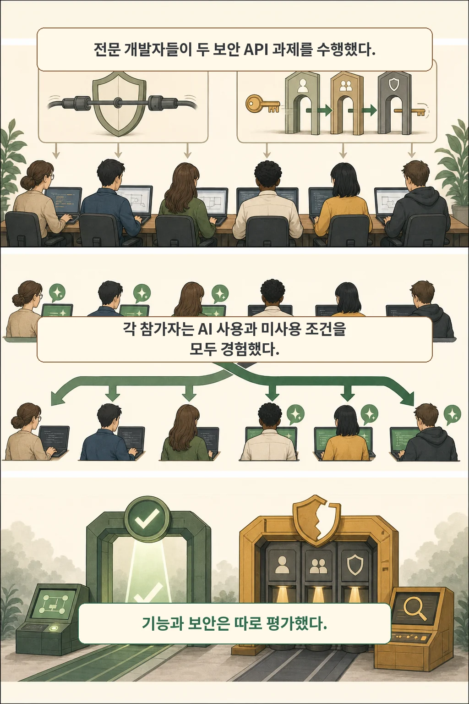
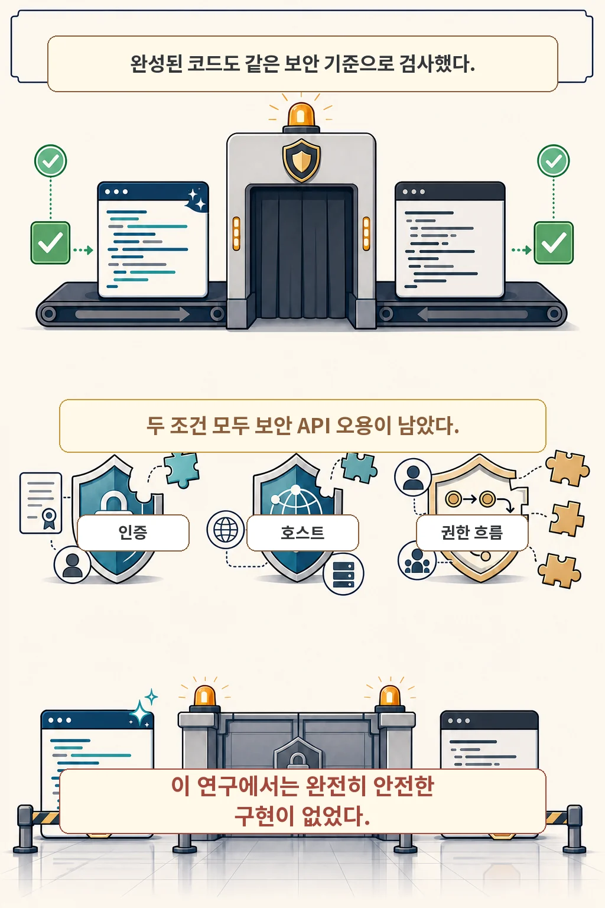
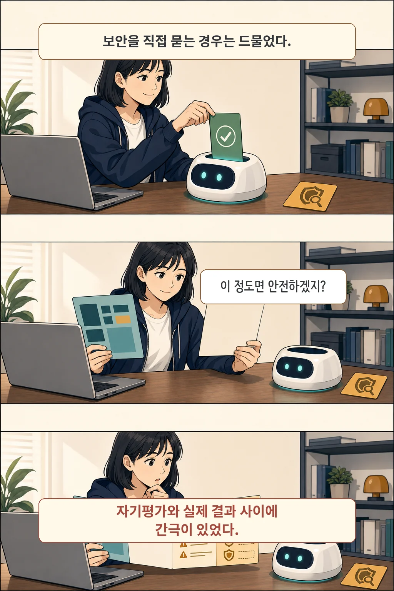

AI 코딩 도우미는 복잡한 인증 코드를 더 빨리 완성하게 도울 수 있습니다. 하지만 **기능 테스트를 통과했다는 사실이 보안 API까지 안전하게 사용했다는 증거는 아닙니다.** 2026년 7월 13일 공개된 실증 연구는 이 둘을 따로 측정했고, 기능 결과와 보안 결과가 뚜렷하게 갈릴 수 있음을 보여 줍니다.

글·해설: 다메카솔

## 먼저 결론

- 44명의 전문 개발자가 Java의 JSSE와 Google OAuth 과제를 수행했습니다.
- Copilot은 더 복잡한 OAuth 과제의 **기능 완료율과 완료 시간**을 개선했습니다.
- 그러나 연구가 정한 보안 기준에서는 **완전히 안전한 구현이 하나도 없었습니다.**
- 보안을 다시 검토하라고 프롬프트하자 일부 문제는 나아졌지만, 복잡한 OAuth 문제는 여전히 남았습니다.

이 결과는 AI 코딩 도우미를 쓰지 말라는 뜻이 아닙니다. AI가 만든 코드도 기능 테스트와 별도로, 해당 API의 보안 기준으로 다시 확인해야 한다는 뜻입니다.

## 보안 API란 무엇인가

보안 API는 인증서 확인, 암호화 통신, 로그인과 권한 위임처럼 보안에 직접 영향을 주는 기능을 제공하는 인터페이스입니다. 이 연구는 두 가지를 골랐습니다.

- **JSSE(Java Secure Socket Extension)**: Java에서 TLS 통신과 인증서 검증을 다루는 API입니다.
- **Google OAuth**: 사용자가 비밀번호를 직접 넘기지 않고 다른 서비스에 제한된 권한을 위임하는 흐름입니다.

둘 다 코드를 실행하는 것만으로는 충분하지 않습니다. 인증서나 호스트를 제대로 확인하지 않거나, OAuth의 요청·응답을 묶는 보호 장치를 빠뜨려도 겉으로는 로그인과 통신이 동작할 수 있기 때문입니다.

## 연구는 어떻게 비교했나

저자들은 Java 경력 1년 이상인 전문 개발자 44명을 모집했습니다. 참가자마다 JSSE 과제와 Google OAuth 과제를 하나씩 수행하되, 한 과제에서는 Copilot을 사용하고 다른 과제에서는 사용하지 않았습니다. 과제 순서와 Copilot 조건은 네 그룹으로 나눠 상쇄했습니다. 따라서 서로 다른 두 집단을 단순 비교한 실험이 아니라, 각 참가자가 두 조건을 모두 경험하는 참가자 내 설계입니다.

과제당 Copilot 사용 조건 22명, 미사용 조건 22명이 배정됐습니다. 실험 환경은 Ubuntu 20.04, VS Code, GitHub Copilot v1.250.0과 GPT-4o였고, 두 과제에 주어진 시간은 합계 2시간이었습니다.

이 조건은 해석의 경계이기도 합니다. 현재 버전의 모든 Copilot, 다른 모델, 다른 언어와 모든 현업 프로젝트에 그대로 적용할 수 있는 실험은 아닙니다.

## 기능 결과: 복잡한 과제에서는 도움이 컸다

먼저 기능만 보면 AI 보조의 이점이 확인됩니다.

| 과제 | Copilot 사용 | Copilot 미사용 | 비교 기준 |
| --- | --- | --- | --- |
| JSSE 기능 완료 | 22/22, 평균 14분 | 22/22, 평균 26분 | 두 조건 모두 완료, 평균 시간 차이 |
| OAuth 기능 완료 | 20/22(91%), 평균 23분 | 10/22(45%), 평균 62분 | 완료율과 평균 시간 차이 |

OAuth 기능 결과에 대한 회귀분석에서 Copilot 조건의 효과는 통계적으로 유의했습니다(`p=0.007`). 즉, 이 실험의 복잡한 OAuth 과제에서는 Copilot 사용이 기능 완성과 연관됐습니다. 다만 이 표는 **기능 결과**이며, 다음의 보안 평가를 대신하지 않습니다.

## 보안 결과: 작동해도 오용은 남았다

연구진은 구현을 별도의 보안 API 오용 기준으로 검토했습니다. JSSE에서는 3종, OAuth에서는 6종의 오용 유형을 확인했습니다. Copilot 조건에서 일부 오용 빈도가 조금 낮아진 경우는 있었지만, 오용 유형에 대한 통계적으로 유의한 효과는 나타나지 않았습니다.

특히 OAuth 구현에서는 두 조건 모두 다음 보호 장치를 빠뜨렸습니다.

- 요청과 응답을 연결해 위조를 막는 `state` 매개변수
- 통신 상대인 서비스 제공자에 대한 인증
- 인증 코드 탈취 위험을 줄이는 PKCE

보안 평가에 포함된 구현 가운데 연구가 정한 두 과제의 기준을 모두 만족한 완전히 안전한 구현은 없었습니다. 이것은 모든 AI 생성 코드가 불안전하다는 보편 명제가 아닙니다. **이 도구 버전, 두 API 과제, 이 표본과 평가 기준에서 나온 결과**입니다.

## 개발자는 보안 문제를 얼마나 알아챘나

참가자들은 보안도 평가 대상이라는 사실을 미리 알고 있었습니다. 그런데 Copilot 대화에서 의도적으로 보안 문제를 제기한 참가자는 44명 중 2명이었습니다. 보안 관련 단어를 쓴 참가자는 7명이었지만, 그중 5명은 과제 문구를 그대로 복사한 경우였습니다.

또한 완전히 안전한 구현이 없었는데도 대부분은 자신의 구현이 안전하다고 답했습니다. 연구는 모델의 제안뿐 아니라 개발자의 자기평가도 실제 보안 검토와 어긋날 수 있음을 보여 줍니다.

## “보안도 확인해 줘”라고 다시 물으면 충분할까

연구진은 사후 분석으로 38개의 Copilot 대화에 보안 모범 사례를 기준으로 다시 검토하라는 프롬프트를 추가했습니다. 그 결과 일부 JSSE 오용은 수정되거나 경고됐습니다. 하지만 OAuth의 여러 오용은 여전히 수정되지도, 문제로 지적되지도 않았습니다.

따라서 보안을 명시적으로 묻는 것은 유용한 첫 단계일 수 있지만 보증은 아닙니다. 재프롬프트 결과도 원래 참가자가 수행한 실험 결과가 아니라 연구진의 후속 분석이라는 점을 구분해야 합니다.

## 다메카솔의 실무 해석

다음 세 단계는 논문이 효과를 검증한 새로운 방법론이 아니라, 연구 결과를 팀의 코드 검토 절차로 바꾼 **다메카솔의 해석**입니다.

1. **보안을 요구사항에 명시합니다.** “구현해 줘”에서 끝내지 말고, 인증서·호스트·리디렉션·토큰·권한 범위처럼 검토할 보안 조건을 적습니다.
2. **기능 테스트와 보안 검증을 분리합니다.** 실행 성공, 테스트 통과, OAuth 로그인 성공을 보안 통과로 취급하지 않습니다.
3. **사람과 도구로 다시 확인합니다.** API 공식 체크리스트, 정적 분석과 테스트, 위협 모델, 동료 리뷰를 조합하고 AI의 자기검토만으로 종료하지 않습니다.

핵심은 AI 코딩 도우미의 생산성 이점을 버리는 것이 아니라, 그 이점이 보안 보증으로 오해되지 않도록 별도 게이트를 두는 것입니다.

## 연구의 한계

- GitHub Copilot v1.250.0과 GPT-4o 한 조합을 사용했습니다.
- Java의 JSSE와 Google OAuth 두 과제만 다뤘습니다.
- Freelancer에서 모집한 전문 개발자 44명의 통제 실험입니다.
- 두 과제를 합쳐 2시간인 짧은 과제였으며 장기 유지보수와 팀 협업은 평가하지 않았습니다.
- 구현은 수동 검토했으며 두 검토자의 일치도는 높았지만(`κ=0.97`), 다른 평가 기준이 같은 결과를 낸다고 단정할 수 없습니다.

따라서 이 논문은 AI 코딩 도우미가 모든 상황에서 보안을 악화시킨다고 증명하지 않습니다. 더 정확한 결론은 **기능상의 도움과 보안상의 안전을 따로 측정해야 한다**는 것입니다.

## 논문 정보와 출처

| 항목 | 내용 |
| --- | --- |
| 제목 | Understanding the Impact of AI Code Assistants on Security API Usage: An Empirical Study |
| 저자 | Zahra Mousavi, Chadni Islam, M. Ali Babar, Alsharif Abuadbba, Kristen Moore |
| 공개 | arXiv v1, 2026-07-13 |
| 상태 | arXiv 메타데이터상 RAID 2026 채택 |

- [논문 원문과 메타데이터 — arXiv:2607.11348](https://arxiv.org/abs/2607.11348)
- [RAID 2026 Call for Papers](https://raid2026.org/call.html)

이 글의 만화 이미지는 AI로 생성했습니다.
