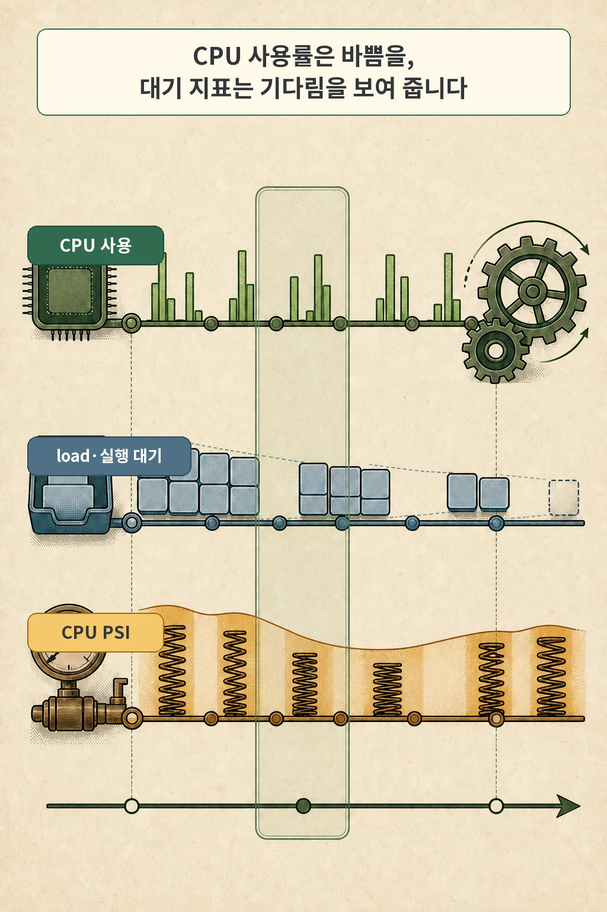
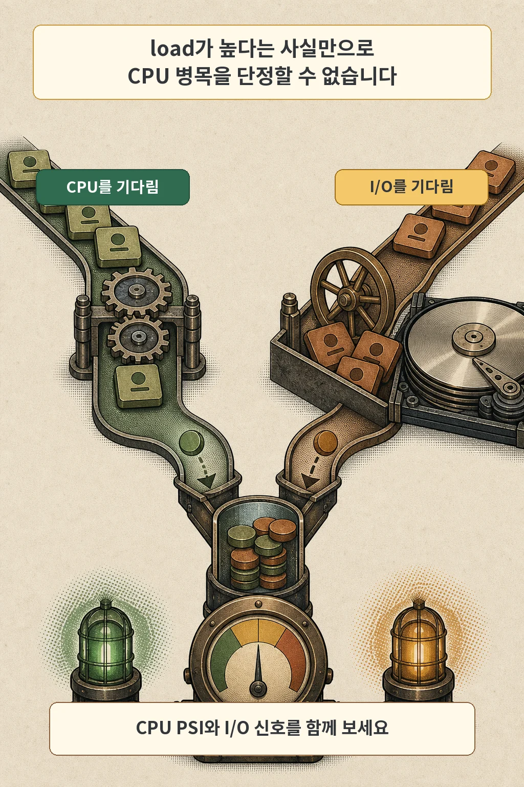
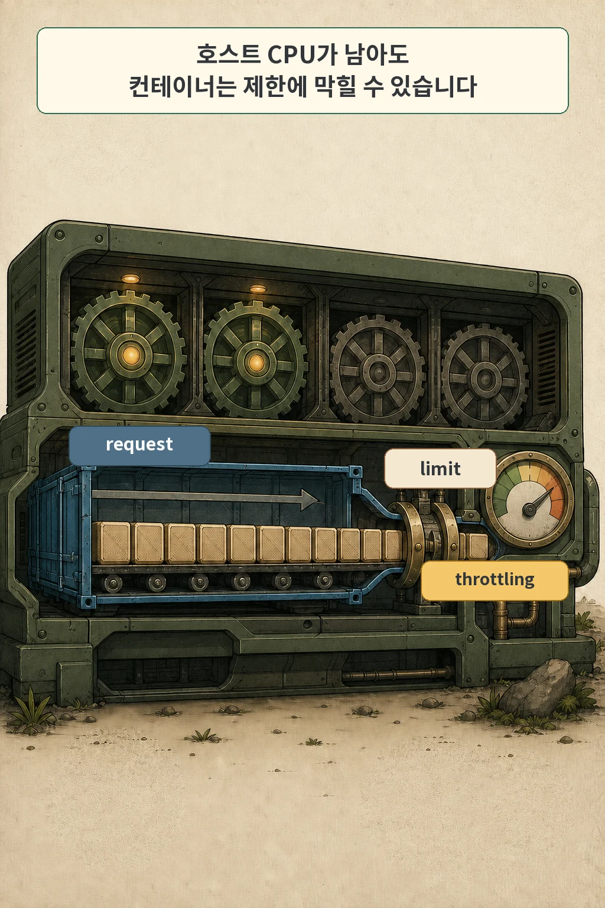

Synology NAS에 학습용 k3s를 올려 쓰던 때, 32GB RAM은 제게 꽤 강한 안심 신호였습니다. 대시보드에 남는 메모리가 보이면 서버 전체에도 여유가 있다고 생각했습니다. 그런데 Airflow DAG는 반복해서 실패했고 실제 작업은 끝까지 가지 못했습니다. 당시 운영 기록에 남은 제약은 RAM이 아니라 부족한 CPU 코어였습니다.

그 뒤로 저는 메모리 그래프 하나만 보고 장비가 충분하다고 판단하지 않습니다. **남는 RAM은 메모리 용량에 여유가 있다는 뜻이지, CPU가 작업을 제때 처리하거나 실행 대기열이 짧다는 뜻은 아닙니다.** 같은 시간대의 실행 대기, pressure, 컨테이너 throttling, 실제 동시 실행 수를 나란히 놓아야 CPU 병목 가설을 검증할 수 있습니다.

글·해설: 다메카솔

> 당시 NAS 모델, 실제 CPU 코어 수, Airflow 설정값과 오류 로그는 회수하지 못했습니다. 32GB RAM과 CPU 코어 부족이라는 작성자 경험은 확인했지만, 아래 절차를 과거의 특정 DAG 오류를 사후 증명한 결과로 읽어서는 안 됩니다. 지금 환경에서 원인을 다시 검증하기 위한 진단법입니다.

## RAM 여유와 CPU 여유는 왜 다른가


메모리는 실행 중인 코드와 데이터를 담는 공간입니다. CPU는 준비된 일을 시간 조각으로 나눠 처리합니다. 창고가 넓다고 출하구의 처리 속도까지 빨라지지 않듯, `available memory`가 많아도 실행할 task가 CPU 코어보다 빠르게 늘면 기다리는 일이 생깁니다.

반대 상황도 가능합니다. CPU가 한가로워 보여도 프로세스가 디스크나 네트워크 응답을 기다리면 서비스는 느립니다.

그래서 “RAM이 남는다” 다음 질문은 “그럼 CPU인가?”가 아니라 “작업은 지금 어디에서 기다리는가?”여야 합니다.

성능 문제를 세 문장으로 나누면 관측 지점이 선명해집니다.

| 질문 | 먼저 볼 신호 | 이 신호만으로 모르는 것 |
| --- | --- | --- |
| 메모리를 다 쓰고 있는가? | available memory, working set, swap, OOM | CPU 대기와 처리 진척 |
| CPU가 얼마나 일했는가? | CPU 사용률, 사용한 core 수 | 실행 기회를 기다린 시간 |
| 작업이 어디에서 기다리는가? | load, 실행 대기, CPU·I/O PSI, throttling | 애플리케이션이 유용한 진척을 냈는지 |

## CPU 사용률과 실행 대기를 같은 시간대에 놓기



CPU 사용률은 관측 구간에 CPU가 실제로 일한 비율입니다. Kubernetes Metrics API의 CPU 값도 커널의 누적 CPU 카운터를 일정 시간 구간의 평균으로 계산합니다.

순간 최고값이 아니라 `window` 안의 평균이라는 점을 기억해야 합니다.

`load average`는 다른 질문에 답합니다. `/proc/loadavg`의 앞 세 값은 1분, 5분, 15분 평균이고, 네 번째 필드의 슬래시 앞 값은 현재 실행 중이거나 실행 대기 중인 프로세스 수입니다. 예를 들어 출력 형식은 아래처럼 생겼습니다. 숫자 자체는 환경마다 달라집니다.

```text
0.61 0.61 0.55 3/828 22084
```

여기서 흔한 실수는 첫 숫자를 CPU 사용률처럼 읽거나, 코어 수로 나눈 값에 보편적인 합격선을 붙이는 것입니다. load는 실행 가능한 작업뿐 아니라 Linux에서 일부 중단 불가능 대기의 영향도 받습니다. 디스크 I/O가 막힌 시스템에서도 load가 높아질 수 있으므로 단독 판정표로 쓰면 안 됩니다.

PSI(Pressure Stall Information)는 “자원이 바빠서 작업이 실제로 얼마나 멈춰 있었는가”를 보완합니다. Linux는 `/proc/pressure/cpu`, `/proc/pressure/memory`, `/proc/pressure/io`에 최근 10초·60초·300초 평균과 누적 stall 시간을 제공합니다. `some`은 적어도 일부 task가 해당 자원 때문에 멈춰 있던 시간 비율입니다.

```bash
uptime
cat /proc/loadavg
cat /proc/pressure/cpu
cat /proc/pressure/io
```

위 네 결과는 한 번 찍고 끝내기보다 문제 작업의 시작·혼잡·종료 구간에 반복해서 남기는 편이 낫습니다. CPU 사용률과 CPU pressure가 함께 오르고 실행 대기가 길어지는지, 아니면 I/O pressure 쪽이 더 크게 움직이는지 비교할 수 있기 때문입니다.

## load가 높으면 CPU 병목인가



load가 높다는 사실은 시스템에 처리되지 못한 일이 있다는 경고이지 원인명은 아닙니다. CPU를 쓰려고 줄 선 runnable task와 디스크 응답을 기다리는 task가 같은 load 수치에 섞일 수 있습니다. CPU와 I/O 신호를 갈라 봐야 하는 이유입니다.

관측 결과는 대략 이런 가설로 이어집니다.

| 관측 조합 | 먼저 의심할 것 | 다음 확인 |
| --- | --- | --- |
| CPU 사용과 CPU PSI가 높고 실행 대기도 증가 | CPU 경합 | 프로세스·Pod별 CPU, 동시 실행 수 |
| load는 높지만 CPU 사용은 낮고 I/O PSI가 증가 | 저장장치 또는 네트워크 파일시스템 대기 | 디스크 지연, 처리량, process I/O |
| 호스트 CPU는 남는데 특정 Pod 처리량이 제한 | 컨테이너 CPU limit | resource 설정과 cgroup throttling |
| CPU 사용은 높지만 출력은 없고 내부 진행량은 증가 | 계산 또는 읽기 작업이 진행 중 | stage별 처리량, 완료 카운터 |
| 모든 신호가 낮은데 요청만 느림 | 외부 API, lock, 애플리케이션 대기 | trace, thread dump, 의존 서비스 |

CPU 100%도 곧바로 hang을 뜻하지 않습니다. 압축, 파싱, 인덱싱처럼 CPU를 계속 쓰는 단계라면 높은 사용률은 유용한 진척일 수 있습니다. 반대로 사용률이 낮아도 lock이나 외부 응답을 기다리느라 진행하지 못할 수 있습니다. “바쁜가?”와 “앞으로 가는가?”를 분리해야 합니다.

## Kubernetes에서는 request와 limit을 따로 본다



Kubernetes의 CPU `request`는 주로 배치와 경쟁 시 몫에 관여합니다. scheduler는 이미 배치된 Pod의 request 합계와 노드 용량을 비교해 새 Pod를 놓을 수 있는지 판단합니다. Linux에서 여러 컨테이너가 CPU를 놓고 경쟁할 때 request는 상대적인 CPU 시간 가중치로도 쓰입니다.

CPU `limit`은 실행 중의 상한입니다. 컨테이너가 한도에 도달하면 Linux 커널은 해당 cgroup이 다시 실행되기 전에 기다리게 합니다. CPU를 너무 썼다는 이유로 컨테이너를 종료하는 대신 CPU 시간을 제한하는 throttling입니다.

이 차이 때문에 호스트 전체 CPU 그래프만 보면 빈틈이 있어도 특정 컨테이너는 느릴 수 있습니다. 먼저 선언값과 실제 사용 구간을 확인합니다.

```bash
kubectl top node
kubectl top pod -A --containers
kubectl get pod -A -o custom-columns='NAMESPACE:.metadata.namespace,NAME:.metadata.name,CPU_REQUEST:.spec.containers[*].resources.requests.cpu,CPU_LIMIT:.spec.containers[*].resources.limits.cpu'
```

`kubectl top`은 metrics-server 또는 Metrics API를 제공하는 대체 adapter가 있어야 동작합니다. 이 값은 autoscaling에 필요한 짧은 구간의 자원 사용을 제공하는 데 초점이 있으므로, 장기 추세와 throttling 원인을 모두 설명하는 완전한 관측 도구는 아닙니다.

cgroup v2 환경에서는 `cpu.stat`에 `nr_throttled`와 `throttled_usec` 같은 필드가 있습니다. 문제 작업을 실행하는 동안 이 값이 얼마나 늘었는지 보면 제한의 영향을 좁힐 수 있습니다. 실제 cgroup 파일 경로는 운영체제, Kubernetes 배포판, 컨테이너 런타임에 따라 달라집니다. 인터넷 예시의 경로를 그대로 복사하기보다 현재 노드가 cgroup v2인지와 해당 컨테이너의 경로를 먼저 확인해야 합니다.

## Airflow 동시성은 한 개의 숫자가 아니다


Airflow에서 동시에 실행할 task 수는 여러 상한을 통과한 결과입니다. 2026년 7월 23일 확인한 Airflow 3.3.0 공식 문서에서는 `parallelism`이 scheduler별 동시 실행 task instance 상한을 정하고, `max_active_tasks_per_dag`가 DAG별 상한을 정합니다. 개별 DAG는 `max_active_tasks`로 이를 덮어쓸 수 있습니다. Pool은 특정 task 묶음이 함께 사용할 worker slot 수를 제한합니다.

이 설정을 한 줄로 더하면 실제 동시성이 계산되지는 않습니다. executor와 worker 수, DAG별 상한, active run 수, Pool, task별 제한, 외부 시스템의 처리량까지 가장 좁은 관문이 됩니다. 확인할 것은 설정 파일의 숫자 하나가 아니라 문제 시간대에 실제 `running` 상태였던 task instance 수입니다.

동시성이 CPU 코어보다 빠르게 늘면 각 task가 CPU를 얻는 간격이 길어집니다. 컨텍스트 전환과 캐시 경쟁이 늘고, 정해진 시간 안에 끝나지 못한 task가 재시도되면 다시 부하를 보탤 수도 있습니다. 그러나 동시성을 무조건 낮추면 병렬 처리의 장점을 잃습니다. 영구 설정을 먼저 정하기보다 통제 실험으로 적정 범위를 좁히는 편이 안전합니다.

## 첫 진단을 위한 관측 순서

아래 순서는 도구를 많이 설치하지 않고 가설을 좁히는 최소 절차입니다. 정확한 분석 시간은 작업 길이에 따라 달라지지만, 관측 순서는 그대로 쓸 수 있습니다.

1. **문제 시간창을 고정합니다.** DAG 시작, 느려진 시각, 실패·재시도, 종료 시각을 한 타임존으로 적습니다.
2. **호스트 신호를 같은 시간대에 봅니다.** CPU 사용, `/proc/loadavg`, `/proc/pressure/cpu`, `/proc/pressure/io`를 함께 남깁니다.
3. **CPU 대기와 I/O 대기를 가릅니다.** load만 높으면 결론 내리지 말고 CPU·I/O pressure의 방향을 비교합니다.
4. **Pod의 선언과 실제 사용을 맞춥니다.** CPU request·limit, `kubectl top`의 관측 window, 문제가 난 container를 확인합니다.
5. **throttling 증가량을 확인합니다.** 가능하면 문제 전후 `cpu.stat`을 비교합니다. 누적값의 절댓값보다 같은 작업 동안 늘어난 양이 중요합니다.
6. **실제 동시 실행 수를 셉니다.** Airflow라면 전체 running task, DAG별 running task, Pool 점유 slot을 같은 시각에 기록합니다.
7. **한 변수만 낮춰 다시 실행합니다.** 입력과 코드는 유지하고 DAG별 상한이나 Pool slot처럼 한 관문만 한 단계 낮춥니다.

## CPU 병목 가설을 검증하는 작은 실험

좋은 실험은 체감이 아니라 완료와 대기를 함께 비교합니다. 지금 같은 문제를 다시 본다면 저는 새 장비를 사기 전에 동시성 상한을 절반으로 낮춘 실행부터 비교하겠습니다. 입력과 코드 버전은 그대로 두고 한 변수만 바꿔야, 코어를 더 사야 하는지 설정을 조정해야 하는지 판단할 근거가 생깁니다.

| 비교 항목 | 기준 실행 | 동시성 축소 실행 |
| --- | --- | --- |
| 입력과 코드 버전 | 같게 고정 | 같게 고정 |
| 외부 API·스토리지 조건 | 가능한 한 같게 | 가능한 한 같게 |
| 동시에 running인 task 수 | 기록 | 가능한 경우 절반으로 낮춤 |
| 완료 여부와 총 소요 시간 | 기록 | 기록 |
| CPU PSI와 실행 대기 | 구간 변화 기록 | 구간 변화 기록 |
| throttled 시간 증가량 | 기록 | 기록 |
| 재시도와 오류 종류 | 기록 | 기록 |

동시성을 낮춘 실행에서 완료율이 좋아지고 CPU 대기와 throttling이 함께 줄었다면 CPU 경합 가설은 강해집니다. 총 소요 시간만 늘고 대기·오류는 그대로라면 다른 병목을 찾아야 합니다. I/O pressure가 더 두드러진다면 CPU 코어를 늘리는 것보다 저장장치와 데이터 경로를 먼저 조사하는 편이 맞습니다.

이 실험은 최적값을 한 번에 찾아주지 않습니다. 다만 “RAM이 남으니 자원은 충분하다”는 막연한 판단을, 재현 가능한 원인 가설로 바꿔 줍니다. 홈랩에서는 이 차이가 장비를 더 사기 전에 할 수 있는 가장 값싼 개선입니다.

## 자주 묻는 질문

### load average가 CPU 코어 수보다 높으면 무조건 문제인가요?

아닙니다. 짧은 burst인지 지속되는 대기인지, 실행 가능한 task인지 I/O 대기인지, 서비스 지연과 실패가 함께 나타나는지를 봐야 합니다. 코어 수와 load의 단순 비율은 출발점일 수 있지만 보편 임계값은 아닙니다.

### Airflow parallelism만 낮추면 되나요?

반드시 그렇지는 않습니다. DAG별 상한, active run, Pool, executor와 worker가 더 좁은 관문일 수 있습니다. 실제 running task 수와 어느 상한에서 대기했는지를 먼저 확인하세요.

이 진단이 필요했던 실제 홈랩 사례는 [홈랩 쿠버네티스 구축기 1편: RAM은 32GB인데 Airflow DAG가 계속 실패한 이유](/posts/why-homelab-kubernetes/)에서 확인할 수 있습니다.

## 출처

- [Linux kernel: The /proc Filesystem](https://docs.kernel.org/filesystems/proc.html)
- [Linux kernel: Pressure Stall Information](https://docs.kernel.org/accounting/psi.html)
- [Linux kernel: Control Group v2](https://docs.kernel.org/admin-guide/cgroup-v2.html)
- [Kubernetes: Resource Management for Pods and Containers](https://kubernetes.io/docs/concepts/configuration/manage-resources-containers/)
- [Kubernetes: Resource metrics pipeline](https://kubernetes.io/docs/tasks/debug/debug-cluster/resource-metrics-pipeline/)
- [Apache Airflow 3.3.0: Configuration Reference](https://airflow.apache.org/docs/apache-airflow/stable/configurations-ref.html)
- [Apache Airflow 3.3.0: Pools](https://airflow.apache.org/docs/apache-airflow/stable/administration-and-deployment/pools.html)

이 글의 홈랩 사례는 작성자의 경험에 근거하며, 당시의 상세 로그와 설정값은 미회수 상태입니다. 기술 설명은 2026년 7월 23일 확인한 공식 문서를 기준으로 작성했습니다. 버전과 배포판에 따라 설정 이름, 기본값, cgroup 경로가 달라질 수 있습니다.

이 글의 본문과 이미지는 생성형 AI로 제작했습니다. 기획과 편집 기준은 다메카솔이 정했습니다. 만화 이미지는 텍스트 없는 원화에 결정적 레터링을 합성해 만들었습니다. 공식 로고·UI·제품 화면·문서 도표 등 외부 이미지 자산은 사용하지 않았습니다.
