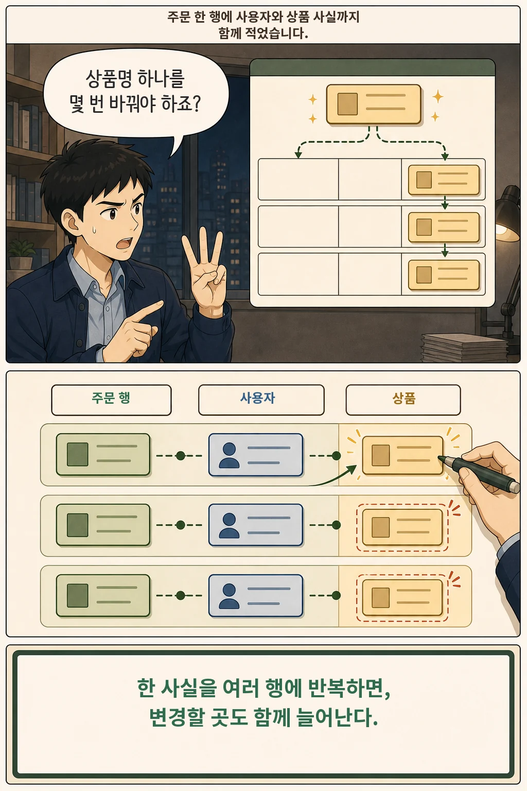
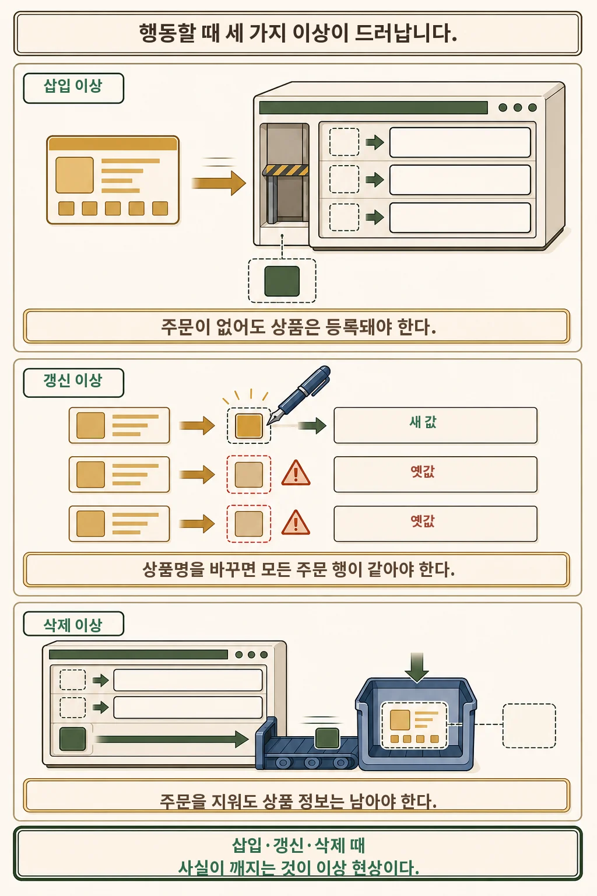
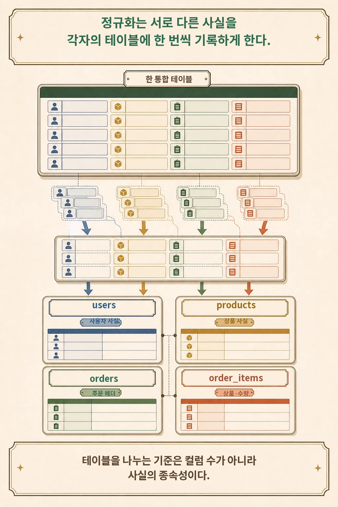
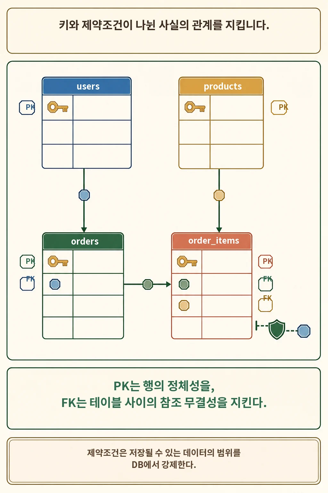
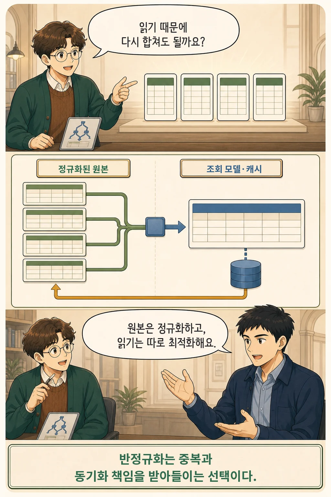

글·해설: 다메카솔

상품명을 하나 수정했는데 과거 주문 내역마다 제각각 다른 상품명이 남아 있거나, 탈퇴한 회원의 마지막 주문을 지웠더니 상품 마스터 데이터까지 함께 날아간 경험이 있으신가요?

많은 개발자가 데이터베이스 정규화(Normalization)를 단순히 "디스크 용량을 아끼기 위해 중복 컬럼을 제거하는 작업" 정도로 기억하곤 합니다. 하지만 스토리지 비용이 매우 저렴해진 오늘날, 정규화의 진짜 목적은 용량 절약이 아니라 **데이터를 삽입·수정·삭제할 때 발생하는 치명적인 데이터 오염(이상 현상, Anomalies)을 원천 차단하는 데** 있습니다.

이번 글에서는 실무에서 흔히 마주치는 주문 도메인 예시를 통해 정규화의 본질과 트레이드오프를 살펴보겠습니다.

## 핵심 요약

- 정규화의 1차 목표는 용량 절감이 아니라 **데이터 무결성을 해치는 3대 이상 현상(삽입·갱신·삭제 이상)을 방지**하는 것입니다.
- 주문 시스템은 사용자(`users`), 상품(`products`), 주문 기본정보(`orders`), 주문 상세품목(`order_items`)처럼 **각자의 식별자(PK)와 라이프사이클을 갖는 독립된 사실(Fact)**로 분리해야 합니다.
- '현재 상품 가격'과 '주문 당시 결제 단가'처럼 값이 같아 보여도 비즈니스 의미와 보존 시점이 다르면 분리된 스냅샷으로 관리하는 것이 올바른 모델링입니다.
- 정규화로 인해 JOIN 비용이 커졌다고 무작정 반정규화를 도입하면 안 되며, 캐시나 CQRS 등 조회 모델을 먼저 고려하고 데이터 동기화 책임을 함께 설계해야 합니다.

## 한 번 고쳤는데 왜 행마다 값이 다를까


주문 화면 개발을 편하게 하겠다고 다음과 같이 모든 정보를 때려 넣은 단일 테이블 `orders_all`을 설계했다고 가정해 보겠습니다:

```text
orders_all(
  order_id, ordered_at, order_status,
  user_id, user_name, user_email,
  product_id, product_name, product_price,
  quantity
)
```

이 구조는 얼핏 보면 JOIN이 필요 없어서 쿼리 작성이 편해 보입니다. 하지만 이 테이블 하나에는 **서로 다른 네 가지 비즈니스 사실**이 뒤엉켜 있습니다:

| 컬럼 그룹 | 실제 의미하는 엔티티 | 고유 식별 기준(Key) |
| :--- | :--- | :--- |
| `user_name`, `user_email` | 회원 정보 | `user_id` |
| `product_name`, `product_price` | 상품 정보 | `product_id` |
| `ordered_at`, `order_status` | 주문 마스터 | `order_id` |
| `product_id`, `quantity` | 주문 품목 상세 | `order_id + line_no` |

여기서 `product_name`은 주문 번호(`order_id`)가 아니라 상품 번호(`product_id`)에 종속되는 속성입니다. 만약 상품명을 변경하려면 이 테이블에 수백만 건 쌓여 있는 해당 `product_id`의 모든 행을 하나도 빠짐없이 `UPDATE`해야 합니다. 네트워크 순서나 배치 작업 누락으로 단 한 행이라도 누락되면, 데이터베이스 안에서 동일한 상품에 대해 서로 다른 이름이 공존하는 **데이터 불일치(Inconsistency)**가 발생합니다.

## 중복 저장은 쓰기 비용과 리스크를 폭증시킨다



하나의 사실(Fact)이 데이터베이스 내 여러 테이블과 행에 파편화되어 존재하면, 데이터 변경 시 모든 쓰기 경로가 완벽한 원자성을 보장해야 합니다.

현업 시스템에는 단순 API 서버뿐 아니라 다음과 같은 수많은 쓰기 경로가 공존합니다:
- 백그라운드 배치 프로세스
- 운영팀의 수동 SQL 패치
- 동일 DB를 공유하는 레거시 서비스나 마이크로서비스
- 이벤트 큐 기반의 비동기 재처리 로직

정규화는 이 위험을 **"상품명은 오직 `products` 테이블의 단 한 행에서만 수정된다"**는 단일 진실 공급원(SSOT, Single Source of Truth) 구조로 원천 해결합니다.

## 시스템을 망가뜨리는 3대 이상 현상



### 1. 갱신 이상 (Update Anomaly)
상품 `P10`의 가격을 인상했는데 수천 개의 주문 행 중 일부만 업데이트되고 일부는 누락되어, 조회할 때마다 가격이 오락가락하는 현상입니다.

### 2. 삽입 이상 (Insertion Anomaly)
신규 출시할 상품을 미리 등록하려는데, 아직 발생한 주문(`order_id`)이 없어서 테이블에 `NULL` 값을 억지로 채워 넣거나 아예 상품 등록 자체가 불가능해지는 현상입니다.

### 3. 삭제 이상 (Deletion Anomaly)
취소된 마지막 주문 1건을 정리하려고 `DELETE` 쿼리를 날렸는데, 그 행이 해당 상품의 상세 정보나 회원 정보를 담고 있던 유일한 행이어서 마스터 데이터까지 통째로 유실되는 현상입니다.

이 모든 이상 현상은 **"서로 다른 식별자와 수명 주기를 가진 데이터들을 억지로 한 테이블에 묶어두었기 때문"**에 발생합니다.

## 정규화의 핵심: 사실의 소유권 분리



주문 도메인을 비즈니스 엔티티 단위로 분리하면 다음과 같이 깔끔한 4개 테이블 구조가 완성됩니다:

```sql
CREATE TABLE users (
  user_id       BIGINT PRIMARY KEY,
  name          VARCHAR(100) NOT NULL,
  email         VARCHAR(255) NOT NULL UNIQUE
);

CREATE TABLE products (
  product_id    BIGINT PRIMARY KEY,
  name          VARCHAR(200) NOT NULL,
  current_price NUMERIC(12, 2) NOT NULL CHECK (current_price >= 0)
);

CREATE TABLE orders (
  order_id      BIGINT PRIMARY KEY,
  user_id       BIGINT NOT NULL REFERENCES users(user_id),
  ordered_at    TIMESTAMP NOT NULL,
  status        VARCHAR(30) NOT NULL
);

CREATE TABLE order_items (
  order_id      BIGINT NOT NULL REFERENCES orders(order_id),
  line_no       INTEGER NOT NULL,
  product_id    BIGINT NOT NULL REFERENCES products(product_id),
  quantity      INTEGER NOT NULL CHECK (quantity >= 1),
  unit_price    NUMERIC(12, 2) NOT NULL CHECK (unit_price >= 0),
  PRIMARY KEY (order_id, line_no)
);
```

이 구조에서는 회원의 이메일이 바뀌든 상품명이 바뀌든 딱 한 곳의 행만 수정하면 끝납니다. 신상품은 주문이 없어도 자유롭게 등록되고, 주문 내역이 삭제되어도 상품 마스터는 안전하게 보존됩니다.

> **💡 실무 팁 (정규형 1NF·2NF·3NF 쉽게 외우기)**:  
> 복잡한 학술 정의 대신 **"이 컬럼의 값은 오직 PK 전체에만 1:1로 종속되는가?"**를 질문하세요.  
> 만약 복합 키의 일부에만 걸려 있거나(2NF 위반), 다른 일반 컬럼을 거쳐 간접적으로 결정된다면(3NF 위반) 별도 테이블로 분리할 대상입니다.

## 주문 당시 가격은 중복이 아니라 '스냅샷'이다



테이블을 분리할 때 초심자가 가장 많이 실수하는 부분이 바로 가격 데이터입니다. `products.current_price`가 있는데 `order_items.unit_price`를 또 두면 중복 아니냐고 생각하기 쉽습니다.

하지만 두 컬럼은 이름과 수치만 비슷할 뿐 비즈니스적 본질이 완전히 다릅니다:
- `products.current_price`: **현재 시점**에 판매 중인 마스터 가격 (언제든 변동 가능)
- `order_items.unit_price`: 과거 특정 주문 시점에 **결제 계약이 체결된 확정 단가** (영구 불변)

내일 상품 가격이 10% 인상된다고 해서 지난달 고객이 결제한 영수증 금액까지 바뀌면 안 됩니다. 이것은 불필요한 데이터 중복이 아니라, **과거 시점의 계약 사실을 보존하기 위한 의도적인 '이력 스냅샷'**입니다.

## 원본은 정규화하고 읽기는 따로 최적화한다



테이블이 쪼개지면 자연스럽게 조회 시 JOIN 연산이 늘어납니다. 그렇다고 해서 "성능이 느려질 테니 처음부터 반정규화해서 다 합쳐두자"고 접근하는 것은 전형적인 안티패턴입니다.

실무에서는 다음 단계를 거쳐 성능을 최적화해야 합니다:

1. **외래 키(FK) 및 인덱스 최적화**: JOIN 조건 컬럼과 WHERE 조건절에 복합 인덱스를 적절히 구성합니다.
2. **N+1 문제 제거**: ORM 사용 시 불필요한 단건 쿼리가 반복 호출되지 않도록 `JOIN FETCH`나 배치 조회를 적용합니다.
3. **읽기 전용 모델 분리 (CQRS/캐시)**: 실시간 집계나 대용량 조회가 병목이라면 Redis 캐시, Materialized View, 또는 Elasticsearch 같은 별도 검색 엔진으로 읽기 파이프라인을 분리합니다.
4. **반정규화 도입 시 동기화 책임 정의**: 만약 테이블 내에 중복 컬럼을 추가하기로 결정했다면, **"이 중복 값을 누가, 언제 갱신하고 불일치가 났을 때 어떻게 복구할 것인가"**에 대한 운영 정책을 반드시 함께 수립해야 합니다.

## 다메카솔의 해석: 모델링의 완성은 제약조건과 동기화 책임에 있다

DB 정규화는 단순히 테이블을 잘게 쪼개는 기술이 아닙니다. **도메인의 비즈니스 규칙과 데이터의 생명주기를 시스템 구조로 명확히 못 박는 아키텍처 작업**입니다.

실무 데이터 모델링을 검토할 때 다음 3가지를 점검해 보세요:

1. **단일 진실 공급원(SSOT)**: 마스터성 데이터의 수정 경로가 오직 단일 엔티티로 수렴하는가?
2. **비즈니스 스냅샷 구분**: 값의 일치 여부가 아니라, 시간에 따른 불변 계약 데이터(주문 단가, 배송지 주소 등)와 마스터 데이터를 명확히 분리했는가?
3. **스토리지 레벨 제약조건 강제**: PK, FK, NOT NULL, CHECK 제약조건을 DB 엔진 레벨에 걸어두어 애플리케이션 버그나 비동기 배치가 잘못된 데이터를 밀어 넣지 못하게 방어하고 있는가?

## 함께 읽을 DB 핵심 원리

- [트랜잭션 ACID와 Commit/Rollback의 내부 동작 원리](/posts/transaction-acid-commit-rollback/): 쓰기 정합성을 보장하는 WAL 로그와 잠금 메커니즘
- [SQL 선언형 모델과 옵티마이저가 쿼리를 실행하는 법](/posts/sql-declarative-language/): JOIN과 인덱스 실행 계획 분석

## 출처

- [Microsoft Learn — 데이터베이스 정규화 기본 사항 설명](https://learn.microsoft.com/ko-kr/office/troubleshoot/access/database-normalization-description)
- [PostgreSQL Documentation — Constraints](https://www.postgresql.org/docs/current/ddl-constraints.html)
- [Google Cloud — What is database normalization?](https://cloud.google.com/discover/what-is-database-normalization)

이 글의 본문과 이미지는 생성형 AI로 제작했습니다. 기획과 편집 기준은 다메카솔이 정했습니다.
