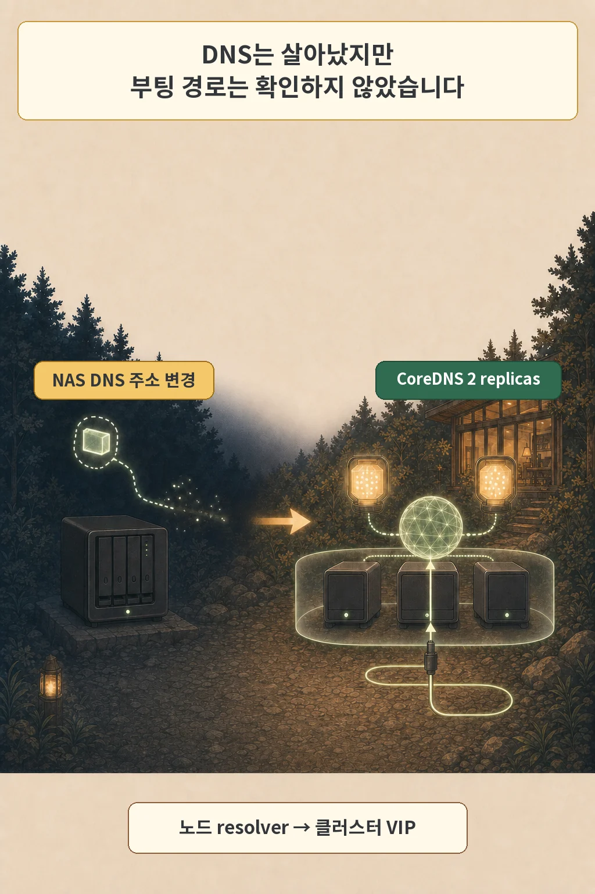
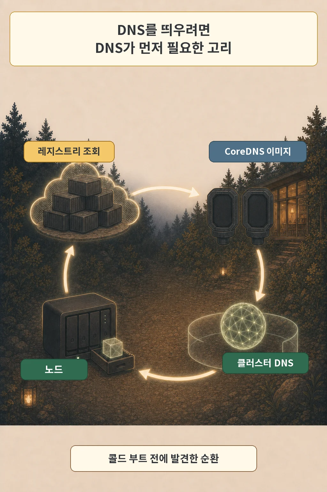
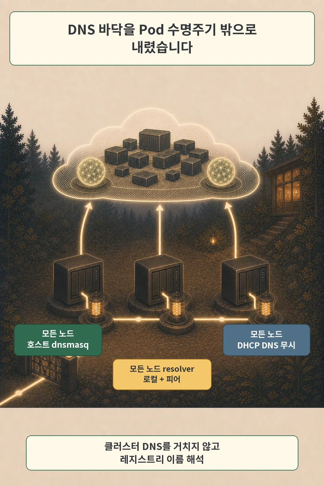
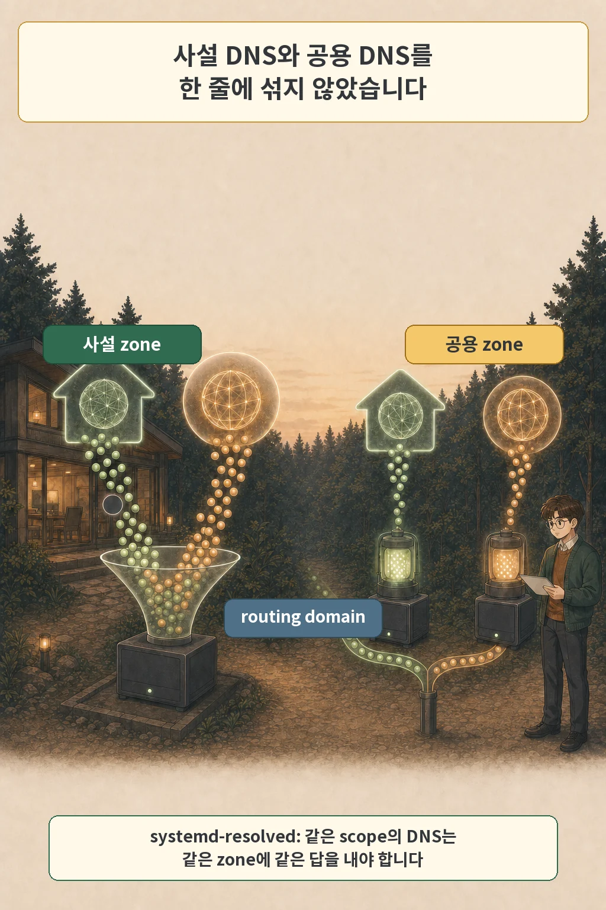

글·해설: 다메카솔

CoreDNS 두 replica가 지킨 것은 이미 떠 있는 클러스터의 DNS였습니다. 빈 클러스터에서 첫 이미지를 받는 길은 별도로 확인해야 했습니다.

2026년 7월 14일 아침, 홈랩의 내부 이름이 한꺼번에 풀리지 않았습니다. 애플리케이션과 ingress는 직접 주소로 확인하면 살아 있었습니다. 밤에 꺼지는 NAS VM의 DHCP 주소가 바뀌었는데, DNS 기록은 이전 주소를 가리키고 있었습니다.

저는 그날 내부 DNS를 24시간 k3s 클러스터로 옮겼습니다. CoreDNS를 두 replica로 띄우고, 서로 다른 노드에 배치했으며, PDB와 VIP도 붙였습니다. 클러스터 밖에서 새 DNS와 기존 DNS의 답을 대조했을 때 결과도 같았습니다. 여기까지는 잘 고친 것처럼 보였습니다.

한 줄이 그 판단을 뒤집었습니다. k3s 노드에서 `resolvectl status`를 보니 현재 DNS 서버가 방금 만든 인클러스터 VIP였습니다. DNS Pod를 시작해야 하는 노드가, 아직 시작되지 않을 수 있는 그 DNS만 바라보고 있었습니다.

> 이 글은 `~/dev/infra`의 2026년 7월 14일 Git 기록과 PARA Vault의 I-25 수집본을 다시 대조해 썼습니다. E03에서 실제 콜드 재구축 실패나 `no such host`가 발생했다는 로그는 찾지 못했습니다. 그 오류 원문은 후속 신규 노드 사건인 E05에 남아 있습니다. 이번 편은 장애를 겪고 복구한 기록이 아니라, resolver 측정으로 다음 장애의 조건을 발견해 제거한 기록입니다.

## 두 replica가 해결한 범위

첫 문제는 명확했습니다. 내부 DNS가 밤에 꺼지는 NAS VM 한 대와 DHCP 주소 하나에 묶여 있었습니다. 주소가 바뀌자 애플리케이션이 멈춘 것처럼 보였지만, 실제로 끊긴 것은 이름에서 주소로 가는 길이었습니다.

그래서 CoreDNS 두 replica를 k3s 안에 두었습니다. 한 Pod가 사라져도 다른 Pod가 VIP 뒤에서 응답하고, zone 파일은 인벤토리에서 생성하도록 바꿨습니다. 평시 가용성과 주소 변경의 재발 방지라는 두 목표에는 맞는 교정이었습니다.



빠진 질문이 있었습니다. 클러스터가 이미 떠 있을 때 DNS가 계속 응답하는가? 이 질문에는 답했습니다. 클러스터가 비어 있을 때 DNS를 처음 띄울 수 있는가? 그 경로는 그리지 않았습니다.

평시 HA와 부트스트랩 독립성은 별도 조건입니다.

## 시작 순서를 그렸더니 보인 고리

K3s는 기본 구성에서 server가 시작될 때 CoreDNS를 자동 배포합니다. 노드가 Pod 이미지를 내려받을 때는 kubelet이 container runtime에 pull을 맡기고, registry 이름을 주소로 바꿀 DNS가 먼저 필요합니다.

당시 측정한 노드 resolver는 인클러스터 CoreDNS VIP 하나를 현재 서버로 골랐습니다. 이 상태에서 빈 노드가 CoreDNS 이미지를 새로 받아야 한다고 가정하면 시작 순서는 한 바퀴 돌아옵니다.

1. 노드가 CoreDNS 이미지를 받을 registry 이름을 풉니다.
2. 노드의 DNS 질의는 인클러스터 VIP로 갑니다.
3. CoreDNS Pod는 아직 시작되지 않았습니다.
4. 그 Pod를 시작하려면 먼저 이미지를 받아야 합니다.



이 고리는 당시 설정과 공식 동작을 합쳐 얻은 아키텍처 추론입니다. zero-cache 상태로 클러스터를 지운 뒤 실패를 재현한 기록은 없습니다. Kubernetes의 `IfNotPresent` 정책은 로컬 이미지가 있으면 pull을 생략하므로 캐시가 이런 의존성을 가릴 수 있지만, 당시 CoreDNS의 실제 이미지 보유 상태와 pull policy도 회수하지 못했습니다.

그래서 `no such host`를 이 장면의 결과로 붙이지 않았습니다. 더 극적인 제목보다 사건 경계가 중요했습니다.

## Pod 수명주기 밖으로 내린 DNS 바닥

제가 고친 대상은 CoreDNS replica 수가 아니라 노드의 첫 이름 해석 경로였습니다. 각 k3s 노드에서 `dnsmasq`를 systemd 서비스로 실행하고, 노드는 자기 로컬 dnsmasq를 먼저 본 뒤 다른 노드의 dnsmasq를 보도록 구성했습니다. 어느 resolver도 Kubernetes Pod가 뜰 때까지 기다리지 않습니다.

DHCP가 다시 인클러스터 VIP를 밀어 넣지 못하도록 systemd-networkd drop-in에는 `UseDNS=false`를 두었습니다. 노드의 resolver 설정은 로컬과 peer로 고정했습니다.



적용 playbook은 세 가지를 검사했습니다.

```bash
resolvectl status
dig @127.0.0.1 +short registry.k8s.io
dig +short registry.k8s.io
```

첫 출력에서 인클러스터 VIP가 사라지고 로컬 resolver가 보여야 합니다. 두 번째는 dnsmasq 자체의 응답을, 세 번째는 애플리케이션이 실제로 쓰는 시스템 resolver 경로를 확인합니다. 당시 교정 기록에는 로컬 resolver와 peer가 반영됐고, 클러스터 DNS를 거치지 않은 registry 이름 해석도 통과했다고 남아 있습니다.

여기서 “클러스터 밖”은 물리 장비의 위치보다 프로세스 생명주기 경계를 가리킵니다. 같은 미니PC에서 돌더라도 Kubernetes Pod와 control-plane의 생명주기 밖에 있는 호스트 프로세스면 이 고리를 끊을 수 있습니다. 이 홈랩에서는 dnsmasq가 그 역할을 맡았습니다.

## 공용 DNS는 왜 예비선이 아닌가

사설 이름을 아는 DNS 뒤에 공용 DNS를 하나 더 쓰면 안전해 보입니다. 하지만 공용 DNS는 사설 이름을 모를 때 timeout 대신 NXDOMAIN이라는 정상적인 부정 응답을 돌려줄 수 있습니다. RFC 2308은 NXDOMAIN을 negative caching 대상으로 정의합니다.

systemd-resolved 문서도 같은 lookup scope에 둔 DNS 서버들이 같은 zone에 대해 같은 결과를 내야 한다고 설명합니다. 사설 zone을 아는 resolver와 모르는 resolver를 한 목록에 섞으면 두 서버가 동등한 대체재가 되지 못합니다.



이 환경에서는 노드 resolver를 로컬+peer dnsmasq로 맞추고, 사설 이름과 공용 이름은 DNS 계층 안에서 조건부로 전달했습니다. 공용 DNS를 실제 보조 서버로 넣어 사고를 겪은 기록은 없습니다. 설정을 고치면서 미리 제거한 함정입니다.

## 남은 문제: 호스트 서비스의 부팅 순서

호스트 계층으로 옮겼다고 시작 순서가 저절로 완성되지는 않았습니다. 7월 27일에는 dnsmasq가 주소를 가진 인터페이스보다 먼저 시작해 실패하는 후속 문제가 기록됐고, 서비스가 `network-online.target` 뒤에 오도록 보강했습니다.

저는 이 대목이 이번 사건의 결론이라고 봅니다. 기반 서비스를 아래 계층에 놓는 일과 그 계층 안에서의 부팅 순서를 검증하는 일은 한 묶음입니다.

콜드 부트스트랩을 검토할 때는 평시 대시보드 대신 네 질문을 씁니다.

| 질문 | 확인할 증거 |
| --- | --- |
| 노드가 첫 이미지를 받기 전에 어떤 DNS를 쓰는가 | `resolvectl status`, 시스템 resolver를 거치는 실제 조회 |
| 그 DNS 프로세스는 Kubernetes 없이 시작하는가 | systemd 의존성과 interface 준비 상태 |
| 이미지가 하나도 없어도 시작 경로가 열리는가 | 새 노드·캐시 없는 조건 또는 air-gap 이미지 목록 |
| 사설 이름을 묻는 모든 resolver가 같은 답을 내는가 | zone별 직접 질의와 routing domain 설정 |

외부 dnsmasq만이 정답은 아닙니다. K3s 공식 air-gap 절차처럼 필요한 이미지를 미리 넣거나, 독립된 사설 registry와 registry mirror를 두어도 순환을 끊을 수 있습니다. 제가 지금 고정하는 원칙은 구현 이름보다 짧습니다. **클러스터를 시작하는 데 필요한 의존성은, 아직 시작되지 않은 클러스터 하나에만 기대지 않습니다.**

다음 4편에서는 CoreDNS가 44시간 동안 정상처럼 보였지만, 재시작하는 순간 잘못된 상위 DNS를 읽을 상태였던 `resolv.conf` 스냅숏 문제를 다룹니다. 5편에서는 이번 글에서 빼 둔 실제 `no such host`와 신규 노드의 절반짜리 DNS 베이스라인을 이어갑니다.

Kubernetes와 k3s의 기본 역할이 먼저 필요하면 [Kubernetes와 k3s는 무엇이 다른가](/posts/kubernetes-k3s-homelab/)를 함께 읽을 수 있습니다.

## 출처

- 개인 인프라 Git 기록: DNS VM 주소 변경 교정, 2026-07-14, commit `729eec914`
- 개인 인프라 Git 기록: 인클러스터 CoreDNS와 VIP 도입, 2026-07-14, commit `65fd80dc5`
- 개인 인프라 Git 기록: 노드 DNS 바닥과 resolver pin, 2026-07-14, commit `893c55256`
- 개인 인프라 Git 기록: dnsmasq network-online 보강, 2026-07-27, commit `76de47a98`
- [K3s: Networking Services](https://docs.k3s.io/networking/networking-services)
- [Kubernetes: Images](https://kubernetes.io/docs/concepts/containers/images/)
- [K3s: Air-Gap Install](https://docs.k3s.io/installation/airgap)
- [systemd-resolved.service manual](https://www.freedesktop.org/software/systemd/man/latest/systemd-resolved.service.html)
- [RFC 2308: Negative Caching of DNS Queries](https://datatracker.ietf.org/doc/html/rfc2308)

사설 주소, 내부 도메인과 호스트명은 공개하지 않았습니다. 2026년 7월 31일 공식 문서를 다시 확인했습니다.

이 글의 본문과 이미지는 생성형 AI로 제작했습니다. 기획과 편집 기준은 다메카솔이 정했습니다. 만화 이미지는 텍스트 없는 원화에 결정적 레터링을 합성해 만들었습니다. 공식 로고·UI·문서 도표 등 외부 이미지 자산은 사용하지 않았습니다.
