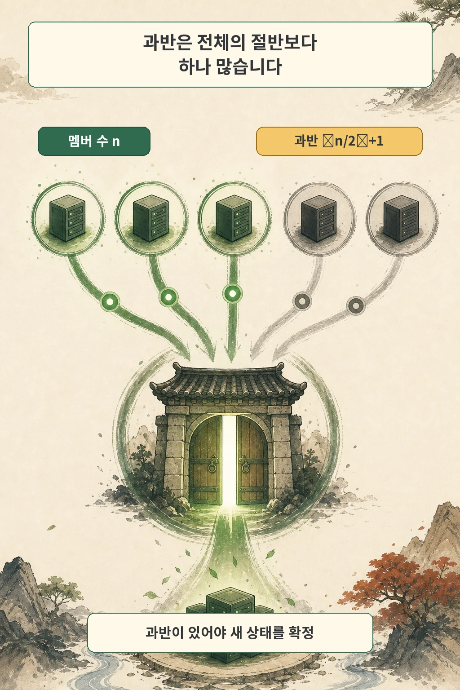
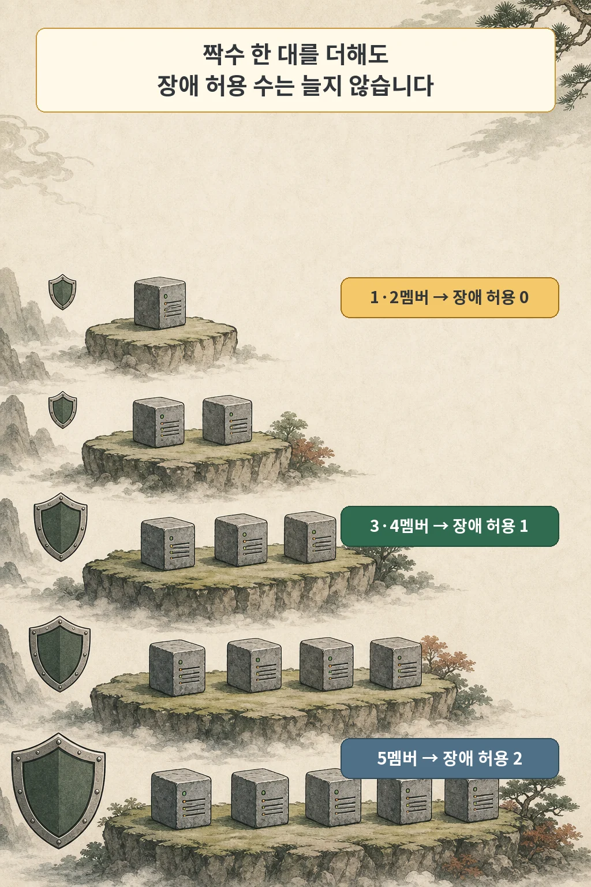
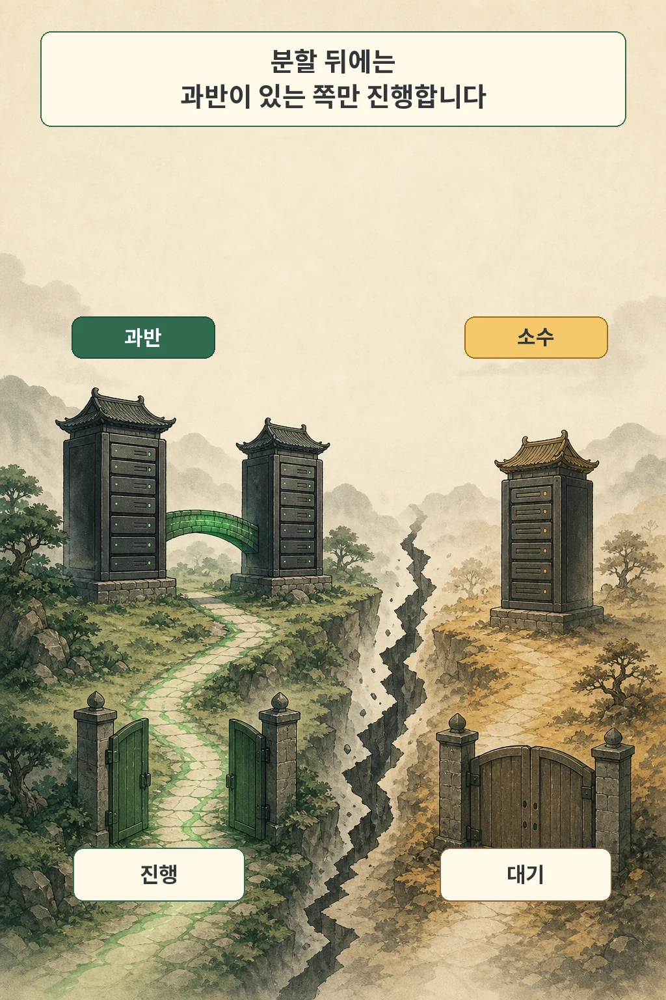
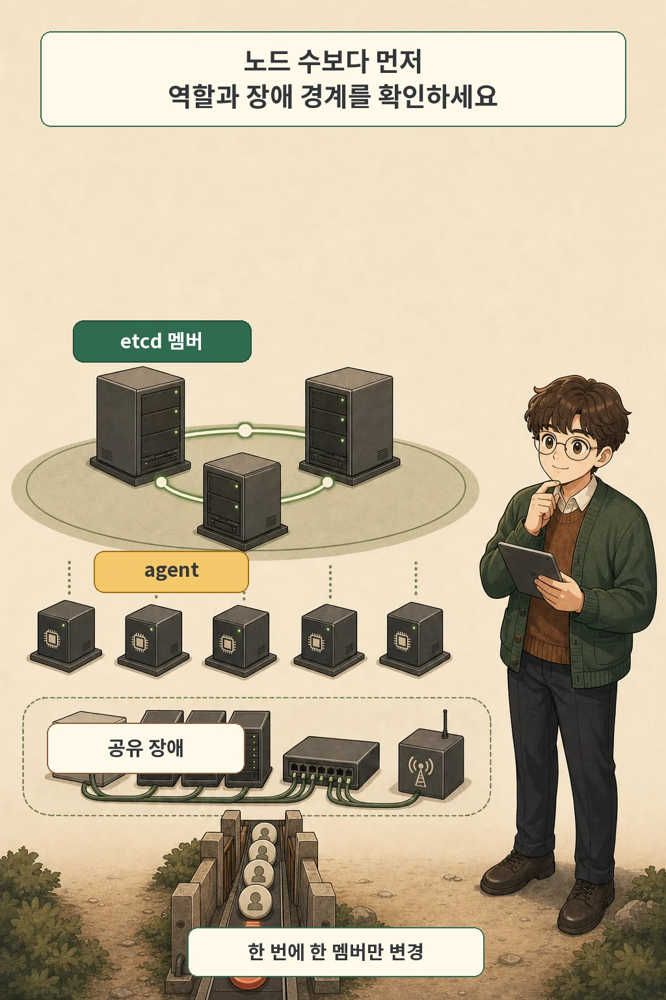

홈랩에 미니PC를 두 대 놓으면 한 대보다 안전해 보입니다. 하지만 두 장비가 모두 etcd 투표 멤버라면 한 대가 멈추는 순간 과반도 사라집니다. 장비는 늘었지만 허용할 수 있는 장애 수는 여전히 0입니다.

세 번째 멤버가 들어오면 처음으로 달라집니다. 세 멤버의 과반은 둘이므로 한 대가 멈춰도 남은 두 대가 새 상태를 확정할 수 있습니다. k3s가 embedded etcd HA 구성에 세 대 이상의 홀수 server node를 요구하는 이유입니다.

핵심은 “홀수가 좋다”는 문장을 외우는 데 있지 않습니다. **현재 투표 멤버 수에서 필요한 과반과 장애 허용 수를 직접 계산하는 것**입니다.

글·해설: 다메카솔

## 먼저 답부터 계산합니다

- 과반 = `floor(멤버 수 / 2) + 1`
- 장애 허용 수 = `멤버 수 - 과반`

예를 들어 5멤버의 과반은 `floor(5/2)+1`, 즉 3입니다. 다섯 대 중 두 대가 사라져도 세 대가 남아 과반을 유지합니다.

## 쿼럼은 ‘살아 있는 서버 수’보다 엄격합니다

etcd는 Kubernetes의 원하는 상태를 저장하는 일관된 key-value store입니다. 여러 멤버가 있을 때 새 상태를 확정하려면 투표 멤버의 과반이 동의해야 합니다. 한 멤버가 혼자 다른 값을 확정하지 못하게 막는 대신, 과반이 없는 상황에서는 새 쓰기를 진행하지 않는 쪽을 택합니다.

이 원칙 때문에 “프로세스가 살아 있다”와 “클러스터가 결정을 계속한다”는 다른 상태입니다. 두 멤버 중 하나만 살아 있어도 etcd 프로세스 자체는 실행될 수 있지만, 2멤버 구성의 과반 2를 만들 수 없으므로 새 상태를 확정할 수 없습니다.

과반 계산은 정수 나눗셈으로 생각하면 쉽습니다.

| 투표 멤버 수 | 필요한 과반 | 장애 허용 수 |
| ---: | ---: | ---: |
| 1 | 1 | 0 |
| 2 | 2 | 0 |
| 3 | 2 | 1 |
| 4 | 3 | 1 |
| 5 | 3 | 2 |
| 6 | 4 | 2 |
| 7 | 4 | 3 |

표에서 중요한 변화는 1→2, 3→4, 5→6에서 장애 허용 수가 늘지 않는다는 점입니다. 바로 앞의 홀수 구성과 같은 수의 장애만 견디면서 투표 멤버와 필요한 과반은 늘어납니다.

## 2멤버가 1멤버보다 HA가 아닌 이유

1멤버는 그 한 대가 살아 있어야 합니다. 2멤버도 두 대가 모두 살아 있어야 합니다. 둘 모두 장애 허용 수는 0입니다.

그렇다고 모든 2노드 Kubernetes 구성이 1노드보다 나쁘다는 뜻은 아닙니다. 다음을 먼저 구분해야 합니다.

- 두 노드가 모두 embedded etcd 투표 멤버인가?
- control plane은 외부 datastore를 사용하는가?
- 한 대는 server이고 다른 한 대는 agent인가?
- 애플리케이션 replica 두 개를 말하는가?

이 글의 계산은 **etcd 투표 멤버**에만 적용됩니다. K3s agent를 열 대 추가해도 embedded etcd 투표 수는 늘지 않습니다. 반대로 server 역할을 분리했다면 모든 server가 etcd 멤버인 것도 아닐 수 있습니다.

3멤버와 4멤버도 비교해 보겠습니다. 3멤버는 과반 2, 장애 허용 1입니다. 네 번째 멤버를 추가하면 과반은 3으로 올라가지만 장애 허용은 여전히 1입니다. 네 번째 장비가 용량이나 다른 역할에는 도움을 줄 수 있어도 etcd의 장애 허용 수를 늘리지는 않습니다.

다섯 번째 멤버가 들어와야 과반 3을 유지하면서 두 대 장애를 허용할 수 있습니다. 그래서 etcd는 일반적으로 홀수 멤버 수를 권장합니다.

## 네트워크가 둘로 갈라지면 어느 쪽이 살아남나

세 멤버가 네트워크 분할로 `2 대 1`로 갈라졌다고 가정하겠습니다. 두 멤버가 서로 통신할 수 있는 쪽은 과반을 만들 수 있으므로 결정을 계속합니다. 혼자 남은 멤버는 살아 있어도 새 상태를 확정하지 못합니다.

양쪽이 동시에 서로 다른 상태를 확정하지 않도록 하는 것이 합의의 목적입니다. 가용성을 일부 포기해서 일관성을 지키는 선택입니다. 네트워크가 회복되면 소수 쪽 멤버는 과반이 확정한 상태를 다시 따라갑니다.

이때 물리적 배치가 중요해집니다. 세 멤버가 서로 다른 미니PC에 있어도 같은 멀티탭이나 스위치에 묶여 있다면 한 번의 장애로 과반을 잃을 수 있습니다. 반대로 멀리 떨어진 네트워크에 무작정 분산하면 멤버 간 지연이 커져 합의 요청과 leader election이 불안정해질 수 있습니다.

좋은 장애 도메인은 “멀리 떨어져 있음”이 아니라 다음 두 조건의 균형입니다.

1. 한 번의 전원·장비·네트워크 장애가 과반을 함께 없애지 않습니다.
2. 정상 상태에서 과반이 안정적인 지연 안에 서로 응답할 수 있습니다.

## 노드를 추가하기 전에 다시 계산해야 합니다

etcd의 멤버 변경도 합의가 필요한 쓰기입니다. 이미 과반을 잃은 뒤에는 정상적인 멤버 추가로 쉽게 복구할 수 없습니다. 3멤버 중 한 대가 고장 난 상태에서 새 멤버부터 더해 4멤버 구성으로 만들면, 새 과반이 3으로 올라가 남아 있던 두 멤버만으로 진행할 수 없는 위험이 생깁니다.

etcd는 이런 위험을 줄이기 위해 재구성 안전장치를 제공합니다. v3.6의 `strict-reconfig-check`는 시작된 멤버 수가 새 구성의 과반보다 적어질 요청을 거부하도록 설계됐습니다. 그러나 안전장치가 운영 계획을 대신하지는 않습니다.

K3s의 embedded etcd는 배포판이 멤버 수명주기를 관리합니다. 인터넷의 일반 `etcdctl member add/remove` 예시를 바로 실행하기보다 현재 K3s 버전의 노드 제거·재가입·snapshot 복구 절차를 따라야 합니다. 이 글은 직접 멤버를 조작하는 명령을 제공하지 않습니다.

멤버를 바꾸기 전에는 다음 순서를 문서로 확인합니다.

1. 현재 etcd 역할을 가진 server와 health를 확인합니다.
2. 변경 전 멤버 수, 과반, 장애 허용 수를 적습니다.
3. 고장 멤버를 교체하는지, 정상 멤버를 확장하는지 구분합니다.
4. 한 번에 한 멤버만 변경하고 다시 health를 확인합니다.
5. 변경 후 멤버 수와 물리 장애 도메인을 다시 적습니다.
6. 해당 K3s 버전에서 복구할 수 있는 snapshot과 절차를 확인합니다.

## 3멤버 etcd가 해결하지 않는 것

3멤버 embedded etcd는 한 대 장애 뒤에도 Kubernetes 제어면 상태를 합의하기 위한 조건입니다. 다음 문제까지 자동으로 해결하지 않습니다.

- API server에 도달하는 고정 주소와 load balancer
- 애플리케이션 replica와 Pod 배치
- 데이터베이스의 복제와 장애 조치
- Longhorn 같은 스토리지 계층의 replica
- 같은 전원·스위치·디스크 풀 장애
- 잘못된 삭제와 데이터 손상에서 돌아갈 백업

etcd replica는 Kubernetes 상태를 현재 시점에 유지하기 위한 합의 구성입니다. snapshot과 백업은 과거 상태로 복구하기 위한 별도 계층입니다. 쿼럼이 살아 있어도 잘못된 삭제는 정상적으로 합의돼 모든 멤버에 반영될 수 있습니다.

## 내 클러스터를 계산하는 5분 표

| 질문 | 내 환경의 답 |
| --- | --- |
| datastore는 embedded etcd인가, 외부 DB인가? |  |
| 실제 etcd 투표 멤버는 몇 개인가? |  |
| 필요한 과반은 몇 개인가? |  |
| 동시에 몇 멤버 장애를 허용하는가? |  |
| 멤버들이 공유하는 전원·스위치·스토리지는 무엇인가? |  |
| 한 장애 도메인이 사라지면 과반이 남는가? |  |
| 다음 멤버 변경 전후의 과반은 어떻게 바뀌는가? |  |
| snapshot과 복구 절차를 실제로 시험했는가? |  |

이 표에서 “Kubernetes 노드 수”를 그대로 적지 마세요. `etcd` 역할을 가진 투표 멤버만 세야 합니다. 계산이 끝난 뒤에야 세 대가 필요한지, 다섯 대가 필요한지, 외부 datastore가 더 맞는지 판단할 수 있습니다.

홀수 노드는 주문처럼 외울 규칙이 아닙니다. 과반을 유지하면서 같은 장애 허용 수에 불필요한 투표 멤버를 더하지 않는 결과입니다. 숫자보다 먼저 역할을 확인하고, 멤버를 바꿀 때마다 다시 계산하는 것이 etcd HA의 출발점입니다.

## 자주 묻는 질문

### 4멤버 etcd는 잘못된 구성인가요?

동작할 수 있지만 3멤버와 장애 허용 수가 1로 같습니다. 네 번째 멤버가 주는 다른 운영 가치와 추가 지연·관리 비용을 비교해야 합니다. 내결함성만 목표라면 바로 다음 홀수 구성까지 계산하는 편이 낫습니다.

### worker를 추가하면 쿼럼도 늘어나나요?

아닙니다. K3s agent는 workload를 실행하지만 embedded etcd 투표 멤버가 아닙니다. 실제 server role을 확인해야 합니다.

### 세 노드를 서로 다른 집이나 지역에 놓으면 더 안전한가요?

상관된 장애는 줄 수 있지만 네트워크 지연과 단절 가능성이 커집니다. 과반이 안정적으로 통신할 수 있는 지연과 장애 도메인 분리를 함께 검토해야 합니다.

### 쿼럼이 있으면 백업은 필요 없나요?

필요합니다. 쿼럼은 현재 상태의 일관성과 진행을 위한 장치이고, 백업은 삭제·손상·운영 실수 뒤 과거 상태를 복구하기 위한 장치입니다.

## 출처

- [K3s: High Availability Embedded etcd](https://docs.k3s.io/datastore/ha-embedded)
- [K3s: Cluster Datastore](https://docs.k3s.io/datastore)
- [K3s: Managing Server Roles](https://docs.k3s.io/installation/server-roles)
- [etcd FAQ: failure tolerance](https://etcd.io/docs/v3.2/faq/)
- [etcd v3.6: Configuration options](https://etcd.io/docs/v3.6/op-guide/configuration/)
- [etcd: Design of runtime reconfiguration](https://etcd.io/docs/v3.5/op-guide/runtime-reconf-design/)

기술 설명은 2026년 7월 25일 확인한 공식 문서를 기준으로 작성했습니다. K3s와 etcd 버전에 따라 멤버 관리·복구 절차가 달라질 수 있으므로 실제 변경 전 해당 버전 문서를 확인해야 합니다.

이미지는 생성형 AI로 만든 텍스트 없는 원화에 결정적 레터링을 합성해 제작했습니다. 공식 로고·UI·문서 도표·외부 이미지 자산은 사용하지 않았습니다.
