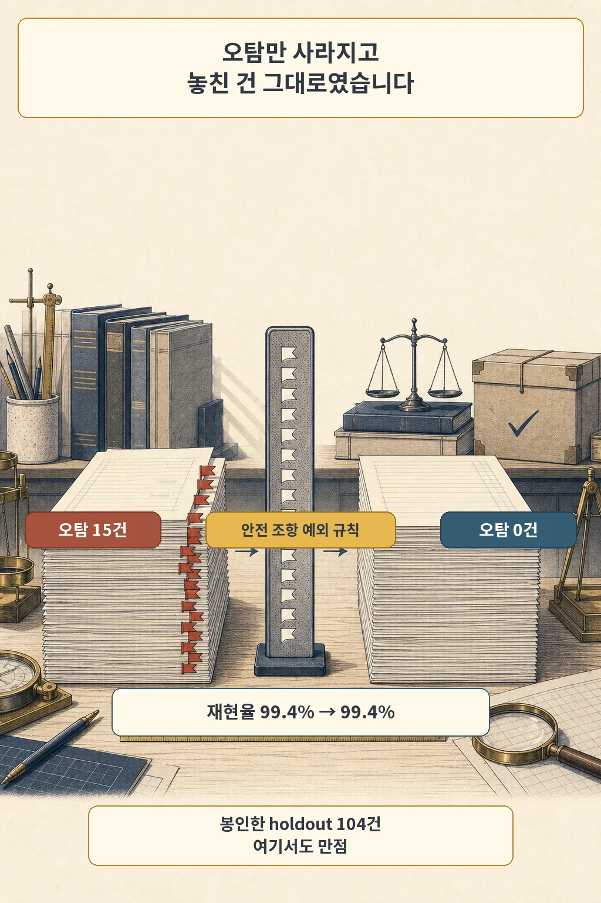
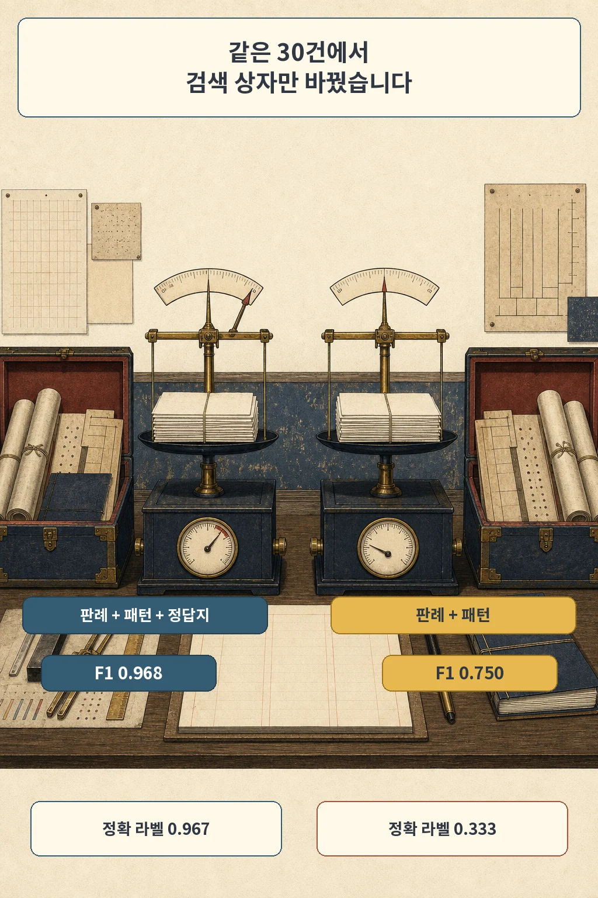

글·해설: 다메카솔

성적표에는 0.997이 찍혀 있었습니다. 그 숫자를 받고 다섯 달 뒤에야, 저는 그것이 탐지 실력이 아니라 제가 고른 378건에 대한 적합도라는 것을 알았습니다.

판례를 근거로 임대차 계약서의 위험 조항을 찾아 보자는 실험이었습니다. 2026년 2월 4일 평가 보고서에는 골든셋 378건에 대해 이진 분류 F1 99.7%, 정밀도 100.0%, 재현율 99.4%가 적혀 있습니다. 오탐은 0건, 미탐은 1건이었습니다.

> 이 글은 개인 학습·포트폴리오 목적의 평가 실험 기록입니다. 법률 자문이나 계약 안전 판정을 제공하지 않습니다. 아래 수치는 모두 합성 내부 corpus에서 나온 값이고, 법률 전문가가 검수한 benchmark가 아닙니다.

## 오탐만 사라지고, 놓친 것은 그대로였습니다

같은 보고서의 직전 단계 비교표에 답이 이미 있었습니다. 오탐이 15건에서 0건으로 줄었고, 재현율은 99.4%에서 99.4%로 움직이지 않았습니다.

한쪽만 움직이는 개선은 드뭅니다. 탐지기가 정말 좋아졌다면 놓치는 것도 함께 줄어야 하는데, 줄어든 것은 잘못 잡은 것뿐이었습니다. 그 사이에 한 일은 안전 조항을 걸러 주는 예외 규칙을 늘린 것이었습니다. 당시 저는 그 표를 성능 개선으로 읽었습니다.

지금 다시 보면 그 표는 개선이 아니라 조준이었습니다. 눈앞의 378건에서 붉은 표식이 붙은 자리를 보고, 그 자리에 맞는 구멍을 뚫은 셈입니다.

여기서 "홀드아웃을 안 뒀으니 당연하다"고 읽으면 이 사건의 교훈을 놓칩니다. 홀드아웃은 있었습니다. 104건을 따로 동결했고, 승격된 행이 홀드아웃에 섞였는지와 정규화한 문장 해시가 겹치는지를 검사하는 누출 점검 스크립트도 함께 돌렸습니다. 2026년 2월 10일 집계에서 그 홀드아웃의 라벨 F1은 1.0이었습니다.

절차는 있었고, 그 절차가 유효하려면 한 가지 조건이 성립해야 했습니다. 홀드아웃이 학습·조정 대상과 **다른 분포**에서 와야 한다는 조건입니다. 제 홀드아웃은 같은 합성 생성기에서 나온 378건을 나눈 것이었습니다. 나누기는 했지만 새롭지는 않았습니다.

## 검색 상자에서 정답지를 빼 봤습니다

2026년 7월 8일, 저는 조건 하나만 바꾼 실험을 돌렸습니다. 같은 30건, 같은 모델, 같은 프롬프트에서 검색이 참고하는 컬렉션만 교체했습니다.

| 검색 컬렉션 | 정밀도 | F1 | 정확 라벨 일치 |
|---|---:|---:|---:|
| 판례 + 패턴 + 정답 corpus | 0.938 | 0.968 | 0.967 |
| 판례 + 패턴 | 0.600 | 0.750 | 0.333 |

정답 corpus가 검색 대상에 들어 있었습니다. 조항을 판정할 때 참고하라고 넘긴 문서 더미 안에, 그 조항의 정답이 붙은 예시가 함께 들어 있었던 겁니다.

F1보다 정확 라벨 일치의 낙폭이 훨씬 큽니다. 0.967에서 0.333으로 떨어졌습니다. 위험한지 아닌지를 맞히는 일보다, 어떤 유형의 위험인지를 고르는 일에서 정답지를 더 많이 베끼고 있었다는 뜻입니다.

이 실험이 이 글에서 유일하게 조건을 통제한 대조입니다. 다른 숫자들은 시점도 시스템도 달라서, 누출의 크기를 말할 수 있는 근거는 이 표 하나뿐입니다.

## 350건 중 9건만 판정까지 갔습니다

같은 날 전체 350건을 새 파이프라인에 태운 결과는 F1 0.100이었습니다. 정밀도 0.889, 재현율 0.053입니다.

이 숫자를 "모델이 못한다"로 읽을 뻔했습니다. 실제 원인은 다른 곳에 있었습니다. 350건 중 9건만 휴리스틱 사전 필터를 통과해 검색과 LLM 판정까지 도달했고, 나머지 341건은 판정을 받아 본 적조차 없었습니다. 그 9건 중 8건은 실제 독소 조항이었으니, 필터는 정확하되 거의 아무것도 통과시키지 않은 셈입니다.

반례가 같은 날 나왔습니다. 10건에 검색과 판정을 강제로 태우자 재현율이 1.000으로 올라갔습니다. 판정 단계는 호출되기만 하면 찾아냈고, 문제는 호출되지 않는다는 것이었습니다.

낮은 점수의 원인을 능력과 경로로 갈라 놓는 일은 그래서 별도의 작업입니다. 0.100은 라우팅의 성적이었습니다.

## 정답지를 치우고 다시 잰 성적표

2026년 7월 10일에 두 번 측정했습니다. 한 번은 규칙을 조정할 때 들여다본 표본과 겹치지 않는 100건에서, 한 번은 조정에 아예 쓰지 않고 덮어 둔 100건에서 쟀습니다.

| | 조정에 쓴 표본 계열 | 덮어 둔 표본 |
|---|---:|---:|
| 정밀도 | 0.931 | 0.533 |
| 재현율 | 0.957 | 1.000 |
| F1 | 0.944 | 0.696 |
| 정확 라벨 일치 | 0.490 | 0.530 |
| 표본 구성(독소/안전) | 70 / 30 | 24 / 76 |

두 표본의 구성이 다릅니다. 왼쪽은 독소 조항이 70건이고 오른쪽은 24건이라, F1 차이에는 일반화 격차와 표본 분포 효과가 함께 들어 있습니다. 아래 해석에서 이 점을 빼고 읽으면 낙폭을 과장하게 됩니다.

그래도 오른쪽 열의 모양은 분명합니다. 미탐 0건, 오탐 21건입니다. 위험한 조항은 하나도 놓치지 않았고, 적법한 조항을 스물한 번 위험하다고 불렀습니다. 잘못 잡힌 쪽에는 과실에 따른 책임, 차임 연체에 따른 갱신 거절, 통상 소모품 수선비 부담, 상호 비밀유지, 항목별 공과금 정산 같은 것들이 있었습니다.

## 같은 형태의 교정을 두 번 했습니다

2026년 2월과 2026년 7월의 교정을 나란히 놓으면 모양이 같습니다.

2월에는 눈앞의 378건에서 오탐 15건을 없애는 regex 예외를 넣었습니다. 7월에는 눈앞의 조정 표본에서 오탐 5건을 없애는 프롬프트 예외조건을 넣었습니다. 48시간 통지, 3일 납부 독촉, 동의된 방문 같은 것들에 "이건 안전하다"는 조건을 붙였습니다. 두 번 모두 그 표본 안에서는 오탐이 사라졌고, 두 번 모두 표본 밖에서 다시 나타났습니다.

한 가지는 분명히 해 두겠습니다. 0.997과 0.100을 빼서 낙폭을 말할 수는 없습니다. 앞은 2026년 2월의 regex 규칙 엔진이고 뒤는 2026년 7월의 LangGraph 파이프라인이라, 시스템도 조건도 다릅니다. 이 글에서 통제된 비교는 앞의 검색 컬렉션 실험과 덮어 둔 표본 재측정 두 건뿐이고, 두 시점을 잇는 것은 교정의 형태입니다.

모델 가중치를 학습시킨 적은 없다는 점도 덧붙입니다. 여기서 벌어진 일은 규칙 조정이었고, 거기에 검색 누출이 겹쳤습니다.

## 놓치지 않는 쪽을 고르고, 대가를 함께 적었습니다

정밀도 0.533과 재현율 1.000 중 어느 쪽을 성적표의 대표 숫자로 쓸지는 기술 문제이기 전에 선택입니다.

임대차 계약서를 읽는 사람에게 두 오류의 무게는 같지 않습니다. 위험한 조항을 안전하다고 말하면 그 사람은 그대로 계약합니다. 안전한 조항을 위험하다고 말하면 그 사람은 한 번 더 확인합니다. 그래서 저는 놓치지 않는 쪽을 우선하기로 했습니다.

그 선택에는 값이 붙습니다. 스물한 개의 오탐은 적법한 조항을 의심하게 만든 횟수이고, 그중 상당수는 세입자에게 유리하거나 법이 이미 정해 둔 내용이었습니다. 대가를 적지 않고 재현율만 크게 쓰면 그건 성적표보다 광고에 가깝습니다.

그래서 하나의 대표 점수로 합치지 않기로 했습니다. 재현율 1.000, 정밀도 0.533, F1 0.696, 정확 라벨 일치 0.530을 조건과 함께 나란히 씁니다. 어떤 표본에서, 정답 corpus를 검색에서 뺀 상태로 쟀는지까지 붙여야 그 숫자가 무엇을 잰 값인지 남습니다.

## 판단 못 내린 것을 안전으로 보내지 않습니다

성적표를 고치는 것과 별개로, 실패가 어디로 흘러가는지도 정해야 했습니다.

2026년 7월 7일 설계 기록에 보류 규칙을 넣었습니다. 근거가 부족하거나 모델 출력이 스키마·인용·라벨 일관성 검증을 통과하지 못하면 위험 판단을 확정하지 않고 보류합니다. 보류는 사용자에게 숨기지 않고 "추가 확인 필요"와 면책 문구를 함께 보여 줍니다. 같은 문서에 사용자에게 보이는 문구로 "안전합니다", "보장됩니다"를 쓰지 않는다는 회피 항목도 넣었습니다.

이게 중요한 이유는 실패의 기본값 때문입니다. 검색이 아무것도 못 찾거나 파싱이 깨졌을 때, 위험 신호가 비어 있다는 이유로 초록불이 켜지면 시스템은 가장 모르는 순간에 가장 안심시키는 말을 하게 됩니다.

원칙만으로는 지켜지지 않아서, 같은 날 테스트로 고정했습니다. 판정기가 없는 상태로 조항을 넣으면 개별 라벨과 종합 판정이 모두 보류가 되고 사람 검토 필요 플래그가 켜지는지 확인하는 테스트입니다. 짧은 테스트지만, 판정 경로가 조용히 초록불로 되돌아가면 실패하도록 만들어 둔 자리입니다.

## 다메카솔의 해석

저는 0.696을 좋은 성적이라고 보지 않습니다. 정밀도 0.533은 절반 조금 넘게만 맞았다는 뜻이고, 정확 라벨 일치 0.530과 인용 충실도 0.378은 근거를 제대로 붙이지 못했다는 뜻입니다. 이 편은 성능에 도달한 기록이라기보다 성적표의 형식을 바꾼 기록입니다.

제가 얻은 것은 질문 하나입니다. 점수를 보면 이제 "얼마나 높은가"보다 "이 점수를 만든 조정과 이 점수를 잰 표본이 분리돼 있는가"를 먼저 봅니다. 분리돼 있지 않으면 그 값은 성능이 아니라 자기 표본에 대한 적합도입니다.

여전히 확신이 없는 부분도 있습니다. 2026년 2월 8일 게이트 스냅숏의 0.997에는 평가셋 크기가 기록돼 있지 않고, 승격 이후 행에만 406건이 남아 있습니다. 378건은 같은 시기의 다른 보고서들에서 교차 확인한 값이라, 두 스냅숏이 정확히 같은 집합을 잰 것인지는 아직 확정하지 못했습니다. 이 글에서 378건을 2026년 2월 4일 보고서에 묶어서만 쓴 이유입니다.

다음 편에서는 이 오탐 21건을 줄이려고 또 표본별 예외를 붙이는 대신, 적법 조항의 범주를 넓게 정의하고 같은 held-out에서 통제된 전후 비교로 재는 과정을 다룹니다.

## 출처

- 개인 프로젝트 평가 보고서: 규칙 엔진 탐지 정확도, 2026-02-04, 골든셋 378건
- 개인 프로젝트 평가 보고서: 품질 게이트 전후 스냅숏, 2026-02-08
- 개인 프로젝트 평가 보고서: 홀드아웃 동결과 누출 점검, 2026-02-08 / 집계 2026-02-10
- 개인 프로젝트 평가 보고서: 전체 baseline 350건, 2026-07-08
- 개인 프로젝트 평가 보고서: 검색 컬렉션 통제 비교 30건, 2026-07-08
- 개인 프로젝트 평가 보고서: 조정 표본 계열 100건 재측정, 2026-07-10
- 개인 프로젝트 평가 보고서: 덮어 둔 표본 100건 재측정, 2026-07-10
- 개인 프로젝트 설계 기록: 계약 분석 그래프와 보류 정책, 2026-07-07
- 개인 프로젝트 Git 기록: 보류 동작 테스트 추가, 2026-07-07

수치는 2026년 8월 4일에 원본 리포트로 다시 대조했습니다. 조항 원문, 내부 식별자, 파일 경로는 공개하지 않았습니다.

이 글의 본문과 이미지는 생성형 AI로 제작했습니다. 기획과 편집 기준은 다메카솔이 정했습니다. 만화 이미지는 텍스트 없는 원화에 결정적 레터링을 합성해 만들었습니다. 외부 이미지 자산과 법령·판례 원문은 사용하지 않았습니다.
