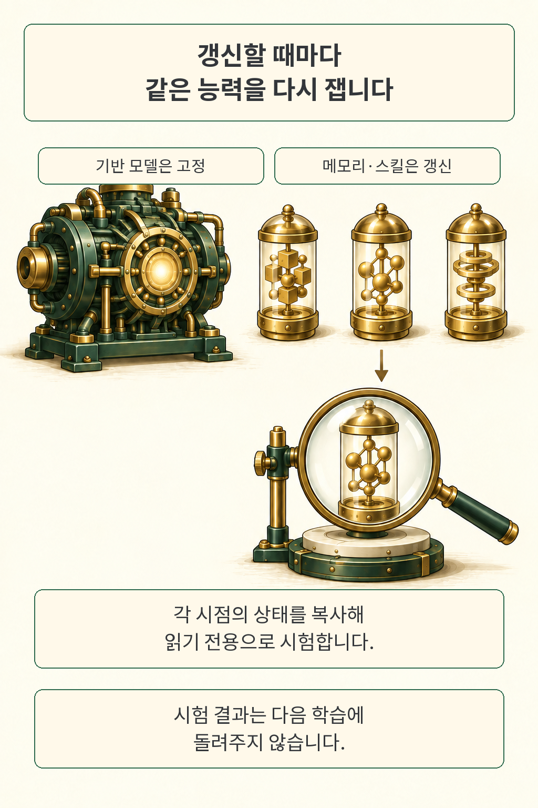
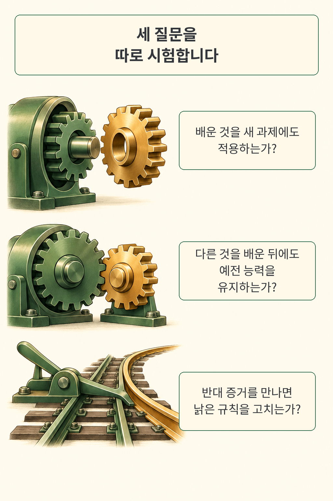
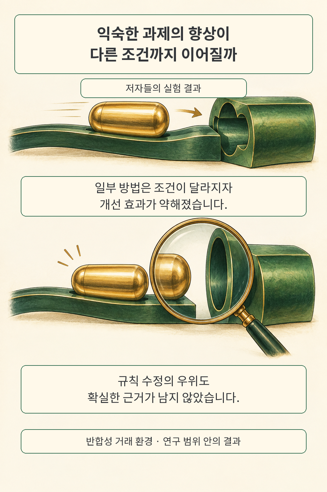

에이전트가 작업을 마칠 때마다 메모리와 스킬을 고치도록 만들었다면, 배포 뒤에도 프로그램의 행동은 계속 달라집니다. 최신 성공률만 보고 승인하기에는 어제 잘하던 일을 놓칠 가능성이 마음에 걸립니다. **EvoPathBench는 갱신 시점마다 같은 능력을 다시 시험해, 새로 배운 것·계속 유지한 것·고쳐야 할 규칙을 따로 살펴보는 평가 연구**입니다.

글·해설: 다메카솔

## 기억이 바뀐 순간을 붙잡는다

모델 버전이 같아도 다음 실행에 읽히는 메모리가 바뀌면 판단은 달라집니다. 이 연구에서 갱신하는 대상은 메모리·스킬 문서·작업 규칙이고, 기반 모델의 가중치와 도구·실행기는 고정합니다. 무엇이 변했는지 좁혀 보는 설계입니다.

연구팀은 매 시점의 상태를 복사해 따로 떼어 둔 평가 과제에 적용했습니다. 이때 복사본은 읽기 전용이며, 시험 결과를 다음 학습에 돌려주지 않습니다. 갱신하지 않는 대조군과 비교하고, 배운 상태에 접근하지 못하게 한 평가도 짝지어 실제로 그 상태가 도움이 됐는지 확인합니다. [원문 3절](https://arxiv.org/html/2609.24663v1#S3)

저는 이 분리가 메모리 갱신을 검수하는 출발점이라고 봅니다. 평가 중에 기억까지 고쳐 버리면, 방금 배포한 버전의 실력과 시험 도중 배운 효과가 뒤섞이기 때문입니다. 그림의 기억 캡슐과 검사 장치는 이 관계를 풀어낸 가상 도식입니다.

## 새로 배우기, 유지하기, 고쳐 배우기

그렇다면 어느 순서로 경험을 줘야 능력의 변화를 볼까요. 공식 데이터는 서로 다른 세 흐름을 제공합니다.

| 시험 흐름 | 경험을 주는 순서 | 확인할 질문 |
| --- | --- | --- |
| 축적 | 같은 계열의 학습 과제를 이어 줌 | 처음 보는 과제와 달라진 조건에도 적용하는가 |
| 간섭 | 먼저 한 능력을 익힌 뒤 다른 계열을 학습 | 이전에 하던 일을 계속 잘하는가 |
| 반전 | 유효했던 규칙을 배운 뒤 반대 증거를 줌 | 상황에 맞게 규칙을 수정하는가 |

각 흐름은 갱신 기회 5회와 초기 상태를 포함한 평가 시점 6개로 구성됩니다. 전체 공개본에는 생성된 과제 사양 4,800개와 흐름 1,800개가 있습니다. 흐름별·실험 묶음별로 연결된 자료이므로, 과제 수를 곧바로 독립 표본 수로 읽으면 안 됩니다. [고정한 공식 데이터와 설명](https://github.com/HQ-Lin/EvoPathBench/tree/a0a596237d888304c25be2828d30c99e2f66b3b7)

여기서 유지와 수정은 서로 다른 요구입니다. 예전 절차를 보존해야 하는 상황도 있고, 새 증거에 맞춰 버려야 하는 상황도 있습니다. 운영 평가에서도 이 둘을 구분해야 회귀 검사와 규칙 변경 승인이 충돌하는 이유를 설명하기 쉽습니다. 이는 연구 설계를 실무에 연결한 제 해석입니다.

## 익숙한 조건에서의 향상은 어디까지 갔나

익숙한 조건에서 좋아진 방법이 조건 변화 뒤에는 대조군보다 낮은 점수를 받기도 했습니다. 예를 들어 원문 표 2의 SkillOpt는 근접 분포에서 **+0.763**, 전이 조건에서 **−0.273**을 보고합니다. 같은 방법의 개선 방향이 바뀐 셈입니다. 두 값은 갱신하지 않는 대조군에 대한 위험 조정 과제 점수의 차이이며, 성공률이나 수익률의 퍼센트가 아닙니다.

규칙 수정에서는 평균값이 양수인 방법도 있었지만, 저자들은 Holm 다중비교 보정 뒤 유의한 효과가 남지 않았다고 설명합니다. 이 결과로 수정이 불가능하다고 결론 내릴 수는 없습니다. 이번 실험에서 어느 방법이 확실히 우월한지 뒷받침할 근거가 부족했다는 뜻입니다. [원문 표 2와 4.2절](https://arxiv.org/html/2609.24663v1#S4)

성능 하락의 크기도 살폈습니다. 저자들은 일부 경로에 큰 손실이 몰렸고, 더 좋은 갱신 후보를 만들어도 실제로 그 후보를 골라 저장하는 데 한계가 있었다고 보고합니다. 평균 점수와 함께 갱신별 결과를 남겨야 할 이유입니다. [4.4~4.5절](https://arxiv.org/html/2609.24663v1#S4.SS4)

범위는 좁혀 읽어야 합니다. 연구팀은 반합성 거래 시뮬레이션에서 Qwen3.8-Max와 Kimi-K3를 기반으로 메모리·스킬 방법을 평가했습니다. 실제 서비스의 코드 수정이나 고객 지원에 같은 효과가 나는지는 별도 검증이 필요합니다. 이 글은 투자 성과를 다루지 않습니다. [원문 부록 A.4·B.4](https://arxiv.org/pdf/2609.24663v1)

## 공개 파일에서 직접 확인한 것

2026년 9월 22일 공식 저장소의 커밋 `a0a59623`을 고정해 데이터 검증기를 실행했습니다. 파일 9개의 해시, 과제 4,800개, 흐름 1,800개가 검사에 통과했고 공식 데이터 무결성 테스트도 통과했습니다. 별도 검사에서도 모든 흐름의 학습 과제 ID와 평가 과제 ID가 겹치지 않았습니다.

확인 범위는 데이터 구성과 무결성까지입니다. 모델을 호출해 논문의 성능을 재현하는 실험은 수행하지 않았습니다. 데이터가 바르게 연결됐다는 사실과 제시된 성능을 독립적으로 재현했다는 주장은 구별해 두겠습니다. [공식 검증 코드](https://github.com/HQ-Lin/EvoPathBench/blob/a0a596237d888304c25be2828d30c99e2f66b3b7/scripts/validate_dataset.py)

## 다메카솔의 해석: 메모리도 배포 이력을 갖게 하기

코드는 커밋으로 되돌리면서 에이전트의 기억은 최신 파일 하나만 남긴다면, 행동이 변한 이유를 추적하기 어렵습니다. 저는 메모리·스킬 버전과 그 버전을 사용한 평가 결과를 함께 보관하겠습니다. 갱신이 승인된 이유, 이전 규칙의 적용 조건, 새 증거로 바꾼 부분까지 연결하면 되돌릴 대상을 정하기도 수월합니다. 판단 근거를 남기는 설계는 [Workflow as Knowledge의 지식 계보 논의](/posts/workflow-as-knowledge/)와 이어집니다.

평가 비용도 설계에 넣어야 합니다. 매번 모든 과제를 다시 실행하는 대신, 바뀐 규칙에 가까운 과제와 지켜야 할 기존 능력의 대표 과제를 먼저 돌리는 방식을 검토할 만합니다. 다만 대표 과제만 반복하면 그 시험에 맞춘 갱신이 살아남을 수 있으니, 승인에 쓰지 않는 별도 평가 묶음도 필요합니다. 이것은 논문에서 검증한 운영 해법이 아니라 제가 제안하는 구현 방향입니다.

제 기준에서 메모리 갱신의 승인 기록은 파일 변경 내역과 평가 결과를 함께 담아야 합니다. 새로 해결한 일 옆에 계속 해결해야 하는 일의 결과가 있어야, 그 버전을 배포한 이유가 남습니다.

## 출처

- Hongqiang Lin 외, [Beyond Endpoint Performance: Process-Level Evaluation of Self-Evolving Agents](https://arxiv.org/abs/2609.24663v1). arXiv v1, 2026년 9월 21일 제출.
- [원문 PDF](https://arxiv.org/pdf/2609.24663v1): 평가 설계 3절, 결과 표 2·4.2절, 환경과 실행 조건 부록 A·B.
- [공식 코드·데이터 고정 버전](https://github.com/HQ-Lin/EvoPathBench/tree/a0a596237d888304c25be2828d30c99e2f66b3b7): 공개 데이터와 오프라인 무결성 검사.

출처 확인·작성: 2026년 9월 22일.

이 글의 본문과 이미지는 생성형 AI로 제작했습니다. 기획과 편집 기준은 다메카솔이 정했습니다.
