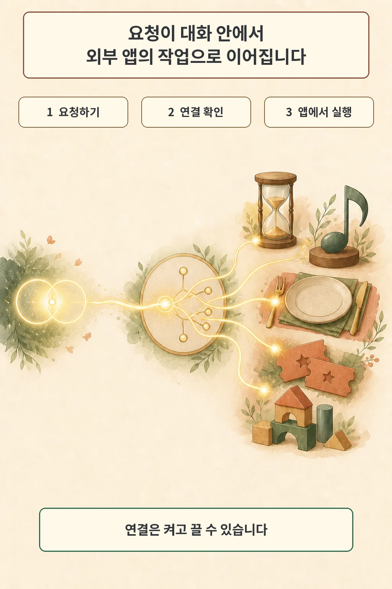

연결 앱 목록이 커진 만큼 지원표 확인이 더 중요해졌습니다. Google은 2026년 8월 12일 Gemini에 새로운 Connected Apps 묶음을 추가한다고 발표했습니다. 회의 요약부터 웹사이트 편집, 예약, 티켓 검색, 음악 재생까지 대화 안에서 외부 서비스의 작업으로 이어지는 범위를 넓히는 변화입니다.

글·해설: 다메카솔

## 새 파트너는 앞으로 몇 주에 걸쳐 열립니다

Google이 발표한 파트너는 생산성·창작, 지역·엔터테인먼트, 음악, 주거·건강·생활 서비스에 걸쳐 있습니다. Granola와 Otter.ai로 회의를 요약하고, Wix로 웹사이트를 편집하며, OpenTable과 Zocdoc 같은 서비스에서 예약 작업을 처리하는 예시를 제시했습니다.

시점은 구분해야 합니다. 발표문은 이 기능들을 당일 전 세계에 일괄 제공한다고 쓰지 않았습니다. Google이 밝힌 상태는 `앞으로 몇 주에 걸친 롤아웃`입니다. 파트너 이름이 공개된 시점과 내 계정에서 기능이 보이는 시점은 다를 수 있습니다.

## 대화에서 외부 앱의 작업으로 이어집니다

연결 방식은 대화 흐름 안에 들어옵니다. 사용자는 앱 이름을 말하거나 `@앱이름`을 프롬프트에 넣어 작업을 요청할 수 있습니다. 연결되지 않은 앱이면서 사용 조건을 충족하면 Gemini가 연결 옵션을 보여 줍니다.

설정 화면은 통제 지점입니다. Connected Apps 설정에서 사용 가능한 앱과 지원 작업을 확인할 수 있고, 외부 앱 계정과 Google 계정의 연결도 나중에 해제할 수 있습니다. 대화가 외부 행동으로 이어질수록 어떤 앱이 연결돼 있는지 점검하는 습관이 중요해집니다.

## 실제 가용성은 앱마다 다릅니다

Google의 공식 지원표는 Connected Apps의 가용성이 위치, 언어, 기기, Gemini 앱과 모드에 따라 달라진다고 명시합니다. 앱별로 개인·업무·학교 계정 지원, 최소 연령, 국가, 언어, 구독 조건도 따로 적혀 있습니다. 같은 파트너라도 웹과 모바일, Gemini chat·Spark·Live에서 지원 범위가 같다고 가정할 수 없습니다.

한국에서 Gemini를 쓰는 독자라면 파트너 목록만 보고 기능을 찾기보다 지원표의 지역과 언어부터 확인하는 편이 빠릅니다. 목록에 있다는 사실은 생태계 합류를 뜻하고, 현재 내 계정에서 쓸 수 있다는 판단은 별도의 조건 검사가 필요합니다.

## 다메카솔의 해석

이번 발표에서 제가 주목한 부분은 앱 숫자가 아닙니다. Gemini가 답변 도구에서 외부 서비스의 실제 작업을 이어 주는 허브로 넓어지는 방향이 더 중요합니다. 회의 요약, 웹 편집, 예약과 티켓 검색이 한 대화 안에 모이면 사용자는 앱 사이를 옮기는 대신 의도를 말하게 됩니다.

그 변화는 확인할 책임도 키웁니다. 저라면 새 앱 이름보다 먼저 내 계정의 지원 범위와 연결 상태를 살피겠습니다. 앞으로 볼 지점은 파트너 수보다 지역·언어 확대 속도, 모드별 지원 차이, 그리고 연결 해제와 권한 확인이 얼마나 분명하게 유지되는지입니다.

## 출처

- [Google — New connected apps are coming to Gemini](https://blog.google/innovation-and-ai/products/gemini-app/new-connected-apps-services-gemini-august-2026/)
- [Gemini Apps Help — Check the availability & requirements of Connected Apps in Gemini Apps](https://support.google.com/gemini/table/17434654)

이 글의 본문과 이미지는 생성형 AI로 제작했습니다. 기획과 편집 기준은 다메카솔이 정했습니다.
