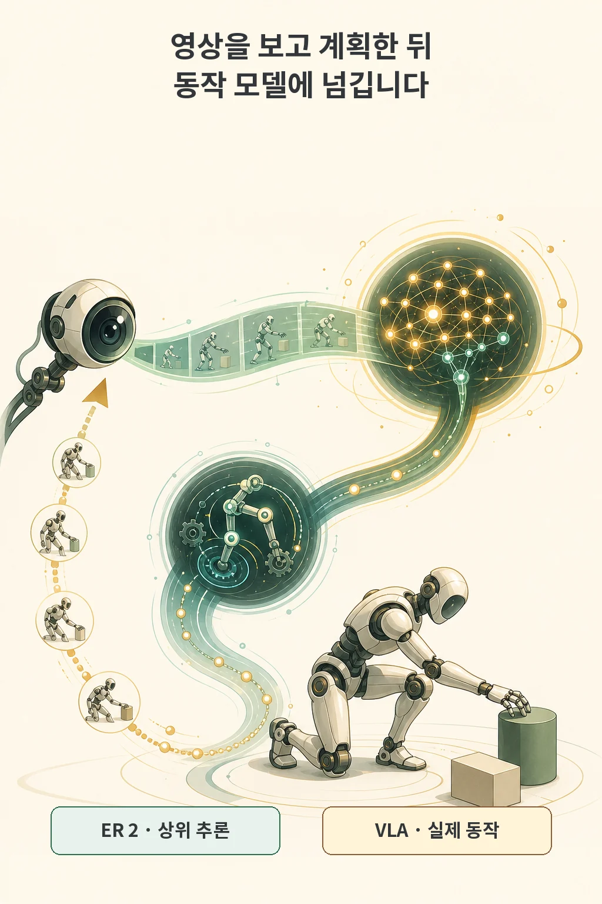
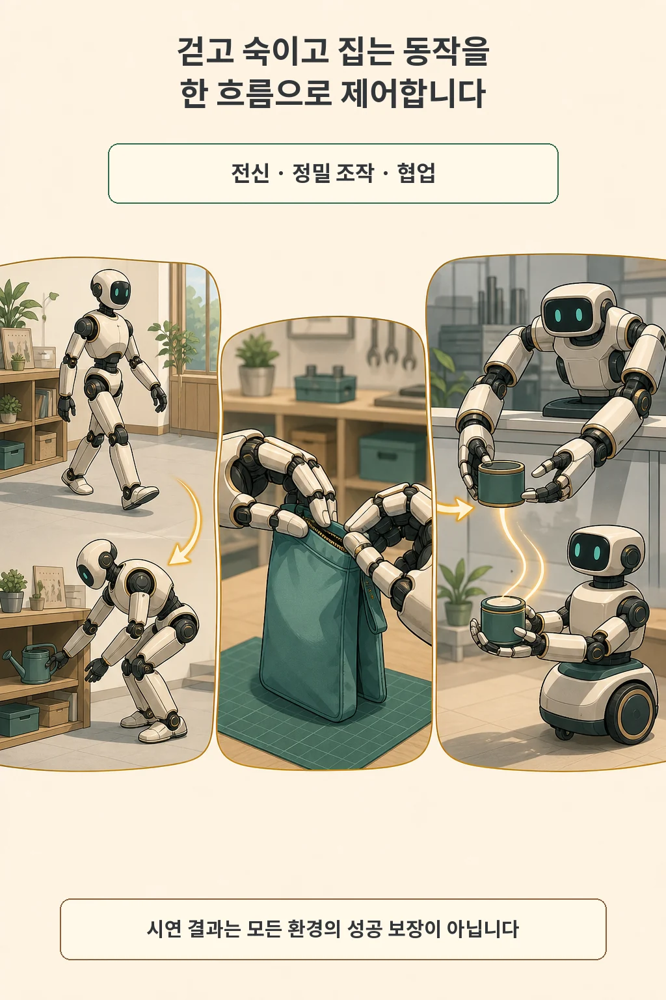
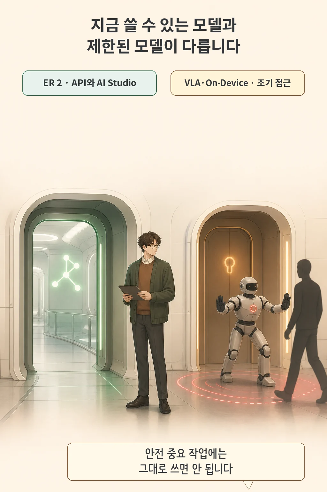

Google DeepMind는 2026년 7월 30일 **Gemini Robotics 2** 모델군을 발표했습니다. 이번 변화는 로봇이 영상을 보고 계획하는 상위 추론, 몸을 움직이는 하위 제어, 기기 내부 실행을 서로 다른 모델 역할로 나눈 데 있습니다. ER 2는 개발자가 지금 API로 시험할 수 있지만, 실제 동작을 만드는 VLA와 온디바이스 모델은 조기 접근 파트너 범위입니다.

글·해설: 다메카솔

## 생각과 동작을 두 층으로 나눕니다

Gemini Robotics ER 2는 로봇의 상위 수준 두뇌 역할을 맡습니다. 영상·이미지·음성·텍스트를 받아 공간과 작업 진행을 이해하고, 여러 단계를 계획한 다음 하위 Vision-Language-Action(VLA) 모델이나 로봇 API를 도구처럼 호출합니다. VLA는 그 계획을 실제 관절과 그리퍼 움직임으로 바꾸는 층입니다.

연속 영상은 작업이 어디까지 진행됐는지 확인하는 데 쓰입니다. Google DeepMind는 ER 2가 실패를 발견하면 단계를 조정하고, 작업의 시작과 끝을 구분하며, 여러 분 동안 수백 번의 결정을 포함하는 흐름을 다룬다고 설명합니다. 이 대목은 회사가 공개한 모델·시연 범위의 주장입니다.

## 전신과 손, 여러 로봇을 한 흐름에 묶습니다

전신 제어가 이번 발표의 눈에 띄는 변화입니다. 이전 상체 중심 작업을 넘어 휴머노이드가 걷고, 숙이고, 뻗고, 물건을 집는 움직임을 한 작업 안에서 이어 간다고 Google DeepMind는 밝혔습니다. 양손과 그리퍼의 정밀 조작, 서로 다른 형태의 로봇이 한 작업을 넘겨받는 협업도 함께 시연했습니다.

On-Device 2는 네트워크 지연이나 연결이 어려운 로봇 내부 실행을 겨냥합니다. 회사는 새로운 양팔 로봇 형태에 몇 시간 분량, 대체로 200개 미만의 예시로 적응할 수 있다고 설명했습니다. 이 수치는 공개된 적응 조건의 결과이며, 모든 로봇과 현장에서 같은 비용으로 재현된다는 뜻은 아닙니다.

[긴 시각·행동 이력을 다루는 RobotTT 연구](/posts/robottt-long-context-policies/)가 정책의 기억 문제를 보여 줬다면, 이번 발표는 그 정책이 실제 몸을 움직이기 전에 어떤 추론·제어 층을 거치는지 보여 줍니다. 둘은 같은 로보틱스 범주에 있지만 질문이 다릅니다.

## 공개된 ER 2와 제한된 동작 모델을 구분합니다

ER 2는 Gemini API와 Google AI Studio에서 공개 제공됩니다. Gemini Enterprise Agent Platform에서는 private preview이며, 개발 예제도 공식 GitHub 저장소에 공개됐습니다. 반면 Gemini Robotics 2 VLA와 On-Device 2는 조기 접근 파트너 대상입니다.

따라서 “Gemini Robotics 2가 공개됐다”는 문장만으로 휴머노이드 모터 제어 모델까지 누구나 내려받아 쓸 수 있다고 해석하기 어렵습니다. 지금 일반 개발자가 바로 시험할 수 있는 중심은 ER 2의 상위 추론과 도구 오케스트레이션입니다. 실제 로봇 동작 층의 접근 조건은 별도로 확인해야 합니다.

## 안전 정지는 모델만의 일이 아닙니다

공식 안전 자료는 사람이 가까워졌을 때 보호 정지를 호출하고, 실행 불가능하거나 불확실한 요청에서는 사람에게 도움을 구하는 능력을 평가합니다. 새 ASIMOV-Agentic 벤치마크도 안전 제약을 지키고 환경을 감시하며 모호함을 풀어내는 상위 오케스트레이터에 초점을 둡니다.

물리 안전장치는 계속 필요합니다. 보고서는 비상 정지, 물리 장벽, 속도·힘 제한이 기본이라고 적고, 모델 카드는 의료·교통처럼 오작동이 사망·부상·재산 피해로 이어질 수 있는 안전 중요 작업에 Robotics Models를 사용하지 말라고 요구합니다.

## 다메카솔의 해석

제가 이번 발표에서 가장 중요하게 본 부분은 화려한 휴머노이드 동작보다 **역할과 접근 범위를 나눈 구조**입니다. 개발자는 ER 2로 계획·진행 추적·도구 호출을 시험할 수 있고, 실제 모터 제어는 VLA와 로봇 API의 책임으로 남습니다. 시연을 볼 때도 어떤 모델이 어떤 몸에서 어떤 조건으로 움직였는지, 실패 시 안전 정지가 어디서 작동하는지부터 확인하겠습니다.

실제 도입 검토는 네 질문으로 시작할 수 있습니다.

- 내가 접근할 수 있는 것은 ER 2인가, VLA·On-Device 2까지인가?
- 상위 추론이 호출하는 로봇 API와 VLA에 속도·힘·공간 제한이 있는가?
- 사람 접근, 센서 오류, 실행 불가능한 요청에서 보호 정지와 이관이 작동하는가?
- 회사 시연의 로봇·과제·평가 조건이 내 환경과 얼마나 가까운가?

Gemini Robotics 2는 생각하는 층과 움직이는 층을 연결하는 큰 업데이트입니다. 다음 판단은 데모의 동작 수보다 공개된 모델 범위, 하위 제어 인터페이스, 물리 안전장치를 내 환경에 대조하는 일입니다.

## 출처

- [Google DeepMind — Gemini Robotics 2 brings whole body intelligence to robots](https://deepmind.google/blog/gemini-robotics-2-brings-whole-body-intelligence-to-robots/)
- [Google — Introducing Gemini Robotics ER 2](https://blog.google/innovation-and-ai/models-and-research/google-deepmind/gemini-robotics-er-2/)
- [Google DeepMind — Gemini Robotics ER 2 Model Card](https://deepmind.google/models/model-cards/gemini-robotics-er-2/)
- [Google DeepMind — Gemini Robotics 2: Safety Evaluations](https://storage.googleapis.com/deepmind-media/gemini-robotics/Gemini-Robotics-2-Safety.pdf)

이 글의 본문과 이미지는 생성형 AI로 제작했습니다. 기획과 편집 기준은 다메카솔이 정했습니다.

Updated: 2026-08-02
