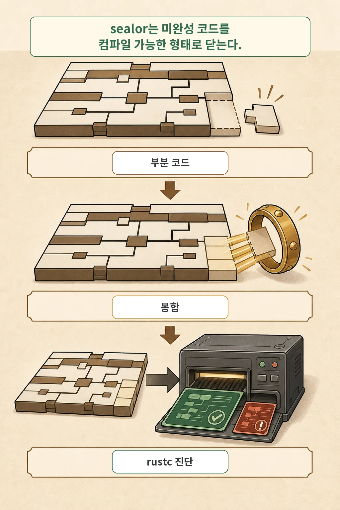
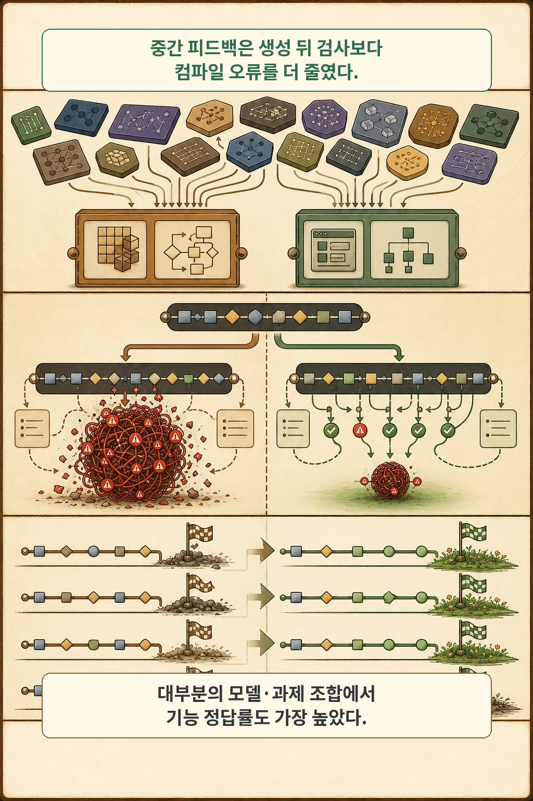

글·해설: 다메카솔

AI 코딩 에이전트에게 복잡한 Rust나 C++ 알고리즘 작성을 맡겼을 때, 수백 줄의 코드가 스트리밍되는 것을 끝까지 기다렸다가 `cargo check`를 돌려본 경험이 있으실 겁니다.

그리고 돌아오는 것은 **"5번째 줄에서 발생한 소유권(Borrow Checker) 및 타입 불일치 오류 때문에, 그 뒤에 작성된 80줄의 코드가 연쇄적으로 망가져 컴파일 에러가 20개 넘게 폭증하는 대참사"**입니다.

결국 AI는 수십 초 동안 헛수고를 한 셈이고, 수정한답시고 전체 코드를 처음부터 다시 생성하느라 토큰과 시간을 낭비합니다.

최근 발표된 논문 **Generative Compilation: On-the-Fly Compiler Feedback as AI Generates Code**는 이 문제를 해결하기 위해 **"AI가 코드를 스트리밍으로 작성하는 도중에, 미완성 코드를 실시간으로 컴파일러에 던져 조기에 오류를 바로잡는" 획기적인 온더플라이(On-the-fly) 검증 기술**을 제안했습니다.

## 생성 후 컴파일(Post-hoc)의 치명적인 지연 문제

현재 대부분의 코딩 도구는 **"코드 생성 완료 ➡️ 파일 저장 ➡️ 컴파일러 실행 ➡️ 에러 메시지를 프롬프트에 담아 재생성"**이라는 사후 루프(Post-hoc loop)를 돕니다.

이 방식의 문제는 **피드백의 시점이 너무 늦다**는 것입니다:
- 초반부의 사소한 타입 가정(Type Assumption) 하나가 틀어지면, 그 뒤에 생성되는 모든 함수 호출과 변수 선언이 잘못된 전제 위에 쌓여 오류의 눈덩이(Error Snowball)를 만듭니다.
- 에러가 난 시점과 원인 위치 사이의 거리가 너무 멀어져, AI 모델조차 어디서부터 손을 대야 할지 헷갈려합니다.

## 해결책: 미완성 코드를 컴파일러에 넣는 'Sealor(봉합기)'의 마법

"아직 닫히지도 않은 중괄호 `{`와 미완성 함수를 컴파일러(`rustc`)에 넣으면 당연히 문법 에러(Syntax Error)가 날 텐데, 어떻게 중간 검사를 할 수 있을까?"

연구진은 **Sealor**라는 가벼운 AST 변환기를 고안했습니다:
1. **임시 구문 닫기**: 아직 닫히지 않은 제어문과 블록에 가상의 닫는 괄호 `}`를 자동 보충
2. **플레이스홀더(Placeholder) 주입**: 아직 생성되지 않은 함수의 리턴값이나 변수 자리에 타입 추론을 방해하지 않는 특수 구문(`todo!()`, `unimplemented!()`)을 임시 주입
3. **표준 컴파일러 검증**: 완성된 형태의 '봉합된 코드(Sealed Program)'를 실제 `rustc`에 넘겨, **이미 작성된 앞부분 코드의 타입 안정성과 빌림 검사(Borrow Check)만 정확히 검증**

## 생성형 컴파일(Generative Compilation)의 5단계 루프

1. AI 모델이 코드를 한 줄씩 토큰 스트리밍
2. 백그라운드 워커가 현재까지 작성된 프리픽스(Prefix) 코드를 Sealor로 봉합
3. `rustc`가 실시간으로 타입/소유권 검증 수행
4. **되돌릴 수 없는 치명적 타입 오류가 감지되면 즉시 생성을 중단(Break)하고 오류 위치로 되감기(Rewind)**
5. 컴파일러의 에러 메시지를 즉각 주입하여 올바른 방향으로 이어서 생성

## Rust 벤치마크 실험 결과

7개 최신 LLM을 대상으로 고난도 Rust 코드 변환 및 API 마이그레이션 과제를 평가한 결과:
- **컴파일 에러율**: 기존 사후 컴파일 방식(20.7%) 대비 **13.1%로 대폭 감소**
- **단일 에러당 진단 수**: 평균 13.8개에서 **5.5개로 감소** (연쇄 파생 오류 제거)
- **오류 감지 시점**: 전체 코드의 평균 33% 지점에서 조기 발견하여, **나머지 67%의 불필요한 토큰 낭비를 원천 차단**

## 다메카솔의 해석: 컴파일러는 '최종 채점관'이 아닌 '실시간 가드레일'이어야 한다

시니어 엔지니어링 관점에서 이 논문은 컴파일러와 정적 분석 도구(Linter)의 역할을 새롭게 정의합니다.

1. **조기 실패(Fail-Fast)의 힘**: 에이전트 시스템을 구축할 때 모든 작업이 끝난 뒤에 유닛 테스트를 돌리는 것보다, 중간 단계마다 정적 분석 가드레일을 걸어주는 것이 훨씬 저렴하고 정확합니다.
2. **도메인 특화 린터와의 결합**: Rust의 `rustc`뿐만 아니라, TypeScript, Python의 `mypy`/`ruff` 등도 부분 코드 파싱 기법을 결합하여 실시간 에이전트 생성 루프에 통합할 수 있습니다.
3. **정적 검증과 의미 검증의 조화**: 컴파일러가 문법과 타입을 100% 보증해주더라도, 비즈니스 요구사항과 보안 검증은 별도의 E2E 테스트와 리뷰를 통해 최종 검증해야 합니다.

## 함께 읽을 AI 코딩 글

- [Claude Opus 5와 GitHub Copilot 지원 분석](/posts/claude-opus-5-github-copilot/)
- [Copilot 보안 API 실증 연구와 검증 가드레일](/posts/copilot-security-api-study/)

## 출처

- [Generative Compilation: On-the-Fly Compiler Feedback as AI Generates Code, arXiv:2607.13921](https://arxiv.org/abs/2607.13921)

이 글의 본문과 이미지는 생성형 AI로 제작했습니다. 기획과 편집 기준은 다메카솔이 정했습니다.
