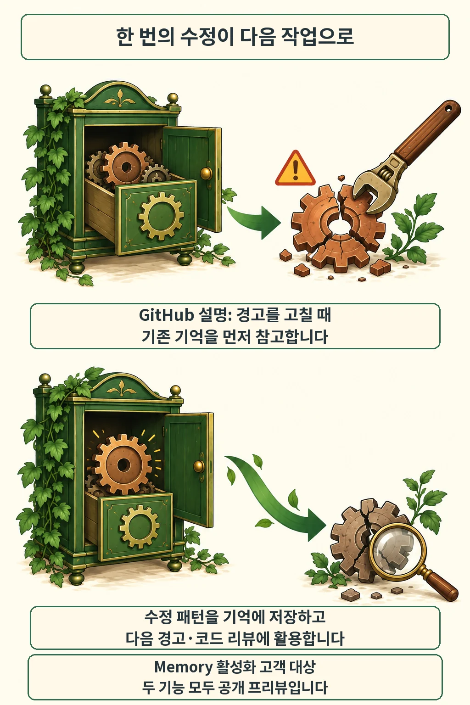

글·해설: 다메카솔

발행·확인: 2026-09-27

같은 저장소에서 비슷한 보안 경고를 고칠 때, 앞서 찾은 수정 방식을 다음 작업에서도 참고할 수 있게 됐습니다. GitHub는 **2026년 9월 25일 Agentic autofix에 Copilot Memory를 연결했다**고 발표했습니다. Memory를 켠 고객이 대상이며, 두 기능 모두 공개 프리뷰입니다. 이번 변화의 핵심은 보안 수정 패턴을 저장해 다른 경고와 코드 리뷰에 활용하는 흐름입니다. [공식 변경 공지](https://github.blog/changelog/2026-09-25-agentic-autofix-now-uses-copilot-memory/)

## 경고를 고친 다음에 남는 것

GitHub의 설명에 따르면 에이전트는 경고를 처리할 때 기존 기억을 참고하고, 수정안을 만들면 그 패턴을 새 기억으로 저장합니다. 이후 다른 경고를 고치거나 Copilot 코드 리뷰·클라우드 에이전트를 사용할 때도 이 지식을 활용할 수 있습니다. 한 번의 작업에서 얻은 맥락이 다음 작업으로 이어지는 셈입니다.

여기서 Agentic autofix는 저장소 코드를 탐색하고 수정과 검증을 반복해 풀 리퀘스트(PR)를 여는 기능입니다. 일반 Copilot Autofix는 사람이 검토하고 적용할 단일 수정안을 제시합니다. 두 경로의 실행 방식과 이용 조건을 구분해야 합니다.

이번 발표에서 확인한 것은 기능 연동입니다. 특정 저장소의 취약점 감소율이나 무검토 병합의 안전성은 발표 자료로 판단하기 어렵습니다. [AI 코딩 도우미의 보안 API 사용 연구](/posts/copilot-security-api-study/)에서도 도구의 도움과 실제로 안전한 결과를 구분해 살펴봤습니다.

## 저장된 사실은 현재 브랜치에서 다시 확인합니다

기억의 근거가 코드와 함께 남습니다. GitHub 문서는 저장소 사실에 코드 인용을 붙이고, 사용할 때 현재 브랜치에서 그 근거를 검증한다고 설명합니다. 검증한 사실만 활용한다는 설계입니다.

저장소 사실은 같은 저장소의 작업에서 공유됩니다. 저장소 소유자는 이를 검토하고 삭제할 수 있습니다. 개인 선호는 별도 종류의 기억이며, 코드 리뷰는 저장소 사실만 사용합니다. 이번 보안 수정 패턴을 다른 저장소로 무조건 퍼지는 개인 선호와 섞어 읽으면 범위를 잘못 이해하게 됩니다. [Memory 문서](https://docs.github.com/en/enterprise-cloud@latest/copilot/concepts/agents/copilot-memory)

## 도입 조건과 검증 범위

관리자는 Memory 설정에 더해 저장소의 에이전트 사용 조건도 확인해야 합니다. 조건은 두 겹입니다.

| 확인 대상 | 공식 문서에서 확인한 조건 |
| --- | --- |
| Copilot Memory | 유료 Copilot 플랜에서 제공하며 사용자별로 설정합니다. 개인 플랜은 기본 켜짐, 조직·엔터프라이즈 관리 플랜은 관리자 정책 허용이 먼저입니다. |
| Agentic autofix | 해당 저장소에서 Copilot cloud agent와 Copilot Autofix를 모두 사용할 수 있어야 합니다. 세션은 AI 크레딧을 소비합니다. |
| 검사 범위 | code-scanning 쿼리 모음으로 CodeQL을 다시 실행합니다. custom·security-extended 쿼리 경고의 해결 여부는 확인할 수 없고 타사 도구 경고의 수정 품질도 보장 범위 밖입니다. |

공개 프리뷰의 정책과 동작은 달라질 수 있습니다. 이 글은 9월 27일의 공개 문서를 대조했으며, 실제 계정에서 기능을 실행하거나 수정 성능을 측정한 사용기는 아닙니다. [Autofix 문서](https://docs.github.com/en/enterprise-cloud@latest/code-security/concepts/code-scanning/autofix-for-code-scanning)

## 다메카솔의 해석: 기억 검증과 수정 검증을 나눕니다

저는 이 연동을 저장소별 수정 맥락을 다시 찾는 비용을 줄이는 장치로 봅니다. 예를 들어 여러 API가 같은 입력 검증 함수를 쓰는 저장소를 가정해 봅시다. 앞선 작업에서 그 함수를 찾았다면 다음 수정도 어디서 시작할지 빨리 좁힐 여지가 있습니다. 이는 원리를 설명하기 위한 가정입니다.

하지만 함수를 기억하는 것과 새 호출부가 안전하게 쓰는 것은 다른 검사입니다. 현재 코드가 기억을 뒷받침하는지 확인한 뒤, 해당 경고를 다시 검사하고 기존 정상 요청과 실패 요청의 동작도 테스트해야 합니다. 코드 구조가 유지돼도 호출 조건은 달라질 수 있기 때문입니다.

기억의 정확성, 경고 해결, 동작 보존을 각각 확인하는 편이 실패 원인을 찾기도 쉽습니다. 저장된 패턴은 리뷰어에게 근거를 더해 주는 자료로 쓰고, 병합 판단에는 실제 변경 내용과 검사 결과를 함께 남기는 것이 제 판단입니다.

## 출처

- [Agentic autofix now uses Copilot Memory](https://github.blog/changelog/2026-09-25-agentic-autofix-now-uses-copilot-memory/) — 2026-09-25 발표
- [About GitHub Copilot Memory](https://docs.github.com/en/enterprise-cloud@latest/copilot/concepts/agents/copilot-memory) — 2026-09-27 확인
- [About autofix for code scanning](https://docs.github.com/en/enterprise-cloud@latest/code-security/concepts/code-scanning/autofix-for-code-scanning) — 2026-09-27 확인

이 글의 본문과 이미지는 생성형 AI로 제작했습니다. 기획과 편집 기준은 다메카솔이 정했습니다.
