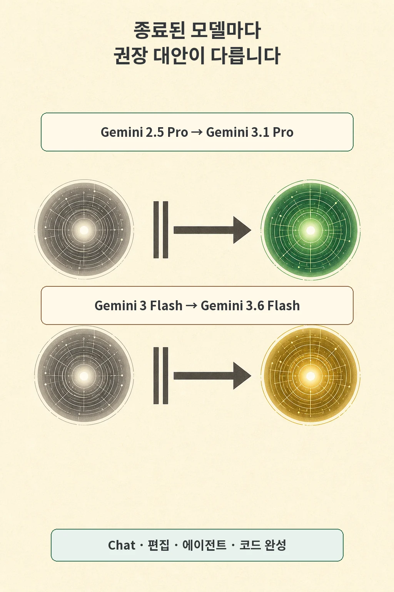

모델 하나를 고정해 둔 자동화는 이제 이름 두 개를 확인해야 합니다. GitHub는 2026년 7월 31일 **GitHub Copilot에서 Gemini 2.5 Pro와 Gemini 3 Flash를 deprecated 처리**했습니다. 권장 대안은 각각 Gemini 3.1 Pro와 Gemini 3.6 Flash입니다.

글·해설: 다메카솔

## Copilot 전반에서 두 모델 지원이 끝났습니다

GitHub가 밝힌 변경 범위는 모델 선택기 한 곳에 그치지 않습니다. Copilot Chat, inline edits, ask와 agent mode, code completions를 포함한 모든 GitHub Copilot 경험에 적용됩니다. GitHub Docs의 model retirement history에도 두 모델의 종료일이 2026년 7월 31일로 기록돼 있습니다.

GitHub는 deprecated 모델을 제거하기 위한 별도 동작은 필요 없다고 설명했습니다. 반면 workflow와 integration이 두 모델을 이름으로 고정했다면 지원 모델을 쓰도록 업데이트해야 합니다. 자동 선택만 쓰는 사용자와 명시적으로 모델명을 저장한 사용자의 할 일이 갈리는 지점입니다.

## 대체 모델은 한 쌍씩 확인합니다

두 교체 관계는 서로 다릅니다.

- Gemini 2.5 Pro → Gemini 3.1 Pro
- Gemini 3 Flash → Gemini 3.6 Flash

GitHub Docs에서 Gemini 3.1 Pro는 Public preview, Gemini 3.6 Flash는 GA로 표시됩니다. 두 모델의 상태와 기능 조건이 같지 않으므로 이름만 보고 완전히 같은 대체품으로 가정하기 어렵습니다. 모델 가용성도 Copilot 플랜과 GitHub.com·IDE 같은 사용 표면에 따라 달라집니다.

## 사용자 선택과 조직 정책을 함께 봅니다

개인 사용자는 Copilot 설정과 모델 선택기에서 대체 모델이 보이는지 먼저 확인할 수 있습니다. 모델명을 적어 둔 프롬프트 템플릿, 에이전트 설정, 스크립트나 팀 문서가 있다면 두 종료 모델을 검색해 교체 범위를 찾는 편이 빠릅니다.

조직에서는 관리자 정책이 한 단계 더 붙습니다. GitHub는 Copilot Enterprise 관리자가 대체 모델 접근을 모델 정책에서 활성화해야 할 수 있다고 안내했습니다. 사용자의 플랜에 모델이 포함돼도 조직이 해당 모델을 허용하지 않았다면 선택기에서 바로 쓸 수 없습니다.

## 다메카솔의 해석

저라면 이번 변경을 선택기 정리가 아니라 **외부 의존성 교체**로 기록하겠습니다. 모델명을 바꾼 뒤에는 대표 프롬프트와 에이전트 작업을 다시 실행해 결과 품질, 응답 형식, 도구 호출, 비용 조건을 확인하겠습니다. GitHub가 대체 모델을 제시했다는 사실은 기존 결과와 같은 동작을 보장한다는 뜻까지 담고 있지 않습니다.

점검 순서는 짧습니다.

1. 저장소와 자동화에서 두 종료 모델명을 검색합니다.
2. 각 모델을 GitHub가 제시한 대안과 연결합니다.
3. 개인 플랜과 사용 표면에서 대안이 보이는지 확인합니다.
4. Business·Enterprise라면 조직 모델 정책도 확인합니다.
5. 대표 작업을 다시 실행하고 차이를 남깁니다.

모델 목록은 계속 바뀝니다. 이번에 교체 기록과 대표 테스트를 남겨 두면 다음 지원 종료 때도 같은 절차로 대응할 수 있습니다.

## 출처

- [GitHub Changelog — Gemini 2.5 Pro and Gemini 3 Flash deprecated](https://github.blog/changelog/2026-07-31-gemini-2-5-pro-and-gemini-3-flash-deprecated/)
- [GitHub Docs — Supported AI models in GitHub Copilot](https://docs.github.com/en/copilot/reference/ai-models/supported-models)

이 글의 본문과 이미지는 생성형 AI로 제작했습니다. 기획과 편집 기준은 다메카솔이 정했습니다.

Updated: 2026-08-03
