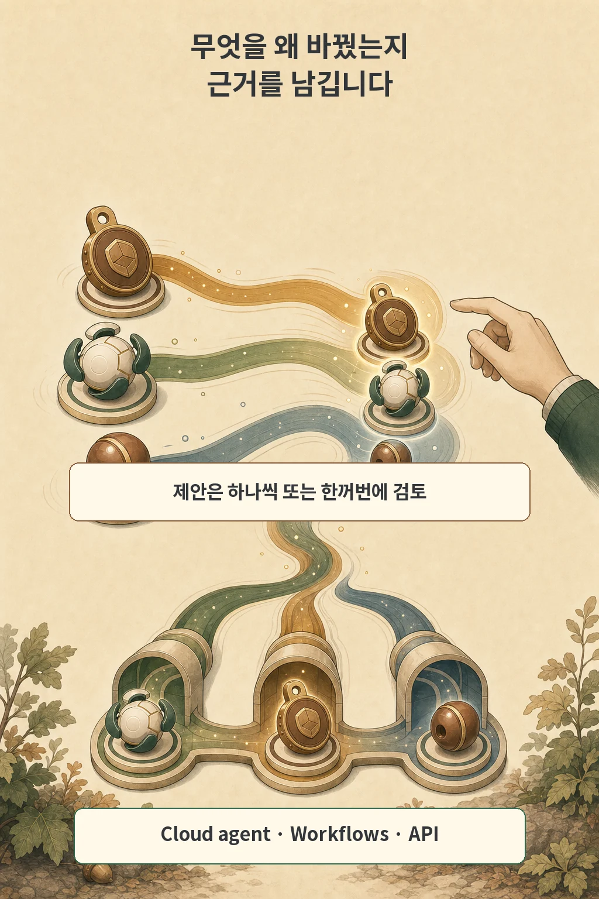

글·해설: 다메카솔

GitHub Issues에서 AI 에이전트가 버그 리포트를 분석해 자동으로 담당자를 배정하고, 적절한 라벨을 붙이며, 완료된 이슈를 닫아주는 자동화는 매우 매력적입니다.

하지만 에이전트가 잘못된 맥락으로 이슈를 오판해 엉뚱한 사람에게 티켓을 몰아주거나, 아직 해결되지 않은 중요 장애 이슈를 멋대로 닫아버린다면 협업에 큰 혼선이 빚어집니다.

최근 GitHub는 이러한 문제를 방어하기 위해 **Issues 에이전트 자동화에 '변경 근거(Rationale)', '신뢰도(Confidence)', '사람 승인(Human-in-the-loop) 가드레일'을 전격 도입**했습니다.

이번 글에서는 GitHub의 새로운 에이전트 통제 모델과, **"UI 승인 화면이 결코 보안 샌드박스를 대체할 수 없는 이유"**를 살펴보겠습니다.

## 신뢰도가 낮으면 자동 반영 대신 '사람 검토 대기'로 보류

새로운 시스템에서 AI 에이전트는 이슈 속성(라벨, 담당자, 이슈 타입, 닫기 여부)을 변경할 때마다 자체적인 신뢰도(`High`, `Medium`, `Low`)를 매깁니다:

저장소 관리자는 팀의 성향에 맞춰 4단계의 통제 레벨을 설정할 수 있습니다:
- **Full Control (전면 수동)**: 모든 AI 변경사항을 사람의 승인 대기열로 전달
- **Cautious (보수적 - 기본값)**: `High` 신뢰도만 자동 적용하고 나머지는 사람 검토 대기
- **Balanced (균형)**: 애매한 변경만 선별하여 보류
- **Full Automation (전면 자동)**: 불확실성이 극히 높은 일부 경우를 제외하고 자동 적용

## 왜 그렇게 바꿨는지 '추론 근거(Rationale)'를 남긴다

단순히 "라벨이 `bug`로 변경되었습니다"라고만 뜨면 사람은 왜 그렇게 판단했는지 알 길이 없습니다.

새로운 기능은 에이전트가 **"이슈 본문 3번째 단락의 스택트레이스 에러 로그를 기반으로 `backend-error` 라벨을 제안함"**처럼 구체적인 판단 근거를 이슈 타임라인에 남깁니다. 개발자는 이 근거를 읽고 클릭 한 번으로 수락하거나 거절할 수 있습니다.

## 주의: 승인 UI는 '보안 경계'가 아니다

여기서 엔지니어링 관점에서 가장 중요한 맹점이 있습니다.

GitHub 공식 문서가 밝히고 있듯, 이 승인 기능은 어디까지나 **'워크플로우 편의 기능(Workflow Convenience)'**일 뿐, 서버 레벨에서 강제되는 **'보안 격리 장치(Security Boundary)'가 아닙니다.**

에이전트에게 부여된 GitHub Token(PAT / GitHub App)에 `issues: write` 권한이 열려 있다면, 악의적이거나 탈취당한 에이전트 스크립트는 **웹 UI의 승인 창을 우회하여 REST/GraphQL API를 통해 이슈를 직접 조작**할 수 있습니다.

따라서 진정한 통제는 화면 위의 승인 버튼이 아니라, **"에이전트 토큰의 최소 권한(Least Privilege) 부여와 허용 도구(Tool Allowlist) 제한"**이라는 밑단 보안에서 완성됩니다.

## 다메카솔의 해석: AI 워크플로우를 통제하는 4단계 아키텍처

AI 에이전트를 실무 개발 파이프라인에 통합할 때 다음 4단계 계층을 명확히 분리하여 설계해야 합니다:

1. **관측 및 승인 계층 (UI Level)**: 애매한 판단은 사람의 리뷰 대기열로 보내고, 모든 자동화 행동에 추론 근거(Rationale)를 로깅하세요.
2. **토큰 권한 계층 (API Level)**: 에이전트에게 필요한 최소 스코프만 부여하고, 프로덕션 배포나 코드 푸시(`contents: write`) 권한을 이슈 관리 토큰에 섞지 마세요.
3. **영역별 격리 계층 (Domain Level)**: 이슈 라벨링용 에이전트와 PR 머지용 에이전트의 역할과 샌드박스를 분리해야 연쇄 오동작을 막을 수 있습니다.
4. **감사 추적 계층 (Audit Level)**: 사람이 직접 수락한 변경과 에이전트가 독자적으로 실행한 변경을 분리하여 사후 추적할 수 있어야 합니다.

## 함께 읽을 AI 시스템 글

- [AI 코딩 에이전트 작업 공간 격리(Orca)와 권한 제어](/posts/orca-ai-coding-agent-workspaces/)
- [Copilot 보안 API 실증 연구와 검증 가드레일](/posts/copilot-security-api-study/)

## 출처

- [GitHub Changelog — Agent automation controls in GitHub Issues in public preview](https://github.blog/changelog/2026-07-23-agent-automation-controls-in-github-issues-in-public-preview/)
- [GitHub Documentation — About rationale, confidence, and approvals for issues](https://docs.github.com/en/copilot/concepts/agents/cloud-agent/about-automation-rationale-and-approvals)

이 글의 본문과 이미지는 생성형 AI로 제작했습니다. 기획과 편집 기준은 다메카솔이 정했습니다.
