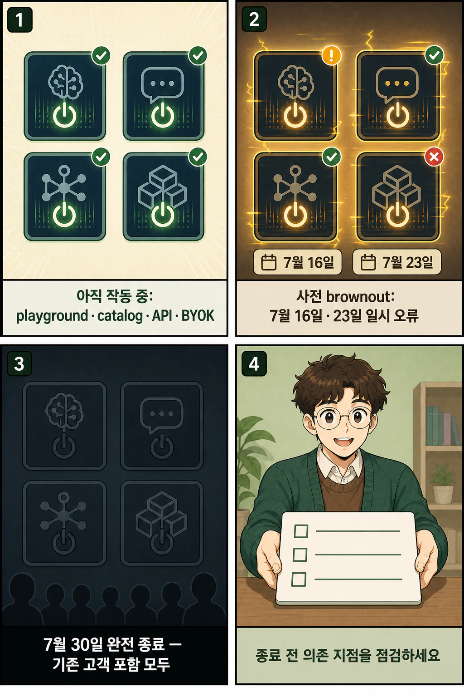

GitHub Models는 **2026년 7월 30일 완전히 종료**됩니다. GitHub의 7월 1일 공식 공지에 따르면 playground뿐 아니라 model catalog, inference API, BYOK endpoint와 관련 UI도 종료 대상이며, 활성 사용자를 포함한 모든 고객에게 적용됩니다.

카솔과 함께 종료 범위와 준비 일정을 짧게 정리했습니다.

## 핵심 내용

- 완전 종료일: **2026년 7월 30일**
- 종료 대상: playground, model catalog, inference API, BYOK endpoint, 관련 UI
- 적용 범위: 기존 활성 사용자를 포함한 모든 고객
- 사전 brownout: **7월 16일**, **7월 23일**

## 만화로 보기

종료일을 먼저 확인하고, 아래 한 장에서 영향 범위와 점검 순서를 볼 수 있습니다.

## 무엇이 종료되나요?

GitHub 공식 공지에서 열거한 종료 범위는 다음과 같습니다.

1. GitHub Models playground
2. model catalog
3. inference API
4. BYOK(bring your own key) endpoint
5. 관련 사용자 인터페이스

이번 단계는 신규 고객만 막았던 이전 단계와 달리 **기존 활성 사용자를 포함한 모든 고객**에게 적용됩니다.

## 7월 16일과 23일에는 brownout이 있습니다

완전 종료 전에 미리 거치는 단계가 있습니다. GitHub는 2026년 7월 16일과 23일 짧은 brownout을 진행한다고 밝혔습니다. 이 시간에는 GitHub Models 요청이 일시적으로 오류를 반환한 뒤 복구됩니다. 현재 API 호출이나 데모가 GitHub Models에 의존한다면 두 날짜 전에 의존 지점과 오류 처리 동작을 점검하는 편이 안전합니다.

## 공식 공지가 안내한 대안

GitHub는 모델 접근이 필요한 새 프로젝트와 기존 프로젝트에는 Microsoft Foundry를, GitHub 안에서 AI 워크플로를 구축하려는 경우에는 GitHub Copilot을 안내했습니다. 이는 공식 공지가 제시한 선택지이며, 기존 GitHub Models와 기능·가격·이식성이 동일하다는 의미는 아닙니다. 구체적인 이전 비교는 별도 검토가 필요합니다.

## 출처

- GitHub Changelog, [GitHub Models is being fully retired on July 30, 2026](https://github.blog/changelog/2026-07-01-github-models-is-being-fully-retired-on-july-30-2026/), 2026-07-01

이 글의 만화 이미지는 AI로 생성했습니다.
